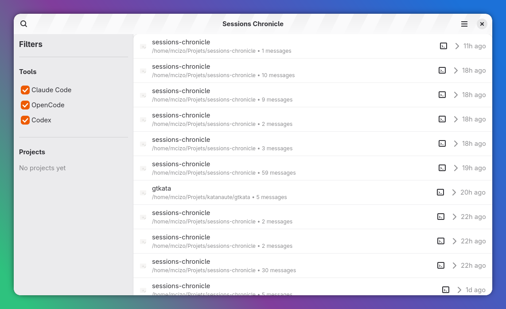
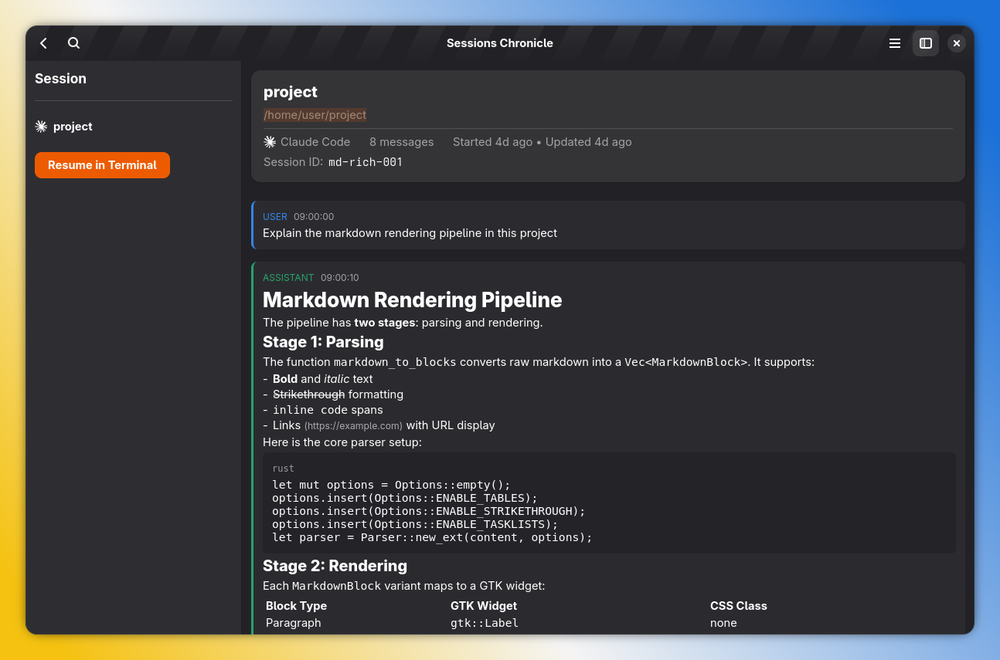

<div style="display: flex; align-items: center; gap: 20px;">
  
  <div>
    <h1>Sessions Chronicle</h1>
    <p><strong>A GNOME app for browsing, searching, and resuming AI coding sessions.</strong></p>
  </div>
</div>

## Features

- Parse Claude Code session files (JSONL format)
- SQLite database with full-text search (FTS5)
- Browse and search sessions with filters
- Session detail view with conversation history
- Local data only (no telemetry)

### Planned
- Resume sessions in terminal
- Support for OpenCode and Codex formats

## Screenshots

**Session List View**  


**Session Detail View**  


## Prerequisites

- `flatpak`
- `flatpak-builder`

Install via your package manager (e.g., `apt install flatpak flatpak-builder`).

## Building the project

Install the required SDKs, then build:

```bash
flatpak install --user org.gnome.Sdk//49 org.gnome.Platform//49 org.freedesktop.Sdk.Extension.rust-stable//25.08 org.freedesktop.Sdk.Extension.llvm21//25.08
flatpak-builder --user flatpak_app build-aux/io.github.supermaciz.sessionschronicle.Devel.json --force-clean
```

## Running the project

```bash
flatpak-builder --run flatpak_app build-aux/io.github.supermaciz.sessionschronicle.Devel.json sessions-chronicle
```

## Testing

```bash
cargo test
```

## Inspiration

This project was inspired by [agent-sessions](https://github.com/jazzyalex/agent-sessions).

## License

See LICENSE file.
