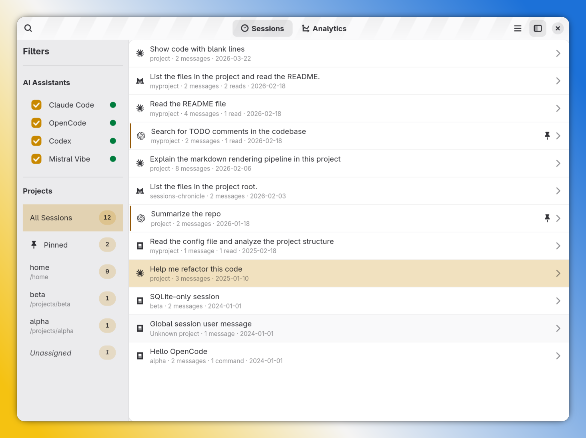
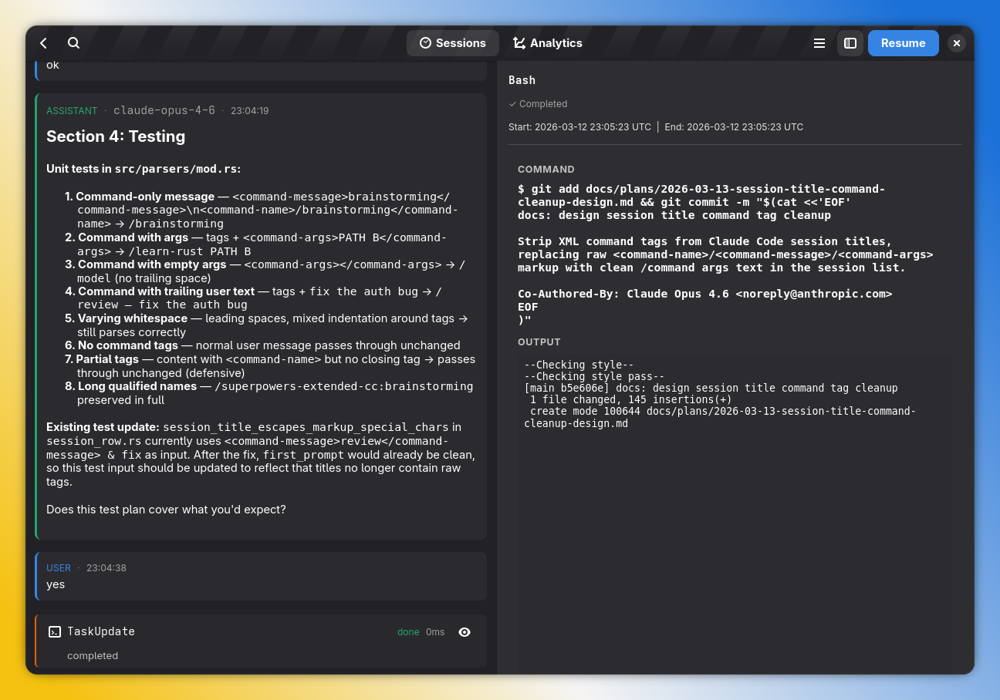
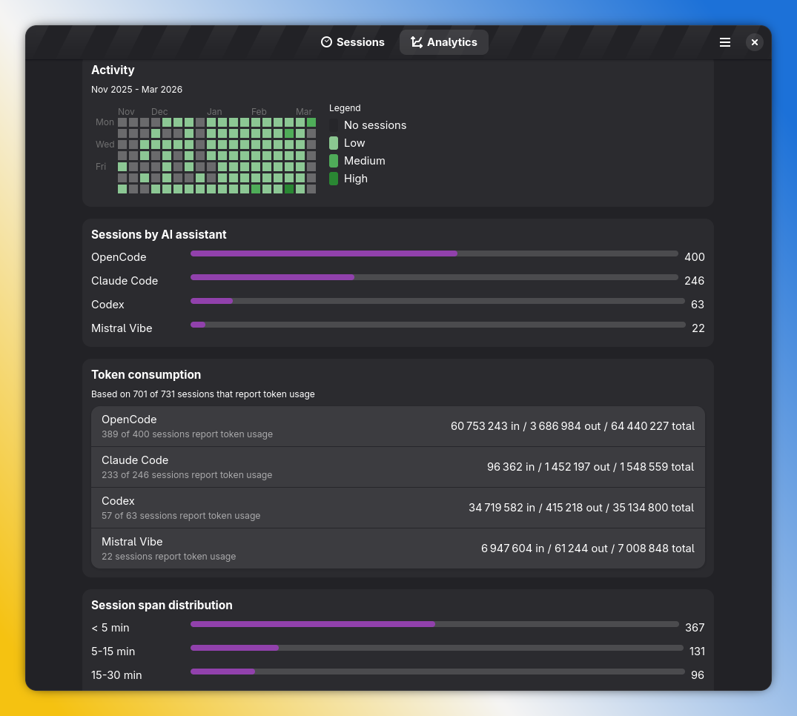

# Sessions Chronicle
<br clear="left"/>

[](https://github.com/supermaciz/sessions-chronicle/actions/workflows/ci.yml) [](https://codecov.io/gh/supermaciz/sessions-chronicle)

**Browse, search, and resume your AI assistant sessions**

Sessions Chronicle indexes all your local AI assistant sessions into a searchable database,
so you can find any conversation, inspect tool calls, diagnose source indexing issues,
and pick up where you left off.


## Features

- **Find any session instantly** — full-text search across all conversations (SQLite FTS5)
- **Browse & filter** — sidebar filters by project and assistant, keyword search with highlighted matches
- **Read conversations comfortably** — rich markdown rendering (code blocks, tables, task lists, blockquotes)
- **Inspect tool calls** — expand inline tool calls and drill down into subagents in the utility pane
- **Track token usage** — see per-session token breakdowns in the detail view
- **See indexing health at a glance** — assistant status dots, issue banner, empty-state source diagnostics, and a detailed indexing status dialog
- **Resume where you left off** — launch sessions directly from the app in your terminal
- **Navigate with the keyboard** — Up/Down to move selection, Enter to open, Escape closes search or backs out of detail
- **Supports 4 AI assistants** — Claude Code, OpenCode, Codex, Mistral Vibe
- **Analytics** — see your most-used assistants, most-active days, and more


## Installation

1. Download the latest `.flatpak` file from the [Releases page](https://github.com/supermaciz/sessions-chronicle/releases)
2. Install it:

```bash
flatpak install sessions-chronicle-*.flatpak
```

3. Launch **Sessions Chronicle** from your app menu, or run:

```bash
flatpak run io.github.supermaciz.sessionschronicle
```


## Screenshots

**Browse and search your sessions**  


**Read conversations with full markdown rendering and tool call inspection**  


**Analytics**  



## Inspiration

Inspired by [agent-sessions](https://github.com/jazzyalex/agent-sessions).


## License

Licensed under MIT. See [LICENSE](LICENSE).
