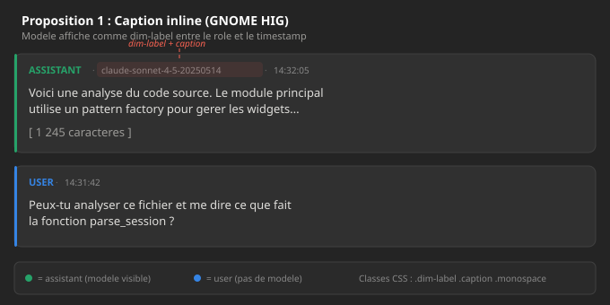
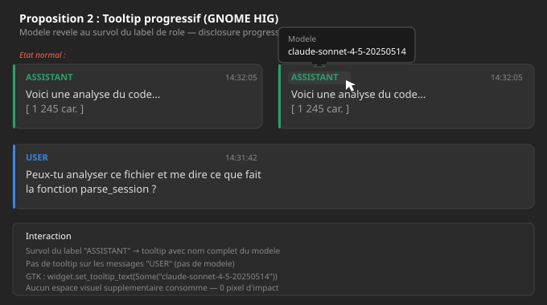
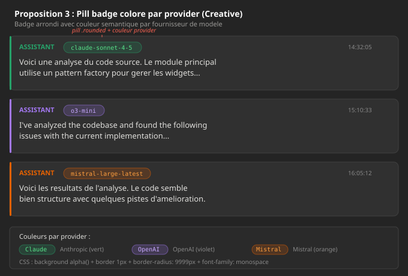
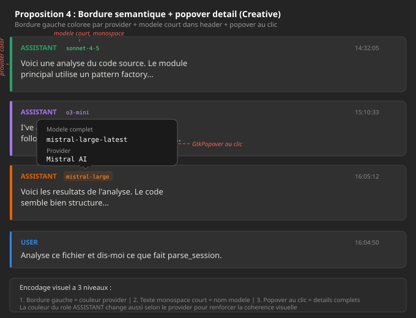

# Display LLM Model in UI — Design Exploration

**Date**: 2026-02-24  
**Feature**: Show the LLM model per assistant message in the transcript view  
**Prerequisite**: PR #39 — `Message.model: Option<String>` already in place (parsers + DB schema v2)  

---

## Technical Context

### Available Data

The `model` field is an `Option<String>` on each message.
Only `assistant` messages carry a model; `user` messages have `None`.

Raw value examples by source:

| Source        | Example value                   |
|---------------|---------------------------------|
| Claude Code   | `claude-sonnet-4-5-20250514`    |
| Codex         | `o3-mini`                       |
| OpenCode      | `anthropic/claude-sonnet-4-5`   |
| Mistral Vibe  | `mistral-large-latest`          |

### Current TranscriptRow UI

```
message-row (.card, .role-assistant)
├── header (gtk::Box, horizontal)
│   ├── role_label  "ASSISTANT"  [.caption, .role-assistant]
│   └── timestamp   "14:32:05"   [.caption, .dim-label]
├── content (gtk::Box)
│   └── markdown_view / label
└── expand_button (optional)
```

Left border colored by role: green (assistant), blue (user), orange (tool call).

### Current Gap

The `model` field is stored in DB but **not surfaced in the UI pipeline**:
- `TranscriptItemRow` has no `model` field
- The SQL query does not SELECT `model`
- `MessagePreview` has no `model` field
- `TranscriptRow` does not display it

---

## Proposal 1 — Inline Caption (GNOME HIG)

**Mockup**:



### Description

The model appears as a subtle text label in the message header,
between the role label and the timestamp, separated by `·` dots.

```
ASSISTANT · claude-sonnet-4-5-20250514 · 14:32:05
```

The label uses standard libadwaita CSS classes: `.dim-label` + `.caption` + `.monospace`.

### HIG Compliance

- **Typography hierarchy**: role (bold, colored) > model (dim, caption, mono) > timestamp (dim, caption).
  Follows the HIG principle: *"Use smaller and/or lighter text for less important
  information."*
- **Standard classes**: `.dim-label` (or `.dimmed`), `.caption`, `.monospace` are
  documented libadwaita classes.
- **No custom widget**: only `GtkLabel` instances with existing CSS classes.

### Pros

- **Simple to implement**: one extra `GtkLabel` in the header `gtk::Box`.
  No custom CSS, no custom widget.
- **Always visible**: no interaction (hover, click) needed to see the model.
- **Accessible**: readable by screen readers, no hover dependency
  (unlike tooltips, which are inaccessible on touch).
- **Consistent** with existing patterns (timestamp is already a dim-label).

### Cons

- **Visual clutter**: the full slug can be long (`claude-sonnet-4-5-20250514`
  = 28 characters). On narrow screens, it pushes the timestamp out of the viewport.
- **Repetitive**: in a long session with a single model, the same string repeats
  on every assistant message, adding noise.
- **Raw name not user-friendly**: technical slugs (`claude-sonnet-4-5-20250514`) are
  not very readable for the end user.

---

## Proposal 2 — Progressive Tooltip (GNOME HIG)

**Mockup**:



### Description

The model is not visible by default. It appears in a native GTK tooltip
when hovering over the "ASSISTANT" role label.

```
[ASSISTANT]  ← hover → tooltip: "claude-sonnet-4-5-20250514"
```

Implementation: `role_label.set_tooltip_text(Some(&model_slug))`.

### HIG Compliance

- **Progressive disclosure**: core GNOME HIG principle — *"Don't overwhelm people
  with too many elements at once. Use progressive disclosure."*
- **Tooltip**: the HIG recommends tooltips for header bar controls and for
  *"additional information about app content"*, used sparingly.
- **Zero pixel impact**: no modification to the visible layout.

### Pros

- **Cleanest interface**: zero visual change, zero clutter.
- **Minimal implementation**: a single line of code (`set_tooltip_text`), no CSS.
- **No visual regression** possible on narrow screens.
- **HIG-consistent**: tooltips are the recommended mechanism for supplementary info.

### Cons

- **Not discoverable**: the user has no way to know the info is there without hovering
  by accident. The HIG explicitly states: *"Don't rely on tooltips to communicate
  essential information."*
- **Touch-inaccessible**: tooltips do not work on touch screens
  or in some Flatpak sandboxed Wayland cases.
- **No quick scan**: impossible to compare models across multiple messages at a glance
  without hovering over each message one by one.
- **Invisible in screenshots**: for documentation and reviews, the model does not appear.

---

## Proposal 3 — Color-coded Pill Badge (Creative)

**Mockup**:



### Description

A rounded pill badge with a provider-colored background is displayed in the message
header, right after the role label.

```
ASSISTANT  [claude-sonnet-4-5]  14:32:05
            ^^^^^^^^^^^^^^^^^
            semi-transparent green background, light green text, monospace
```

Provider-to-color mapping:

| Provider  | Background color        | Text color    |
|-----------|-------------------------|---------------|
| Anthropic | `rgba(38,162,105,0.2)`  | `#57e389`     |
| OpenAI    | `rgba(163,120,242,0.2)` | `#c8a8ff`     |
| Mistral   | `rgba(230,97,0,0.2)`    | `#ff9e3d`     |

Requires custom CSS (`.model-pill`, `.model-pill--anthropic`, etc.) with
`border-radius: 9999px`, `padding: 2px 8px`.

### Pros

- **Highly scannable**: while scrolling, the provider and model are immediately
  identifiable by color.
- **Visually rich**: color adds an extra information dimension
  (the provider) without additional text.
- **Established pattern**: "tag pills" are a recognized UI pattern (GitHub labels,
  Fractal mentions, etc.). `AdwWrapBox` is designed for this use case.
- **Multi-provider differentiation**: in an OpenCode session using both Claude AND GPT,
  the distinction is immediate.

### Cons

- **Non-standard GNOME**: libadwaita has no native badge widget. Requires custom CSS
  (`.model-pill`), which departs from strict HIG conventions.
- **Color maintenance**: requires defining and maintaining a provider-to-color mapping.
  Each new provider = a new color to choose. Must handle fallback.
- **Space consumption**: pills take more space than a simple dim label.
  On small screens, this can compress the content area.
- **Provider parsing**: requires extracting the provider from the raw slug
  (`claude-*` → Anthropic, `gpt-*`/`o*` → OpenAI, `mistral-*` → Mistral).
  Fragile heuristic logic.
- **Contrast / accessibility**: custom colors must be tested in
  high-contrast and dark/light modes. Adwaita CSS variables (`--success-bg-color`, etc.)
  have no direct mapping to providers.

---

## Proposal 4 — Semantic Border + Detail Popover (Creative)

**Mockup**:



### Description

Three combined levels of information:

1. **Left border**: the color encodes the provider (instead of the role as currently).
   Green = Anthropic, purple = OpenAI, orange = Mistral.
2. **Short monospace text**: an abbreviated model name in the header
   (`sonnet-4-5`, `o3-mini`, `mistral-large`).
3. **Click popover**: clicking the model name opens a `GtkPopover` with
   full details (complete name, provider).

```
│ ASSISTANT  sonnet-4-5                    14:32:05
│ (green)    ^^^^^^^^^^--- click → popover with details
```

The role label color also changes to match the provider.

### Pros

- **Multi-channel encoding**: color (border) + text (label) + interaction (popover).
  Information is accessible at multiple levels depending on user need.
- **Short names**: by abbreviating the slug, horizontal space is saved.
  `sonnet-4-5` is more readable than `claude-sonnet-4-5-20250514`.
- **Popover for details**: the full name and provider are available without
  leaving the view, via a deliberate click.
- **Visually distinctive**: provider-colored borders make multi-model sessions
  immediately readable while scrolling.

### Cons

- **Convention break**: currently the left border encodes the **role**
  (user/assistant/tool). Changing its semantics breaks an existing visual cue.
  User messages would lose their distinctive blue border.
- **Complexity**: 3 systems to implement (border color, abbreviation,
  popover) instead of one. More code, more tests, more maintenance.
- **Fragile abbreviation**: transforming `claude-sonnet-4-5-20250514` into `sonnet-4-5`
  requires heuristic parsing logic. Future model names may not follow
  expected patterns.
- **Mandatory interaction**: the full name is only visible on click,
  which is heavier than a simple always-visible label.
- **Popover accessibility**: popovers require a click/tap, which is
  better than tooltips for touch but adds a step.
- **Border ambiguity**: the user loses the visual distinction between
  user/assistant/tool via the border. Another encoding must be found.

---

## Comparison Table

| Criterion                    | 1. Inline caption | 2. Tooltip       | 3. Pill badge    | 4. Border + popover |
|------------------------------|:-----------------:|:----------------:|:----------------:|:-------------------:|
| HIG compliance               | ★★★★★            | ★★★★☆            | ★★★☆☆            | ★★☆☆☆              |
| Immediate visibility         | ★★★★★            | ★☆☆☆☆            | ★★★★★            | ★★★★☆              |
| Multi-message scannability   | ★★★☆☆            | ★☆☆☆☆            | ★★★★★            | ★★★★★              |
| Layout impact / space        | ★★★☆☆            | ★★★★★            | ★★☆☆☆            | ★★★★☆              |
| Implementation complexity    | ★★★★★            | ★★★★★            | ★★★☆☆            | ★★☆☆☆              |
| Accessibility (touch, a11y)  | ★★★★★            | ★★☆☆☆            | ★★★★☆            | ★★★☆☆              |
| Narrow screen readability    | ★★☆☆☆            | ★★★★★            | ★★☆☆☆            | ★★★☆☆              |
| Provider differentiation     | ★☆☆☆☆            | ★☆☆☆☆            | ★★★★★            | ★★★★★              |
| Regression risk              | ★★★★★            | ★★★★★            | ★★★☆☆            | ★★☆☆☆              |

_(★★★★★ = best / ★☆☆☆☆ = worst)_

---

## Possible Hybrid Approaches

### Hybrid A: Inline Caption + Tooltip (1 + 2)

Display a **shortened name** in the header (`sonnet-4-5`) with `.dim-label .caption .monospace`,
and the **full name** as a tooltip on that label.

**Advantage**: visible + detail accessible + simple to implement.

### Hybrid B: Inline Caption + Optional Pill (1 + 3)

Start with the inline caption (proposal 1), and add color-coding
as a future enhancement if multi-provider usage becomes frequent.

**Advantage**: incremental implementation, no big-bang.

### Hybrid C: Pill Badge + Tooltip Detail (3 + 2)

Pill badge with **short name** colored, and tooltip with the **full slug** on hover over the badge.

**Advantage**: best of both worlds (quick scan + full detail).

---

## Files to Modify (Common to All Proposals)

The data pipeline must be completed regardless of the chosen approach:

| File                             | Change                                              |
|----------------------------------|-----------------------------------------------------|
| `src/database/mod.rs`            | Add `model` to `TranscriptItemRow` and to SELECT    |
| `src/models/message_preview.rs`  | Add `model: Option<String>`                         |
| `src/ui/transcript_row.rs`       | Add `model` to `MessageItemInit` + display widget   |
| `data/resources/style.css`       | CSS depending on chosen proposal                    |

---

## Next Steps

1. **Choose** a proposal (or hybrid)
2. **Write** the detailed design doc
3. **Plan** implementation via the `writing-plans` skill
