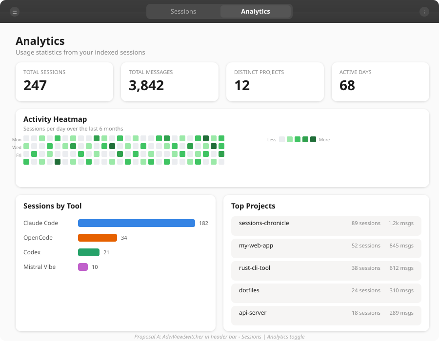
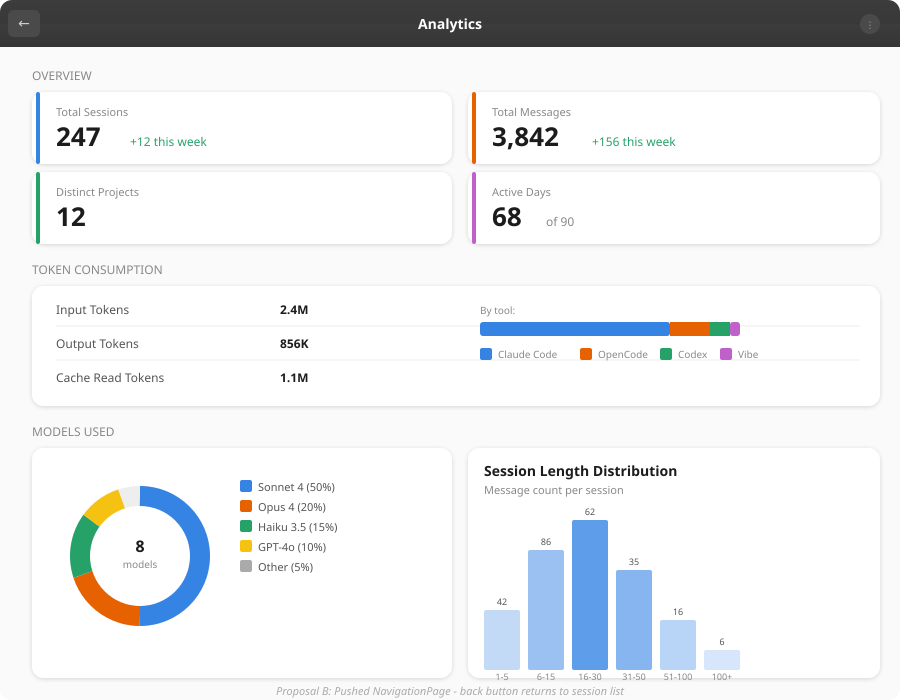
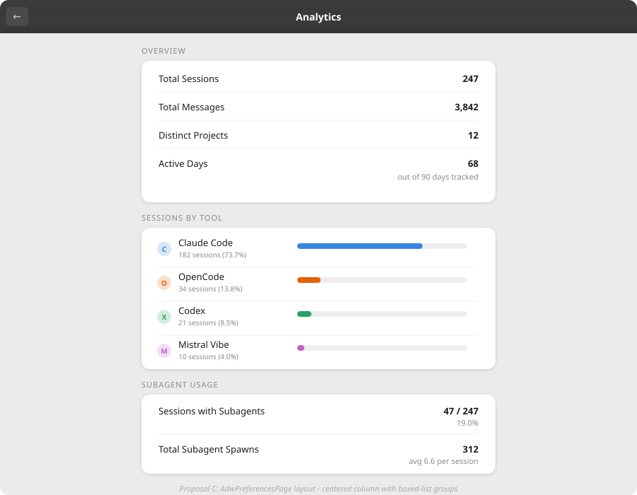
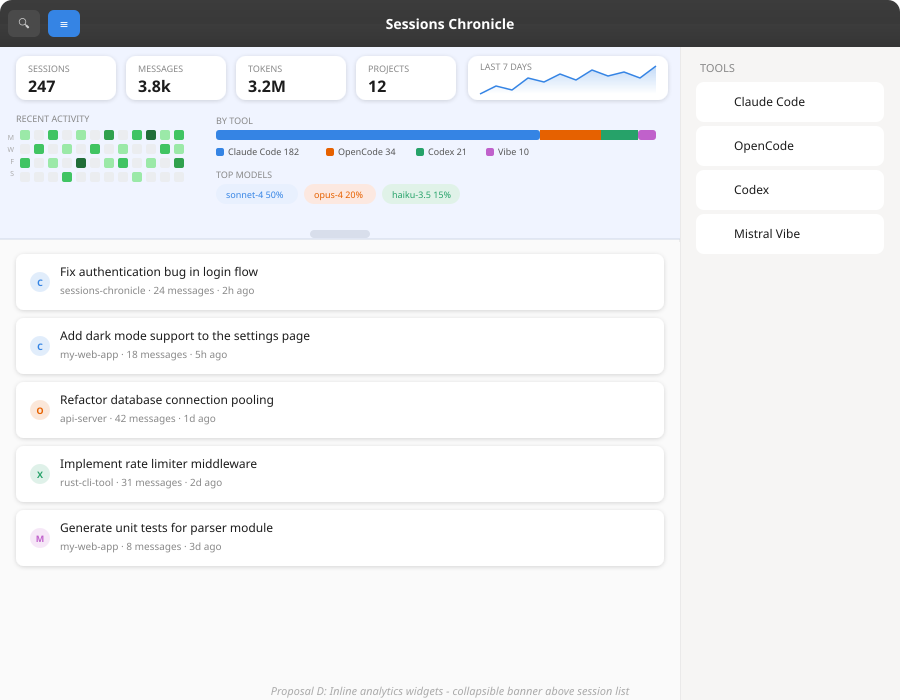
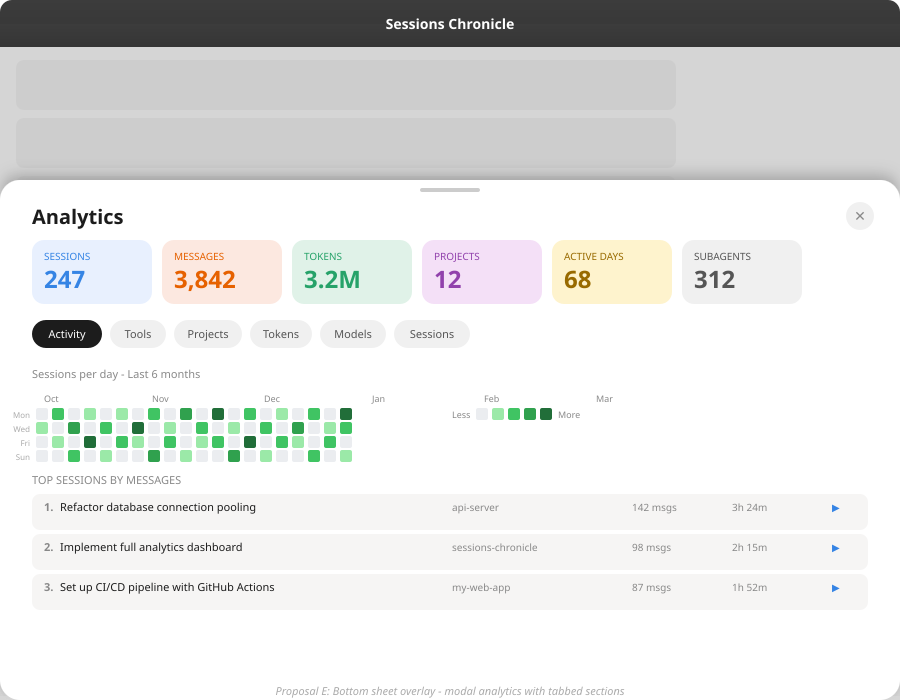

# Basic Analytics Dashboard - Design Exploration

**Issue:** [#58 - Basic analytics](https://github.com/supermaciz/sessions-chronicle/issues/58)  
**Date:** 2026-03-02  
**Status:** Exploration

## Problem Statement

Add an analytics dashboard view showing key usage statistics computed from
indexed session data. All stats are derived from data already captured by
parsers -- no new data collection needed.

### Stats to Implement

**Summary counters:** total sessions, total messages, distinct projects,
active days.

**Breakdowns:** sessions by tool, activity heatmap (GitHub-style), top
projects, token consumption (by tool and project), top sessions (by message
count and duration), session length distribution (histogram), models used,
subagent usage.

### Constraints

- Data source: existing SQLite database (sessions, messages, tool_calls,
  subagents tables).
- All chart rendering must be done with GTK4/Cairo -- no web views or
  external JS charting libraries.
- Must respect light/dark theme via Adwaita's `StyleManager`.
- Must work within the existing Relm4 component architecture.
- Adding charting dependencies is allowed if it improves implementation
  velocity or maintainability. `plotters` + `plotters-cairo` and
  `plotters-gtk4` are accepted options alongside direct Cairo or
  `GtkSnapshot`-based drawing.

## Current Architecture Context

The app uses `adw::NavigationView` with two pages:
- **"sessions"** -- `SessionList` (master)
- **"detail"** -- `SessionDetail` (detail, pushed on selection)

Utility pane: `adw::OverlaySplitView` with a `gtk::Stack` toggling between
filter sidebar and tool inspector. Search is via `gtk::SearchBar` in the
header.

No `AdwViewSwitcher` exists today. Adding one is a structural change to the
header bar. Alternatively, analytics can be pushed as a new NavigationPage
or shown as a modal overlay.

---

## Proposals

### A. AdwViewSwitcher (GNOME HIG)

**Navigation:** Replace the plain header title with an `AdwViewSwitcher`
offering two views: **Sessions** and **Analytics**.

**Layout:** The analytics view is a full-width scrollable page with:
- 4 summary counter cards in a horizontal `FlowBox`
- Activity heatmap card (custom-rendered via Cairo/Snapshot/Plotters)
- Two-column bottom section: sessions-by-tool bar chart + top projects list

**Mockup:**

| Aspect | Assessment |
|--------|-----------|
| HIG compliance | Excellent -- `AdwViewSwitcher` is the canonical GNOME pattern for 2-5 top-level views |
| Discoverability | High -- always visible in header bar |
| Implementation cost | Medium -- requires restructuring the header bar and root content stack |
| Adaptive | `AdwViewSwitcherBar` auto-relocates to bottom on narrow windows |
| Scalability | Good for future views (e.g. "Projects", "Models") |

**Trade-offs:**
- (+) Standard GNOME pattern, familiar to users.
- (+) Keyboard accessible via Ctrl+Tab or direct click.
- (+) Scales to 3-5 views if more analytics pages are added later.
- (-) Header bar restructuring affects existing search/pane toggle layout.
- (-) Two views may feel sparse for a ViewSwitcher; GNOME HIG recommends
  3-5 views.

---

### B. Pushed NavigationPage (GNOME HIG)

**Navigation:** Analytics is a new `adw::NavigationPage` pushed onto the
existing `NavigationView`. Accessed via a header bar button (chart icon)
or a keyboard shortcut (e.g. Ctrl+Shift+A). Back button returns to
sessions.

**Layout:** Full dashboard page with:
- 2x2 summary cards with colored left borders and week-over-week deltas
- Token consumption boxed-list with inline stacked bar
- Models used (donut chart via custom rendering) + session length histogram

**Mockup:**

| Aspect | Assessment |
|--------|-----------|
| HIG compliance | Good -- NavigationView push is the standard drill-down pattern |
| Discoverability | Medium -- requires a visible button or menu entry |
| Implementation cost | Low -- minimal changes to existing header bar |
| Adaptive | Inherits NavigationView adaptive behavior |
| Scalability | Limited -- push-based navigation creates depth, not breadth |

**Trade-offs:**
- (+) Minimal disruption to existing layout.
- (+) Natural back-button navigation.
- (+) Chart icon in header bar is intuitive.
- (-) Analytics is "hidden" behind a button, not visible at a glance.
- (-) Conceptually, analytics is a peer of sessions, not a child -- push
  semantics may feel wrong.
- (-) Sharing the NavigationView with session detail creates ambiguity
  (analytics -> select session -> back goes to analytics, not session list).

---

### C. AdwPreferencesPage Layout (GNOME HIG)

**Navigation:** Same as Proposal B (pushed NavigationPage), but the
content uses `AdwPreferencesPage` with `AdwPreferencesGroup` sections.

**Layout:** Narrow centered column (GNOME Settings style) with:
- "Overview" group: key-value property rows (label + value)
- "Sessions by Tool" group: rows with inline progress bars
- "Subagent Usage" group: property rows with percentages

All data presented as boxed-list rows -- no custom chart rendering needed.

**Mockup:**

| Aspect | Assessment |
|--------|-----------|
| HIG compliance | Excellent -- `AdwPreferencesPage` is the canonical GNOME pattern for info-heavy pages |
| Discoverability | Medium (same as Proposal B) |
| Implementation cost | Low -- uses built-in widgets only, no custom drawing |
| Adaptive | Native responsive behavior from `AdwPreferencesPage` |
| Scalability | Groups can be added incrementally |

**Trade-offs:**
- (+) Zero custom rendering -- all built-in Adwaita widgets.
- (+) Extremely fast to implement.
- (+) Naturally adaptive and accessible.
- (+) Easy to add new stat groups without layout work.
- (-) No heatmap, no histograms, no donut charts -- purely textual.
- (-) Less visually engaging than a proper dashboard.
- (-) Narrow column wastes horizontal space on wide windows.

---

### D. Inline Analytics Widgets (Creative)

**Navigation:** No separate page. Analytics is a collapsible banner
embedded at the top of the session list view. Toggled via a header bar
button (chart icon).

**Layout:**
- Horizontal row of stat pills (sessions, messages, tokens, projects)
  with a 7-day sparkline
- Compact 4-week heatmap alongside a stacked tool-breakdown bar
- Model-distribution pills
- Drag handle to collapse/expand
- Session list continues below

**Mockup:**

| Aspect | Assessment |
|--------|-----------|
| HIG compliance | Low -- no standard GNOME pattern for inline dashboards |
| Discoverability | High -- visible alongside sessions when toggled on |
| Implementation cost | High -- custom layout, sparkline rendering, collapse animation |
| Adaptive | Challenging -- many elements to reflow on narrow windows |
| Scalability | Limited -- banner height constrains stat count |

**Trade-offs:**
- (+) No context switch -- stats and sessions coexist.
- (+) Glanceable -- see trends without leaving the list.
- (+) Toggle preserves list position and selection state.
- (-) Not a standard GNOME pattern; may feel alien.
- (-) Complex adaptive behavior for narrow/mobile.
- (-) Limited space constrains what can be shown.
- (-) Sparkline and heatmap still require custom chart rendering even in
  compressed form.

---

### E. Bottom Sheet Overlay (Creative)

**Navigation:** Analytics opens as a modal bottom sheet (`AdwDialog` or
custom `adw::BottomSheet`) that slides up over the session list. Triggered
by header bar button or Ctrl+Shift+A. Close via X button, Escape, or
swipe down.

**Layout:**
- Drag handle + close button at top
- Colored summary chips in a horizontal scroll
- Pill-shaped tab bar: Activity | Tools | Projects | Tokens | Models |
  Sessions
- Tab content area: heatmap, ranked lists, breakdowns
- Top sessions with "open" action links

**Mockup:**

| Aspect | Assessment |
|--------|-----------|
| HIG compliance | Low -- bottom sheets are mobile-first, unusual in desktop GNOME apps |
| Discoverability | Medium -- requires trigger button; modal blocks session list |
| Implementation cost | Medium-High -- custom sheet widget or `AdwDialog` with gesture handling |
| Adaptive | Good on narrow/mobile, but blocking overlay feels heavy on desktop |
| Scalability | Excellent -- tabbed sections allow unlimited stat categories |

**Trade-offs:**
- (+) Rich, spacious layout with tabs for each analytics domain.
- (+) Top sessions link back to session detail (cross-navigation).
- (+) Tabbed UI cleanly separates stat categories.
- (+) Modern feel, inspired by mobile analytics dashboards.
- (-) Modal overlay blocks access to the session list.
- (-) Not a standard GNOME desktop pattern (more iOS/Android).
- (-) Gesture handling for drag-to-dismiss adds complexity.
- (-) Libadwaita's `AdwBottomSheet` is not yet stable API.

---

## Comparison Matrix

| Criterion | A. ViewSwitcher | B. NavPage | C. PrefsPage | D. Inline | E. BottomSheet |
|-----------|:-:|:-:|:-:|:-:|:-:|
| HIG compliance | ★★★ | ★★☆ | ★★★ | ★☆☆ | ★☆☆ |
| Discoverability | ★★★ | ★★☆ | ★★☆ | ★★★ | ★★☆ |
| Visual richness | ★★★ | ★★★ | ★☆☆ | ★★☆ | ★★★ |
| Implementation cost | Medium | Low | Low | High | Med-High |
| Future scalability | ★★★ | ★☆☆ | ★★☆ | ★☆☆ | ★★★ |
| Adaptive behavior | ★★★ | ★★★ | ★★★ | ★☆☆ | ★★☆ |
| Custom rendering | Cairo `draw_func`, `GtkSnapshot`, or Plotters backends (`plotters-cairo` / `plotters-gtk4`) | Cairo `draw_func`, `GtkSnapshot`, or Plotters backends (`plotters-cairo` / `plotters-gtk4`) | None | Cairo `draw_func`, `GtkSnapshot`, or Plotters backends (`plotters-cairo` / `plotters-gtk4`) | Cairo `draw_func`, `GtkSnapshot`, or Plotters backends (`plotters-cairo` / `plotters-gtk4`) |

## Hybrid Possibilities

These proposals are not mutually exclusive. Notable combinations:

1. **A + C:** ViewSwitcher for navigation, PreferencesPage for the
   text-heavy stats, with custom charts added incrementally later.
2. **B + D:** NavigationPage for the full dashboard, inline widgets as a
   "quick glance" summary in the session list header.
3. **A with C's layout initially, evolving to B's layout:** Ship quickly
   with PreferencesPage, then add charts.

## Rendering Approach: Widgets, Cairo, and GtkSnapshot

GTK4 supports two custom-rendering styles in practice:

1. `gtk::DrawingArea::set_draw_func()` (Cairo callback)
2. `WidgetImpl::snapshot()` with `gtk::Snapshot` (scene graph / render nodes,
   optionally using `append_cairo`)

On top of those, Plotters can be integrated via either `plotters-cairo` or
`plotters-gtk4`:

- `plotters-cairo`: straightforward in `DrawingArea` draw callbacks
- `plotters-gtk4` snapshot backend: useful when drawing directly in
  `GtkSnapshot` / custom widgets
- `plotters-gtk4` paintable backend: useful with `GtkPicture` +
  `GdkPaintable`

| Option | Best fit | Advantages | Trade-offs |
|--------|----------|------------|------------|
| Widgets only (`AdwPreferencesGroup`, lists, progress bars) | Counters and ranked lists | Fastest to ship, best accessibility defaults, minimal dependencies | Limited visual expressiveness (no heatmap / histogram / donut) |
| `DrawingArea` + Cairo (`set_draw_func`) | First chart iteration | Simple mental model, low code overhead, already common in GTK apps | Imperative drawing path; less reusable if later moving to `Paintable` |
| Custom widget `snapshot()` + Cairo (`append_cairo`) | Advanced custom charts integrated in custom widgets | Aligns with GTK4 rendering model and scene graph lifecycle | More boilerplate than `DrawingArea`; steeper GTK subclassing complexity |
| `plotters-cairo` | Reusing Plotters chart primitives in draw callbacks | Rich chart API, avoids hand-writing chart geometry | Extra dependency and adaptation to app theming/colors |
| `plotters-gtk4` (snapshot or paintable backend) | Plotters charts with GTK4-native targets | Explicit GTK4 backend, supports Snapshot and Paintable workflows | Less battle-tested ecosystem than Cairo path; evaluate maintenance risk |

| Stat | Widget-only possible? | Custom chart needed? | Viable custom rendering paths |
|------|:----:|:----:|-------------------------------|
| Summary counters | Yes (labels) | No | N/A |
| Sessions by tool | Yes (progress bars) | No (optional) | Optional bar chart via Cairo / Snapshot / Plotters |
| Top projects | Yes (boxed list) | No | N/A |
| Token consumption | Yes (labels + progress bars) | No (optional) | Optional stacked chart via Cairo / Snapshot / Plotters |
| Subagent usage | Yes (labels) | No (optional) | Optional chart via Cairo / Snapshot / Plotters |
| Models used | Partial (labels + progress bars) | Yes (if donut desired) | Cairo `draw_func`, `snapshot()` + `append_cairo`, `plotters-cairo`, or `plotters-gtk4` |
| Activity heatmap | No | Yes | Cairo `draw_func`, `snapshot()` + `append_cairo`, `plotters-cairo`, or `plotters-gtk4` |
| Session length distribution | No | Yes | Cairo `draw_func`, `snapshot()` + `append_cairo`, `plotters-cairo`, or `plotters-gtk4` |
| Top sessions | Yes (boxed list) | No | N/A |

**Observation:** 6 of 9 stats can ship with widgets only.
The three chart-centric stats (heatmap, histogram, donut) can be implemented
with either `DrawingArea`+Cairo or a `GtkSnapshot` path (directly or through
`plotters-gtk4`).

**Pragmatic recommendation:** start with widgets + `DrawingArea`/Cairo for V1,
then adopt `snapshot()` and/or `plotters-gtk4` only if we need reusable
paintables, richer chart abstractions, or more advanced chart composition.

## References

- [GNOME HIG - View Switchers](https://developer.gnome.org/hig/patterns/nav/view-switchers.html)
- [GNOME HIG - Boxed Lists](https://developer.gnome.org/hig/patterns/containers/boxed-lists.html)
- [GNOME HIG - Typography](https://developer.gnome.org/hig/guidelines/typography.html)
- [GTK4 - DrawingArea draw func](https://docs.gtk.org/gtk4/method.DrawingArea.set_draw_func.html)
- [GTK4 - Drawing model and snapshot](https://docs.gtk.org/gtk4/drawing-model.html)
- [GTK4 - Migration notes (`draw` -> `snapshot`)](https://docs.gtk.org/gtk4/migrating-3to4.html)
- [plotters-gtk4](https://github.com/SeaDve/plotters-gtk4)
- [AgentsView](https://github.com/wesm/agentsview) -- Svelte dashboard
  with heatmaps and velocity metrics
- [Sniffly](https://github.com/chiphuyen/sniffly) -- Python dashboard with
  usage stats and error analysis
- [Agent Sessions](https://github.com/jazzyalex/agent-sessions) -- macOS
  session browser with token tracking
