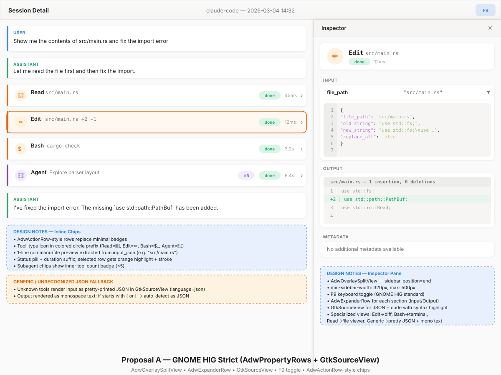
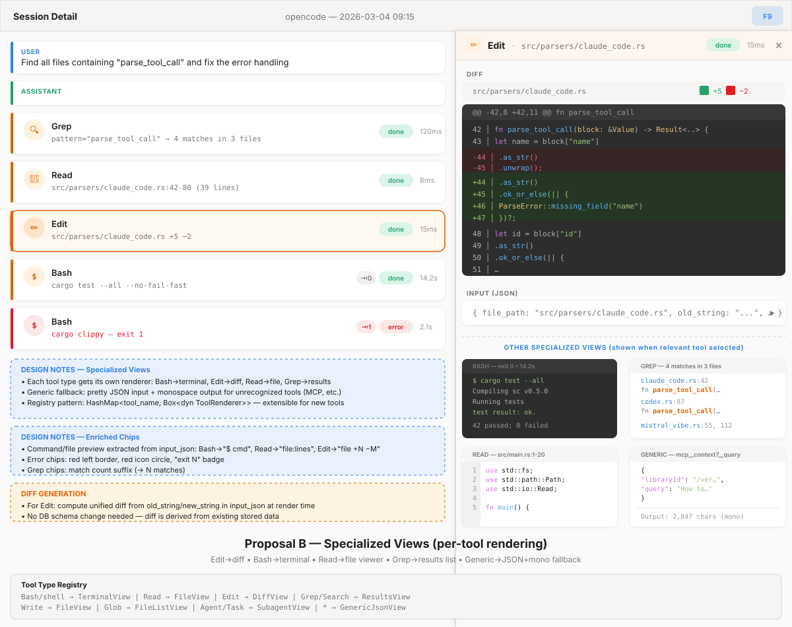
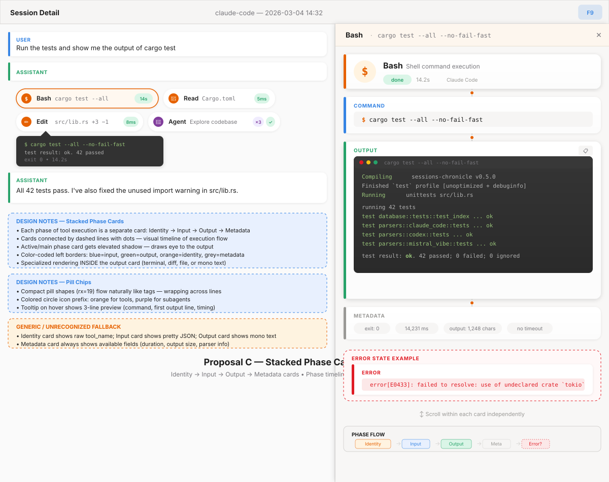

# Tool Inspector Improvements — Design Exploration

**Issue:** [#46 — enhance ToolInspector pane](https://github.com/supermaciz/sessions-chronicle/issues/46)
**Date:** 2026-03-05
**Scope:** Inspector pane + inline transcript chips
**Input:** [docs/TOOL_CALLS_ANALYSIS.md](../TOOL_CALLS_ANALYSIS.md)

---

## Problem Statement

The current Tool Inspector pane dumps raw text for every tool call:
a monospace label for `input_json`, another for `output_text`, another for `error_text`.
No JSON pretty-printing, no markdown rendering, no differentiation between tool types.
The inline transcript chips show only the tool name, a status word, and duration —
no preview of what the tool actually did.

### What we want

1. **Better width handling** — responsive split (min/max), overlay on narrow windows.
2. **Markdown-light rendering** — headings, lists, bold/italic, code blocks in output text.
3. **Pretty-printed JSON** — syntax-highlighted, indented input display.
4. **Specialized views per tool type** — Bash→terminal, Edit→diff, Read→file viewer,
   Grep→results, with a generic fallback for MCP tools and unrecognized JSON.
5. **Enriched inline chips** — contextual preview (command, file path, diff stats)
   extracted from `input_json`.

### What we explicitly exclude

- Full markdown (images, clickable links, tables).
- Schema or DB changes.
- Changes to the parser layer or ToolCall model.

---

## Current State

### Inspector pane (`src/ui/tool_inspector_pane.rs`)

- `AdwNavigationView` with two pages: overview (tool / subagent / empty) and drill-down.
- Each section built with `make_text_section()`: uppercase heading label + monospace `gtk::Label`.
- No width constraints beyond `set_hexpand(true)`.
- No JSON formatting — `input_json` displayed verbatim.
- No content-type awareness — `output_text` treated identically for all tools.

### Inline chips (`src/ui/transcript_row.rs`)

- `gtk::Box` with CSS class `tool-call-row` (orange left border, 6px radius).
- Fixed layout: icon → tool_name label → status label → duration label → inspect button.
- `ToolCallItemInit` carries only `tool_name`, `status`, `summary`, `duration_ms` —
  no input preview data.
- Summary field is always NULL in current parsers.

### CSS (`data/resources/style.css`)

- `.tool-call-row`, `.status-completed/error/running/pending/unknown`,
  `.inspector-code-block`, `.inspector-section-heading`.
- No dark-theme code blocks, no diff coloring, no per-tool-type classes.

---

## Proposals

### Proposal A — GNOME HIG Strict

**Philosophy:** Every widget is a standard libadwaita component.
Looks like a GNOME Settings page.

#### Inspector pane

| Aspect | Choice |
|--------|--------|
| Container | `AdwOverlaySplitView`, `sidebar-position=end` |
| Width | min 320 px, max 500 px, collapses to overlay below ~900 px window |
| Toggle | F9 keyboard shortcut (GNOME HIG standard for utility panes) |
| Sections | `AdwExpanderRow` per section (Input, Output, Error, Metadata) |
| Code display | `GtkSourceView` with language=json for input, language=diff for Edit output |
| Markdown | Existing `render_markdown_to_textview()` from `src/ui/markdown.rs` |

**Specialized rendering:**

- **Edit** — Output section uses `GtkSourceView` language=diff.
- **Bash** — Output section uses `GtkSourceView` language=sh, with exit code in metadata.
- **Read** — Output section uses `GtkSourceView` with auto-detected language from file extension.
- **Generic** — Input as pretty JSON in `GtkSourceView`; output rendered via
  `render_markdown_to_textview()` (handles code blocks, headings, lists natively).

#### Inline chips

- Replace `gtk::Box` with `AdwActionRow`-like layout:
  tool-type icon in colored circle → name → 1-line preview → status pill → duration.
- Preview extracted from `input_json`: file_path for Read/Edit/Write, command for Bash,
  pattern for Grep, description for Agent.
- Selected chip: `#fff8f0` background + `#e66100` stroke.
- Subagent chips: purple accent + inner tool count badge (×N).

#### Trade-offs

| Pro | Con |
|-----|-----|
| Fully standard GNOME — accessibility, keyboard nav, dark theme for free | GtkSourceView is a new dependency (~2 MB); could use existing markdown renderer instead |
| `AdwExpanderRow` sections collapse cleanly | Less visually distinctive than alternatives |
| `AdwOverlaySplitView` handles responsive layout natively | Expander rows add clicks to reach content |
| F9 toggle is discoverable via GNOME conventions | Limited creative expression |

---

### Proposal B — Specialized Views (per-tool rendering)

**Philosophy:** Each tool type deserves its own renderer.
The inspector adapts its layout to the tool being inspected.

#### Inspector pane

| Aspect | Choice |
|--------|--------|
| Container | Same `AdwOverlaySplitView` as Proposal A |
| Width | min 380 px (wider to accommodate code), max 540 px |
| Header | Warm-tinted bar (`#fdf6ee`) with breadcrumb: icon + tool name + file/command |
| Layout | Header → Specialized view area → collapsible Input JSON → Metadata |

**Tool type registry:**

| Tool pattern | Renderer | Key features |
|-------------|----------|--------------|
| `Bash`, `shell`, `exec_command` | **TerminalView** | Dark background, `$ prompt`, colored exit code, green/red output |
| `Edit`, `apply_patch` | **DiffView** | Unified diff computed from `old_string`/`new_string`, red/green lines |
| `Read` | **FileView** | Line number gutter, syntax highlight from extension, line range in header |
| `Grep`, `Search`, `Glob` | **ResultsView** | `file:line` entries, highlighted match pattern, match count |
| `Write` | **FileView** | Same as Read but labeled "Written content" |
| `Agent`, `Task` | **SubagentView** | Existing subagent layout (prompt + inner tools list) |
| `*` (fallback) | **GenericJsonView** | Pretty-printed JSON input + monospace output with JSON auto-detect |

The registry is a `match` on `tool_name` (or a `HashMap<&str, RendererFactory>`).
New MCP tools fall through to `GenericJsonView`.

**Diff generation for Edit:**
Compute the diff at render time from `old_string` and `new_string` fields
already stored in `input_json`. No DB change needed.
Use the `similar` crate (already common in Rust) for unified diff output.

#### Inline chips

- Enriched preview per tool type:
  - Bash: `$ cargo test --all`
  - Read: `src/main.rs:42-80 (39 lines)`
  - Edit: `src/main.rs +5 −2`
  - Grep: `pattern="parse_tool_call" → 4 matches`
- Exit code badge for Bash (`⇥0` or `⇥1`).
- Error state: red left border, red icon circle, red status pill.
- `ToolCallItemInit` needs new field: `preview: Option<String>`,
  computed during transcript loading from `input_json`.

#### Trade-offs

| Pro | Con |
|-----|-----|
| Optimal rendering per tool — diffs look like diffs, terminals look like terminals | More code to write and maintain (5-6 renderers) |
| Contextual chip previews are immediately useful | Registry pattern adds abstraction layer |
| Diff from old/new is a high-value feature — shows *what changed* | Diff computation at render time has a small CPU cost |
| Generic fallback handles any MCP/custom tool gracefully | `ToolCallItemInit` requires adding a `preview` field |

---

### Proposal C — Stacked Phase Cards

**Philosophy:** A tool call is a story in four acts.
Each phase of execution gets its own card, connected by a visual timeline.

#### Inspector pane

| Aspect | Choice |
|--------|--------|
| Container | Same `AdwOverlaySplitView` |
| Width | min 380 px, max 540 px |
| Layout | Vertical stack of 4 phase cards connected by dashed timeline |

**Phase cards:**

| Phase | Border color | Content |
|-------|-------------|---------|
| **Identity** | Orange `#e66100` | Tool type icon (large), name, description, status pill, duration, agent source |
| **Input** | Blue `#3584e4` | Command display (Bash) or pretty JSON (others); collapsible for long inputs |
| **Output** | Green `#26a269` | Specialized rendering inside (terminal, diff, file, mono); elevated shadow; copy button |
| **Metadata** | Grey `#9a9996` | Pill row: exit code, duration ms, output size, timeout info |
| **Error** (conditional) | Red `#e01b24` | Only shown when `error_text` is present or `status == Error` |

The Output card gets an elevated shadow (`filter: feDropShadow` with larger stdDeviation)
to draw the eye to the main content area.

Specialized rendering from Proposal B applies *inside* the Output card —
the card system is the chrome, the renderers are the content.

#### Inline chips

- Pill-shaped (`border-radius: 19px`) flowing like tags, wrapping across lines.
- Colored circle icon prefix (orange tools, purple subagents).
- Compact: name + 1-word preview + duration pill.
- **Tooltip on hover:** 3-line preview (command, first output line, timing).
- Subagent pills: inner tool count badge.

#### Trade-offs

| Pro | Con |
|-----|-----|
| Clear visual hierarchy — Identity/Input/Output/Meta phases are instantly parseable | Takes more vertical space than flat layout |
| Timeline dots create a narrative flow | Tooltip preview is not touch-friendly and not discoverable |
| Error card is visually distinct — impossible to miss | 4 separate cards may feel over-engineered for simple tools (Read, Glob) |
| Works with any renderer inside the Output card | More complex widget tree to build and maintain |
| Pill chips are compact and flow naturally | Pill wrapping behavior needs careful handling in GTK |

---

## Cross-Cutting Concerns

### Generic / Unrecognized JSON Fallback

All three proposals share the same fallback strategy:

1. **Input:** attempt `serde_json::from_str` → if valid JSON, pretty-print with 2-space indent
   and syntax highlight; otherwise display as raw monospace text.
2. **Output:** if content starts with `{` or `[`, attempt JSON parse → pretty-print;
   otherwise render via the existing `render_markdown_to_textview()` which handles
   plain text, code blocks, headings, lists, and tables natively via `pulldown-cmark`.
3. **Tool name display:** show the raw `tool_name` string; for MCP tools
   (`mcp__server__tool`), split on `__` and show as `server › tool`.

This ensures that any new tool from any agent (including future MCP integrations)
gets a reasonable display without code changes.

### Markdown Rendering

The app already has a mature markdown pipeline — reuse it directly:

- **Crate:** `pulldown-cmark = "0.13"` (with SIMD) + `unicode-width` for table alignment.
- **Module:** `src/ui/markdown.rs` (~1000 lines, 28 tests).
- **Entry point:** `render_markdown_to_textview(content, highlight_query) -> (gtk::TextView, usize)`.
- **Rendering:** `gtk::TextBuffer` + `gtk::TextTag` (not Pango markup).
  Supports bold, italic, strikethrough, code inline, code blocks, headings (h1–h4),
  ordered/unordered/task lists, blockquotes, tables (monospace-aligned), horizontal rules,
  and optional search highlight.
- **Theme-aware:** tags update live on dark/light mode toggle via `adw::StyleManager`.
- **CSS:** `.markdown-textview` with transparent background.

**Usage in the inspector:** call `render_markdown_to_textview(output_text, None)`
for tool output sections instead of the current monospace `gtk::Label`.
No new dependency, no new rendering code — just wire the existing function
into `tool_inspector_pane.rs` where `apply_optional_section()` currently sets
a plain label.

### Width and Responsive Behavior

All proposals use `AdwOverlaySplitView`:

| Window width | Behavior |
|-------------|----------|
| ≥ 1000 px | Side-by-side: transcript + inspector |
| < 1000 px | Inspector overlays transcript (slide from right) |
| Any | F9 toggles inspector visibility |
| Any | Drag handle on the split boundary (AdwOverlaySplitView native) |

### Error State Rendering

| Signal | Source | Current handling | Proposed |
|--------|--------|-----------------|----------|
| `is_error: true` on `tool_result` | Claude Code | **Ignored** | Check and set `status = Error` |
| `state.error` string | OpenCode | Mapped to `error_text` | Display in Error section/card |
| Non-zero exit code | Bash tools (all agents) | Not extracted | Show in metadata; color chip red |
| `status == Error` | All | Shows "error" label | Red accent on chip + Error section/card in inspector |

### Preview Extraction for Chips

To show contextual previews on inline chips, we need a function
`extract_preview(tool_name: &str, input_json: &str) -> Option<String>`
that parses the JSON and extracts a 1-line summary:

| Tool | Field(s) | Preview format |
|------|----------|---------------|
| Bash, shell | `command` | `$ {first 50 chars of command}` |
| Read | `file_path`, `offset`, `limit` | `{file_path}:{offset}-{offset+limit}` |
| Edit | `file_path`, old/new lengths | `{file_path} +{added} −{removed}` |
| Write | `file_path` | `{file_path}` |
| Grep | `pattern`, match count from output | `pattern="{pattern}" → {N} matches` |
| Glob | `pattern` | `{pattern}` |
| Agent, Task | `description` | `{first 50 chars of description}` |
| `*` | first string field | `{first 50 chars}` |

This function lives in the UI layer (not parsers) and is called during transcript loading.

---

## Comparison Matrix

| Criterion | A (HIG Strict) | B (Specialized) | C (Stacked Cards) |
|-----------|:-:|:-:|:-:|
| GNOME HIG compliance | ★★★ | ★★☆ | ★☆☆ |
| Visual richness | ★☆☆ | ★★★ | ★★★ |
| Tool-type differentiation | ★★☆ | ★★★ | ★★★ |
| Implementation effort | ★★☆ (low-medium) | ★★★ (medium-high) | ★★★ (medium-high) |
| Maintenance burden | ★☆☆ (low) | ★★☆ (medium) | ★★★ (high) |
| Vertical space efficiency | ★★★ | ★★☆ | ★☆☆ |
| Narrow window behavior | ★★★ | ★★★ | ★★☆ |
| Discoverability | ★★★ | ★★☆ | ★☆☆ (tooltips) |
| Chip informativeness | ★★☆ | ★★★ | ★★☆ |

---

## Recommendation

**Proposal B (Specialized Views)** is the strongest overall choice.

**Why:**

1. **High-value output:** The specialized renderers (especially DiffView for Edit
   and TerminalView for Bash) provide genuinely useful views that raw text cannot match.
   These are the two most common tool types across all four agents.

2. **Extensible with low coupling:** The registry pattern (`match tool_name → renderer`)
   is easy to extend for new tools without touching existing code.
   The generic fallback ensures MCP tools work out of the box.

3. **Enriched chips are the biggest quick win:** Showing `$ cargo test` or
   `src/main.rs +3 −1` directly in the transcript gives immediate context
   without opening the inspector.

4. **Combines well with HIG foundations:** Uses `AdwOverlaySplitView` and F9 toggle
   from Proposal A. The structure is standard GNOME; only the content area
   inside the inspector varies per tool type.

5. **Proposal C's card system is orthogonal:** If desired later, the phase-card
   chrome from Proposal C could wrap the specialized renderers from Proposal B.
   They're not mutually exclusive — B defines *what* to render, C defines *how to frame* it.

**Suggested hybrid:** Start with Proposal B's specialized renderers and enriched chips,
using Proposal A's `AdwOverlaySplitView` + `AdwExpanderRow` structure as the container.
This gives HIG compliance for the chrome with rich, tool-aware content inside.

---

## Decision

*To be filled after review.*

---

## References

- [GNOME HIG — Utility Panes](https://developer.gnome.org/hig/patterns/containers/utility-panes.html)
- [AdwOverlaySplitView](https://gnome.pages.gitlab.gnome.org/libadwaita/doc/1-latest/class.OverlaySplitView.html)
- [GtkSourceView](https://wiki.gnome.org/Projects/GtkSourceView)
- [docs/TOOL_CALLS_ANALYSIS.md](../TOOL_CALLS_ANALYSIS.md)
- [similar crate (Rust diff library)](https://crates.io/crates/similar)
