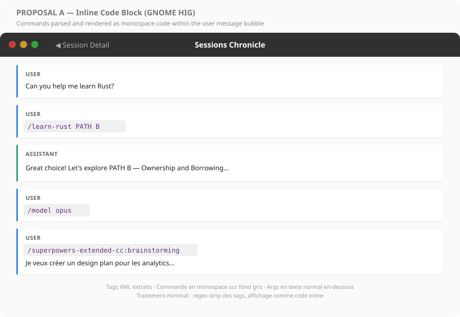
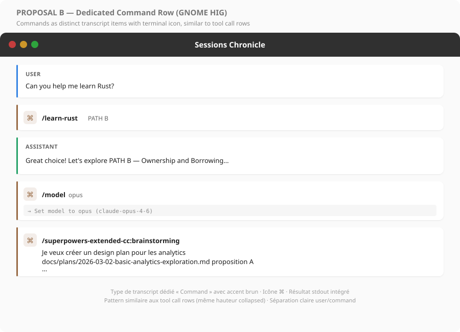
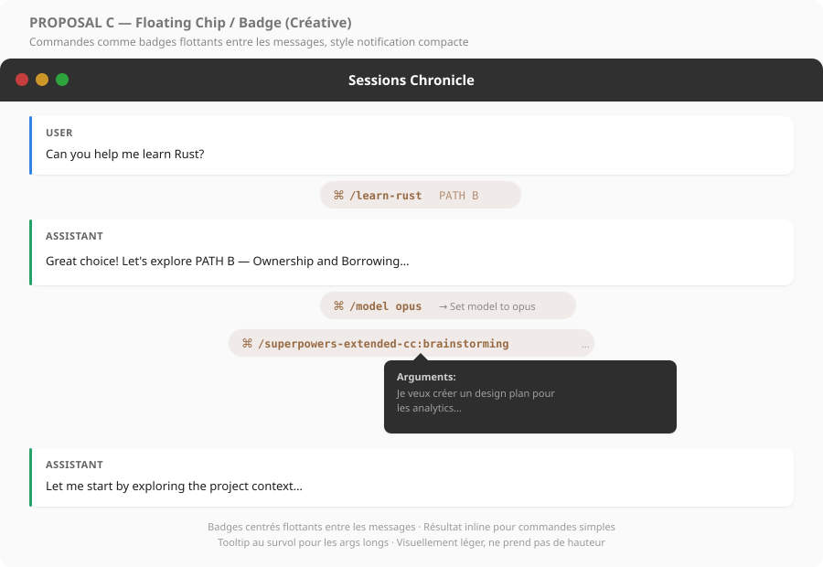
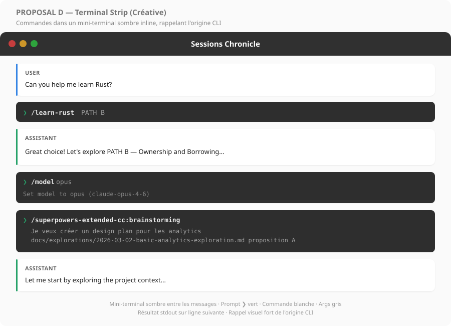
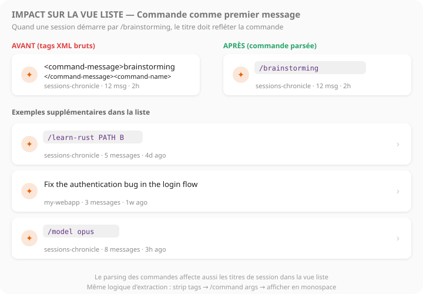

# Command Display — UI Exploration

> Superseded by [2026-03-10-skill-visibility-exploration.md](./2026-03-10-skill-visibility-exploration.md).  
> This document is kept as historical context for the earlier, narrower
> command-display exploration.

Visual exploration of how to display Claude Code slash commands (`/learn-rust`,
`/model`, `/brainstorming`, etc.) in Sessions Chronicle's session list and
transcript detail views.

---

## Problem

Claude Code encodes slash commands as XML-like tags in session JSONL data.
Currently Sessions Chronicle displays these tags verbatim, producing unreadable
content like:

```
<command-message>learn-rust</command-message>
<command-name>/learn-rust</command-name>
<command-args>PATH B</command-args>
```

This affects **two views**:
- **Session list** — when a command is the first message, it becomes the session
  title
- **Transcript detail** — command messages appear as raw tagged text in the
  conversation flow

## Data Format

Commands appear in two JSONL event types:

**1. User messages** (`type: "user"`) — the invoked command:
```json
{
  "type": "user",
  "message": {
    "role": "user",
    "content": "<command-message>learn-rust</command-message>\n<command-name>/learn-rust</command-name>\n<command-args>PATH B</command-args>"
  }
}
```

**2. System events** (`type: "system"`, `subtype: "local_command"`) — command
output:
```json
{
  "type": "system",
  "subtype": "local_command",
  "content": "<command-name>/model</command-name>\n            <command-message>model</command-message>\n            <command-args>opus</command-args>"
}
```

Followed by its result:
```json
{
  "type": "system",
  "subtype": "local_command",
  "content": "<local-command-stdout>Set model to opus (claude-opus-4-6)</local-command-stdout>"
}
```

**Tags used:**
| Tag | Content |
|-----|---------|
| `<command-name>` | The slash command with `/` prefix (e.g. `/learn-rust`) |
| `<command-message>` | The command name without `/` prefix |
| `<command-args>` | Arguments passed to the command (may be empty or multiline) |
| `<local-command-stdout>` | stdout output from local commands |
| `<local-command-caveat>` | System caveat about local command context |

---

## Proposals

### A — Inline Code Block (GNOME HIG)



Commands are parsed and displayed as **monospace code spans** within the
existing user message bubble. The XML tags are stripped and replaced with
formatted text.

| Aspect | Detail |
|--------|--------|
| Layout | Reuses existing user message row |
| Command | Monospace on grey `#f0f0f0` background, purple `#613583` text |
| Args | Short args inline; long/multiline args as normal text below |
| System events | Filtered out (not shown) |

**Pros:** Minimal UI change, no new widget or transcript item type, familiar
code-span pattern, low implementation effort.
**Cons:** Commands visually blend with regular user messages — not immediately
distinguishable. System command results (like `/model` output) are lost.

**Analysis:** The simplest approach. Works well for commands embedded in longer
user messages, but doesn't distinguish "the user typed a command" from "the
user typed a message". Since commands are a distinct interaction type (no user
intent to communicate, just a mode switch), treating them as normal messages
loses semantic meaning. Also discards `local-command-stdout` results.

---

### B — Dedicated Command Row (GNOME HIG)



Commands become a **new transcript item type** with its own row design, visually
parallel to tool call rows. Uses a brown `#986a44` accent and a `⌘` icon to
signal "user-invoked command" distinct from "assistant-invoked tool call".

| Aspect | Detail |
|--------|--------|
| Layout | New `CommandRow` alongside `MessageRow` and `ToolCallRow` |
| Command | Bold name, grey args on the same line |
| Result | Optional grey result line below (from `local-command-stdout`) |
| Long args | Wrapped below the command name as regular text |
| Accent | Brown `#986a44` left bar (distinct from blue/green/orange/purple) |

**Pros:** Clear semantic distinction, reuses existing row pattern (consistent
with tool calls), captures stdout results, straightforward implementation with
the existing factory system.
**Cons:** Adds a new transcript item type (model + factory + enum variant),
slightly more complex than proposal A.

**Analysis:** Follows GNOME HIG patterns established by the existing tool call
rows. The dedicated row makes commands first-class citizens in the transcript.
The brown accent creates a clear visual hierarchy:
blue = user, green = assistant, orange = tool call, purple = subagent,
brown = command. The stdout result display handles `/model` feedback naturally.
Implementation requires a new `TranscriptItemKind::Command` variant and a
corresponding factory widget, but follows the exact same pattern as
`ToolCallRow`.

---

### C — Floating Chip / Badge (Creative)



Commands are **centered floating pills** between messages, visually lightweight
and reminiscent of chat app "system event" indicators (like "Alice joined the
chat").

| Aspect | Detail |
|--------|--------|
| Layout | Centered pill between message rows |
| Command | Monospace inside pill with `⌘` icon |
| Result | Short inline text for simple commands |
| Long args | Ellipsis `…` with tooltip on hover |
| Accent | Brown pill border, translucent fill |

**Pros:** Very lightweight visual footprint, doesn't interrupt message reading
flow, distinguishes commands as "meta" events rather than conversation turns,
elegant for simple commands.
**Cons:** Tooltip for long args is not discoverable, centered layout breaks the
left-aligned transcript flow, GTK4 tooltips have limited formatting, no clear
interaction pattern.

**Analysis:** Visually appealing for short commands (`/model opus`) but breaks
down for commands with substantial arguments like `/brainstorming` with a
multi-paragraph prompt. The centered layout also diverges from the left-aligned
card pattern used by every other transcript element, which may feel
inconsistent. The tooltip dependency for args is a discoverability problem.

---

### D — Terminal Strip (Creative)



Commands are rendered in **dark terminal-styled strips** inline in the
transcript, evoking the CLI origin of the commands. Uses a green `❯` prompt
character, white command text, and grey args.

| Aspect | Detail |
|--------|--------|
| Layout | Full-width dark strip between messages |
| Command | White monospace on dark `#2d2d2d` background |
| Prompt | Green `❯` character left-aligned |
| Args | Grey monospace on subsequent lines |
| Result | Subdued grey text on next line |

**Pros:** Strong visual metaphor linking back to CLI, immediately
recognizable as "something the user typed in a terminal", natural home for
stdout results, visually distinct from all other transcript items.
**Cons:** Dark strips create strong contrast against the light transcript
background, may feel visually heavy in a session with many commands, doesn't
match GNOME HIG patterns at all.

**Analysis:** The most visually distinctive option. The terminal metaphor is
accurate (these *are* CLI commands) and creates an instant "aha" for users
familiar with Claude Code. However, the dark-on-light contrast is aggressive
and multiple terminal strips in a row (e.g. `/model` followed by
`/brainstorming`) would create a "zebra" effect. Works best combined with
proposal B's structure but using the terminal aesthetic only inside the
content area (not the full row).

---

## Impact on Session List Titles



When a command is the **first message** in a session, it becomes the session
title in the list view. All proposals require the same parsing logic at the
title level:

1. Detect `<command-name>` tags in the first message content
2. Extract the command name and args
3. Display as `/command args` instead of raw XML

This is **independent** of the detail view proposal chosen — the title parsing
is needed regardless.

---

## Summary

| Proposal | Style | Complexity | Stdout | HIG | Visual distinction |
|----------|-------|------------|--------|-----|-------------------|
| A — Inline code | Code span in user bubble | Low | No | Yes | Low |
| B — Command row | Dedicated row type | Medium | Yes | Yes | High |
| C — Floating chip | Centered pill | Medium | Partial | No | Medium |
| D — Terminal strip | Dark CLI strip | Medium | Yes | No | Very high |

---

## Decision

*Pending — awaiting review of mockups and discussion.*
