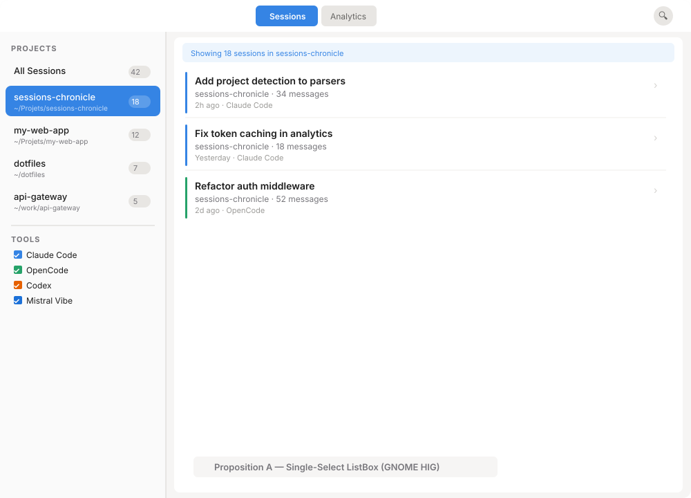
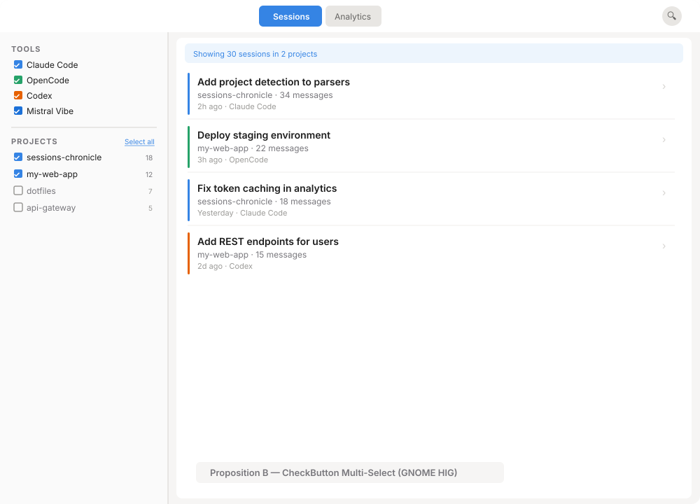
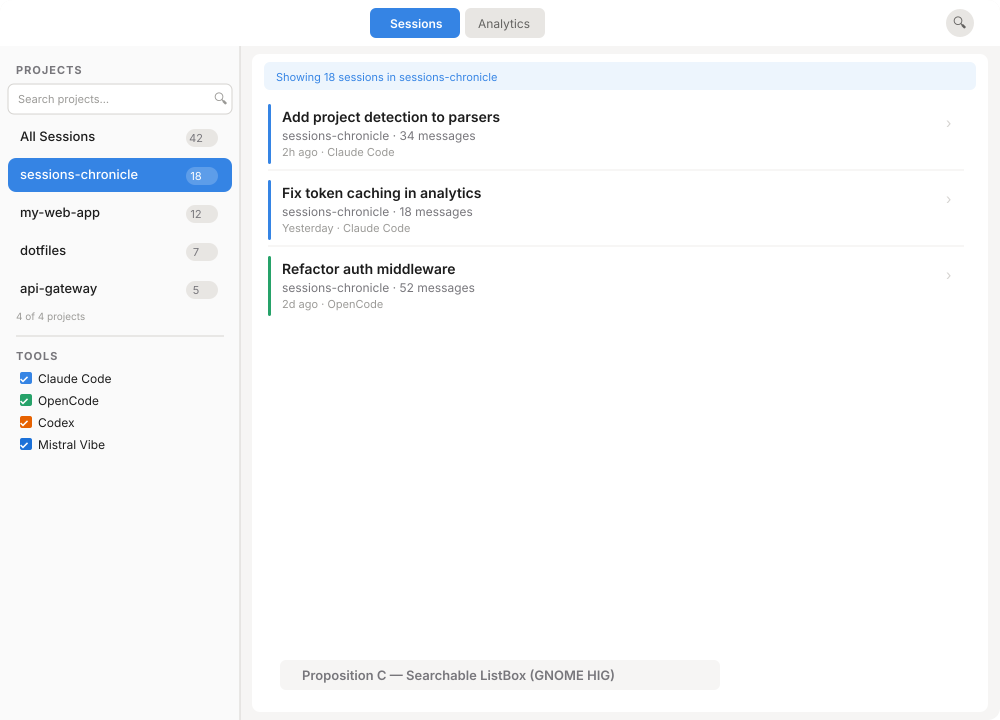
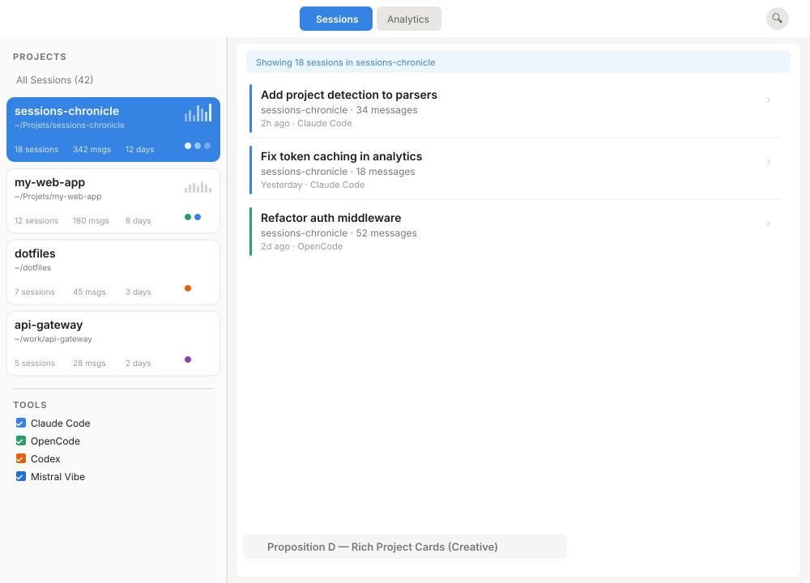
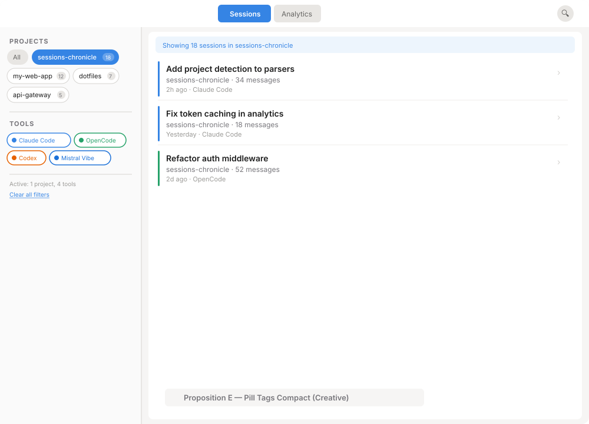

# Project Sidebar Filtering: Design Exploration

**Parent:** [Project-Aware UI Exploration](2026-03-14-project-views-exploration.md) — Option A
**Issue:** [#66](https://github.com/supermaciz/sessions-chronicle/issues/66)
**Date:** 2026-03-16
**Status:** Open

## Context

The [project views exploration](2026-03-14-project-views-exploration.md) decided on **Option A (Project Sidebar)** as the first step toward project-aware UI. This exploration zooms into Option A and compares five concrete proposals for how the project list should look and behave *inside* the existing sidebar.

### Current State

The sidebar (`src/ui/sidebar.rs`) is a 200px-wide vertical `gtk::Box` with:
- A "Filters" title + separator
- A "Tools" section with 4 `gtk::CheckButton` widgets (one per AI assistant)
- A `gtk::ScrolledWindow` containing a placeholder label: "No projects yet"

The `projects` table and `sessions.project_id` foreign key are already populated by the indexer (PR #80). Each project has an `id`, `path`, and `name` (directory basename).

### Key Questions This Exploration Answers

1. **Selection model:** single-select (one project at a time) vs. multi-select (combine projects)?
2. **Row density:** compact name-only rows vs. rich cards with metadata?
3. **Scalability:** how does it work with 5 projects? 20? 50?
4. **Section ordering:** projects above tools, below tools, or unified?
5. **GTK widget pattern:** ListBox, CheckButtons, FlowBox, or custom?

---

## Proposition A — Single-Select ListBox (GNOME HIG)

The most standard GNOME pattern. Projects appear in a `gtk::ListBox` with single-selection mode. Clicking a project filters the session list; clicking "All Sessions" removes the filter.

### Behavior

- "All Sessions" row at top acts as the default (no project filter)
- Each project row shows: name, path (truncated), session count badge (pill)
- Single-click selects a project and immediately filters the session list
- Selected row gets accent background (`@accent_bg_color`)
- Projects sorted by `last_updated DESC` (most recently active first)
- An info bar appears above the session list: "Showing N sessions in project-name"
- Tools section remains below with independent CheckButton filters (cross-filtering)

### Widgets

- `gtk::ListBox` with `SelectionMode::Single`
- Each row: `adw::ActionRow` with subtitle (path) and suffix (badge `gtk::Label` in a pill-shaped frame)
- "All Sessions" row: simple `gtk::ListBoxRow` with bold label

### Trade-offs

| Pros | Cons |
|------|------|
| Simplest GTK pattern — `ListBox` single-select is native | Can only view one project at a time |
| Consistent with GNOME Files, Contacts sidebar behavior | No project metadata beyond name/path/count |
| Zero learning curve for GNOME users | Two-line rows (name + path) use more vertical space |
| Keyboard navigation works out of the box (`Up`/`Down`) | "All Sessions" as a pseudo-row is a minor semantic stretch |
| Minimal code: ~50 lines of Relm4 view macro | Path subtitle may truncate on narrow sidebar |

---

## Proposition B — CheckButton Multi-Select (GNOME HIG)

Mirrors the existing tool filter pattern exactly. Projects become CheckButtons, allowing users to combine multiple projects in the session list.

### Behavior

- Projects listed as `gtk::CheckButton` widgets, same pattern as existing tool checkboxes
- All projects checked by default (shows all sessions)
- Unchecking a project hides its sessions; multiple projects can be checked simultaneously
- "Select all" / "Deselect all" link above the project list for bulk toggle
- Tools section moves to the top of the sidebar (static, always 4 items) to anchor familiar UI
- Info bar shows: "Showing N sessions in K projects"

### Widgets

- `gtk::CheckButton` per project (dynamically created from DB query)
- Session count as a `gtk::Label` right-aligned next to each checkbox
- "Select all" link: `gtk::LinkButton` or clickable `gtk::Label`

### Trade-offs

| Pros | Cons |
|------|------|
| 100% consistent with existing tool filter UX — no new patterns | Checkbox list gets long with 15+ projects |
| Multi-select is more powerful (compare 2 projects side by side) | All-checked default means no visual "active filter" state |
| Users already know the interaction model | No path info — just project name + count |
| Simplest state model: `Vec<i64>` of selected project IDs | Unchecking is mentally inverted: "hide this" not "show this" |
| Easy to implement: extend existing `ToolToggled` pattern | Checkbox fatigue if both tools and projects are long lists |

---

## Proposition C — Searchable ListBox (GNOME HIG)

Adds a `gtk::SearchEntry` above the project list for type-to-filter. Designed for users with many projects (20+) who need to find one quickly.

### Behavior

- Small search entry at top of project section: "Search projects..."
- Typing filters the project list in real-time (client-side `GtkFilterListModel`)
- Below the search: same single-select `ListBox` as Proposition A
- Compact rows: name + badge only (no path subtitle) to maximize visible projects
- "N of M projects" counter below the list shows filter status
- Tools section remains below with independent CheckButton filters

### Widgets

- `gtk::SearchEntry` (compact, no reveal animation — always visible)
- `gtk::ListBox` with `gtk::FilterListModel` backed by a `gtk::StringFilter` on project name
- Each row: simple `gtk::ListBoxRow` with name label + count badge
- Counter: `gtk::Label` with `dim-label` class

### Trade-offs

| Pros | Cons |
|------|------|
| Scales to 50+ projects without scrolling fatigue | Search entry takes 30px of vertical space even with few projects |
| Standard GTK pattern (`FilterListModel` + `SearchEntry`) | Compact rows lose path info (disambiguating "api" from "api-gateway" relies on name alone) |
| Type-ahead is faster than scrolling for power users | Two search fields in the UI (header search + project search) may confuse |
| Combines well with single-select for clear filter state | Overkill for users with < 5 projects |
| `GtkFilterListModel` handles the filtering automatically | Slightly more implementation effort than plain ListBox |

---

## Proposition D — Rich Project Cards (Creative)

Each project is a mini-card with stats, sparkline, and tool dots. The sidebar becomes an information-dense project browser, not just a filter.

### Behavior

- Sidebar widened to 280px to accommodate card content
- Each project card shows: name, path, session/message/active-day counts, tool dots (colored circles for each AI assistant used), 7-day activity sparkline (mini bar chart)
- Single-click selects a card (accent background) and filters sessions
- "All Sessions" as a compact link row above the cards
- Cards have subtle border and rounded corners (`border-radius: 10px`)
- Selected card gets solid accent fill; unselected cards have white background with border

### Widgets

- `gtk::ListBox` with custom `gtk::Box` rows (not `AdwActionRow` — too constrained for card layout)
- Sparkline: `gtk::DrawingArea` with Cairo bar chart (7 bars, one per day)
- Tool dots: small colored `gtk::DrawingArea` circles
- Stats: horizontal `gtk::Box` with 3 count labels

### Trade-offs

| Pros | Cons |
|------|------|
| Information-dense: stats at a glance without clicking | 280px sidebar takes more horizontal space |
| Sparkline reveals activity trends per project | Cards are 80px tall — only ~5 visible without scrolling |
| Tool dots show which AI assistants are used per project | Custom Cairo drawing for sparkline adds complexity |
| Visually distinctive and appealing | Not a standard GTK/GNOME pattern |
| Natural evolution toward Option D (Project Hub) later | More implementation effort: custom row layout + Cairo |

---

## Proposition E — Pill Tags Compact (Creative)

Projects and tools are both rendered as toggle-able pill tags in a `gtk::FlowBox` wrapping layout. Maximizes density and unifies the two filter types visually.

### Behavior

- Projects section uses a wrapping flow layout (pills that wrap to the next line)
- Each project pill: rounded rectangle with name + count badge
- "All" pill at the start resets the project filter
- Clicking a pill selects it (accent color); clicking again deselects (returns to "All")
- Tools rendered as smaller pills with colored dot prefix and colored border
- "Active filters" summary below: "Active: 1 project, 4 tools"
- "Clear all filters" link resets everything
- Compact: the entire filter section fits in ~300px vertical space

### Widgets

- `gtk::FlowBox` with `SelectionMode::Single` for projects (or `Multiple` for multi-select variant)
- Each pill: `gtk::ToggleButton` with custom CSS for rounded shape
- Tool pills: same but with `gtk::DrawingArea` dot prefix
- Summary: `gtk::Label` with `dim-label` class

### Trade-offs

| Pros | Cons |
|------|------|
| Most compact layout — entire filter area in ~300px height | FlowBox wrapping is less predictable than vertical list |
| Unifies project + tool filters into one visual language | Pill tags are more web/Material than GNOME HIG |
| Toggle interaction is fast: one click on, one click off | No project metadata (path, stats) — name + count only |
| FlowBox handles wrapping and responsive layout natively | With many projects, wrapping becomes hard to scan |
| Leaves room below for future sidebar content | Pill sizes vary by name length — visual rhythm is uneven |

---

## Comparison Matrix

| Criterion | A: Single-Select | B: Multi-Select | C: Searchable | D: Rich Cards | E: Pill Tags |
|-----------|:-:|:-:|:-:|:-:|:-:|
| GNOME HIG compliance | ★★★ | ★★★ | ★★★ | ★☆☆ | ★☆☆ |
| Multi-project filtering | ✗ | ✓ | ✗ | ✗ | ✗ |
| Project metadata shown | Name + path | Name only | Name only | Name + path + stats + sparkline | Name only |
| Scales to 20+ projects | ★★☆ | ★☆☆ | ★★★ | ★★☆ | ★★☆ |
| Vertical space used | Medium (~200px for 4 projects) | Low (~120px for 4 projects) | Medium + 30px search | High (~400px for 4 projects) | Low (~120px for 4 projects) |
| Implementation effort | Low | Low | Medium | High | Medium |
| Sidebar width impact | None (200px) | None (200px) | None (200px) | +80px (280px) | None (200px) |
| Consistency with existing UI | ★★★ | ★★★ | ★★☆ | ★☆☆ | ★☆☆ |
| Keyboard navigation | ★★★ | ★★☆ | ★★★ | ★★★ | ★★☆ |

---

## Combinations Worth Considering

1. **A + C (progressive)** — Start with Proposition A (simple ListBox). Add the search entry from Proposition C only when there are >10 projects. The search entry appears/disappears dynamically based on project count.

2. **B for tools, A for projects** — Keep the existing CheckButton pattern for tools (4 static items, multi-select makes sense). Use single-select ListBox for projects (dynamic list, filtering to one project is the primary use case). This is the current mockup layout in Proposition A.

3. **E for tools, A for projects** — Render the 4 tool filters as colored pill tags (compact, saves vertical space) and use a standard ListBox for projects below. Combines the visual density of E with the GNOME compliance of A.

---

## Decision

A, maybe C later.
