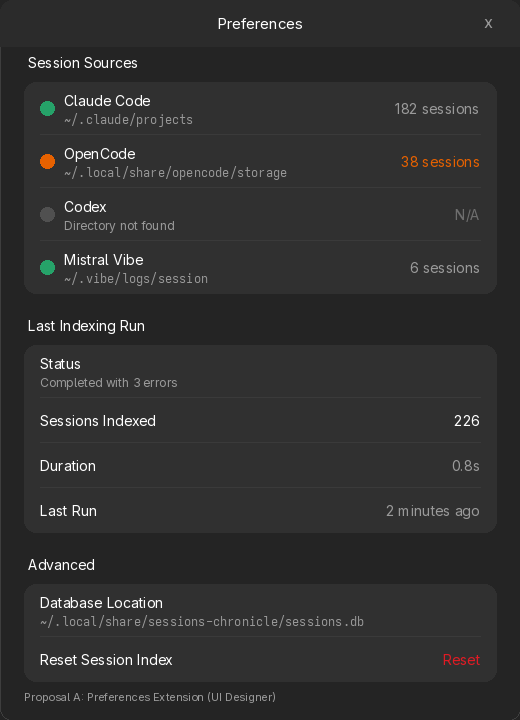
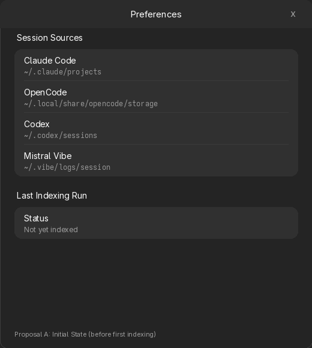
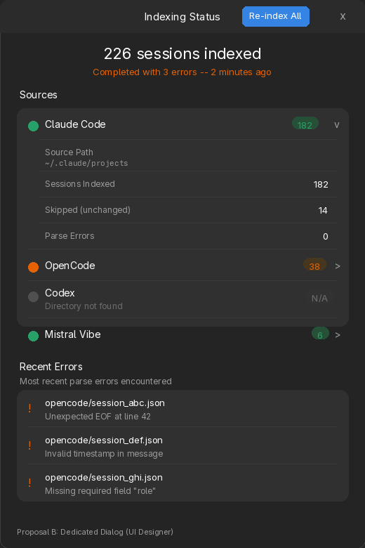
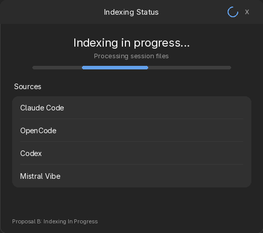
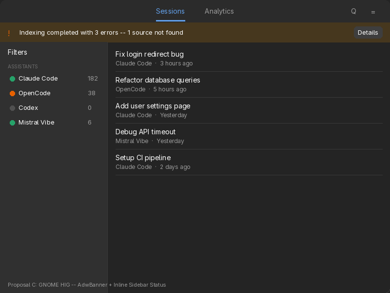
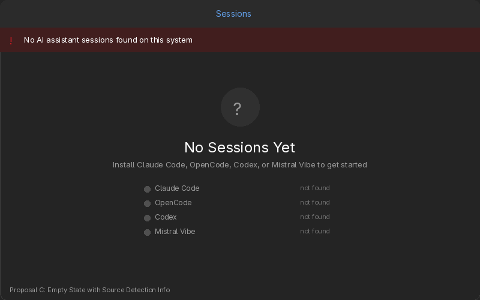
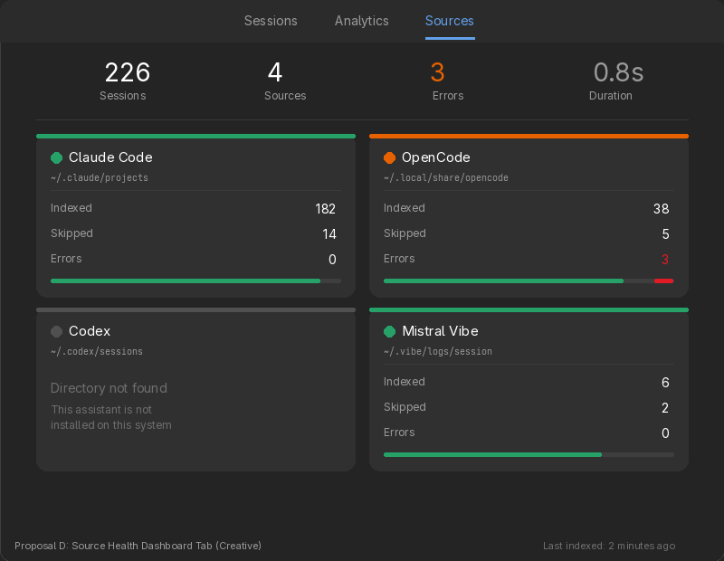
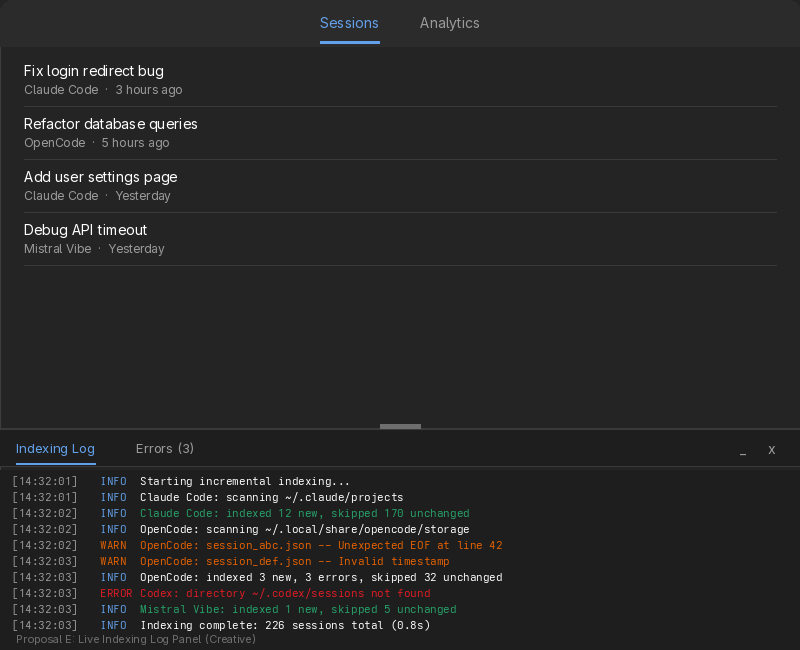

# Indexing Diagnostics UI — Exploration

**Issue:** [#84 — Source discovery and indexing health diagnostics](https://github.com/supermaciz/sessions-chronicle/issues/84)  
**Date:** 2026-03-23  
**Type:** Exploration (comparing UI approaches)

## Problem

Users have no visibility into indexing state. They cannot see which assistant sources are detected, which succeeded or failed, how many sessions were indexed per source, or when the last indexing run happened. Silent failures erode trust in a local-first tool.

## Shared Backend Prerequisite

All proposals require enriching `IndexingWorkerOutput::Completed` to carry per-source results. The current `IndexingStats { indexed, skipped }` would become:

```rust
struct PerSourceResult {
    assistant: AiAssistant,
    path: PathBuf,
    path_exists: bool,
    indexed: usize,
    skipped: usize,
    errors: usize,
    status: SourceStatus, // NotFound | Empty | Indexed | Failed
}
```

This is a backend change common to all proposals and not part of the UI decision.

## Current State

- **Feedback during indexing:** spinner in header bar, tooltip "Indexing sessions..."
- **Feedback on completion:** `AdwToast` "Index rebuilt — N sessions" (3s timeout)
- **Feedback on failure:** `AdwToast` "Background indexing failed" (3s, no details)
- **Parse errors:** logged via `tracing::warn()`, not surfaced to UI
- **Source paths:** resolved in `session_sources.rs`, not displayed anywhere
- **Existing widgets used:** `AdwStatusPage` (empty states), `AdwToast`, `AdwAlertDialog`, `AdwPreferencesDialog`, `AdwOverlaySplitView`, `AdwViewStack`

---

## Proposal A — Preferences Extension

**Origin:** UI Designer agent  
**Philosophy:** Extend the existing Preferences dialog with two new `AdwPreferencesGroup` sections. No new views, no new navigation targets.

### Mockup





### Design

Add two groups to the existing `AdwPreferencesDialog`, between the existing "Session Resumption" and "Advanced" groups:

**"Session Sources" group** — one `AdwActionRow` per assistant:
- **Title:** assistant display name (e.g. "Claude Code")
- **Subtitle:** resolved path in monospace (`subtitle_lines(1)`, ellipsized). "Directory not found" if path absent.
- **Prefix:** colored status dot (green = OK, orange = errors present, grey = not found)
- **Suffix:** session count label (e.g. "182 sessions") or "N/A"

**"Last Indexing Run" group** — four `AdwActionRow`:
- Status: "Completed successfully" / "Completed with N errors" / "Not yet indexed"
- Sessions Indexed: numeric count
- Duration: e.g. "0.8s"
- Last Run: relative timestamp ("2 minutes ago")

**Entry point enhancement:** the existing completion toast gains a "Details" action button that opens Preferences and scrolls to the Sources group.

### States

| State | Sources group | Last Run group |
|-------|--------------|----------------|
| Before first indexing | Paths shown, no counts | "Not yet indexed" |
| Indexing in progress | No change (updates on completion) | Spinner in Status row |
| Completed OK | Green dots + counts | "Completed successfully" |
| Completed with errors | Mixed dots + counts | "Completed with N errors" |
| No sources found | All grey + "Directory not found" | "No session sources found" |

### Trade-offs

| | |
|---|---|
| **Strengths** | Zero new navigation; minimal code; follows GNOME Settings pattern (hardware status in prefs); toast "Details" button aids discoverability |
| **Weaknesses** | Not visible during normal use; no real-time progress; requires opening Preferences to inspect; cannot show error details |
| **Effort** | Low — extends existing `PreferencesDialog` component |
| **HIG conformance** | High — standard preferences pattern |

---

## Proposal B — Dedicated AdwDialog

**Origin:** UI Designer agent  
**Philosophy:** A purpose-built dialog accessible from the hamburger menu, using `AdwExpanderRow` cards for progressive disclosure and an error log section.

### Mockup





### Design

**Shell:** `AdwDialog` (480×560, `follows_content_size: true`). Accessible via hamburger menu "Indexing Status…" and `Ctrl+Shift+I`.

**Summary banner** — compact `AdwStatusPage`:
- Title: "247 sessions indexed" or "Indexing in progress…" or "No sessions found"
- Subtitle: "Last indexed 2 min ago" or "Completed with N errors"
- Child during indexing: `GtkProgressBar` (pulse mode)

**Source cards** — `AdwPreferencesGroup` "Sources" with one `AdwExpanderRow` per assistant:
- Suffix: colored pill with session count (e.g. green "182", orange "38", grey "N/A")
- Expanded children: Source Path (monospace, copy button), Sessions Indexed, Skipped, Parse Errors, Re-index button
- Non-expandable when path not found (subtitle: "Directory not found")

**Error log** — `AdwPreferencesGroup` "Recent Errors" (visible only when errors > 0):
- Up to 10 `AdwActionRow` with file path as title, error message as subtitle, warning icon prefix
- Final "and N more errors" row if overflow

**Header bar:** "Re-index All" button (`.suggested-action`), replaced by spinner during indexing.

### Trade-offs

| | |
|---|---|
| **Strengths** | Rich progressive disclosure; error log surfaces invisible parse failures; per-source re-index; discoverable via menu; `AdwDialog` adapts to narrow windows (bottom sheet on mobile) |
| **Weaknesses** | More code (new component + message variants); per-source re-index needs backend work; error log needs indexer changes to collect details; may feel heavy for simple setups |
| **Effort** | Medium — new `IndexingStatusDialog` in `src/ui/modals/`, new menu action, enriched worker output |
| **HIG conformance** | High — `AdwDialog` is the modern HIG pattern for "inspect system status" (cf. GNOME Disks SMART dialog) |

---

## Proposal C — AdwBanner + Inline Sidebar Status

**Origin:** GNOME HIG (strict conformance)  
**Philosophy:** No new dialogs or pages. Use the three standard GNOME feedback mechanisms — `AdwBanner` for persistent warnings, `AdwToast` for transient success, and `AdwStatusPage` for empty states — combined with inline session counts in the existing sidebar.

### Mockup





### Design

**AdwBanner** (top of main window, below header bar):
- Shown only when indexing completed with errors or missing sources
- Text: "Indexing completed with 3 errors — 1 source not found"
- Action button: "Details" → opens Preferences (where Proposal A's groups could optionally live, or just shows existing DB info)
- Auto-hides after 30 seconds or on user dismiss
- Not shown when indexing is successful (toast suffices)

**Sidebar enhancement** — in the existing "Assistants" filter section:
- Each assistant row gains a colored status dot (green/orange/grey) and session count
- Grey dot + "0" for sources not found
- Orange dot when errors were encountered for that source
- This gives at-a-glance per-source health without any extra navigation

**Enhanced empty state** — when no sessions exist at all:
- The existing `AdwStatusPage` "No Sessions Yet" gains a child widget listing detected source paths and their status (found / not found)
- Helps users understand why there are no sessions and which assistants to install

**Toast enhancement** — on indexing completion:
- Success: "Index rebuilt — 247 sessions" (existing, unchanged)
- Partial: "Indexed 226 sessions with 3 errors" with "Details" button
- Failure: "Indexing failed" with "Retry" button

### Trade-offs

| | |
|---|---|
| **Strengths** | Zero new UI surfaces; information appears in-context where users already look; `AdwBanner` is the HIG-prescribed pattern for "persistent non-blocking message"; minimal visual footprint when everything works |
| **Weaknesses** | Limited detail (no error log, no per-source breakdown beyond counts); banner can feel alarming for minor issues; sidebar counts require sidebar to be visible; no dedicated place to see full diagnostic history |
| **Effort** | Low — add banner widget to root view, enrich sidebar rows, enhance empty state |
| **HIG conformance** | Strict — uses only prescribed GNOME feedback patterns without any extensions |

---

## Proposal D — Source Health Dashboard Tab

**Origin:** Creative (departs from HIG)  
**Philosophy:** Treat source health as a first-class workspace alongside Sessions and Analytics. A visual dashboard with card-based layout, summary metrics, and colored health indicators gives maximum visibility.

### Mockup



### Design

**Third workspace tab** — "Sources" added to the existing `AdwViewStack` alongside Sessions and Analytics.

**Summary metrics bar** (top):
- Four large numbers: total sessions, source count, error count, duration
- Error count highlighted in orange/red when > 0

**Source cards** (2×2 responsive grid via `GtkFlowBox`):
- Each card: rounded container with colored top border (green/orange/red/grey)
- Card content: assistant name + status dot, monospace path, separator, stats table (Indexed / Skipped / Errors), mini stacked progress bar at bottom
- "Not found" cards show a dimmed placeholder message instead of stats
- Cards reflow to single-column on narrow windows

**Footer:** "Last indexed: 2 minutes ago" timestamp.

**Re-index button:** in header bar when Sources tab is active.

### Trade-offs

| | |
|---|---|
| **Strengths** | Maximum visibility — always one click away; visual and scannable; progress bars give intuitive health picture; room for future enrichment (charts, history, per-file detail); feels modern and "app-like" |
| **Weaknesses** | **Violates HIG** — workspace tabs should represent equal-weight content areas, but indexing diagnostics are operational metadata, not a primary workspace; adds permanent navigation weight for a feature consulted occasionally; 2×2 grid is unusual in GNOME apps; more CSS and layout code to maintain |
| **Effort** | Medium-High — new `SourcesView` component, `GtkFlowBox` layout, custom CSS for cards and progress bars, `AdwViewStack` modification |
| **HIG conformance** | Low — HIG discourages workspace tabs for secondary/admin content |

---

## Proposal E — Live Indexing Log Panel

**Origin:** Creative (departs from HIG)  
**Philosophy:** Borrow the "developer console" pattern from browsers and IDEs. A slide-up bottom panel shows a live monospace log of indexing activity, color-coded by level (INFO/WARN/ERROR). Gives power users full transparency into what the indexer is doing.

### Mockup



### Design

**Bottom panel** — resizable, collapsible panel at the bottom of the main window:
- Drag handle to resize (browser DevTools style)
- Minimize (`_`) and close (`x`) buttons
- Two tabs: "Indexing Log" (full log) and "Errors (N)" (filtered to WARN/ERROR)
- Default: collapsed/hidden. Opened via `Ctrl+Shift+L` or hamburger menu "Indexing Log"
- Remembers open/closed state and height via GSettings

**Log content** — monospace, terminal-style:
- Each line: `[HH:MM:SS]  LEVEL  message`
- Color-coded: INFO = blue, WARN = orange, ERROR = red, success messages = green
- Scrolls to bottom automatically during indexing
- Persists log from last indexing run (cleared on next run)

**Integration with `tracing`:** the indexing worker already logs via `tracing::info!()` / `warn!()` / `error!()`. A custom `tracing::Subscriber` layer would capture these and forward them as messages to the UI panel.

**Errors tab:** filtered view showing only warnings and errors, with clickable file paths (for future: open in file manager).

### Trade-offs

| | |
|---|---|
| **Strengths** | Maximum transparency for power users; real-time streaming (not just after-the-fact); familiar to developers (target audience); error tab gives focused troubleshooting view; leverages existing `tracing` infrastructure |
| **Weaknesses** | **Strongly departs from HIG** — bottom panels are not a GNOME pattern (GNOME apps use dialogs, sidebars, or popovers); visually complex; non-trivial to implement (custom tracing subscriber, resizable panel, scroll management); intimidating for non-developer users; consumes vertical space |
| **Effort** | High — custom resizable panel widget, tracing subscriber layer, GSettings for state, two-tab sub-view, scroll management |
| **HIG conformance** | Very low — no GNOME app uses this pattern; feels like an IDE feature transplanted into a GNOME app |

---

## Comparison Matrix

| Criterion | A: Preferences | B: Dialog | C: Banner+Inline | D: Dashboard Tab | E: Log Panel |
|---|---|---|---|---|---|
| **Effort** | Low | Medium | Low | Medium-High | High |
| **HIG conformance** | High | High | Strict | Low | Very Low |
| **Information density** | Basic | Rich | Minimal | Medium | Maximum |
| **Discoverability** | Moderate | High | High (banner) | Very High | Moderate |
| **Always visible?** | No (dialog) | No (dialog) | Partially (banner+sidebar) | Yes (tab) | Optional (panel) |
| **Real-time progress** | No | Partial (pulse bar) | No | No | Yes (streaming) |
| **Error details** | No | Yes (log section) | No | Counts only | Yes (full log) |
| **Adaptive/mobile** | Free | Free (bottom sheet) | Free | Needs breakpoints | Poor on mobile |
| **Future extensibility** | Limited | Good | Limited | Good | Very good |
| **Maintenance burden** | Minimal | Moderate | Minimal | Moderate | High |

## Hybrid Possibilities

These proposals are not mutually exclusive. Some natural combinations:

1. **C + A:** Banner for immediate feedback + Preferences for persistent reference. Low effort, full HIG compliance.
2. **C + B:** Banner for immediate feedback + Dialog for deep-dive diagnostics. Moderate effort, strong HIG compliance.
3. **A + E:** Preferences for summary + Log panel for power users. Covers both audiences but high total effort.

## Decision

**Recommended product direction:** adopt a **hybrid C + B** approach.

- **Phase 1:** ship **Proposal C** first to eliminate silent failures quickly with minimal UI and implementation risk.
- **Phase 2:** add **Proposal B** as the canonical deep-dive diagnostics surface once the backend result model is validated.

### Rationale

1. **C addresses the core issue immediately.**  
   Issue #84 is primarily about silent failures and missing visibility. `AdwBanner` + enriched toast + inline source status make indexing problems visible in the main flow, without requiring users to proactively inspect a secondary surface.

2. **C is the right first slice of the shared backend work.**  
   Both proposals depend on enriching indexing results with per-source status. Proposal C only needs aggregate counts and per-source health, while Proposal B becomes more valuable once individual error messages and richer diagnostics are available. Shipping C first validates the backend shape with lower scope.

3. **B is more useful once C can drive discovery.**  
   A diagnostics dialog is valuable, but it is fundamentally an inspection surface. Its utility increases significantly when users can reach it from contextual entry points such as a banner or toast "Details" action shown at the moment a problem occurs.

### Product interpretation

- **C = proactive notification and in-context visibility**
- **B = persistent inspection and troubleshooting**

That makes the recommended sequence:

1. **Implement C first** to remove silent failure and restore trust.
2. **Implement B next** as the single canonical destination for "Details".

### Explicit non-decision

- Do **not** start with Proposal D or E; both add too much permanent UI weight and depart too far from GNOME HIG for a secondary operational concern.
- Do **not** treat Proposal A as the target solution; it is acceptable as a low-effort fallback, but too hidden to fully solve the trust problem on its own.

## References

- [GNOME HIG — Dialogs](https://developer.gnome.org/hig/patterns/feedback/dialogs.html)
- [AdwStatusPage documentation](https://gnome.pages.gitlab.gnome.org/libadwaita/doc/main/class.StatusPage.html)
- [AdwBanner documentation](https://gnome.pages.gitlab.gnome.org/libadwaita/doc/main/class.Banner.html)
- `docs/PRODUCT_ASSESSMENT_2026-03.md` — must-have features, short-term roadmap
- `src/session_sources.rs` — current source resolution logic
- `src/database/indexer.rs` — current indexing logic and `IndexingStats`
- `src/indexing_worker.rs` — worker message types
- `src/ui/modals/preferences.rs` — existing preferences dialog
