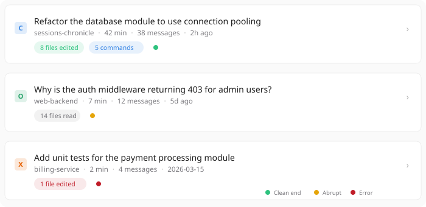
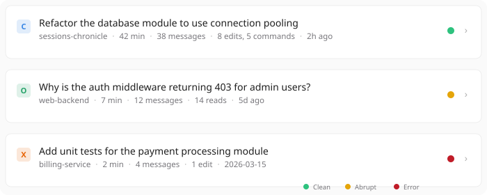
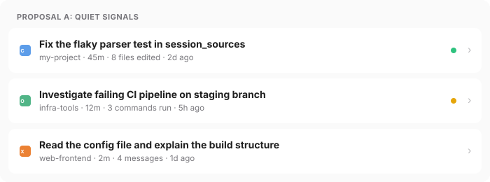
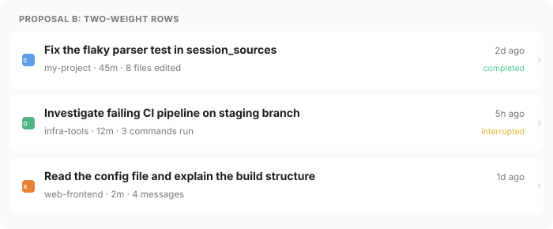
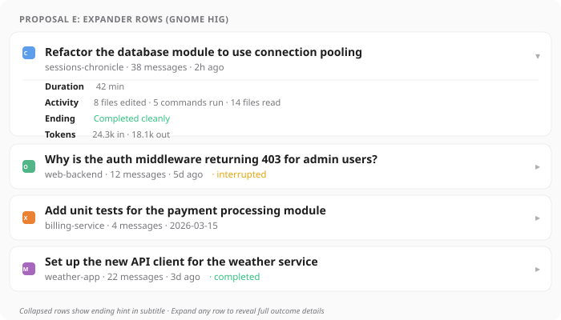
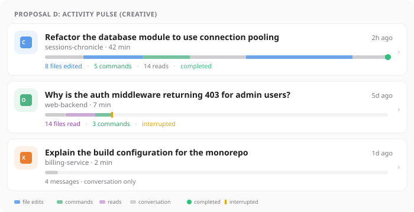

# Session Outcome Display — Exploration

**Issue:** [#90 — Session outcome display and stopping point in session list](https://github.com/supermaciz/sessions-chronicle/issues/90)  
**Date:** 2026-03-27  
**Type:** Exploration (comparing UI approaches)

## Problem

The session list does not let users understand a session at a glance. Users currently need to open the detail view to answer basic questions:

- What project does this session belong to?
- Where did the work appear to stop?
- Did the session end cleanly or abruptly?
- Did it produce a meaningful outcome (edits, commands) or was it mostly exploration?

The product assessment (2026-03-21, recommendation 1.1) calls this "the single most impactful UX change available" and identifies the 2-second scanability threshold as the target.

## Current State

Each session row is an `AdwActionRow` (`src/ui/session_row.rs`):

```
[16px icon]  First user prompt (1 line, ellipsis)        [>]
             project-name · N messages · 2d ago
```

- **Prefix**: 16px tool icon (Claude Code, OpenCode, Codex, Mistral Vibe)
- **Title**: `first_prompt` (1 line, ellipsis via `title_lines: 1`)
- **Subtitle**: `project-name · N messages · relative-time`
- **Suffix**: `go-next-symbolic` chevron
- **Context menu**: "Resume in Terminal" (right-click)
- **Row height**: ~56px (standard two-line `AdwActionRow`)

The row covers identity and recency but says nothing about outcome, duration, or effort.

## Available Data

All signals below are already in the database and require no AI inference:

| Signal | Source | Derivation |
|---|---|---|
| **Session duration** | `sessions.start_time`, `sessions.last_updated` | `last_updated - start_time` |
| **Ending signal** | `transcript_items` + `tool_calls` | Last item is assistant message with no pending tool calls = clean; last item is user or tool call in error = abrupt |
| **Activity summary** | `tool_calls.tool_name`, `tool_calls.status` | Count by category: edits (Write, Edit, etc.), reads (Read, Glob, etc.), commands (Bash, Terminal, etc.) |
| **Token usage** | `sessions.input_tokens`, `sessions.output_tokens` | Total tokens; lower priority for list display |
| **Subagent count** | `sessions.parent_session_id` | Count child sessions |

## Shared Backend Prerequisite

All proposals require the same data layer work:

1. **Session duration**: Computed as `last_updated - start_time`. Trivial, no schema change.

2. **Activity summary counts**: Classify `tool_calls.tool_name` into edit/read/command categories and count per session. Either JOIN at query time or denormalize into `sessions` during indexing.

3. **Ending signal**: Inspect last transcript item + tool call error states. Best stored as denormalized `ending_status TEXT` column (`clean`, `abrupt`, `error`, `unknown`).

4. **Schema migration**: Add to `sessions`:
   - `edit_count INTEGER DEFAULT 0`
   - `read_count INTEGER DEFAULT 0`
   - `command_count INTEGER DEFAULT 0`
   - `ending_status TEXT DEFAULT 'unknown'`

This backend work is identical for all proposals and is not part of the UI decision.

---

## Proposal A — Enriched Subtitle with Outcome Chips

**Origin:** UI Designer  
**Philosophy:** Add a third visual line of colored pill chips for activity counts and a status dot, keeping the `AdwActionRow` structure intact.

### Layout

```
[icon]  Refactor the database module to use connection pooling     [>]
        sessions-chronicle · 42 min · 38 messages · 2h ago
        [8 files edited] [5 commands] ●
```

- Title: unchanged (first prompt, 1 line, ellipsis)
- Subtitle: project + duration + message count + relative time
- Third line: horizontal `GtkBox` below subtitle with 0-3 pill-shaped `GtkLabel` chips + 8px status dot
- Chips: green for edits, blue for commands, dim for reads. Omitted when count is zero.
- Status dot: green (clean), amber (abrupt), red (error), hidden (unknown)
- Row height: ~80px (+24px vs current)

### Mockup



### Pros

- High glanceability: colored chips create a scannable visual pattern
- Graceful degradation: rows without tool call data show no chips and look like the current design
- Familiar pattern: chip rows appear in GNOME Software categories

### Cons

- ~24px taller per row, fewer sessions visible when scrolling long lists
- Colored chips add visual weight; risk of clutter if tuning is off
- Requires custom widget below `AdwActionRow` subtitle (slightly outside standard API)
- Activity query adds JOIN cost to session list loading

---

## Proposal B — Compact Suffix with Inline Summary

**Origin:** UI Designer  
**Philosophy:** Pack all new information into the existing subtitle text and a small status dot in the suffix area. Zero height increase.

### Layout

```
[icon]  Refactor the database module to use connection pooling   ● [>]
        sessions-chronicle · 42 min · 38 messages · 8 edits, 5 cmds · 2h ago
```

- Title: unchanged
- Subtitle: project + duration + messages + compact activity summary + relative time
- Suffix: 10px colored status dot before chevron
- Row height: ~56px (unchanged)

### Mockup



### Pros

- Zero height increase; same density as current design
- Minimal implementation: subtitle string formatting + small suffix widget
- Fully standard `AdwActionRow` API (title, subtitle, prefix, suffix)
- One CSS class (the dot)

### Cons

- All outcome info is dim text — requires reading, not scanning
- Long subtitle ellipsizes on narrow windows, losing the new info first
- 10px suffix dot is subtle; users may not notice it
- No visual differentiation by activity type

---

## Proposal C — Quiet Signals

**Origin:** Mii Beta GTK Designer  
**Philosophy:** Enrich the subtitle with duration and a dominant activity summary, add a single 8px status dot in the suffix. Same row height, same widget, same rhythm — but the subtitle now tells a story.

### Layout

```
[icon]  Fix the flaky parser test in session_sources           [●] [>]
        my-project · 45m · 8 files edited · 2d ago
```

- Title: unchanged
- Subtitle restructured: project + duration + **dominant activity** (replaces message count) + relative time
- Activity logic: show the most notable category ("8 files edited" > "5 commands run" > "4 messages")
- Suffix: 8px status dot (green/amber/hidden), placed before chevron
- Row height: ~64px (unchanged from `AdwActionRow` two-line)

### What is deliberately left out

- **Token usage**: too noisy for a list; detail-view concern
- **Activity type icons**: icon litter. "8 files edited" as text is clearer than three tiny icons
- **Subagent indicators**: noise that serves power users at the expense of everyone
- **Multi-line custom widgets**: the `AdwActionRow` is structurally fine here

### Mockup



### Pros

- Zero layout disruption; existing tests and factory logic preserved
- Almost entirely a string formatting change in `session_subtitle()`
- Duration is far more meaningful than message count for triage
- Status dot answers "should I look at this?" at a glance

### Cons

- Subtitle can get long and ellipsize before showing recency on narrow windows
- 8px dot is subtle enough that some users may not discover it
- Only shows one activity category — less nuanced than chips or full summary
- Does not address the "every row looks the same weight" problem

---

## Proposal D — Two-Weight Rows

**Origin:** Mii Beta GTK Designer  
**Philosophy:** Replace `AdwActionRow` with a custom two-line layout that separates session identity (title + recency) from session outcome (project, duration, activity, ending state). The eye can sweep titles OR drop to the outcome line depending on the task.

### Layout

```
[icon]  Fix the flaky parser test in session_sources              2d ago
        my-project · 45m · 8 files edited                     completed
```

- Line 1 (identity): icon + title (bold, hexpand) + relative time (right-aligned, dim)
- Line 2 (outcome): project + duration + activity (dim, hexpand) + ending text (right-aligned, colored: green "completed" / amber "interrupted" / absent when unknown)
- Chevron: vertically centered on both lines
- Row height: ~72px (+8px vs current)

### What is deliberately left out

Same as Proposal C, plus:
- **No third line**: two lines is the ceiling
- **No per-row card styling**: rows remain list items in `boxed-list`
- **No background color-coding**: this is a session list, not a CI monitor

### Mockup



### Pros

- Dramatically more informative through hierarchy, not density
- Two-line scan pattern is a proven GNOME idiom (Nautilus, GNOME Software)
- Relative time in fixed top-right is instantly scannable
- "completed"/"interrupted" as text is self-explanatory — no legend needed
- Project name gets its own visual weight, separated from duration and activity

### Cons

- Replaces `AdwActionRow` with custom layout: more code, more maintenance
- Must manually handle accessibility, RTL, dark/light/high-contrast
- ~8px taller rows — roughly 10-15% fewer visible on screen
- Moderate implementation cost: new `view!` macro layout, CSS classes, updated factory tests

---

## Proposal E — Expander Rows (GNOME HIG)

**Origin:** GNOME HIG pattern study  
**Philosophy:** Use `AdwExpanderRow` to keep the list compact by default. Rows show the essentials (title, subtitle with ending hint) and can be expanded inline to reveal full outcome details — duration, activity breakdown, token usage, ending status — without navigating to the detail view.

### Layout (collapsed)

```
[icon]  Why is the auth middleware returning 403 for admin users?   [▸]
        web-backend · 12 messages · 5d ago · interrupted
```

### Layout (expanded)

```
[icon]  Refactor the database module to use connection pooling      [▾]
        sessions-chronicle · 38 messages · 2h ago
        ─────────────────────────────────────────────
        Duration      42 min
        Activity      8 files edited · 5 commands run · 14 files read
        Ending        Completed cleanly
        Tokens        24.3k in · 18.1k out
```

- Collapsed: standard `AdwExpanderRow` with ending hint appended to subtitle (colored text: "· completed" / "· interrupted")
- Expanded: key-value pairs for duration, activity breakdown, ending status, and optionally token usage
- Expander arrow replaces the chevron; clicking the row still navigates to detail view, the expander toggle is a separate click target
- Row height (collapsed): ~56px (same as current)

### Mockup



### Pros

- **Progressive disclosure**: zero visual noise by default, full detail on demand
- **Pure GNOME HIG**: `AdwExpanderRow` is a standard libadwaita widget used in GNOME Settings, Software, etc.
- **Compact default**: collapsed rows are the same height as current design
- **Rich on demand**: expanded view can show more data than any other proposal (duration + activity + tokens + ending)
- **No custom widgets**: uses `AdwExpanderRow` API directly

### Cons

- **Two click targets per row**: expand vs navigate creates ambiguity. Users must distinguish "I want to see details" from "I want to open this session"
- **Inconsistent row heights**: some expanded, some collapsed — the list becomes irregular during scanning
- **Discoverability**: the ending hint in the subtitle is the only visible outcome signal when collapsed. Users who never expand gain almost nothing over the current design
- **Cognitive overhead**: users must learn the expand pattern. Most GNOME apps use `AdwExpanderRow` for settings/preferences, not for primary navigation lists
- **Implementation complexity**: `AdwExpanderRow` manages its own expand/collapse state and child widgets, which adds interaction complexity vs simple `AdwActionRow`

---

## Proposal F — Activity Pulse (Creative)

**Origin:** Creative departure from GNOME HIG  
**Philosophy:** Replace text-based outcome metadata with a horizontal activity sparkline — a visual "pulse" that encodes the temporal pattern of the session. The sparkline shows when messages were sent, when tool calls happened, and how the session intensity varied over time. Each session gets a unique visual fingerprint.

### Layout

```
[40px icon]  Refactor the database module to use connection pooling    2h ago
             sessions-chronicle · 42 min
             ▓▓░░▓▓▓▓░░░▓▓▓▓▓▓▓▓▓▓▓▓▓░░░░▓▓▓▓▓▓▓▓▓▓▓▓▓▓▓▓░░●
             8 files edited · 5 commands · 14 reads · completed
```

- Line 1: title (bold) + relative time (right-aligned)
- Line 2: project + duration
- Line 3: **activity pulse bar** — a 6px-tall horizontal bar spanning the row width, segmented by time. Segments are color-coded: blue for file edits, green for commands, purple for reads, gray for conversation. The bar length is proportional to session duration. Short sessions show short bars; long sessions fill the width.
- Line 4: activity summary text + ending status text
- End cap: green circle for clean end, amber bar for interrupted, absent for unknown
- Larger icon (40px in tinted background) for stronger tool identity
- Row height: ~88px

### Activity Pulse Bar Construction

The session timeline is divided into time buckets (e.g., 5-minute segments). Each bucket is classified by the dominant activity type in that window:

| Color | Activity | Hex |
|---|---|---|
| Blue | File edits (Write, Edit, etc.) | `#3584e4` at 70% |
| Green | Commands (Bash, Terminal, etc.) | `#26a269` at 60% |
| Purple | Reads (Read, Glob, etc.) | `#9141ac` at 40% |
| Gray | Conversation (no tool calls) | `#77767b` at 30% |

The bar width is proportional: a 2-minute session shows a tiny bar; a 60-minute session fills the row.

### Mockup



### Pros

- **Instant visual differentiation**: every session has a unique visual fingerprint. A quick-question session looks dramatically different from a long refactoring session at a glance, even before reading any text
- **Temporal pattern**: shows where the work concentrated, not just totals. "The edits happened in two bursts with a conversation gap in between" is visible without reading anything
- **High information density**: communicates duration, activity type, intensity, and ending in a single 6px bar
- **Memorable**: users develop visual familiarity with their session patterns over time
- **Engaging**: the most visually distinctive proposal; creates strong product identity

### Cons

- **Departs from GNOME HIG**: no standard libadwaita widget for sparkline/activity bars. Requires custom `GtkDrawingArea` or `GtkSnapshot` rendering
- **Tallest rows**: ~88px per row means significantly fewer visible sessions. For users with 100+ sessions, scrolling becomes a real concern
- **Complex rendering**: computing time-bucketed activity data and rendering proportional colored segments is substantially more complex than text formatting
- **Unfamiliar pattern**: users must learn to read the pulse bar. It is not a standard UI pattern in GNOME or elsewhere
- **Query cost**: requires temporal tool call data (start times), not just counts, adding a more expensive query per session
- **Accessibility**: the pulse bar communicates visual information that has no text equivalent without a verbose tooltip. Screen reader support would require a fallback text description

---

## Comparison Matrix

| Criterion | A (Chips) | B (Compact Suffix) | C (Quiet Signals) | D (Two-Weight) | E (Expander) | F (Activity Pulse) |
|---|---|---|---|---|---|---|
| **2-second scanability** | High | Medium | Medium-High | High | Low (collapsed) | Very High |
| **Row height** | ~80px | ~56px | ~64px | ~72px | ~56px collapsed | ~88px |
| **HIG compliance** | Mostly | Fully | Fully | Custom layout | Fully | Low |
| **Implementation cost** | Medium | Low | Low | Medium | Medium | High |
| **Visual disruption** | Medium | Minimal | Minimal | Low | Minimal | High |
| **Ending signal clarity** | Dot (subtle) | Dot (subtle) | Dot (subtle) | Text (clear) | Text (good) | Cap + text (clear) |
| **Activity visibility** | Color chips | Dim text | Dominant only | Text | On expand | Visual + text |
| **Narrow-width behavior** | Chips hide | Subtitle clips | Subtitle clips | Second line clips | Subtitle clips | Bar shrinks |
| **Accessibility** | Good | Good | Good | Needs work | Good | Needs fallback |
| **Graceful degradation** | Excellent | Excellent | Excellent | Good | Good | Fair |

## GNOME HIG References

- [Boxed Lists](https://developer.gnome.org/hig/patterns/containers/boxed-lists.html) — row types, `.boxed-list` / `.boxed-list-separate`
- [Typography](https://developer.gnome.org/hig/guidelines/typography.html) — `.dimmed`, `.caption`, `.heading`, `.numeric`
- [Buttons](https://developer.gnome.org/hig/patterns/controls/buttons.html) — `.flat`, `.circular`, `.pill`, icon-only rule
- [Browsing](https://developer.gnome.org/hig/patterns/nav/browsing.html) — `go-next-symbolic` for navigation rows
- [AdwActionRow](https://gnome.pages.gitlab.gnome.org/libadwaita/doc/main/class.ActionRow.html) — prefix/suffix, `title_lines`
- [AdwExpanderRow](https://gnome.pages.gitlab.gnome.org/libadwaita/doc/main/class.ExpanderRow.html) — expandable list rows
- [Style classes](https://gnome.pages.gitlab.gnome.org/libadwaita/doc/main/style-classes.html) — full reference
