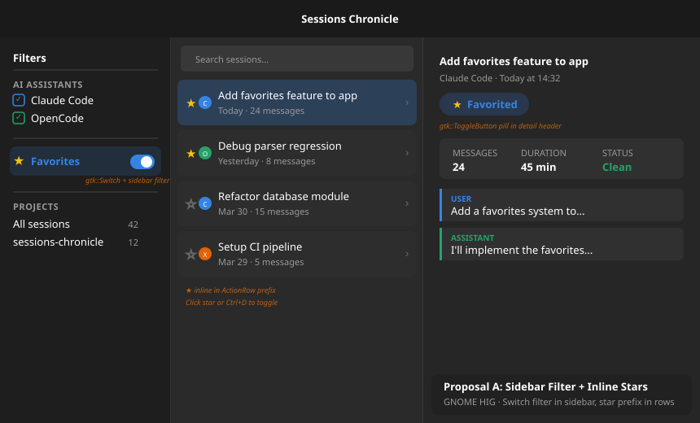
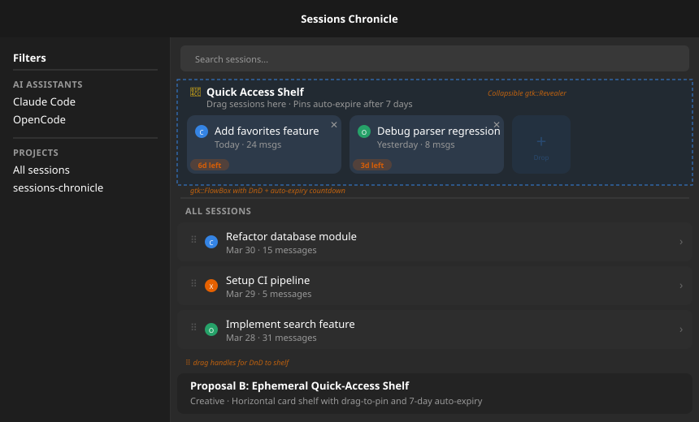
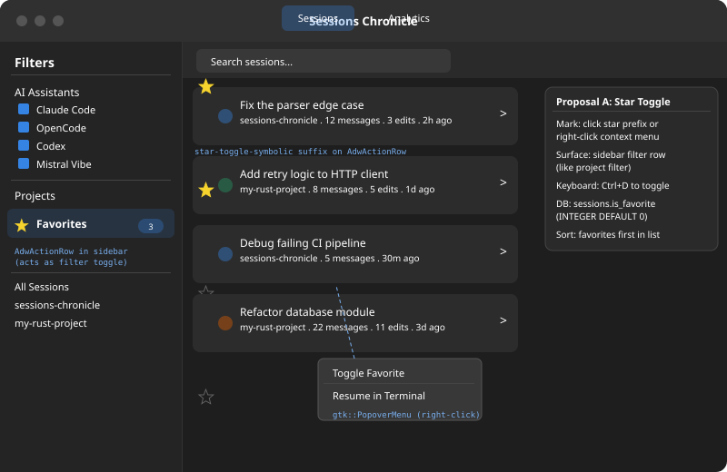
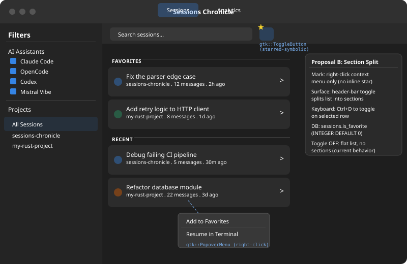
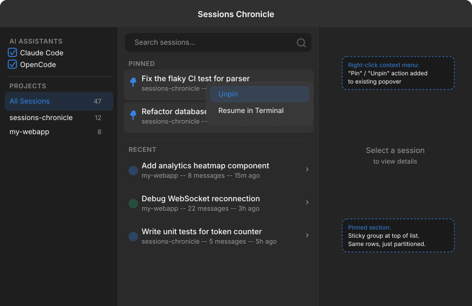
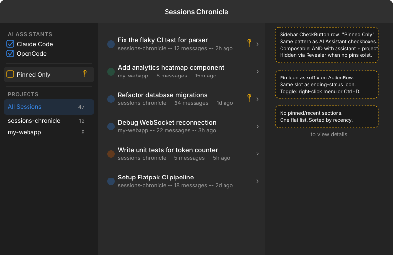

# Exploration: Favorite Sessions (Issue #109)

**Date:** 2026-04-02  
**Issue:** [#109 — feat: favorite sessions for quick revisit](https://github.com/supermaciz/sessions-chronicle/issues/109)  
**Type:** Design exploration — comparing 5 proposals from 4 perspectives  
**Status:** Decided — Proposal F (Pin Filter)

## Problem

Some sessions are worth revisiting soon, and the user already knows which ones.  
Today, the only way to get back to them is to search or navigate again, adding  
small but repeated friction. This is a **quick-access problem**, not a discovery  
problem.

## Shared Technical Baseline

All proposals share these implementation facts:

- **Schema:** new column on `sessions` table (schema migration v8). Either  
  `is_favorite INTEGER NOT NULL DEFAULT 0` or `pinned_at TIMESTAMP NULL`.  
  No re-index needed — the column has a default and is user-set.
- **Keyboard shortcut:** `Ctrl+D` to toggle the mark on the selected row.
- **Context menu:** the existing right-click `PopoverMenu` on session rows gains  
  a toggle action ("Add to favorites" / "Remove from favorites", or equivalent).
- **Composition:** the mark composes with existing assistant, project, and search filters.
- **Scope:** v1 has no ordering, no folders/tags, no smart suggestions, no sync.

## A Note on Naming

The Mii Beta reviewer makes a fair point: "favorite" implies affective preference,  
while the actual behavior is "keep this reachable." Alternative names considered:

| Name | Connotation | Precedent |
|---|---|---|
| **Favorite** | "I like this" | GNOME Web bookmarks, Android |
| **Star** | "Mark for attention" | Gmail, GitHub |
| **Pin** | "Keep at hand" | GNOME Files sidebar, Slack, Discord |
| **Flag** | "Needs follow-up" | Mail.app, Outlook |
| **Bookmark** | "Save for later" | Firefox, GNOME Web |

The naming decision is orthogonal to the interaction design and can be settled  
independently during the design phase. Proposals below use their authors'  
preferred terminology.

---

## Proposal A — Sidebar Filter + Inline Stars *(GNOME HIG)*

**Source:** Main author  
**Summary:** A visible star icon on every session row for direct toggling, with a  
sidebar filter row (between AI Assistants and Projects) to show only favorites.



### Interaction Model

- Each `AdwActionRow` gains a clickable **star prefix** (after the assistant icon).  
  Filled star = favorited, outline star = not.  
  Click the star or press `Ctrl+D` to toggle.
- A new **sidebar filter row** appears between AI Assistants and Projects, styled  
  like project rows, with `starred-symbolic` icon and a count badge.
- Clicking the sidebar row filters the session list to favorites only.  
  The filter composes with project/assistant/search.

### Widgets

| Widget | Role |
|---|---|
| `gtk::Button` with `starred-symbolic` / `non-starred-symbolic` | Star toggle per row (prefix) |
| `AdwActionRow` in sidebar `ListBox` | Favorites filter row |
| `gtk::Label` styled as `.project-badge` | Count badge on sidebar row |
| Context menu entry | Toggle via right-click |

### Trade-offs

| + | - |
|---|---|
| Direct manipulation — star always visible | Adds visual density to **every** row |
| Universal affordance (everyone knows stars) | Star is small (16px) — tight touch target |
| Sidebar filter reuses existing filter patterns | Sidebar gains one more concept |
| Composable with all existing filters | Visual noise for users who never use favorites |

---

## Proposal B — Ephemeral Quick-Access Shelf *(Creative)*

**Source:** Main author  
**Summary:** A horizontal card shelf pinned above the session list, with  
drag-to-pin and automatic 7-day expiry. Designed for sessions that are  
"hot right now" rather than permanently bookmarked.



### Interaction Model

- A collapsible **shelf** (`gtk::Revealer` + `gtk::FlowBox`) sits between the  
  search bar and the session list.
- Sessions are **dragged** from the list onto the shelf, or added via context  
  menu / `Ctrl+D`.
- Each shelf card shows: assistant icon, title, date, message count, and a  
  **countdown badge** ("6d left"). A close button (✕) unpins immediately.
- After **7 days** the pin auto-expires and the session drops off the shelf.  
  The shelf collapses when empty.
- A drag handle (⠿) appears on each list row to signal DnD affordance.

### Widgets

| Widget | Role |
|---|---|
| `gtk::Revealer` | Collapsible shelf container |
| `gtk::FlowBox` | Horizontal card layout inside shelf |
| Custom card widget | Session summary + expiry badge + close button |
| `gtk::DragSource` / `gtk::DropTarget` | DnD between list and shelf |
| Context menu entry | Alternative to drag |

### Schema Note

Requires `pinned_at TIMESTAMP NULL` instead of a boolean, to compute the  
7-day expiry countdown.

### Trade-offs

| + | - |
|---|---|
| Visually distinct — favorites are physically separated | High implementation cost (DnD, custom cards, timers) |
| Auto-expiry prevents stale bookmarks | Unfamiliar pattern — no GNOME precedent |
| Horizontal cards use space efficiently | Shelf takes vertical space even with few pins |
| Drag-to-pin is satisfying and direct | DnD is hard to discover without onboarding |
| No modifications to existing session rows | Auto-expiry may surprise users who expect permanence |

---

## Proposal C — Star Toggle + Sidebar Filter *(UI Designer)*

**Source:** UI Designer agent  
**Summary:** Similar to Proposal A but with more detailed HIG analysis.  
Star icon as prefix on every row, sidebar filter row, full accessibility  
story.



### Interaction Model

- Star icon as **prefix** on `AdwActionRow` (after assistant icon).  
  Click or `Ctrl+D` to toggle.
- Sidebar gains a **Favorites filter row** with count badge,  
  placed between AI Assistants and Projects.
- Context menu gains "Toggle Favorite" / "Remove from Favorites".

### Accessibility

- Star button is focusable within the row. `Ctrl+D` works from row focus.
- `accessible-label`: "Add to favorites" / "Remove from favorites".
- `starred-symbolic` adapts to high-contrast themes.  
  Filled star uses `@warning_color` (yellow) with adequate contrast.
- Button area is at least 24×24px effective size (16px icon + padding).

### Trade-offs

| + | - |
|---|---|
| Direct manipulation — immediate visual feedback | Adds visual noise to every row |
| Composes with project + assistant + search filters | Star is a tight target for mouse |
| Low learning curve | Sidebar complexity increases |
| Full accessibility: keyboard, screen reader, high contrast | — |

### Differences From Proposal A

Essentially the same design with more detailed accessibility analysis  
and explicit widget sizing. The UI Designer recommends **Proposal D** over  
this one.

---

## Proposal D — Context Menu + Header-Bar Section Toggle *(UI Designer)*

**Source:** UI Designer agent  
**Summary:** No inline star. Favorites managed exclusively through  
context menu. A header-bar toggle button splits the session list into  
"Favorites" and "Recent" sections.



### Interaction Model

- **No star icon** on session rows. Rows stay visually clean.
- Mark via **right-click menu** or `Ctrl+D` only.
- A `gtk::ToggleButton` with `starred-symbolic` in the **header bar**  
  (right of search entry). When ON, the list visually splits:
  - **"FAVORITES"** section at the top
  - **"RECENT"** section below
- When OFF (default), the list is flat — identical to today.
- Toggle state persisted in **GSettings** across launches.

### Widgets

| Widget | Role |
|---|---|
| `gtk::ToggleButton` with `starred-symbolic` | Header-bar view mode toggle |
| `gtk::Label` with `.section-heading` CSS | Section headers in list |
| Context menu entry | Only mouse-driven way to toggle favorite |

### Trade-offs

| + | - |
|---|---|
| Session rows stay clean — zero visual change | No single-click toggle — friction for bulk starring |
| Header-bar toggle is discoverable but unobtrusive | Favorites invisible when toggle is OFF |
| Default experience unchanged | Section headers in ListBox slightly complex to implement |
| Sidebar complexity unchanged | Users may forget they are in filtered state |

### UI Designer Recommendation

The UI Designer agent recommends this proposal over C, arguing that  
GNOME apps generally avoid persistent interactive controls on list rows  
when secondary actions (context menu, shortcut) suffice.

---

## Proposal E — Pinned Partition *(Mii Beta)*

**Source:** Mii Beta GTK Designer agent  
**Summary:** Pinned sessions are physically separated at the top of the  
session list. The list becomes two zones: pinned (stable, user-curated)  
and recent (chronological, system-driven). One surface, zero new views.



### Naming

Rejects "favorite" in favor of **"pin"** — expressing intent ("keep this  
reachable") rather than affection ("I like this").

### Interaction Model

- Toggle via **right-click context menu** ("Pin" / "Unpin") or `Ctrl+D`.
- **No star icon** on rows. Pinned rows show a `pin-symbolic` icon as  
  prefix instead of the assistant icon.
- The `ListBox` is partitioned with section headers:  
  **"PINNED"** at top, **"RECENT"** below.
- Pinned section is **always visible** when pins exist — no toggle needed.

### Widgets

| Widget | Role |
|---|---|
| `gtk::Label` with `.heading` CSS | Section headers ("PINNED", "RECENT") |
| `gtk::Image` with `pin-symbolic` | Prefix on pinned rows (replaces assistant icon) |
| Context menu entry | Toggle via right-click |

### Trade-offs

| + | - |
|---|---|
| Spatial anchor — pinned = "up there" | Section headers add visual weight |
| Always visible — no mode toggle needed | Sessions jump position when pinned (disorienting) |
| Zero new views or surfaces | Partition is disproportionate for 1 pinned session |
| Matches GNOME Files sidebar pattern | Pin icon replaces assistant icon — loss of identity |
| Lowest widget count | Keyboard nav gap at section boundary |

### Schema Note

The Mii Beta reviewer recommends `pinned_at TIMESTAMP` from day one  
instead of a boolean, even though v1 doesn't need ordering.  
"Schema migrations are cheap; fixing data you didn't collect is not."

---

## Proposal F — Pin Filter *(Mii Beta)*

**Source:** Mii Beta GTK Designer agent  
**Summary:** A pin is metadata on a row, not a spatial partition.  
Pinned sessions stay in chronological order. A sidebar checkbox row  
filters to pinned-only. Zero new sections, zero list rearrangement.



### Naming

Uses **"pin"** — expressing "keep this reachable" intent rather than  
affection ("favorite") or problem reporting ("flag").

### Interaction Model

- Toggle via **right-click context menu** ("Pin" / "Unpin") or `Ctrl+D`.
- Pinned rows gain a `pin-symbolic` **suffix icon** (alongside  
  ending-status icon). Unpinned rows are unchanged.
- A `gtk::CheckButton` inside an `adw::ActionRow` sits in the **sidebar**,  
  between the AI Assistants and Projects sections. Label: "Pinned Only",  
  with a `pin-symbolic` suffix. Default: **OFF** (show all sessions).  
  When checked, the list shows only pinned sessions.
- The sidebar row is hidden via `gtk::Revealer` when no sessions are  
  pinned. First pin triggers a toast: "Session pinned — find it in  
  the sidebar."
- Composes with all existing filters (assistants, project, search)  
  via AND composition.

### Widgets

| Widget | Role |
|---|---|
| `gtk::Image` with `pin-symbolic` | Suffix on pinned rows only |
| `adw::ActionRow` with `gtk::CheckButton` prefix | Sidebar filter toggle (composable, like AI Assistant rows) |
| `gtk::Revealer` | Hides sidebar row when no pins exist |
| Context menu entry | Toggle via right-click |

### Schema

`pinned_at TIMESTAMP NULL` from day one — even though v1 doesn't need  
ordering. Schema migrations are cheap; fixing data you didn't collect  
is not.

### Filter Composition

The `SidebarOutput::FiltersChanged` message gains one field:

```rust
FiltersChanged {
    tools: Vec<AiAssistant>,
    project_filter: ProjectFilter,
    pinned_only: bool,  // new
}
```

Query: `WHERE ... AND (NOT :pinned_only OR pinned_at IS NOT NULL)`.

### Trade-offs

| + | - |
|---|---|
| Zero new visual structures — uses existing sidebar pattern | Pin suffix is subtle — easy to miss |
| Composes with existing filter model naturally (AND) | Sidebar row hidden when no pins = delayed discoverability |
| Sessions don't move when pinned | Suffix area gets crowded (pin + status + chevron) |
| Only pinned rows gain visual change | — |
| Always-visible filter (sidebar never hides) | — |
| Low implementation cost (~30 lines in sidebar) | — |
| CheckButton matches AI Assistant row pattern | — |

### Mii Beta Recommendation

The Mii Beta agent recommends this proposal over E, arguing that it  
uses the existing sidebar filter surface honestly — the sidebar already  
has composable checkboxes (AI Assistants) and exclusive selection  
(Projects), and a pin filter is the same kind of thing as the former.

---

## Comparison Matrix

| Aspect | A: Sidebar Stars | B: Shelf | C: Star Toggle | D: Section Toggle | E: Pinned | F: Pin Filter |
|---|---|---|---|---|---|---|
| **Source** | Main (HIG) | Main (Creative) | UI Designer | UI Designer | Mii Beta | Mii Beta |
| **Mark action** | Click star | Drag / menu | Click star | Menu only | Menu only | Menu only |
| **Surface favorites** | Sidebar filter | Horizontal shelf | Sidebar filter | Header toggle + sections | Always-on partition | Sidebar checkbox (composable) |
| **Row visual change** | Star on all rows | Drag handle on all rows | Star on all rows | None | Pin icon on pinned rows | Pin icon on pinned rows |
| **New surfaces** | 0 | 1 (shelf) | 0 | 0 | 0 | 0 |
| **Discoverability** | High | Medium | High | Medium | High (always visible) | High (sidebar always visible) |
| **Visual density** | Higher | Higher | Higher | Unchanged | Medium | Minimal |
| **Implementation cost** | Medium | High | Medium | Medium | Low-Medium | Low |
| **GNOME HIG fit** | Good | Poor | Good | Very Good | Good | Very Good |
| **Schema** | Boolean | Timestamp | Boolean | Boolean | Boolean or Timestamp | Timestamp |

## Decision

**Proposal F — Pin Filter**, with refinements from the UI Designer review.

### Chosen Design

- **Naming:** "Pin" (`pin-symbolic`), not "favorite" or "flag".
- **Mark action:** Right-click context menu ("Pin" / "Unpin") or `Ctrl+D`.
- **Row visual:** `pin-symbolic` suffix icon on pinned rows only.  
  Use `@accent_color` (not `@warning_color`) — pin is not a warning state.
- **Filter surface:** `gtk::CheckButton` inside `adw::ActionRow` in the  
  **sidebar**, between AI Assistants and Projects. Label: "Pinned Only".  
  Default: OFF. Composable AND filter with assistants, project, and search.
- **Sidebar row visibility:** Always visible (not hidden via Revealer),  
  matching AI Assistant checkbox behavior. Greyed out with count "0"  
  when no pins exist — consistent and discoverable.
- **Schema:** `pinned_at TIMESTAMP NULL` (migration v8). Forward-looking:  
  enables future ordering without a second migration.
- **Filter composition:** `SidebarOutput::FiltersChanged` gains  
  `pinned_only: bool`. Query: `AND (NOT :pinned_only OR pinned_at IS NOT NULL)`.

### Rationale

- Both the Mii Beta and UI Designer agents independently converged on F.
- The sidebar is already the filter surface — adding a composable  
  checkbox reuses an established pattern with zero learning cost.
- Lowest implementation cost (~30 lines in sidebar) and minimal  
  visual disruption (only pinned rows change).
- The search bar is hidden by default (`Ctrl+F`), ruling out the  
  original "toggle next to search" placement.

### Next Step

Produce a design document (`2026-04-02-favorite-sessions-design.md`)  
and then an implementation plan.

---

## Post-Implementation Review: Pinned as Navigation Target

**Date:** 2026-04-03  
**Source:** Mii Beta GTK Designer review of the implemented Proposal F  
**Context:** After implementing Pin Filter (Proposal F), a follow-up design  
(`2026-04-03-pinned-sidebar-navigation-design.md`) proposed promoting Pinned  
from a composable filter to a dedicated sidebar section. The Mii Beta Designer  
reviewed that proposal and identified a simpler path.

### Problem With Current Implementation

The `pinned_only: bool` filter composes with project selection via AND.  
This creates confusing empty states: the sidebar can point to a project  
with zero pinned sessions while pinned sessions exist in other projects.  
The user sees an empty list despite having pins.

Pinned is functionally a **navigation destination** ("show me my bookmarks"),  
not a **filter facet** ("narrow this view"). The current implementation  
treats it as the latter.

### Rejected Approach: Separate Pinned Section

The initial proposal (`2026-04-03-pinned-sidebar-navigation-design.md`)  
added a dedicated `Pinned` section above AI Assistants with its own  
header and `ListBox`. The Mii Beta review rejected this for three reasons:

1. **Wrong ordering.** Placing Pinned above AI Assistants breaks the  
   visual grammar — AI assistant filters are global scope that affect  
   everything below, including the Pinned badge count. Global context  
   should come first.
2. **Unnecessary surface.** Pinned is a navigation target in the same  
   selection group as All Sessions and projects. It does not need its  
   own section, header, or `ListBox`.
3. **Extra state reconciliation.** A separate section requires manual  
   mutual exclusivity logic. A row in the same `ListBox` gets it free  
   from GTK's `SelectionMode::Single`.

### Recommended Approach: Pinned as First Row in Projects

Pinned becomes the first row in the existing projects `ListBox`,  
participating in the same single-selection model:

```
AI Assistants
  [x] Claude Code
  [x] OpenCode
  [x] Codex
  [x] Mistral Vibe

Projects
  * Pinned           (3)
    All Sessions    (42)
    my-project      (12)
    other-project    (8)
    Unassigned       (2)
```

### Data Model Change

`pinned_only: bool` is removed from `SidebarOutput::FiltersChanged`  
and `FilterState`. Pinned becomes a variant of `ProjectFilter`:

```rust
pub enum ProjectFilter {
    AllSessions,
    Pinned,          // new
    Project(i64),
    Unassigned,
}
```

The database switches on `ProjectFilter::Pinned` to add  
`WHERE pinned_at IS NOT NULL`, ignoring project_id.

### Net Impact

- Removes one boolean from 5+ files
- Removes one `ListBox` and one section header from the sidebar
- Consolidates a two-axis filter (project + pinned) into a single-axis  
  navigation enum
- GTK enforces mutual exclusivity — no manual state reconciliation
- Pinned row always visible (even with count 0) for consistent discoverability
- Badge count updates via the existing `rebuild_project_rows` path

### Status

Pending — requires a design document to specify the full implementation.
