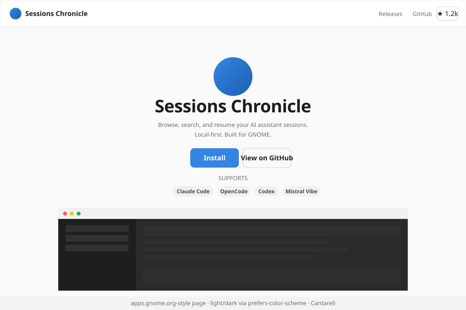
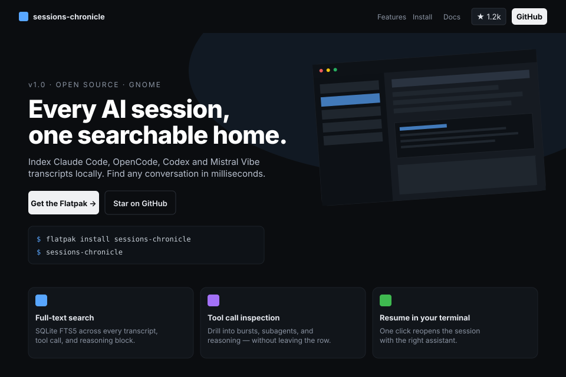
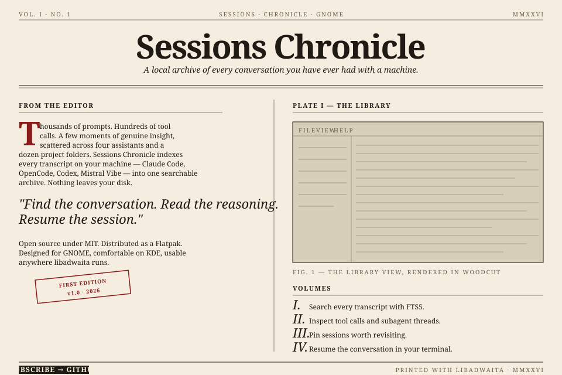
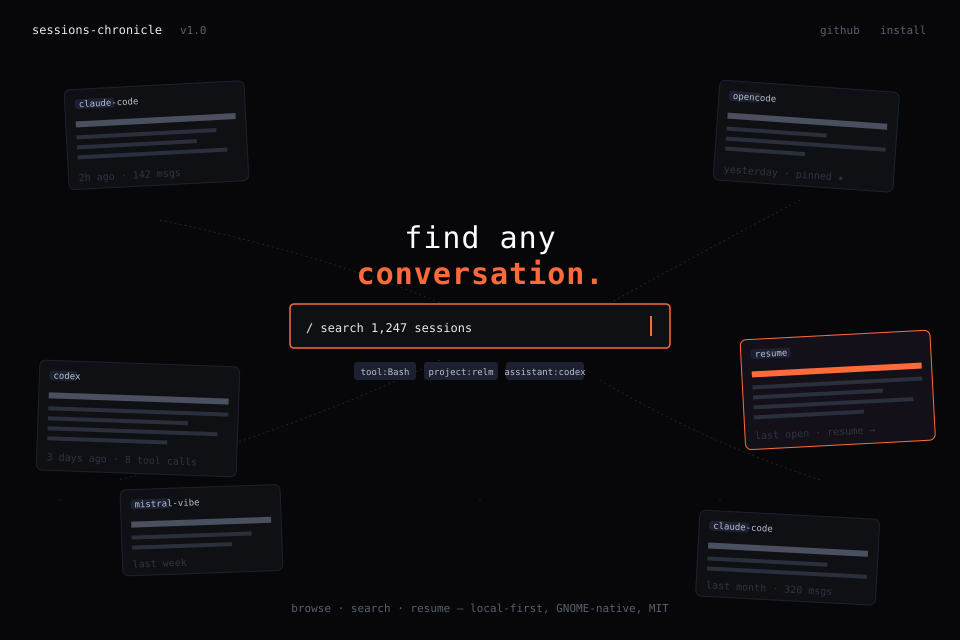
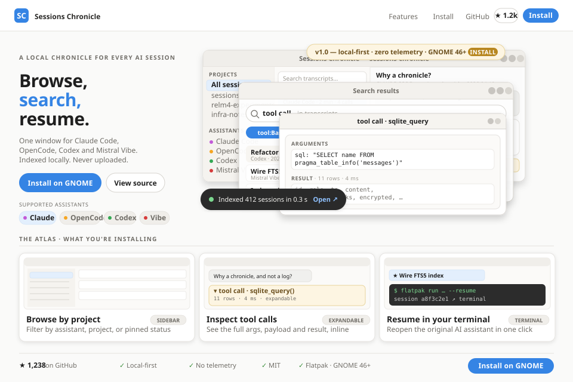

# Exploration: Landing Page (Issue #124)

**Date:** 2026-04-20  
**Issue:** [#124 — Create a static landing page for Sessions Chronicle](https://github.com/supermaciz/sessions-chronicle/issues/124)  
**Type:** Design exploration — 6 visual directions for the v1 marketing page  
**Status:** Open — awaiting decision

## Problem

The README is informative but slow to convey what Sessions Chronicle is.
A first-time visitor needs to read paragraphs before the product "clicks".
A small static landing page would let the value land in seconds: hero,
curated visuals, four-assistant story, install + GitHub links.

This exploration is about **the visual & narrative direction**, not the
stack. Issue #124 already recommends Astro on GitHub Pages; that
recommendation is treated as the shared baseline below.

## Shared Technical Baseline

All proposals share these implementation facts:

- **Stack:** Astro, deployed via GitHub Pages from `docs-site/` (or
  similar). Static HTML at the end. No JS framework on the client.
- **Scope:** Single page. No blog, no changelog, no CMS. Out-of-scope
  items from #124 stay out of scope.
- **Content blocks (all proposals must cover):**
  1. Hero with one-sentence value prop and primary CTA (Releases / Install).
  2. Curated screenshot story (browse → read → inspect → analytics).
  3. Four-assistant support story (Claude Code, OpenCode, Codex, Mistral Vibe).
  4. Links to GitHub, latest release, and license/MIT badge.
- **Responsiveness:** Mobile-readable. No horizontal scroll < 360px.
- **Accessibility:** WCAG-AA contrast, semantic landmarks, alt text on
  every screenshot, `prefers-reduced-motion` respected.
- **Asset hygiene:** Screenshots cropped from real builds, not mockups.
  Reuse `docs/screenshots/*.png` as the source of truth.

What differs between proposals: **aesthetic direction, layout grammar,
typography, and the metaphor used to frame the product.**

---

## Proposal A — Adwaita Marketing *(GNOME-native)*

**Reference:** [apps.gnome.org](https://apps.gnome.org), GNOME Circle pages.  
**One-line:** The page looks like the app belongs to GNOME — because it does.

### Direction

A calm, centered page that mirrors libadwaita conventions: Cantarell
type, the system blue (`#3584e4`), generous whitespace, soft 12px
rounded surfaces, a single accent color. Reads like the "About" page of
a polished GNOME app, scaled up to a marketing surface.

### Layout

- **Header:** App icon + name on the left, Releases / GitHub / star
  count on the right. 56px tall, hairline border below.
- **Hero (centered):** App icon (80px) → product title → two-line
  subtitle → primary "Install" button + ghost "View on GitHub" → row of
  four assistant pills.
- **Screenshot panel:** A single chrome-accurate window mock (traffic
  lights, sidebar, list, detail) sitting on a soft gray surface. One
  screenshot, well-presented, beats four.
- **Below the fold (not in mockup):** Three feature cards (Search /
  Tool calls / Resume), each with a libadwaita-style icon. Footer
  carries assistant logos + MIT.

### Typography

- Cantarell or Adwaita Sans throughout.
- Headings 36/24/18, body 14, dim 12.

### Trade-offs

| + | - |
|---|---|
| Strong identity tie to GNOME — signals "native, trustworthy" | Risks looking generic to visitors who don't know GNOME |
| Cheap to build — uses libadwaita color tokens directly | Centered hero is the most-cloned web pattern of 2020-2025 |
| Light/dark via `prefers-color-scheme` is a one-liner | Less editorial personality than B/C/D |
| Screenshots feel at home (same chrome) | Mobile experience is functional but unmemorable |

---

## Proposal B — Classic OSS / SaaS *(Familiar, conversion-tuned)*

**Reference:** Linear, Tauri, Astro, Zed, Raycast OSS pages.  
**One-line:** The page a dev expects to land on when they click a GitHub link.

### Direction

Dark UI, bright cyan/blue accent, IBM Plex Sans (or Inter Tight) for
copy + JetBrains Mono for the install command. Two-column hero with a
tilted product screenshot, terminal CTA, three feature columns below.
Optimized for "I get it, where do I install" in 5 seconds.

### Layout

- **Sticky nav:** logo / Features / Install / Docs / GitHub stars / CTA.
- **Hero (asymmetric):**
  - Left: pre-headline pill ("v1.0 · OPEN SOURCE · GNOME"), 42px
    headline, 15px sub, two CTAs, then a real terminal block with
    `$ flatpak install …`.
  - Right: product screenshot tilted ~4°, soft glow behind, drop shadow.
- **Feature row:** Three colored-icon cards (full-text search, tool
  call inspection, resume in terminal).
- **Below fold (not in mockup):** "Works with" assistant logo strip,
  "How it works" diagram, footer.

### Typography

- Inter / Inter Tight or IBM Plex Sans for UI.
- JetBrains Mono for code & install commands.
- Tight letter-spacing on the H1 (-1px).

### Trade-offs

| + | - |
|---|---|
| Familiar pattern — visitors know exactly where to look | Familiar pattern — looks like every other dev tool |
| Terminal block doubles as install instruction *and* visual texture | Inter / dark-with-blue-accent is the canonical "AI slop" combo unless executed well |
| Asymmetric hero converts better than centered (industry consensus) | Tilted screenshot is a small but real cliché |
| Easy to extend with extra rows (testimonials, sponsors) later | Pulls visual identity *away* from GNOME, toward generic devtool |

---

## Proposal C — Editorial Chronicle *(Creative, literal-name play)*

**Reference:** New York Times print front pages, *Pitchfork* feature
articles, the [Werner Herzog "Chronicle" aesthetic](https://www.are.na/),
Edward Tufte handouts.  
**One-line:** The product is called *Chronicle*. The page acts like one.

### Direction

A printed-newspaper aesthetic: cream paper (`#f4ede0`), oxblood ink
accents (`#8b1a1a`), Playfair Display masthead, Iowan Old Style /
Charter for body. Two-column layout with a hairline rule between.
"Volumes" instead of features. A dated stamp ("FIRST EDITION · v1.0").
The screenshot is rendered as a woodcut/cross-hatch plate captioned
*"PLATE I — THE LIBRARY"*.

This direction commits hard to the *Chronicle* name as a metaphor. It
is the most distinctive option and the one most likely to show up in
"cool landing pages of the month" lists — at the cost of being further
from what GNOME visitors expect.

### Layout

- **Top meta strip:** `VOL. I · NO. 1   ·   SESSIONS · CHRONICLE · GNOME   ·   MMXXVI`
- **Masthead:** Huge serif title, italic sub-deck below, double rule.
- **Two columns:**
  - Left ("FROM THE EDITOR"): drop-cap paragraph manifesto, pull-quote
    set in italic Playfair, "FIRST EDITION" stamp rotated -6°.
  - Right ("PLATE I — THE LIBRARY"): a large illustrated plate of the
    app rendered as cross-hatched lines, then a numbered "VOLUMES" list
    (I, II, III, IV) for features.
- **Footer rule:** "SUBSCRIBE → GITHUB" black button + colophon.

### Typography

- Playfair Display (display, 56px masthead).
- Iowan Old Style / Charter / Georgia (body).
- Small-caps with 1.5–2px letter-spacing for section labels.
- Drop cap: 56px Playfair in oxblood.

### Trade-offs

| + | - |
|---|---|
| Most memorable, most distinctive — uses the product's name as a frame | Furthest from what a GitHub visitor expects → may confuse |
| Print metaphor reframes "session log" as "archive worth keeping" | Cream paper + serif risks reading as "blog post" not "product page" |
| No competing GNOME app does this — instant recognition | Higher copy burden — needs editorial writing, not just feature bullets |
| Mobile reads beautifully (newspapers were responsive first) | Hardest to A/B-tune for conversion later |
| Real screenshots can be rendered as plates without losing meaning | Rendering screenshots as woodcut illustrations is real production work |

---

## Proposal D — Mosaic Canvas *(Creative, product-as-hero)*

**Reference:** Are.na, Linear's launch page experiments, Obsidian's
graph view, the [Vercel "/templates" page](https://vercel.com/templates).  
**One-line:** Skip the hero text. The product *is* the hero.

### Direction

A near-black canvas (`#07070a`) with a faint dot grid. Real session
cards float across the viewport at slight rotations, each showing
assistant + title + timestamp + message count, connected by hairline
dashed paths. The center of the page is a focal search bar — styled
exactly like the in-app search — with a tagline above:
*"find any **conversation.**"* The page literally demonstrates the
product before describing it.

The "resume" card is highlighted in the brand accent (orange-red
`#ff6a3d`) to draw the eye and convey the "pick up where you left off"
promise.

### Layout

- **Minimal top strip:** product wordmark, version, github / install
  links — all 12px, no borders.
- **Floating cards (6):** four assistants represented, varying
  rotations (-3° to +4°), one card highlighted. Mock connection lines
  suggest the searchable web of conversations.
- **Center focal:** two-line headline with one accent word + a search
  bar that looks live (cursor blinks via CSS), with three suggested
  filter chips beneath (`tool:Bash`, `project:relm`, `assistant:codex`).
- **Below fold (not in mockup):** scroll-triggered single-card
  storytelling: each scroll step swaps the focal card to demonstrate
  one feature (search → tool calls → analytics → resume).

### Typography

- Space Mono / JetBrains Mono throughout (the product talks to
  developers; mono earns its keep here).
- Headline 30px, weight 200 mixed with weight 700 for the accent word.

### Trade-offs

| + | - |
|---|---|
| Product is the hero — demo and marketing collapse into one | The most ambitious to build well; weak execution = "AI slop" instantly |
| Memorable hook ("you scroll, the cards animate to show the feature") | Risks burying the install CTA below the fold |
| Mono + dot grid + accent orange = a strong, cohesive aesthetic | Mono body type tires readers — must be used sparingly below the fold |
| Cards can be reused as social/OG images for free | `prefers-reduced-motion` story has to be designed up front, not bolted on |
| Differentiates strongly from every other GNOME app site | Furthest from GNOME / libadwaita identity — disowns the platform tie |

---

## Proposal E — Component Composition *(Adwaita unframed)*

**Reference:** `AdwBanner`, `AdwClamp`, `AdwActionRow`,
`AdwPreferencesGroup`, filter chips, and toast patterns from libadwaita.  
**One-line:** Use Adwaita as a design grammar for the web page, not as
costume for a fake app window.

### Direction

The page is unmistakably a website: no window controls, no wallpaper,
no pretend desktop shell. But its visual language comes directly from
libadwaita. The hero is composed from familiar GNOME components that
have escaped the app frame and been re-laid as marketing modules:
banner, search entry, chip row, action rows, quiet cards, toast.

This keeps what was smart about the old E/F concepts — "the product
should feel native immediately" — while dropping the pastiche. The page
does not impersonate Sessions Chronicle. It speaks the same language.

### Layout

- **Top bar:** Site nav with libadwaita spacing, rounded ghost buttons,
  and a single primary Install button.
- **Hero split:**
  - Left: headline, short value prop, primary and secondary CTAs.
  - Right: a composed stack of Adwaita-like components rather than a
    full fake app shell.
- **Component stack (the proof surface):**
  1. `AdwBanner`-style release banner with CTA.
  2. Search entry with a real query example.
  3. Four assistant chips in the style of in-app filters.
  4. `AdwPreferencesGroup`-style card containing three `ActionRow`
     feature lines: search, inspect tool calls, resume in terminal.
  5. Transcript preview card with one assistant bubble, one user
     bubble, and one inline `tool call` token.
  6. Small toast in the lower corner carrying the privacy promise or a
     quick install/status cue.
- **Below fold (not in mockup):** three horizontal chapters using the
  same component grammar, each paired with one real screenshot crop.

### Typography

- Cantarell / Adwaita Sans throughout.
- JetBrains Mono only for install commands and the inline `tool call`
  token.
- Headline 34px, body 14px, captions 12px.
- Uses libadwaita-like density and spacing rather than web-style
  oversized hero typography.

### Trade-offs

| + | - |
|---|---|
| Very GNOME-native without pretending to be a running app | Needs discipline so the component stack does not become visual clutter |
| More distinctive than A/B because the page grammar itself is product-specific | If overdone, it can still drift into "UI kit demo" territory |
| Easier to implement responsively than the old E/F window concepts | Requires careful hierarchy so headline and CTA still win over the parts |
| Lets us showcase tool calls, assistant support, and privacy as UI primitives | Needs a real design eye; the wrong spacing makes it look like random cards |
| Keeps room for screenshots below the fold instead of replacing them | Slightly more custom CSS work than a standard hero + screenshot page |

---

## Proposal F — Product Atlas *(Screenshot-led, Adwaita-framed)*

**Reference:** apps.gnome.org gallery pages, Linear's old screenshot
showcases (without the tilt), Raycast's "Stories" rows, Apple's
product pages — but with libadwaita as the binding instead of glass
morphism.  
**One-line:** The screenshots are the heroes. Adwaita is the gallery
that holds them up.

### The thesis

Proposal E uses libadwaita components *as* the marketing payload — a
fake `AdwBanner` stands in for the release announcement, a chip row
stands in for the assistant story, a synthetic transcript card stands
in for the product. The page is a UI kit composition that *implies*
the product.

F flips that relationship. The screenshots of the actual application
are the heroes — front and center, multiple, layered, real. Adwaita
components are still the visual language, but they serve the gallery:
banners *label* the screenshots, action rows *caption* them,
preference-group headings *organize* them. Visitors see what they
will install before they decide to install it.

This is the most honest visual story available to a local-first app:
"this is the product, photographed, presented in its own native
chrome, framed in its own native components." No imitation, no
metaphor, no editorial pastiche. Just real product visibility, calmly
arranged.

### Layout

- **Top bar:** Adwaita-styled site nav. App icon + name on the left,
  ghost text buttons (Features · Install · GitHub) and a single
  primary `Install on GNOME` button on the right. Hairline border
  below, 56px tall.
- **Hero (asymmetric, ~30/70):**
  - Left (~30%): A 42px headline with one accent-blue word, a 14px
    dim subtitle, two CTAs (`Install on GNOME` + ghost `View on
    GitHub`), and a row of four assistant chips styled as in-app
    filter pills (Claude Code · OpenCode · Codex · Mistral Vibe). All
    Cantarell, all calm.
  - Right (~70%): A **layered composition of three real screenshot
    crops**, deliberately *not* tilted:
    - Back layer: the full application window (sidebar + list +
      detail), softly faded so the foreground reads first.
    - Mid layer: a tighter crop on the search results panel, with
      filter chips and highlighted matches visible. Offset down-right
      by ~24px.
    - Front layer: the smallest crop, focused on an expanded tool
      call card showing args + result. Offset down-right by another
      ~24px from the mid layer.
    - All three: 12px radius, 1px hairline border, soft drop shadow,
      no rotation. Depth comes from offset and shadow alone.
  - **Two Adwaita component overlays** float across the screenshot
    stack — these are the only "fake" UI on the page, and they earn
    their keep by labeling what's behind them:
    - An `AdwBanner`-style pill at the top of the back layer:
      *"v1.0 · local-first · zero telemetry"* + small `Install` action.
    - An `AdwToast`-style notification near the bottom-left of the
      composition: *"Indexed 412 sessions in 0.3 s"* with an `Open`
      action. Doubles as proof that indexing is fast.
- **The Atlas (below the fold, the showcase grid):**
  - Section header styled as an `AdwPreferencesGroup` heading:
    small-caps `THE ATLAS · WHAT YOU'RE INSTALLING`, with a hairline
    rule beneath.
  - Six "plates" arranged 3×2 on desktop, 2×3 on tablet, 1×6 on
    mobile. Each plate = one large real screenshot crop (16:10) sat
    on a 1px-bordered card with 12px radius, with an
    `AdwActionRow`-style caption *underneath* the screenshot:
    - **Title** (Cantarell 14px bold) — e.g. *"Browse by project"*.
    - **Subtitle** (Cantarell 12px dim) — e.g. *"Sidebar filters by
      assistant, project, or pinned status."*
    - **Suffix tag** (right-aligned, 11px small-caps, in a quiet
      tinted pill) — e.g. `LOCAL INDEX`, `EXPANDABLE`, `TERMINAL`,
      `FTS5`, `MIT`, `ALL FORMATS`.
  - The six plates: *Browse by project* · *Inspect tool calls* ·
    *Resume in your terminal* · *Read the ledger* · *Search every
    transcript* · *Four assistants, one home*.
- **Spec strip (footer band):** A boxed list in libadwaita style
  with four status rows: `Local-first ✓` · `No telemetry ✓` ·
  `Open source · MIT ✓` · `Flatpak · GNOME 46+ ✓`. Final
  `Install on GNOME` button on the right, GitHub star count + link
  on the left.

### Typography

- **Cantarell / Adwaita Sans throughout.** No serif. No editorial
  display face. The page is product photography in a GNOME frame.
- **JetBrains Mono** appears in exactly two places: the inline
  `tool call` token inside one of the screenshots, and the
  `flatpak install` command in the spec strip. Earned, not
  decorative.
- Headline 42px tight (-1px tracking), subhead 14px dim, plate titles
  14px bold, captions 12px dim, suffix tags 11px small-caps with 1px
  tracking.
- Single accent color (`#3584e4`), used on exactly one hero word, the
  primary CTA, and the highlighted assistant chip. Restraint is the
  rule.

### Visual identity rules

- **No tilt.** Tilted screenshots are the canonical dev-tool cliché
  of the last five years. The layered offset + shadow does the depth
  work without rotating the product into a marketing pose.
- **No mockup illustrations.** Every screenshot crop is from the real
  app, real fixture data, real GTK chrome. The two Adwaita component
  overlays (banner + toast) are the only synthetic UI on the page,
  and both *point at* something real.
- **No logo strip.** The four assistants live in the screenshots
  (sidebar) and in the chip row beside the headline. They don't need
  a separate "Works with" band.
- **Light + dark by `prefers-color-scheme`.** Both themes get
  matching screenshot sets — dark mode is not an afterthought.

### Trade-offs

| + | - |
|---|---|
| Real product visibility above the fold — visitors *see* what they're getting before they decide | Requires a curated set of high-quality screenshot crops in both light and dark themes — real production work |
| Layered montage is visually punchy and shareable as a single OG image, without resorting to tilt clichés | Six plates = six screenshots to keep in sync when the app's UI changes |
| Adwaita framing keeps the page unmistakably GNOME without making it a UI-kit demo | Less conceptually distinctive than C or the dropped Chronicle Entry — closer to "a really good apps.gnome.org page" |
| Differentiates from E by inverting the component/screenshot relationship — components serve product, not the other way around | Hero composition needs real art direction; sloppy layering = generic SaaS hero |
| The two Adwaita overlays (banner + toast) double as feature proofs (release status + indexing speed) | Risk of looking like Linear or Raycast if the layered cards are too glossy — must stay Adwaita-quiet |
| Strongest "this is a real, polished, shipping app" signal of any proposal | Mobile story is real work: layered hero must collapse cleanly to a single front-layer crop |

---

## Comparison Matrix

| Aspect | A: Adwaita | B: Classic OSS | C: Editorial | D: Mosaic | E: Component Composition | F: Product Atlas |
|---|---|---|---|---|---|---|
| **Aesthetic risk** | Low | Low | High | High | Medium | Low-Medium |
| **Identity with GNOME** | Strong | Weak | Neutral | Weak | Very Strong | Strong (via real chrome + Adwaita frame) |
| **Memorability** | Low | Medium | Very High | Very High | High | High |
| **Conversion clarity** | High | Very High | Medium | Medium-Low | High | Very High |
| **Implementation cost** | Low | Low-Medium | Medium | Medium-High | Medium | Medium-High (six curated crops × 2 themes) |
| **Custom illustration needed** | None | None | Yes (plates) | No (cards from real data) | None (HTML components) | None (real screenshots only) |
| **Mobile story** | Easy | Easy | Easy (single col) | Hard (mosaic must collapse) | Easy-Medium | Medium (layered hero must collapse) |
| **Reduced-motion story** | Trivial | Trivial | Trivial | Must design upfront | Trivial | Trivial |
| **Risk of looking "AI slop"** | Low | Medium-High | Very Low | Medium | Very Low | Low |
| **Time to first visitor "gets it"** | ~3s | ~2s | ~6s | ~4s (after one scroll) | ~3s | ~2s |
| **Best when the goal is...** | Trust | Conversion | Distinction | Demonstration | Native-web identity | Real product visibility |

## Open Questions

- **Tone of voice:** Should the page sound like project documentation
  (Adwaita / Classic) or like a designed artifact (Editorial / Mosaic)?
- **Primary visitor:** Someone who already heard about the app and
  wants to install (favors B), or someone discovering through a tweet
  / aggregator post (favors C / D)?
- **GNOME identity vs. broader reach:** Do we want the page to clearly
  signal "GNOME-native" (favors A), or do we want to attract Linux
  developers who don't yet care about GNOME (favors B / D)?
- **Component vs. screenshot priority:** Do we want libadwaita
  components to *be* the marketing payload (E), or to *frame* a
  curated set of real screenshots (F)? Both are GNOME-native; the
  difference is whether visitors see the product before or after
  install.
- **Maintenance budget:** Are we OK with a page that needs an
  illustrator's hand to refresh (C), or does it need to update from
  reusable web components alone (A / B / E), or from a curated set
  of real screenshot crops kept in sync with the app (F)?

## Recommendation Slot

*Revised after feedback on pastiche risk and screenshot visibility:*

- *E and F are the two serious finalists, and they sit on opposite
  ends of the same spectrum: how visible is the real product on the
  page itself.*
- ***E** = "GNOME as the page's grammar" — composed Adwaita-like
  components imply the product. No screenshots above the fold.
  Fastest "gets it" time for visitors who already trust GNOME apps,
  lightest maintenance, but lower direct product visibility.*
- ***F** = "real product, Adwaita-framed" — a layered montage of
  three real screenshot crops anchors the hero, with two Adwaita
  component overlays (banner + toast) labeling them. Below the fold,
  six captioned plates form an "Atlas" of the app. Highest direct
  product visibility, strongest "this ships" signal, at the cost of
  more screenshot maintenance.*
- *A, B, C, D remain on the table as references for fallback safety
  (A/B), distinctiveness ceiling (C), or visual ambition (D), but the
  decision is most likely between E and F.*

## Next Step

Once a direction is selected, produce a design document
(`2026-04-XX-landing-page-design.md`) covering: site structure, page
sections in detail, copy, type scale, color tokens, screenshot crops,
responsive breakpoints, and a deploy plan for GitHub Pages.
