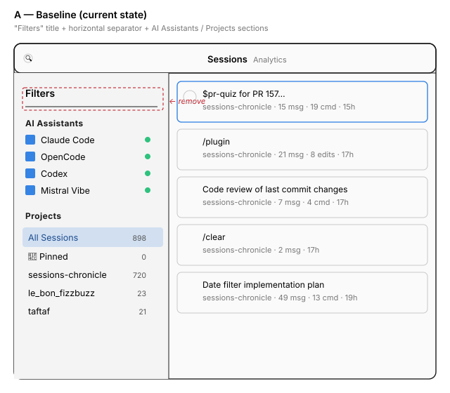
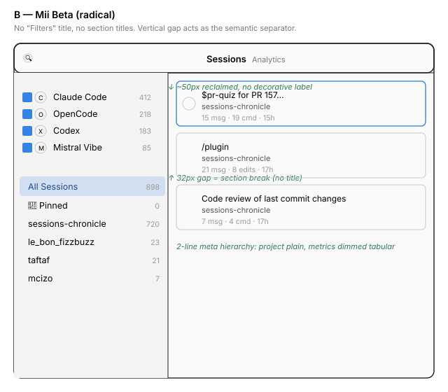
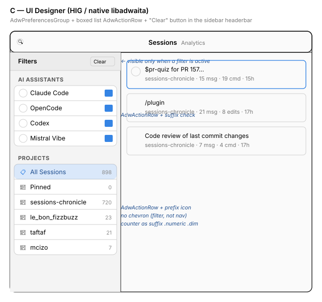

# Sidebar filters simplification — exploration

**Date:** 2026-05-28  
**Status:** exploration  
**Scope:** `SessionList` view, left sidebar ("Filters" zone)

## Context

The current `SessionList` sidebar shows:

- A bold **"Filters"** title at the top of the content area
- A horizontal separator below that title
- An **"AI Assistants"** section with 4 checkboxes (Claude Code, OpenCode, Codex, Mistral Vibe) and green status dots
- A **"Projects"** section with "All Sessions" (selected), "Pinned", and per-project rows with counters

Starting question: is removing the **"Filters"** title and the separator below it a good idea? What other quick wins fit on this view?

Two designers were consulted in parallel:

- **Mii Beta (radical simplification)** — pushes to drop every redundant label and keep only the minimal visual structure.
- **UI Designer (HIG-safe / libadwaita)** — confirms the removal and proposes a refactor aligned with GNOME conventions (`AdwPreferencesGroup`, boxed list, `AdwActionRow`).

Both agree on the central point: **yes, drop "Filters" and the separator**. This doc compares the approaches.

## Variants

### A — Baseline (current state)

- "Filters" title + separator at the top.
- Titled sections "AI Assistants" and "Projects".
- Counters on the right, green status dots on assistants.

**Issues:**

- The "Filters" label describes a zone that already reads as a filter panel (checkboxes, filtering lists).
- The separator under the title separates a label from the thing it labels — a semantically empty divider.
- ~50px of vertical space spent with no added value.

### B — Mii Beta (radical)

- Drops "Filters" **and** the section titles ("AI Assistants", "Projects").
- Uses a **~32px vertical gap** as the semantic separator between blocks.
- Assistant icons sit next to checkboxes to identify the row without a section label.
- Counters use `.numeric .dim-label`.
- Bonus applied to the session list on the right: meta on 2 lines (project plain, metrics dimmed).

**Pros:**

- Maximum density, ~80px reclaimed in sidebar height.
- Trusts the self-explanatory power of icons.

**Cons:**

- Without the "AI Assistants" title, a new user may hesitate for a second in front of the checkboxes.
- Departs from Adwaita conventions (reference sidebars — Settings, Files — keep section headers).
- Loses the accessible identity (`group` role + name) once titles are removed; must be added via `accessible-description`.

### C — UI Designer (HIG / native libadwaita)

- Drops "Filters" + separator.
- Keeps a zone header via the native sidebar `AdwHeaderBar` (with a **"Clear"** button on the end, visible only when a filter is active — Files/Photos pattern).
- Sections become `AdwPreferencesGroup`s: standard `pg-title` + **boxed list** (rounded white card).
- Assistants: `AdwActionRow` with prefix icon + `GtkCheckButton` as suffix (full-row click target, native focus ring).
- Projects: `AdwActionRow` with prefix icon (`view-list-symbolic`, `starred-symbolic`, `folder-symbolic`) + counter as suffix `.numeric .dim-label`. **No chevron** (selection filters, it does not navigate).

**Pros:**

- 100% aligned with GNOME conventions; no custom CSS needed.
- Accessibility for free (roles, names, focus rings).
- Larger click targets (full row).

**Cons:**

- The boxed list adds a white card inside the grey sidebar — minor visual noise.
- More pixels than B (card, intra-row padding).

## Quick comparison

| Criterion                       | A (baseline) | B (Mii)        | C (UI Designer) |
|---------------------------------|--------------|----------------|-----------------|
| Removes "Filters" + separator   | ❌           | ✅             | ✅              |
| HIG / Adwaita conformance       | ⚠️ medium    | ⚠️ departs     | ✅              |
| Density (pixels reclaimed)      | 0            | ~80px          | ~50px           |
| Native accessibility            | ⚠️           | ⚠️ to add      | ✅              |
| Click target                    | small        | small          | large           |
| Implementation effort           | —            | small          | medium          |
| Risk for new users              | none         | slight         | none            |

## Additional quick wins (consensus from both designers)

Independent of the chosen variant:

1. **Session meta on 2 lines** (shown in B): avoid the `project · N msg · N cmd · age` chain that repeats `·` too often. Project on a lighter line 2, metrics on a `.dim-label` line 3.
2. **Counters in `.numeric .dim-label`**: tabular alignment, calibrated contrast.
3. **"Clear filters" button** in the sidebar headerbar (variant C), visible only when a filter is active.
4. **Search shortcut**: Ctrl+F focuses the existing entry in the main headerbar, Esc clears it then unfocuses.

## Recommendation

**Adopt variant C** as the target implementation:

- It satisfies the original ask (removal of "Filters" + separator).
- It nudges the sidebar toward standard Adwaita patterns (`AdwPreferencesGroup`, boxed `AdwActionRow` list), reducing custom CSS and improving accessibility with no extra effort.
- The "`AdwActionRow` + suffix CheckButton" pattern offers a much larger click target than a bare checkbox — a clear UX win.

**Borrow from B**:

- Counters in `.numeric .dim-label`.
- The 2-line hierarchy on session rows (project vs technical metrics).

**Suggested breakdown** (separate issues):

1. _Sidebar filters cleanup_: remove "Filters" + separator, switch to `AdwPreferencesGroup`. **Small.**
2. _Boxed list rows for assistants & projects_: refactor to `AdwActionRow`. **Medium.**
3. _Session row meta hierarchy_: switch to 2 lines, counters `.numeric .dim-label`. **Small.**

1 and 3 are independent and can ship in parallel. 2 depends on 1.

## Affected files (estimate)

- `src/ui/` — sidebar components of `SessionList` (to confirm by reading the module).
- `data/resources/style.css` — prune rules made redundant by the switch to standard Adwaita widgets.
- `data/resources/ui/` — any `.ui` GtkBuilder files driving the sidebar.

## Decision

Proposal B
