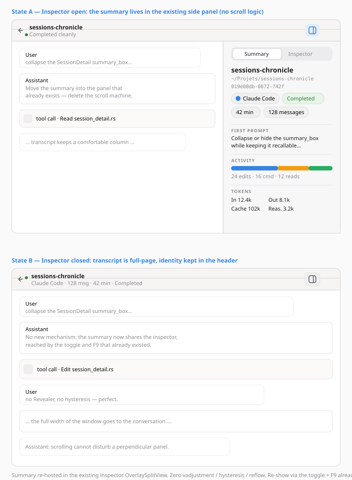
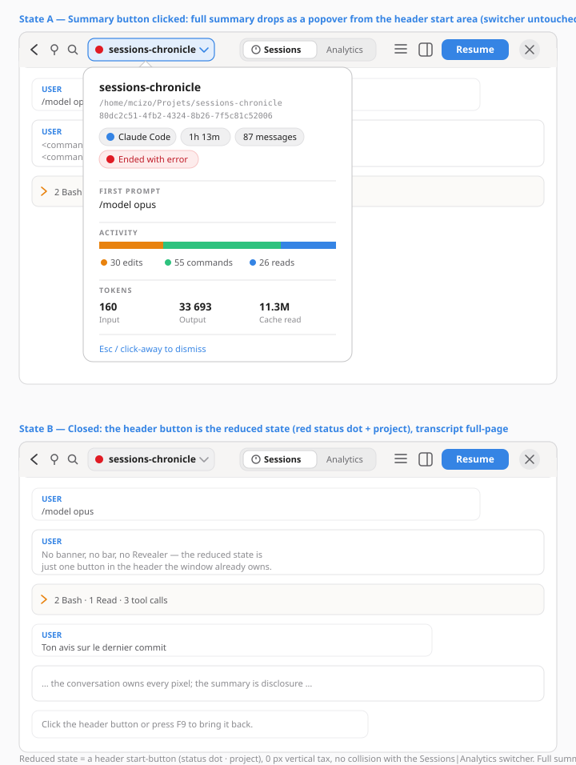

# Session Summary — Collapsing / hiding the `summary_box` — Exploration

**Date**: 2026-06-04  
**Status**: Decided — proposal E selected  
**Regression context**: commit `f8a1d1a` — *fix: make session transcript directly scrollable* (#160)  
**View**: `SessionDetail` (`src/ui/session_detail.rs`)  

---

## Problem

Since the fix for [#160](../explorations/2026-06-03-session-detail-incomplete-scrolling-exploration.md), which made the transcript `ListView` directly scrollable, the `summary_box` was lifted out of the `ScrolledWindow`: it is now a sibling `gtk::Box` **placed above** the `transcript_scroller`.

Side effect: what used to be a banner that **scrolled away with the transcript** is now a **fixed ~300-400 px wall** at the top of the view, always fully visible, squeezing the space available to the conversation — the primary task of the screen.

We want to be able to **collapse or hide** the `summary_box`, while keeping the ability to **bring it back at any time**. One idea raised: **automatic collapse/hide while scrolling** the conversation.

## Current `summary_box` content

Vertical box (`spacing: 12`, `margin: 16`), stacking — `src/ui/session_detail.rs:319-614`:

| Section | Widget | Data |
|---|---|---|
| Project title | `project_label` (`title-2`) | project folder name |
| Path | `path_label` (`dim-label`, selectable) | `project_path` |
| Session ID | `session_id_row` (monospace, selectable) | `session.id` |
| Chips | `chip_row` (FlowBox of `pill`) | assistant, duration, message count, **ending status** (colored) |
| First prompt | `first_prompt_section` (3 ellipsized lines) | `first_prompt` |
| Activity | `activity_section` (bar + legend) | `edit/command/read_count` |
| Tokens | `tokens_section` (FlowBox grid) | input/output/cache/reasoning |

Everything is **data-backed** (indexed fields, no AI-generated content). The problem is not the content but its **omnipresence**.

## Constraints

- **Do not reopen #160**: the `ListView` must remain the **direct** scrollable child of the `ScrolledWindow`. The summary cannot be put back into the scrolled flow. → any collapse must happen **outside** the scroller.
- GTK4 + libadwaita + Relm4 0.10, Rust 2024.
- Infrastructure already in place and reusable: `gtk::Overlay` (`detail_overlay`), `adw::ToastOverlay`, `adw::OverlaySplitView` (inspector, position `End`, collapses at 860 sp), floating search bar as `add_overlay` (top-center).
- The detail page is an `adw::NavigationPage` whose root is a `gtk::Box` **without an internal `AdwToolbarView`/`HeaderBar`** (`src/app/init.rs:165`) → a header `ToggleButton` implies either introducing a local `AdwToolbarView` or wiring to the app-level header bar.
- **The header bar is global and shared** (see `session_detail.png`): its **center title slot is permanently the `AdwViewSwitcher` — `Sessions | Analytics`**; its start cluster holds back/pin/search (with a large empty gap after search); its end cluster holds the hamburger, the **inspector toggle** (validates D's reuse), **Resume** and the window close button. → Any header-anchored affordance (A/B/E) must live in a free slot (the start gap or the end cluster) and **must not** claim the center title — that's the switcher.

## Design dimensions (left free per proposal)

The user explicitly left **two dimensions open** for each proposal:

1. **Scroll behavior** — whether / how the summary reacts to scroll.
2. **What persists in the reduced state** — from a rich bar down to nothing.

A third, structural axis emerged across the five proposals: **does the summary stay near the transcript and acquire a collapse *mechanism* (A, B, C), or is it *relocated* to a surface that already exists, removing the mechanism entirely (D, E)?**

---

## Proposal A — The Collapsible Crest
*Author: Mii Beta GTK Designer (mechanical reasoning: render cost, surfaces, reflow)*

Split `summary_box` into **two zones**: an **always-visible crest (~46 px)** (project + assistant chip + message count + ending status) and a **body inside a `GtkRevealer`** (path, ID, first prompt, activity, tokens). **Auto-collapse on scroll down** with hysteresis, **no automatic re-expand** (one-directional, to kill the yo-yo and the reflow loop). Re-show via clicking the crest, a header `ToggleButton` (clone of the existing `inspector_toggle` pattern), and a keyboard action. Collapse = a height animation on an already-built subtree, triggered once per threshold crossing.

**Strength**: keeps a clear, honest permanent orientation anchor. **Cost**: ~46 px permanent + the `Revealer` briefly re-lays-out the transcript during the animation.

→ full detail: [`_section-mii-beta.md`](../mockups/session-summary-collapse/_section-mii-beta.md)

---

## Proposal B — Retractable summary + persistent recap bar
*Author: UI Designer (GNOME/libadwaita HIG-conformant)*

Wrap the `summary_box` **as-is** in a `gtk::Revealer` driven by the scroller's `vadjustment`. At the top = full summary; on scroll down = collapse onto a **~40 px recap bar** (badge + project + condensed meta `· 128 msg · 42 min ·` + status chip + "Details ▾"). The manual toggle **pins** the state (`summary_pinned`). Alternatives explicitly rejected with rationale: `AdwExpanderRow` (unsuited to a rich header), `AdwBanner` (transient semantics), a second `OverlaySplitView` sidebar (over-engineering). Careful a11y (`F9`, `accessible-label`, reduced-motion, no focus trap).

**Strength**: most surgical change (wrap, don't rewrite) and most HIG-conformant. **Cost**: introduces an internal `AdwToolbarView`/`HeaderBar` (double-header risk); state logic (hysteresis + pinning) to test.

→ full detail: [`_section-ui-designer.md`](../mockups/session-summary-collapse/_section-ui-designer.md)

---

## Proposal C — The Retractable Cartridge (overlay "Peek")
*Author: creative proposal — the inverse structural bet*

Lift the summary **out of the vertical flow** and place it as an `add_overlay` on the existing `detail_overlay` (like the search bar). The transcript takes the **full** height permanently; the summary is a **cartridge** that drops over the top on open, then tucks away on first scroll into a minimal **tab** (colored ending-status dot + chevron). Re-expand never automatic — and here **no reflow is structurally possible**, since the overlay never touches the scroller's height. Re-show via tab, hover-peek, header `ToggleButton`, `F9`.

**Strength**: the only proposal that makes the transcript *truly* full-page and eliminates all reflow by construction. **Cost**: accepted occlusion of the top of the transcript when expanded; very sparse reduced state (status only); collision to manage with the search bar (same Overlay).

→ full detail: [`_section-creative.md`](../mockups/session-summary-collapse/_section-creative.md)

---

## Proposal D — Fold the summary into the existing inspector (surface consolidation)
*Author: systems reasoning — relocate, don't add a mechanism*

A, B and C all keep the summary near the transcript and invent a mechanism to make it yield (`Revealer` height animation, or overlay cartridge), all driven by `vadjustment` + hysteresis. D questions the premise: the view **already owns a contextual side surface** — the inspector (`adw::OverlaySplitView`, position `End`, toggled by `inspector_toggle` + `F9`) — and the summary is conceptually *the same class of object* (session metadata, not conversation). So **move the `summary_box` content into the inspector panel** (top section, or behind a small `AdwViewSwitcher` *Summary | Inspector*). The vertical flow then holds only the transcript. **No scroll behavior at all**: the summary lives perpendicular to the scroll axis, so the entire `vadjustment`/hysteresis/reflow machine A/B/C share is *deleted by construction*. Re-show reuses affordances that **already exist** (inspector toggle + `F9`); optional default-open on first view preserves "summary greets you." In the panel the summary finally reads vertically, at full fidelity.

**Strength**: kills the scroll machine entirely and consolidates two competing metadata surfaces into one, reusing native widgets and the toggle A/B must *introduce*. **Cost**: summary & inspector share one panel (a switcher arbitrates); below 860 sp the open panel overlays; rests on accepting summary ≈ inspector as one family.

→ full detail: [`_section-inspector-fold.md`](../mockups/session-summary-collapse/_section-inspector-fold.md)

---

## Proposal E — The Summary Button (header-anchored disclosure)
*Author: minimalist / HIG purist — the header already exists; add one button*

> **Revised after reviewing the real header** (`session_detail.png`). The detail page shares the **global** `adw::HeaderBar`, whose **center is permanently the `AdwViewSwitcher` (Sessions | Analytics)** and whose end side already holds the hamburger, inspector toggle, **Resume** and close. An earlier draft put an `AdwWindowTitle` menu in that center slot — it collides with the switcher. Corrected below.

Don't park the summary as content; expose it as a **header affordance**. The header is global and already speaks in buttons (search, hamburger, inspector toggle), so add **one more**: a flat `GtkMenuButton` in the header's *start* cluster (where the screenshot shows a large empty gap, between `🔍` and the switcher) reading `● sessions-chronicle ▾` — a status-colored dot + project name + chevron. Clicking it drops a `GtkPopover` holding the **full** summary; click-away / `Esc` dismisses. The vertical flow holds only the transcript, full height, permanently. The "reduced state" is **a single header button** — zero vertical tax, no `Revealer`, no overlay, **no scroll logic, no reflow, no occlusion, and no new header** (it adds a start widget to the header that already exists). The center switcher is untouched. Re-show: click the button; `F9` remains dedicated to filters/inspector.

**Strength**: the cleanest mechanics of the five (no surface state to sync at all), reusing the header-button vocabulary already on screen, with the most glanceable fact — the ending-status dot — permanent and free. **Cost**: with the center owned by the switcher, the permanent anchor is realistically only **dot + project** (assistant/msg/duration move into the popover, not always-on); the full detail must fit a height-bounded popover (internal scroll if it overflows); the summary becomes "consult," not "ambient."

→ full detail: [`_section-title-popover.md`](../mockups/session-summary-collapse/_section-title-popover.md)

---

## Comparison table

| Criterion | A — Crest | B — Recap | C — Overlay cartridge | D — Inspector fold | E — Summary button |
|---|---|---|---|---|---|
| Summary position | in flow | in flow | out of flow (overlay) | **out of flow (side panel)** | **out of flow (header)** |
| Permanent space tax | ~46 px (crest) | ~40 px (bar) | 0 px (floating tab) | **0 px in flow** | **0 px (header reused)** |
| Truly full-page transcript | no | no | yes | **yes** (width narrows when open) | **yes** |
| ListView reflow | brief (height anim) | brief (height anim) | none | **none** | **none** |
| Collapse on scroll | auto, one-directional | auto + pinning | auto on first scroll | **n/a — no scroll coupling** | **n/a — no scroll coupling** |
| Persistent info | project + assistant + msg + status | project + meta + status | status only | **none in flow (full in panel); opt. header subtitle** | **status dot + project (header button)** |
| Occlusion risk | no | no | yes (expanded covers top) | **only < 860 sp (panel overlays)** | **no (popover dismisses)** |
| Strict #160 compliance | yes | yes | yes | **yes** | **yes** |
| Size of change | medium (re-parent/duplicate) | low (encapsulation) | medium (overlay + search collision) | **low–medium (re-host into existing panel)** | **low–medium (header start button + popover; no new header)** |
| HIG compliance | good | most canonical | accepted deviation | **good (reuses native split + inspector)** | **good (header menu button)** |
| Header toggle required | yes | yes (local `AdwToolbarView`) | yes | **no — reuses existing inspector toggle** | **adds 1 start button to the existing global header** |

## Recommendation

The first three proposals (A, B, C) share the same technical foundation (`vadjustment` + hysteresis + header `ToggleButton` + `F9` + reduced-motion) and respect #160. Among them, the choice is **philosophical**:

- **B** is the **safest starting point**: near-rewrite-free encapsulation, the most HIG-conformant pattern, and it directly addresses the "auto-collapse on scroll" idea while keeping an orientation bar. Pick this to fix the regression **fast and cleanly**.
- **A** is B "with conviction": it decides what deserves permanent orientation (ending status + identity) and embraces a one-directional collapse for smoothness. Good for a more opinionated design without changing the structure.
- **C** is the **bet**: the only one of the three that makes the transcript full-page and removes reflow by construction, at the cost of occasional occlusion and a discreet tab.

**Rec (within A/B/C)**: prototype **B** as the base (low risk, reversible), borrowing from **A** the choice of persistent content (ending status = highest-value info). Keep **C** as an evolution if the occasional occlusion proves acceptable in real use.

### Update — proposals D & E (relocate instead of collapse)

D and E open a **different axis**: instead of building a collapse mechanism near the transcript, they *relocate* the summary to a surface that already exists, which **eliminates the entire scroll machine** (no `vadjustment` subscription, no hysteresis, no pin flag, no reflow, no "what happens at the top" edge case). This is the single hardest part of A/B/C — and D/E sidestep it.

- **D** is the **most economical structurally**: it reuses the inspector panel and its toggle (`F9`) verbatim, consolidating two metadata surfaces into one. Choose it if you accept that "summary" and "inspector" are the same family — then it's the least new code *and* the least new UI.
- **E** is the **purest minimalism**: a single flat menu-button in the existing header's start area (status dot + project) is the reduced state, and the full summary is transient disclosure from its popover. It touches neither the scroll flow nor the center `Sessions | Analytics` switcher. Choose it if "the conversation is the page; everything else is disclosure" is the guiding principle and a height-bounded popover for the detail is acceptable — accepting that assistant/msg/duration are then one click away rather than always-on.

**Decision**: ship **E**. The selected design treats the conversation as the page and moves the full summary into a header-anchored `GtkPopover`, opened only from the new summary button. `F9` remains unchanged: filters in list view, inspector in detail view. The implementation spec is `docs/superpowers/specs/2026-06-05-session-summary-header-popover-design.md`.

## Resolved questions

- The reduced state keeps a minimal orientation anchor: status dot + project name in the header button.
- Auto-collapse and re-expand are out of scope because E has no scroll coupling.
- Summary and inspector stay distinct; the summary is not folded into the inspector.
- The full summary will live in a height-bounded `GtkPopover` with internal scrolling when needed.
