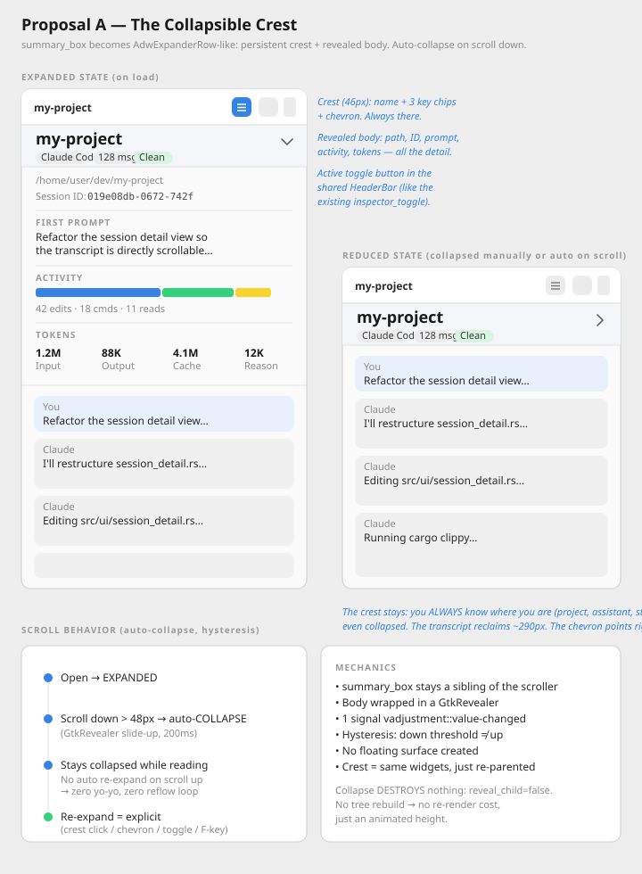
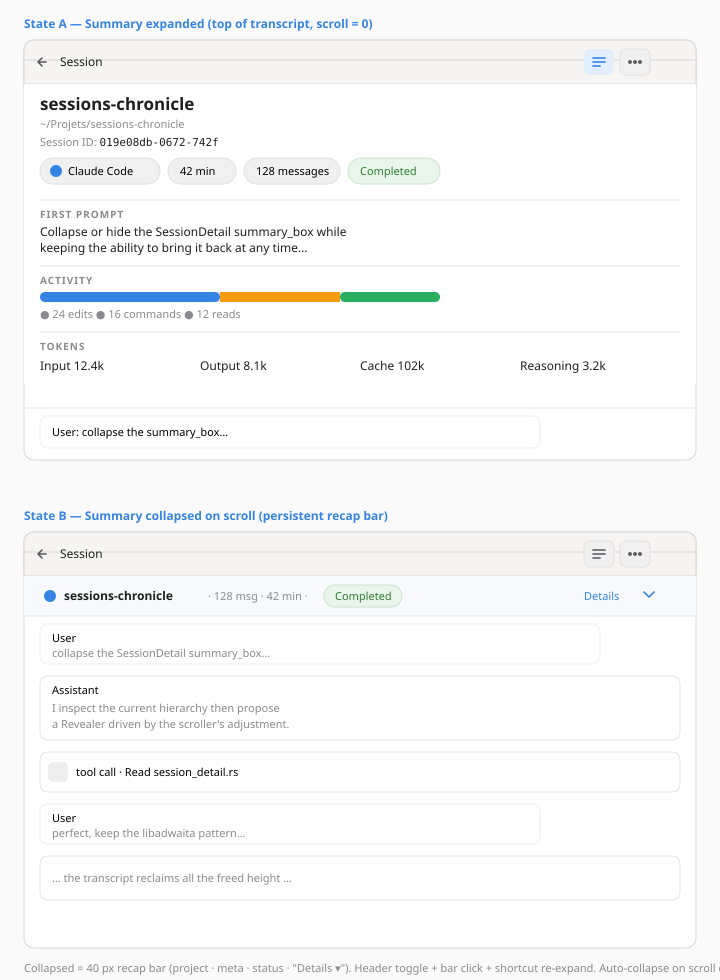
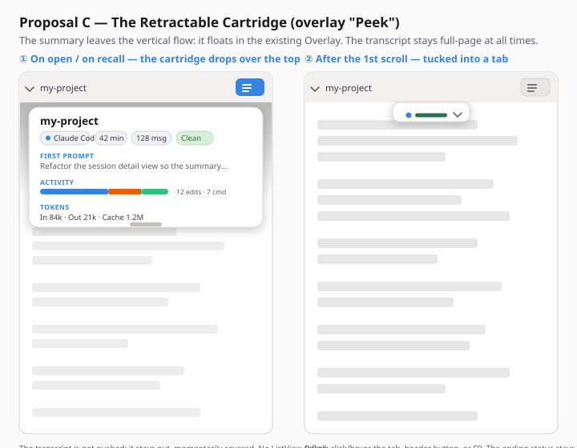

# Session Summary — Collapsing / hiding the `summary_box` — Exploration

**Date**: 2026-06-04  
**Status**: Exploration — decision pending  
**Regression context**: commit `f8a1d1a` — *fix: make session transcript directly scrollable* (#160)  
**View**: `SessionDetail` (`src/ui/session_detail.rs`)  

---

## Problem

Since the fix for [#160](../explorations/2026-06-03-session-detail-incomplete-scrolling-exploration.md), which made the transcript `ListView` directly scrollable, the `summary_box` was lifted out of the `ScrolledWindow`: it is now a sibling `gtk::Box` **placed above** the `transcript_scroller`.

Side effect: what used to be a banner that **scrolled away with the transcript** is now a **fixed ~300-400 px wall** at the top of the view, always fully visible, squeezing the space available to the conversation — the primary task of the screen.

We want to be able to **collapse or hide** the `summary_box`, while keeping the ability to **bring it back at any time**. One idea raised: **automatic collapse/hide while scrolling** the conversation.

## Current `summary_box` content

Vertical box (`spacing: 12`, `margin: 16`), stacking — `src/ui/session_detail.rs:319-614`:

| Section | Widget | Data |
|---|---|---|
| Project title | `project_label` (`title-2`) | project folder name |
| Path | `path_label` (`dim-label`, selectable) | `project_path` |
| Session ID | `session_id_row` (monospace, selectable) | `session.id` |
| Chips | `chip_row` (FlowBox of `pill`) | assistant, duration, message count, **ending status** (colored) |
| First prompt | `first_prompt_section` (3 ellipsized lines) | `first_prompt` |
| Activity | `activity_section` (bar + legend) | `edit/command/read_count` |
| Tokens | `tokens_section` (FlowBox grid) | input/output/cache/reasoning |

Everything is **data-backed** (indexed fields, no AI-generated content). The problem is not the content but its **omnipresence**.

## Constraints

- **Do not reopen #160**: the `ListView` must remain the **direct** scrollable child of the `ScrolledWindow`. The summary cannot be put back into the scrolled flow. → any collapse must happen **outside** the scroller.
- GTK4 + libadwaita + Relm4 0.10, Rust 2024.
- Infrastructure already in place and reusable: `gtk::Overlay` (`detail_overlay`), `adw::ToastOverlay`, `adw::OverlaySplitView` (inspector, position `End`, collapses at 860 sp), floating search bar as `add_overlay` (top-center).
- The detail page is an `adw::NavigationPage` whose root is a `gtk::Box` **without an internal `AdwToolbarView`/`HeaderBar`** (`src/app/init.rs:165`) → a header `ToggleButton` implies either introducing a local `AdwToolbarView` or wiring to the app-level header bar.

## Design dimensions (left free per proposal)

The user explicitly left **two dimensions open** for each proposal:

1. **Scroll behavior** — whether / how the summary reacts to scroll.
2. **What persists in the reduced state** — from a rich bar down to nothing.

---

## Proposal A — The Collapsible Crest
*Author: Mii Beta GTK Designer (mechanical reasoning: render cost, surfaces, reflow)*

Split `summary_box` into **two zones**: an **always-visible crest (~46 px)** (project + assistant chip + message count + ending status) and a **body inside a `GtkRevealer`** (path, ID, first prompt, activity, tokens). **Auto-collapse on scroll down** with hysteresis, **no automatic re-expand** (one-directional, to kill the yo-yo and the reflow loop). Re-show via clicking the crest, a header `ToggleButton` (clone of the existing `inspector_toggle` pattern), and a keyboard action. Collapse = a height animation on an already-built subtree, triggered once per threshold crossing.

**Strength**: keeps a clear, honest permanent orientation anchor. **Cost**: ~46 px permanent + the `Revealer` briefly re-lays-out the transcript during the animation.

→ full detail: [`_section-mii-beta.md`](../mockups/session-summary-collapse/_section-mii-beta.md)

---

## Proposal B — Retractable summary + persistent recap bar
*Author: UI Designer (GNOME/libadwaita HIG-conformant)*

Wrap the `summary_box` **as-is** in a `gtk::Revealer` driven by the scroller's `vadjustment`. At the top = full summary; on scroll down = collapse onto a **~40 px recap bar** (badge + project + condensed meta `· 128 msg · 42 min ·` + status chip + "Details ▾"). The manual toggle **pins** the state (`summary_pinned`). Alternatives explicitly rejected with rationale: `AdwExpanderRow` (unsuited to a rich header), `AdwBanner` (transient semantics), a second `OverlaySplitView` sidebar (over-engineering). Careful a11y (`F9`, `accessible-label`, reduced-motion, no focus trap).

**Strength**: most surgical change (wrap, don't rewrite) and most HIG-conformant. **Cost**: introduces an internal `AdwToolbarView`/`HeaderBar` (double-header risk); state logic (hysteresis + pinning) to test.

→ full detail: [`_section-ui-designer.md`](../mockups/session-summary-collapse/_section-ui-designer.md)

---

## Proposal C — The Retractable Cartridge (overlay "Peek")
*Author: creative proposal — the inverse structural bet*

Lift the summary **out of the vertical flow** and place it as an `add_overlay` on the existing `detail_overlay` (like the search bar). The transcript takes the **full** height permanently; the summary is a **cartridge** that drops over the top on open, then tucks away on first scroll into a minimal **tab** (colored ending-status dot + chevron). Re-expand never automatic — and here **no reflow is structurally possible**, since the overlay never touches the scroller's height. Re-show via tab, hover-peek, header `ToggleButton`, `F9`.

**Strength**: the only proposal that makes the transcript *truly* full-page and eliminates all reflow by construction. **Cost**: accepted occlusion of the top of the transcript when expanded; very sparse reduced state (status only); collision to manage with the search bar (same Overlay).

→ full detail: [`_section-creative.md`](../mockups/session-summary-collapse/_section-creative.md)

---

## Comparison table

| Criterion | A — Crest | B — Recap | C — Overlay cartridge |
|---|---|---|---|
| Summary position | in flow | in flow | **out of flow (overlay)** |
| Permanent space tax | ~46 px (crest) | ~40 px (bar) | **0 px (floating tab)** |
| Truly full-page transcript | no | no | **yes** |
| ListView reflow | brief (height anim) | brief (height anim) | **none (by construction)** |
| Collapse on scroll | auto, one-directional | auto + pinning | auto on first scroll |
| Persistent info | project + assistant + msg + status | project + meta + status | status only |
| Occlusion risk | no | no | **yes (expanded covers top)** |
| Strict #160 compliance | yes | yes | yes |
| Size of change | medium (re-parent/duplicate) | **low (encapsulation)** | medium (overlay + search collision) |
| HIG compliance | good | **most canonical** | accepted deviation (invocable overlay) |
| Header toggle required | yes | yes (local `AdwToolbarView`) | yes |

## Recommendation

All three share the same technical foundation (`vadjustment` + hysteresis + header `ToggleButton` + `F9` + reduced-motion) and respect #160. The real choice is **philosophical**:

- **B** is the **safest starting point**: near-rewrite-free encapsulation, the most HIG-conformant pattern, and it directly addresses the "auto-collapse on scroll" idea while keeping an orientation bar. Pick this to fix the regression **fast and cleanly**.
- **A** is B "with conviction": it decides what deserves permanent orientation (ending status + identity) and embraces a one-directional collapse for smoothness. Good for a more opinionated design without changing the structure.
- **C** is the **bet**: the only one that makes the transcript full-page and removes reflow by construction, at the cost of occasional occlusion and a discreet tab. Favor it if "give all the space back to the conversation" is the absolute priority and you accept testing discoverability.

**Rec**: prototype **B** as the base (low risk, reversible), borrowing from **A** the choice of persistent content (ending status = highest-value info). Keep **C** as an evolution if the occasional occlusion proves acceptable in real use.

## Open questions

- Should the reduced state keep an orientation anchor (project/assistant — A, B) or bet on the header bar alone (C)?
- Should auto-collapse re-expand when scrolling all the way back to the top? All three proposals avoid it by default (anti-loop); to be confirmed from a UX standpoint.
