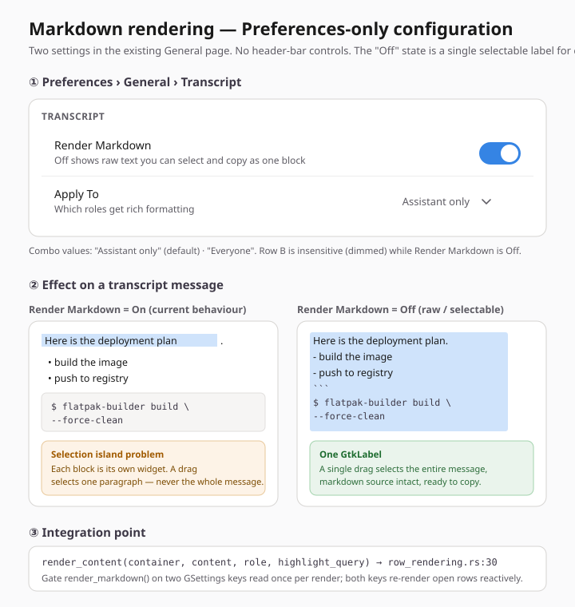
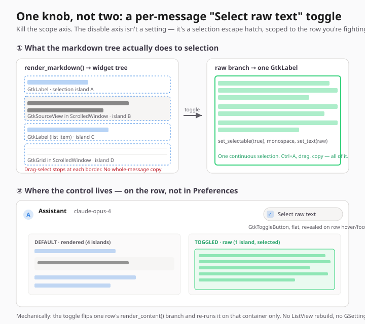
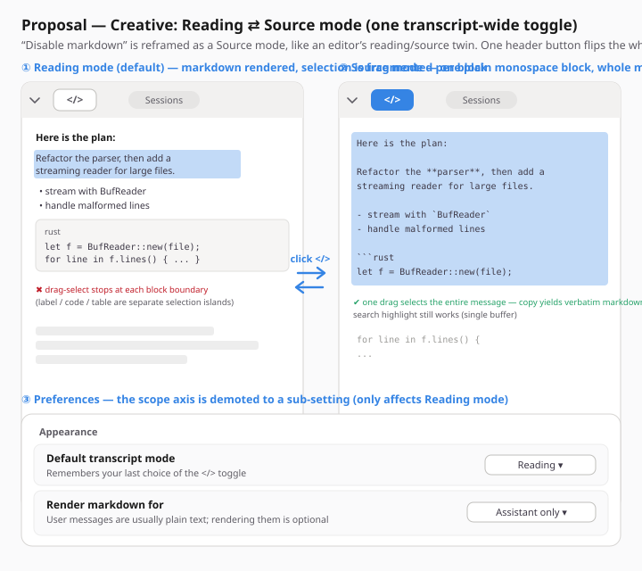

# Markdown rendering — configuration (scope + enable/disable) — Exploration

**Date**: 2026-06-23  
**Status**: Open — three proposals, awaiting decision  
**View**: `SessionDetail` transcript (`src/ui/session_detail/transcript/`)  
**Renderer**: `src/ui/markdown.rs`  

---

## Problem

Transcript messages are rendered through `render_content` (`src/ui/session_detail/transcript/row_rendering.rs:30`). Today the rule is hard-coded:

- **Assistant** messages → `markdown::render_markdown` (full markdown).
- **User / ToolResult** messages → a single plain, selectable `gtk::Label`.

We want to make two things configurable:

1. **Scope / extent** — should markdown rendering stay assistant-only, or be extendable to **user *and* assistant** messages?
2. **Enable / disable** — an easy way to turn markdown rendering off.

The main motivation for an easy *disable* is **text selection**. `render_markdown` builds a **tree of separate widgets** — one `GtkLabel` per paragraph/list item, a non-editable `GtkTextView` for some prose, a `GtkGrid` (in a `ScrolledWindow`) for tables, and a `GtkSourceView` for code blocks. Each of these is its **own selection island**: you can drag-select within a single paragraph, but you cannot drag across blocks or select a whole message at once. Turning markdown off collapses the message back to a single `GtkLabel`, where whole-message selection + copy is trivial.

## What "off" actually buys (the selection mechanics)

| Rendered (today) | Plain (markdown off) |
|---|---|
| N widgets per message (label/textview/grid/sourceview) | 1 `GtkLabel` |
| Selection limited to one block | Whole message selectable in one drag |
| Copy loses block structure / `**`/fences | Copy yields verbatim source text |
| Rich, readable | Plain, but grabbable |

So "disable markdown" is, in practice, a **"raw / selectable text" mode**. The three proposals differ mainly on *where* that switch lives and *how permanent* it is — and on whether the **scope** axis is a real feature at all.

## Integration point (shared by all proposals)

All three converge on the same code seam: the role branch in `render_content` (`row_rendering.rs:42-65`). The plain-label path the proposals reuse for "off" **already exists** — it is the `else` branch at `row_rendering.rs:57-65`. None of them needs a new renderer; they wire an existing branch to a trigger.

---

## Proposal — UI Designer
*Author: GNOME / libadwaita HIG-conformant, minimal change*

HIG-conformant, minimal-change: both controls live in the existing Preferences `General` page in a new `Transcript` group — no header-bar toggle, no per-session affordance. A `SwitchRow` **"Render Markdown"** (default On) and a `ComboRow` **"Apply To"** (*Assistant only* / *Everyone*, default assistant-only, dimmed while markdown is Off). A header toggle is rejected: the session page uses the *global shared* header bar, rendering mode is a stable preference not a per-message decision, and "Off" produces a single selectable `GtkLabel` that is both the fix for the selection-island problem and the more accessible node. Integration is a one-line gate change at `render_content` reusing the existing plain-label branch; a GSettings `changed` subscription re-renders open rows reactively. Complexity: Small.

→ full detail: [`_section-ui-designer.md`](../mockups/markdown-rendering-config/_section-ui-designer.md)  
GSettings: `render-markdown` (`b`, default `true`), `markdown-scope` (`s`, default `"assistant"`; accepts `"assistant"`/`"all"`).

---

## Proposal — Mii Beta
*Author: mechanical reasoning — render cost, surfaces, what the toggle actually flips*

Verdict: **one knob, not two. Kill the scope axis outright** — user messages are captured text (prompts, pasted code, stack traces), so rendering markdown over them either does nothing (a wasted parse + label) or actively lies about what the user typed (`*glob*` → emphasis). Assistant-only isn't a limitation, it's correct. The "disable" axis is real but mis-shaped: whole-message selection fails because `render_markdown()` builds a tree of separate selection islands. Fix it as a **per-row flat "Select raw text" toggle in the assistant row header**, not a global setting — it flips one row's `render_content()` branch and re-runs that container only (no `ListView` rebuild, no parse cost on other rows, reuses the existing plain-label branch). Named after intent ("select & copy this"), not mechanism. State is an ephemeral `raw: bool` on the row model.

→ full detail: [`_section-mii-beta.md`](../mockups/markdown-rendering-config/_section-mii-beta.md)  
GSettings: **none** (transient per-row state, not a preference; would only add a single `prefer-raw-text` bool later if usage proved people live in raw mode).

---

## Proposal — Creative
*Author: reframe the problem — Reading ⟷ Source mode twin (Obsidian / GitHub model)*

Reframe "disable" as a **mode**, the way editors do (Obsidian *Reading/Source*, GitHub *Preview/Edit*). A single flat `</>` `GtkToggleButton` in the header's free start-gap flips the **whole transcript** between *Reading mode* (today's rendered tree) and *Source mode* (every message becomes one plain monospace selectable block of its verbatim markdown). Selection becomes a first-class mode, not a degradation — one drag grabs an entire message and copy yields canonical markdown. This also **subsumes the scope axis**: in Source mode everything is uniformly raw, so "render markdown for user messages too?" only matters in Reading mode, where it drops to a quiet sub-setting. Mode is remembered per-window. Cost: two render paths to maintain, a visible re-render on flip, and contention for the same header slot the session-summary button wants.

→ full detail: [`_section-creative.md`](../mockups/markdown-rendering-config/_section-creative.md)  
GSettings: `transcript-view-mode` (`s`, default `"reading"`), `markdown-scope` (`s`, default `"assistant"`).

---

## Comparison

| Criterion | UI Designer | Mii Beta | Creative |
|---|---|---|---|
| Where the control lives | Preferences (2 rows) | per-row header toggle | header `</>` mode toggle + Prefs sub-setting |
| Scope axis | kept (`ComboRow`) | **deleted** (assistant-only is correct) | demoted to a Reading-mode sub-setting |
| Disable granularity | global (all transcripts) | per message | per transcript (mode), remembered |
| "Off" mental model | a preference | "select & copy this row" | "show me the source" |
| What the toggle re-renders | open rows (on `changed`) | one row's container | visible rows in the transcript |
| GSettings added | 2 keys | 0 (ephemeral) | 2 keys |
| Persistence | permanent until changed | ephemeral (resets) | remembered per window |
| Discoverability | low (buried in Prefs) | high (on every assistant row) | medium (one header button) |
| Copy fidelity | source text when Off | source text when raw | verbatim markdown in Source |
| HIG conformance | highest (canonical rows) | good (row affordance) | good (familiar editor pattern) |
| Size of change | Small | Small–Medium | Medium |

## Discussion

The three proposals disagree most on **whether scope is a real feature**:

- **UI Designer** keeps it because a preference is the canonical home for a stable rendering choice, and a `ComboRow` costs almost nothing.
- **Mii Beta** kills it: user messages are captured text, so rendering markdown on them is at best a wasted parse and at worst a lie about what was typed. This is the strongest single argument in the doc and is worth resolving first — if scope is dropped, two of three proposals simplify.
- **Creative** sidesteps it: scope only exists in Reading mode, so it never competes with the disable control.

On **disable**, the split is *permanence vs. immediacy*:

- A **preference** (UI Designer) suits a user who has a standing opinion ("I always want plain text").
- A **per-row toggle** (Mii Beta) suits the actual triggering moment — "I want to copy *this* answer" — without changing anything else, and is the most discoverable.
- A **mode** (Creative) suits a user who flips between reading and harvesting and wants it to stick for the session.

## Recommendation

These aren't mutually exclusive. A pragmatic path:

1. **Resolve the scope question first.** Mii Beta's case against rendering markdown on user messages is convincing; if accepted, *scope* drops out and the brief collapses to a single axis (enable/disable). If we still want it, ship it as UI Designer's dimmed `ComboRow`.
2. **For disable, lead with Mii Beta's per-row "Select raw text" toggle** — it targets the real moment (copying one answer), is the most discoverable, has zero global state, and reuses the existing plain-label branch with the smallest blast radius (re-render one container).
3. **Keep the Creative mode toggle as the escalation** if telemetry/feedback shows people want a *whole-transcript* raw view (e.g. harvesting a long session), since per-row clicks don't scale to that.

**Suggested first cut**: Mii Beta's per-row toggle, scope axis dropped (assistant-only stays the rule). Revisit a global preference (UI Designer) or a transcript-wide mode (Creative) only if real use shows the per-row affordance is insufficient.

## Open questions

- Drop the scope axis, or ship it as a dimmed `ComboRow`?
- Is the disable trigger per-row, global preference, or transcript-wide mode?
- If a setting is added, do we re-render already-open transcripts reactively (GSettings `changed`) or only new ones?
- Does the header `</>` slot collide with the planned session-summary header button (exploration `2026-06-04`)?
