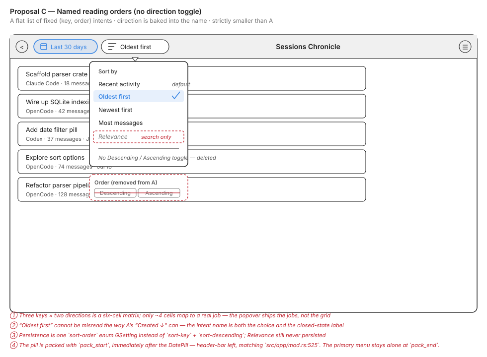
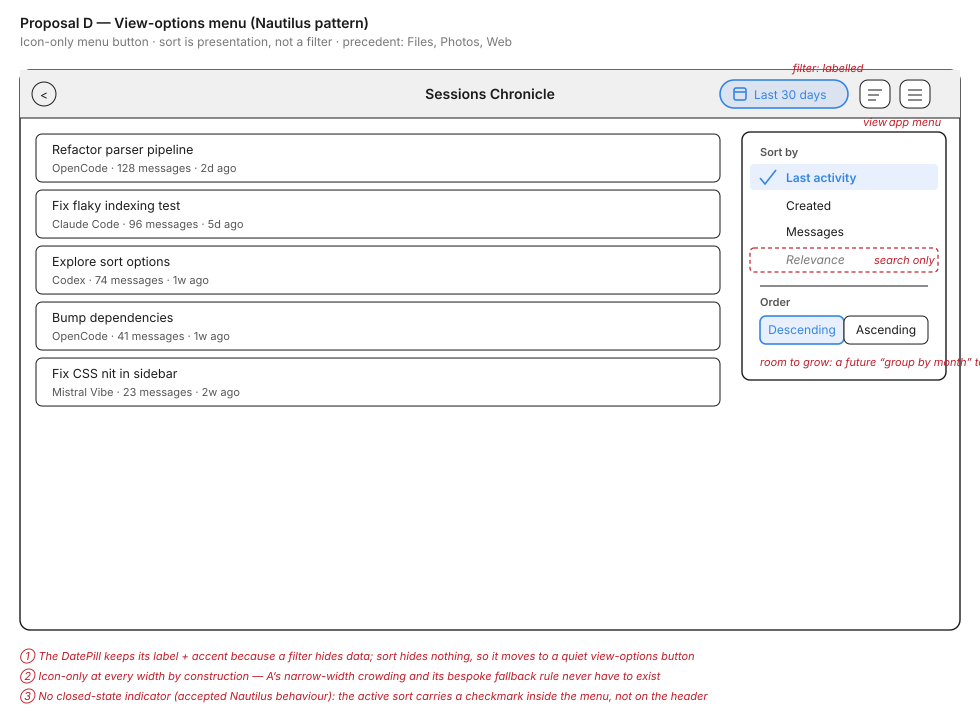
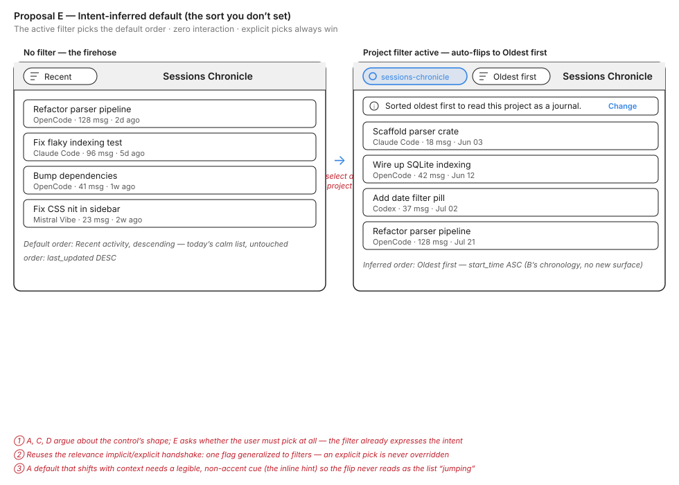

# Session List Sorting: Design Exploration

**Issue:** [#188](https://github.com/supermaciz/sessions-chronicle/issues/188) — Sort options for the session list  
**Date:** 2026-07-21  
**Status:** Decided — Proposal C (named reading orders), on A's pill surface, without the `accent` class  
**Source:** Issue #188 already contains a fully developed GNOME HIG proposal; this exploration restates it (Proposal A) and pits it against a creative alternative (Proposal B). Proposals C, D, and E were added later to interrogate assumptions A and B share: C questions the direction toggle, D questions the pill surface itself, and E questions whether the user needs to pick a sort at all.

## Context

The session list order is hardcoded. Users cannot reorder results to fit what they are looking for.

- `load_sessions_for_filter` and the sibling filtered queries sort by `ORDER BY last_updated DESC` (`src/database/mod.rs:305`, `src/database/mod.rs:494`).
- `search_sessions_with_query` sorts by `ORDER BY rank ASC` (bm25) then `s.last_updated DESC` (`src/database/mod.rs:446`).

Sorting and filtering are different axes: filters (assistant, project, date range) change *which* sessions are in the set, sorting changes *how they are ordered*. Only the first axis is currently exposed.

The concrete jobs-to-be-done are **reconstructing a project's chronology** (oldest first) and **spotting large sessions**.

### Key questions this exploration answers

1. **Surface placement** — a second pill in the header bar, or a control that lives with the list itself?
2. **Sort vs. encoding** — does the control only reorder rows, or does it also change what the rows *show*?
3. **Relevance behaviour** — how does search-mode rank ordering interact with an explicit user choice?
4. **Closed-state readability** — can the user tell which way the list reads without opening anything?
5. **Cost** — what does each option imply for SQL indexes, list virtualization, and maintenance?

### What both proposals share (from the issue, not up for debate)

- Three permanent criteria backed by plain columns: **Last activity** (`last_updated`, default), **Created** (`start_time`), **Messages** (`message_count`).
- **Relevance** is the implicit default of search mode: a query switches to it automatically, an explicit pick is respected, clearing the query falls back to Last activity only if Relevance was never chosen explicitly. Never persisted.
- **Pinned sessions do not float.** `ProjectFilter::Pinned` is the explicit path; a sort that only sorts part of the list misrepresents what it does. A pin badge is marking, not reordering.
- **Out of scope for v1:** tokens (analysis sort, belongs to analytics), duration (no column; `last_updated - start_time` lies about resumed sessions), project/assistant (groupings, already filters).
- **v13 migration** adds `(is_subagent, start_time DESC)` and `(is_subagent, message_count DESC)` indexes; the v12 composite indexes all end in `last_updated DESC` and any other sort falls back to a temporary B-tree.
- SQL fragments are built **from enums, never from strings** — the `ORDER BY` sites are the one place SQL is concatenated rather than parameterised.

---

## Proposal A — Header-bar sort pill (GNOME HIG)

A single sort control in the header bar: a second `GtkMenuButton` pill packed with `pack_start` immediately after the existing `DatePill` (`src/app/mod.rs:525`) — header-bar left, next to the date filter — built on the same mechanics as `src/ui/date_pill.rs`.

### Behaviour

- The popover lists the criteria in a `ListBox` (`Last activity · Created · Messages`), plus `Relevance` at the top **only while a query is active** — never a permanently greyed-out entry.
- A linked pair of `GtkToggleButton`s (`Descending | Ascending`) controls direction, with explicit accessible labels (not just arrow icons).
- Explicitly chosen sorts persist via two GSettings keys: `sort-key` (enum) and `sort-descending` (bool). `relevance` is never persisted — it is query-bound state, not a preference.
- Shortcut `<Ctrl>Shift O`, symmetric with `DatePillInput::OpenViaShortcut`. `GtkMenuButton` is focusable and Escape closes the popover natively.

### Closed-state indicator

- **Default** (Last activity, descending) → icon only, no label; the header stays calm.
- **Anything else** → icon + label ("Messages ↓", "Created ↑") + `accent` CSS class on the pill.
- **Narrow widths** (< ~500 px, two pills + filters toggle + inspector toggle + spinner + primary menu) → icon-only fallback with accent class; the tooltip ("Sort by messages, descending") carries the full description. A tooltip complements the label, it does not replace it.

### Trade-offs

| Pros | Cons |
|------|------|
| Zero new surface: the header already hosts pills, this adds one of the same family | Two header pills + toggles crowd the header below ~500 px — needs the icon-only fallback rule |
| Implementation path is fully sketched in the issue (`SortKey`/`SortOrder` enums, `sort_sql_clause()`, `src/ui/sort_pill.rs` modelled on `date_pill.rs`) | Sort and visual presentation stay separate: the list looks identical whatever the order, the user must read dates/counts to perceive it |
| Predictable GNOME pattern (menu button + popover + boxed list), accessible by construction | "Reconstruct a chronology" still means reading row timestamps one by one |
| Lowest risk, smallest diff, clear verification path (fixtures + `EXPLAIN QUERY PLAN`) | |

---

## Proposal B — Sort lenses (creative)

Sorting as a **lens**: the control doesn't just reorder rows, it re-encodes them. A lens switcher strip sits at the top of the session list pane (below the search bar), as a segmented control — `Activity · Chronology · Volume` — plus `Relevance` while a query is active. Each lens pairs a sort order with a row encoding that makes that order *visible*.

### Chronology lens

- Oldest first, grouped under **month headers** — the hierarchy the issue says an alphabetical project sort could never provide.
- A **timeline spine** runs along the left edge with a node per session: resume gaps and bursts of activity are visible without reading a single date.
- Directly serves the "reconstruct a project's chronology" job: the list reads like a project journal.

### Volume lens

- Sorted by `message_count` descending; each row carries a **proportional meter bar** (length ∝ messages) plus the count.
- Outliers and heavy sessions pop at a glance — the "spot large sessions" job needs no number reading.
- The **Activity** lens is today's list, unchanged: the calm default. The **Relevance** lens (search only) adds a match-count badge per row.

### Trade-offs

| Pros | Cons |
|------|------|
| Solves both JTBD directly: chronology and large sessions are *seen*, not inferred | Much larger implementation: group headers and a spine inside a virtualized list, per-row bars, a lens state machine |
| Sort becomes self-explanatory — the encoding *is* the indicator, no closed-state readability problem | Deviates from GNOME list conventions; month headers + spine + bars risk visual noise |
| Differentiating: no comparable tool re-encodes rows per sort mode | A third surface to place (strip above the list) competes with the existing banner/info-bar slot |
| The lens model extends naturally (a future "Tokens" lens with real data ink) | Row height grows in Volume lens → fewer sessions per screen; group headers break the uniform row factory |
| | Needs its own narrow-width story (lens labels collapse to icons) on top of the header's |

---

## Proposal C — Named reading orders (no direction toggle)

*Contributed by the Mii Beta GTK Designer lens: reason from what the control mechanically generates, not from convention.*

Both A and B inherit an assumption from the issue without examining it: that the user picks a **criterion**, and **direction** is a second, orthogonal control riding alongside. A packs a `Descending | Ascending` toggle pair into the popover; B carries the same key×direction state under its lenses. Look at what that produces: three keys × two directions is a six-cell state space. Now count the cells that map to a real job-to-be-done. "Reconstruct a chronology" is `start_time ASC`. "Spot large sessions" is `message_count DESC`. The default is `last_updated DESC`. That is three or four live cells; `message_count ASC` (smallest first) and `last_updated ASC` (least-recently-touched first) exist only because a matrix generates them, not because anyone asked. Dead options are worse than no options — they widen the decision and pad the popover to look complete.

So collapse the matrix into a flat list of **named reading orders**, each a fixed `(SortKey, SortOrder)` pair chosen because it answers a real question: **Recent activity** (default, `last_updated DESC`), **Oldest first** (`start_time ASC` — the project journal), **Newest first** (`start_time DESC`), **Most messages** (`message_count DESC`), and **Relevance** while a query is live. Direction stops being a widget and becomes baked into the name.

The payoff lands on A's own weak spot: closed-state readability. A must render "Created ↑" and trust the user to decode which way the arrow points on a creation date — a down-arrow on Created is genuinely ambiguous (newer or older?). "Oldest first" cannot be misread, is shorter, and needs no accent-plus-arrow decoding scheme. The one place A's naming got fuzzy — direction — disappears because the name *is* the direction.

Mechanically this is A's data layer with a control **deleted**, not a new surface. Same `GtkMenuButton` pill after `DatePill` (`src/app/mod.rs:525`), same `date_pill.rs` mechanics, same two `ORDER BY` sites (`src/database/mod.rs:494`, `:446`), same v13 indexes, same enum→SQL discipline. The differences: the popover `ListBox` holds ~4 named rows instead of 3 rows plus a toggle pair, and persistence is a single `sort-order` enum GSetting instead of `sort-key` + `sort-descending` (Relevance still never persisted). Zero row-factory cost. It is strictly smaller than A while answering the same jobs with less ambiguity, and — like A — it is a clean foundation B's lenses can sit on, one lens per named order.

| Pros | Cons |
|------|------|
| Deletes a surface: no direction toggle, one flat intent list — smaller diff than A, not larger | Curated list means one deliberate pruning decision (dropping `message_count ASC` / `last_updated ASC`) a reviewer must accept |
| Kills A's only naming ambiguity — "Oldest first" can't be misread the way "Created ↓" can | Adding a genuinely-wanted reverse later means an enum variant, not flipping a toggle (intentional, but a code change not a UI affordance) |
| Closed-state indicator is self-describing: the intent name *is* the label, no arrow to decode | Slightly less discoverable symmetry — a user hunting for ascending-messages won't find a toggle to flip |
| One `sort-order` enum GSetting instead of two keys; still enum→SQL, never string-concatenated | Intent names must be chosen so they don't drift from what the column mechanically sorts on |
| Zero row-factory / virtualization cost; nothing in the list changes or gets heavier in motion | |

---

## Proposal D — View-options menu (Nautilus pattern)

*Contributed by the UI Designer lens: validate the surface against a concrete GNOME precedent.*

The question A leaves open is whether sort deserves a *second labelled pill* at all. Answer: no. The DatePill earns its closed-state label and `accent` class because it is a **filter** — it hides sessions, and the user must be told data is missing. Sort hides nothing; every session is still present, only reordered. The exploration's own Context section says filtering and sorting "are different axes." A collapses them onto the same *surface family* (a pill that lights up accent when non-default), which over-signals: it fires the same "your view is constrained" alarm for a benign, fully reversible reordering. GNOME already has a home for controls that reshape presentation without removing data, and it is not a filter pill — it is the **view-options menu button**.

The canonical precedent is **GNOME Files (Nautilus)**: a single `GtkMenuButton` at the header end whose popover carries the grid/list toggle, zoom, and a **Sort** section (Name / Size / Modified, with A-Z / Z-A). **GNOME Photos** and **GNOME Web** follow the same shape. Crucially, in Nautilus you *cannot* read the current sort without opening the menu — and that is accepted, because sort is low-stakes, reversible presentation state that does not warrant permanent header real estate. Proposal D adopts this: one quiet, icon-only `GtkMenuButton` (`view-sort-descending-symbolic`, a standard Adwaita symbolic — no `relm4-icons` needed) packed at `pack_end` just before the primary hamburger. Its popover holds the same criteria `GtkListBox` and the same linked `Descending | Ascending` toggle pair as A, with identical accessible labels. The data layer is unchanged and shared: `SortKey`/`SortOrder` enums, `sort_sql_clause()`, v13 indexes, the two GSettings keys. Relevance appears as the top row only while a query is active, exactly as in A.

This is *more* conservative than A, not less. It removes A's entire cost surface: no accent-state CSS, no `#[watch]`-driven growing/shrinking label, and — most importantly — **no narrow-width problem to solve**. A's chief Con is that a second labelled pill crowds the header below ~500 px and needs a bespoke icon-only fallback rule; D is icon-only at *every* width by construction, so that rule never has to exist. The deliberate trade is that D has **no closed-state indicator** — but per the Nautilus precedent that is the correct choice for a non-destructive axis, and the small verification cost (open the menu, the active sort carries a checkmark) is the GNOME norm.

The even-more-conservative option — folding sort into the existing primary `open-menu-symbolic` hamburger (`src/app/mod.rs:386`) — is rejected: the HIG reserves the primary menu for app-global actions (About, Preferences, Keyboard), and Nautilus itself deliberately keeps its view-options menu *separate* from the primary menu. A dedicated view-options button is the right amount of separation. New component: `src/ui/sort_menu.rs`, modelled on `date_pill.rs` (both wrap `gtk::MenuButton`); complexity **small** — strictly smaller than A, since it drops the label/accent/fallback logic while reusing the shared data layer.

| Pros | Cons |
|------|------|
| Treats sort as presentation, not as a filter — resolves the axis-conflation the doc itself flags; sort never triggers the "view constrained" accent that should mean "data hidden" | No closed-state readability: the active sort is invisible until the menu is opened (accepted Nautilus behaviour, but a real regression vs. A's label) |
| Strongest GNOME precedent in the exploration: Nautilus, Photos, and Web all sort from a view-options menu button | Chronology / large-session JTBD are still order-only — like A, and unlike B, rows are not re-encoded |
| Icon-only at every width by construction — A's narrow-width crowding and its bespoke fallback rule simply do not exist | One more header button than A's "reuse the pill family" argument would like, though a quieter, label-free one |
| Cheaper than A: no accent CSS, no `#[watch]` label, no fallback logic; reuses A's shared data layer | Users habituated to the DatePill's visible label may not discover an icon-only sort affordance as quickly (mitigated by the standard icon + tooltip) |
| Extensible: a future grouping/density or "group by month" toggle joins the same popover, matching how Nautilus grows its view menu — without adding surfaces | Adds a genuinely new (if small) component surface rather than A's "zero new surface" ideal |

---

## Proposal E — Intent-inferred default (the sort you don't set)

A, C, and D argue about the *control's shape*; B argues about the *rows*. All four still assume the user must actively choose a sort. But the doc already names the two JTBD and ties each to a context the UI **already expresses**: "reconstruct a project's chronology" only becomes the job once you have narrowed to a single project (or Pinned); "spot large sessions" is an analytics-adjacent scan. So let the **active filter pick the default order**, and keep whichever of A/C/D wins as the manual override.

### Behaviour

- **No filter** (the firehose) → Recent activity descending. Today's calm default, untouched.
- **A `ProjectFilter` (a named project, or Pinned) is active** → the list defaults to **Oldest first** (`start_time ASC`). Selecting a project *is* the "read this project as a journal" intent — this is exactly what B's chronology lens shows, minus the new surface and minus the timeline spine.
- **A query is active** → Relevance, exactly as already specified.
- **The moment the user picks a sort explicitly** (from the A/C/D control), the inference yields for the rest of that filter context. The relevance machinery already models this precise "implicit until explicit" handshake — generalize `relevance_is_implicit` into one flag that covers filter-driven defaults too, so an explicit pick is never overridden.

### Why it fits

This rides entirely on A's (or C's) data layer plus that one generalized flag: zero new surface, zero row cost. It converts the sharper half of B's payoff — the chronology JTBD — into a default the user never has to reach for, without paying for group headers, a spine, or a virtualized-list rewrite. It also composes cleanly: E is not a rival to A/C/D but a policy layered on top of the winner, and it stacks under B too (the inferred default just selects which lens opens).

The risk is legibility: a default that changes when you switch context can read as the list "jumping." It needs a quiet, non-accent cue that the order was inferred (a one-line inline hint on the first project open, or a subtle marker in the sort control's closed state) — and it must **never** silently override an explicit choice, which the implicit/explicit flag guarantees.

| Pros | Cons |
|------|------|
| Serves the chronology JTBD with **zero interaction** — the highest-value job needs no control at all | A default that shifts with context can feel like the list jumped; needs a legibility cue and careful "never override explicit" handling |
| Orthogonal: layers on top of whichever of A/C/D ships, and stacks under B (selects the opening lens) | Inference rules are a product judgement (why Oldest-first for Pinned? why not Newest?) that a reviewer must sign off |
| Reuses the relevance implicit/explicit handshake already in the design — one flag generalized, not a new mechanism | Discoverability of the *manual* override still depends entirely on A/C/D; E adds no affordance of its own |
| Zero new surface, zero row-factory cost; smallest footprint of any proposal beyond its host control | Ties sort semantics to filter state, coupling two axes the doc worked to keep separate — deliberate here, but a coupling nonetheless |

---

## Side-by-side summary

| Aspect | Proposal A (sort pill) | Proposal B (sort lenses) |
|--------|------------------------|--------------------------|
| **Mental model** | "Reorder this list" | "Look at this list through a lens" |
| **Surface** | Header-bar pill, same family as DatePill | Segmented strip above the list |
| **Closed-state readability** | Label + accent on the pill; icon-only fallback | The row encoding itself |
| **Chronology JTBD** | Order only — read timestamps | Order + month headers + spine |
| **Large-session JTBD** | Order only — read counts | Order + proportional bars |
| **Implementation** | Small: enums, SQL clause, one new component, v13 indexes | Large: all of A's data layer + headers/spine/bars in the list |
| **GNOME fit** | Standard patterns throughout | Novel; needs restraint to stay calm |
| **Risk** | Low | Medium-high (virtualization, row factory, visual noise) |

The summary above contrasts A and B, the two ends of the spectrum. C, D, and E are **not competing columns** — each keeps A's data layer and moves one axis A fixed:

| | Moves which axis vs. A | Relationship to A/B |
|---|---|---|
| **C — Named reading orders** | Deletes the direction toggle; sorts become curated named intents | Strictly smaller than A; still a foundation for B |
| **D — View-options menu** | Swaps the labelled pill for an icon-only Nautilus-style menu button | Smaller than A (no accent/label/fallback); orthogonal to C's list contents |
| **E — Intent-inferred default** | Lets the active filter pick the default order; no user pick required | A policy layered on the winner of A/C/D; stacks under B |

C and D can combine (a view-options menu whose popover holds C's named orders). E composes with any of them. All five share A's data layer, so the sequencing question is about **surface**, not schema: Proposal A's entire data layer (`SortKey`, `sort_sql_clause()`, v13 indexes, GSettings keys, relevance semantics) is the common prerequisite; every other proposal only changes the control surface, the row rendering, or the default policy on top of it.

## Decision

**Proposal C — named reading orders — is retained**, rendered on Proposal A's header-bar pill, with one amendment borrowed from D: **the pill carries its label but never the `accent` CSS class.**

### Rationale

**C over A.** C is the only proposal that *removes* a control rather than adding one, while answering the same jobs. The key×direction matrix is 3 × 2 = six cells, and two of them (`message_count ASC`, `last_updated ASC`) exist only because a matrix generates them — no stated job asks for smallest-first or least-recently-touched-first. A widget is not built to populate a symmetry. The payoff lands on A's own weak spot: "Created ↓" is genuinely ambiguous (more recent, or arrow pointing into the past?), "Oldest first" cannot be misread. One `sort-order` enum GSetting instead of two keys, zero row-factory cost.

**C over D, but D's diagnosis is adopted.** D is right that sorting hides nothing and must therefore not fire the `accent` state that elsewhere means "data is missing" — that would conflate the two axes the Context section works to separate. But D draws the wrong conclusion from it and discards the *label* along with the accent. C is precisely what makes that label cheap and unambiguous; giving up closed-state readability at the moment it becomes easy pays D's cost without its benefit. So: **labelled pill, no accent class.** The text "Oldest first" informs; it must not alarm. This resolves the axis conflation, keeps closed-state readability, and avoids a second header component (`sort_menu.rs`). A's narrow-width fallback rule still has to be written, but it becomes trivial — C's names are short and the tooltip carries the full description.

**E deferred, not rejected.** E is the most elegant proposal here — the highest-value job served at zero interaction — but it is a product bet, not a technical given. "Open a project ⇒ Oldest first" assumes consulting a project always means reading it as a journal, which is unverifiable before the manual control ships. Ship C, observe whether users systematically switch to Oldest first in project context, and *then* promote it to an inferred default. The `relevance_is_implicit` flag will already be there to generalize.

**B out of scope for v1.** Month headers and a timeline spine inside a virtualized list are a separate project. C is a clean foundation for it — one lens per named order.

### Placement

The pill is packed with **`pack_start`, immediately after the `DatePill`** — header-bar **left**, matching how the date filter is already packed (`src/app/mod.rs:525`). It sits with the control it is a sibling of, not across the header from it. `pack_end` stays reserved for the primary menu and the detail-view actions. Mockups A and C reflect this placement.

### Sequencing

1. **Shared data layer** — `SortOrder` enum (key and direction fixed together), `sort_sql_clause()` built from the enum and never from strings, v13 indexes, Relevance semantics. The common prerequisite of every proposal.
2. **`src/ui/sort_pill.rs`** — modelled on `date_pill.rs`; label without accent, icon-only fallback at narrow widths, `<Ctrl>Shift O`.
3. **E when real usage justifies it**; **B** only if per-row encoding becomes a priority.

The `HashSet` trap noted in the References (`src/database/mod.rs:459` keeps the *first* row seen) deserves a test at step 1 — changing `ORDER BY` silently changes which row survives.

## Open questions for the issue discussion

*Questions 5 and 6 are settled by the Decision above; 1–4 and 7 remain open for the follow-up work.*

1. Ship A first and treat B as a follow-up, or is the lens model compelling enough to design for now?
2. If B: does the lens strip replace the pill, or does the pill remain for narrow widths / keyboard flow?
3. Does the Volume lens bar belong in the session row factory, or is it a sign the analytics view should own "size" questions (as the issue already suggests for tokens)?
4. Verification for B needs fixture sessions with visibly different message counts and date spans — are the current `tests/fixtures/` sufficient?
5. **(C)** Is the six-cell key×direction matrix worth exposing in full, or do we ship curated named orders and add ascending variants only when a real job demands one?
6. **(D)** Is sort a filter-family control (labelled pill, per A) or a presentation control (icon-only view-options menu, per the Nautilus precedent)? This decides whether a closed-state indicator is even desirable.
7. **(E)** Should selecting a project auto-flip the list to Oldest-first, or is a default that changes with context too surprising to be worth the saved interaction?

## References

- Issue #188: full implementation sketch (SQL sites, v13 indexes, persistence keys, relevance flag `relevance_is_implicit`, accessibility, narrow-width rule).
- `src/ui/date_pill.rs`: the component mechanics Proposal A reuses.
- `docs/explorations/2026-05-26-date-filter-exploration.md`: the same "HIG vs. experimental" framing applied to the date filter.
- Known trap for later: `search_sessions_with_query` deduplicates via a `HashSet` keeping the *first* row seen (`src/database/mod.rs:459`) — changing `ORDER BY` changes which row survives, silently, once a "best matching snippet" is displayed.
