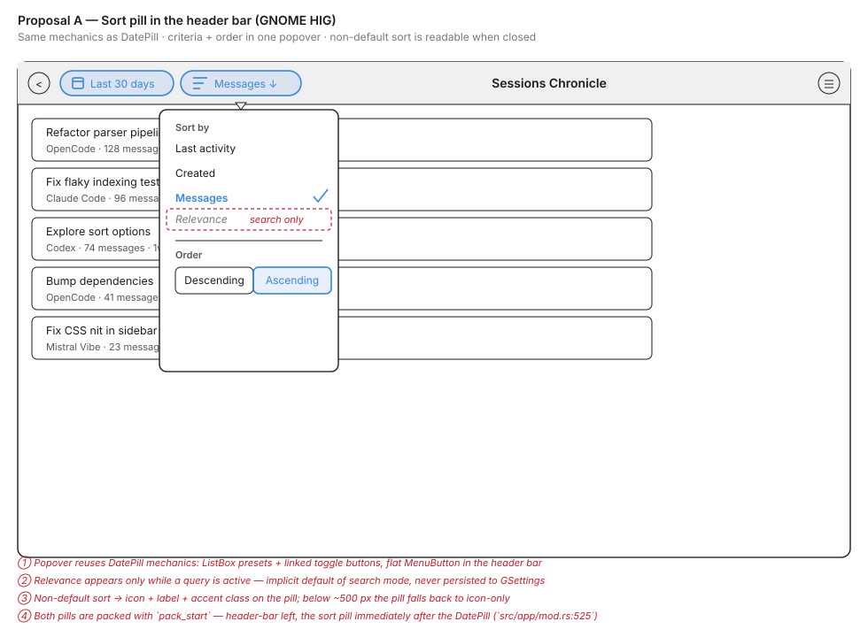
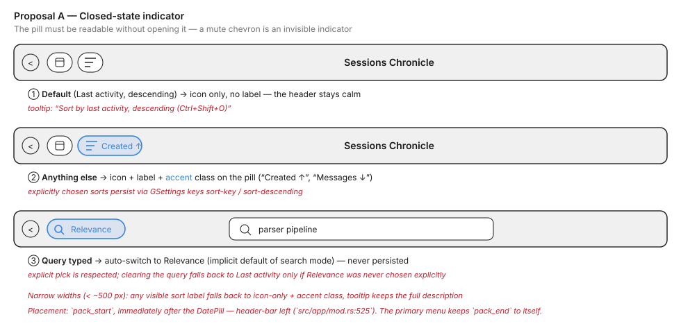
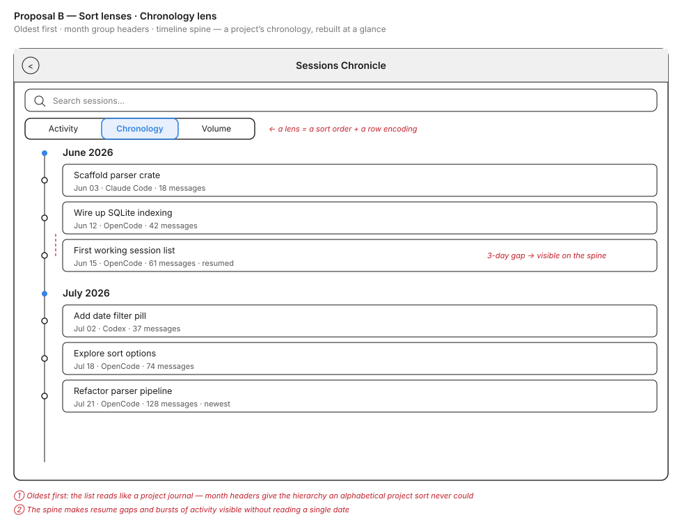
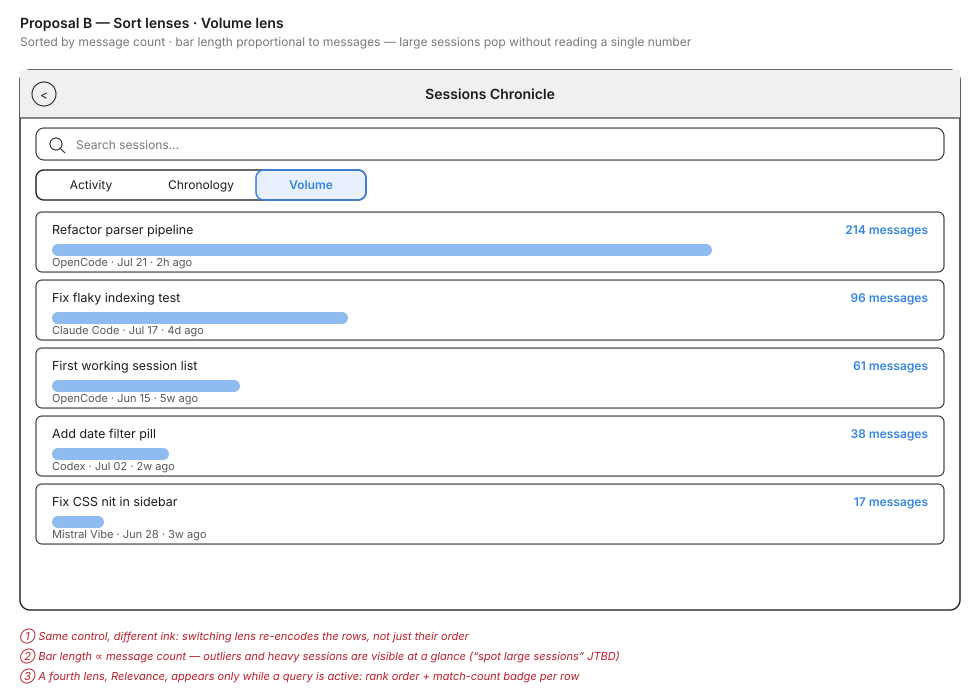

# Session List Sorting: Design Exploration

**Issue:** [#188](https://github.com/supermaciz/sessions-chronicle/issues/188) — Sort options for the session list  
**Date:** 2026-07-21  
**Status:** Open  
**Source:** Issue #188 already contains a fully developed GNOME HIG proposal; this exploration restates it (Proposal A) and pits it against a creative alternative (Proposal B).

## Context

The session list order is hardcoded. Users cannot reorder results to fit what they are looking for.

- `load_sessions_for_filter` and the sibling filtered queries sort by `ORDER BY last_updated DESC` (`src/database/mod.rs:305`, `src/database/mod.rs:494`).
- `search_sessions_with_query` sorts by `ORDER BY rank ASC` (bm25) then `s.last_updated DESC` (`src/database/mod.rs:446`).

Sorting and filtering are different axes: filters (assistant, project, date range) change *which* sessions are in the set, sorting changes *how they are ordered*. Only the first axis is currently exposed.

The concrete jobs-to-be-done are **reconstructing a project's chronology** (oldest first) and **spotting large sessions**.

### Key questions this exploration answers

1. **Surface placement** — a second pill in the header bar, or a control that lives with the list itself?
2. **Sort vs. encoding** — does the control only reorder rows, or does it also change what the rows *show*?
3. **Relevance behaviour** — how does search-mode rank ordering interact with an explicit user choice?
4. **Closed-state readability** — can the user tell which way the list reads without opening anything?
5. **Cost** — what does each option imply for SQL indexes, list virtualization, and maintenance?

### What both proposals share (from the issue, not up for debate)

- Three permanent criteria backed by plain columns: **Last activity** (`last_updated`, default), **Created** (`start_time`), **Messages** (`message_count`).
- **Relevance** is the implicit default of search mode: a query switches to it automatically, an explicit pick is respected, clearing the query falls back to Last activity only if Relevance was never chosen explicitly. Never persisted.
- **Pinned sessions do not float.** `ProjectFilter::Pinned` is the explicit path; a sort that only sorts part of the list misrepresents what it does. A pin badge is marking, not reordering.
- **Out of scope for v1:** tokens (analysis sort, belongs to analytics), duration (no column; `last_updated - start_time` lies about resumed sessions), project/assistant (groupings, already filters).
- **v13 migration** adds `(is_subagent, start_time DESC)` and `(is_subagent, message_count DESC)` indexes; the v12 composite indexes all end in `last_updated DESC` and any other sort falls back to a temporary B-tree.
- SQL fragments are built **from enums, never from strings** — the `ORDER BY` sites are the one place SQL is concatenated rather than parameterised.

---

## Proposal A — Header-bar sort pill (GNOME HIG)

A single sort control in the header bar: a second `GtkMenuButton` pill packed after the existing `DatePill` (`src/app/mod.rs:525`), built on the same mechanics as `src/ui/date_pill.rs`.

### Behaviour

- The popover lists the criteria in a `ListBox` (`Last activity · Created · Messages`), plus `Relevance` at the top **only while a query is active** — never a permanently greyed-out entry.
- A linked pair of `GtkToggleButton`s (`Descending | Ascending`) controls direction, with explicit accessible labels (not just arrow icons).
- Explicitly chosen sorts persist via two GSettings keys: `sort-key` (enum) and `sort-descending` (bool). `relevance` is never persisted — it is query-bound state, not a preference.
- Shortcut `<Ctrl>Shift O`, symmetric with `DatePillInput::OpenViaShortcut`. `GtkMenuButton` is focusable and Escape closes the popover natively.

### Closed-state indicator

- **Default** (Last activity, descending) → icon only, no label; the header stays calm.
- **Anything else** → icon + label ("Messages ↓", "Created ↑") + `accent` CSS class on the pill.
- **Narrow widths** (< ~500 px, two pills + filters toggle + inspector toggle + spinner + primary menu) → icon-only fallback with accent class; the tooltip ("Sort by messages, descending") carries the full description. A tooltip complements the label, it does not replace it.

### Trade-offs

| Pros | Cons |
|------|------|
| Zero new surface: the header already hosts pills, this adds one of the same family | Two header pills + toggles crowd the header below ~500 px — needs the icon-only fallback rule |
| Implementation path is fully sketched in the issue (`SortKey`/`SortOrder` enums, `sort_sql_clause()`, `src/ui/sort_pill.rs` modelled on `date_pill.rs`) | Sort and visual presentation stay separate: the list looks identical whatever the order, the user must read dates/counts to perceive it |
| Predictable GNOME pattern (menu button + popover + boxed list), accessible by construction | "Reconstruct a chronology" still means reading row timestamps one by one |
| Lowest risk, smallest diff, clear verification path (fixtures + `EXPLAIN QUERY PLAN`) | |

---

## Proposal B — Sort lenses (creative)

Sorting as a **lens**: the control doesn't just reorder rows, it re-encodes them. A lens switcher strip sits at the top of the session list pane (below the search bar), as a segmented control — `Activity · Chronology · Volume` — plus `Relevance` while a query is active. Each lens pairs a sort order with a row encoding that makes that order *visible*.

### Chronology lens

- Oldest first, grouped under **month headers** — the hierarchy the issue says an alphabetical project sort could never provide.
- A **timeline spine** runs along the left edge with a node per session: resume gaps and bursts of activity are visible without reading a single date.
- Directly serves the "reconstruct a project's chronology" job: the list reads like a project journal.

### Volume lens

- Sorted by `message_count` descending; each row carries a **proportional meter bar** (length ∝ messages) plus the count.
- Outliers and heavy sessions pop at a glance — the "spot large sessions" job needs no number reading.
- The **Activity** lens is today's list, unchanged: the calm default. The **Relevance** lens (search only) adds a match-count badge per row.

### Trade-offs

| Pros | Cons |
|------|------|
| Solves both JTBD directly: chronology and large sessions are *seen*, not inferred | Much larger implementation: group headers and a spine inside a virtualized list, per-row bars, a lens state machine |
| Sort becomes self-explanatory — the encoding *is* the indicator, no closed-state readability problem | Deviates from GNOME list conventions; month headers + spine + bars risk visual noise |
| Differentiating: no comparable tool re-encodes rows per sort mode | A third surface to place (strip above the list) competes with the existing banner/info-bar slot |
| The lens model extends naturally (a future "Tokens" lens with real data ink) | Row height grows in Volume lens → fewer sessions per screen; group headers break the uniform row factory |
| | Needs its own narrow-width story (lens labels collapse to icons) on top of the header's |

---

## Side-by-side summary

| Aspect | Proposal A (sort pill) | Proposal B (sort lenses) |
|--------|------------------------|--------------------------|
| **Mental model** | "Reorder this list" | "Look at this list through a lens" |
| **Surface** | Header-bar pill, same family as DatePill | Segmented strip above the list |
| **Closed-state readability** | Label + accent on the pill; icon-only fallback | The row encoding itself |
| **Chronology JTBD** | Order only — read timestamps | Order + month headers + spine |
| **Large-session JTBD** | Order only — read counts | Order + proportional bars |
| **Implementation** | Small: enums, SQL clause, one new component, v13 indexes | Large: all of A's data layer + headers/spine/bars in the list |
| **GNOME fit** | Standard patterns throughout | Novel; needs restraint to stay calm |
| **Risk** | Low | Medium-high (virtualization, row factory, visual noise) |

Note that the two are **not mutually exclusive**: Proposal A's entire data layer (`SortKey`, `sort_sql_clause()`, v13 indexes, GSettings keys, relevance semantics) is a prerequisite for Proposal B, which only changes the control surface and the row rendering. B can ship as a follow-up that reuses A's foundations.

## Open questions for the issue discussion

1. Ship A first and treat B as a follow-up, or is the lens model compelling enough to design for now?
2. If B: does the lens strip replace the pill, or does the pill remain for narrow widths / keyboard flow?
3. Does the Volume lens bar belong in the session row factory, or is it a sign the analytics view should own "size" questions (as the issue already suggests for tokens)?
4. Verification for B needs fixture sessions with visibly different message counts and date spans — are the current `tests/fixtures/` sufficient?

## References

- Issue #188: full implementation sketch (SQL sites, v13 indexes, persistence keys, relevance flag `relevance_is_implicit`, accessibility, narrow-width rule).
- `src/ui/date_pill.rs`: the component mechanics Proposal A reuses.
- `docs/explorations/2026-05-26-date-filter-exploration.md`: the same "HIG vs. experimental" framing applied to the date filter.
- Known trap for later: `search_sessions_with_query` deduplicates via a `HashSet` keeping the *first* row seen (`src/database/mod.rs:459`) — changing `ORDER BY` changes which row survives, silently, once a "best matching snippet" is displayed.
