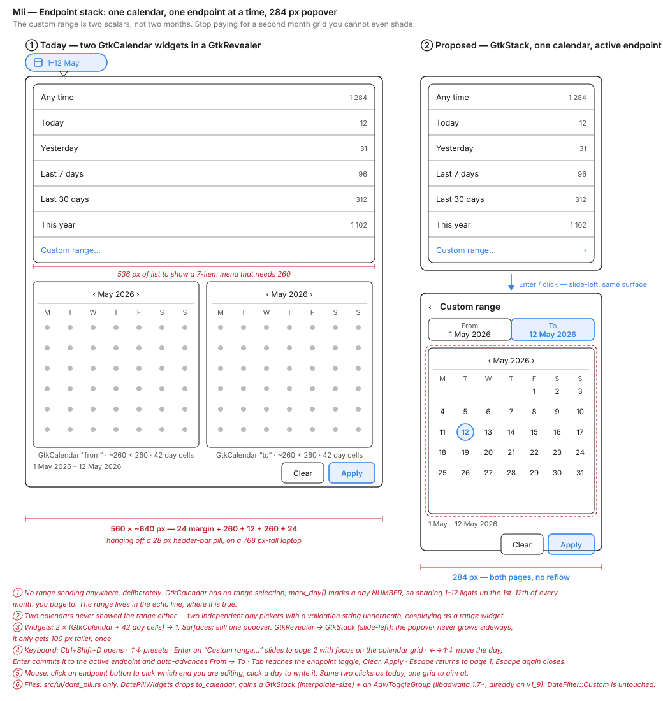
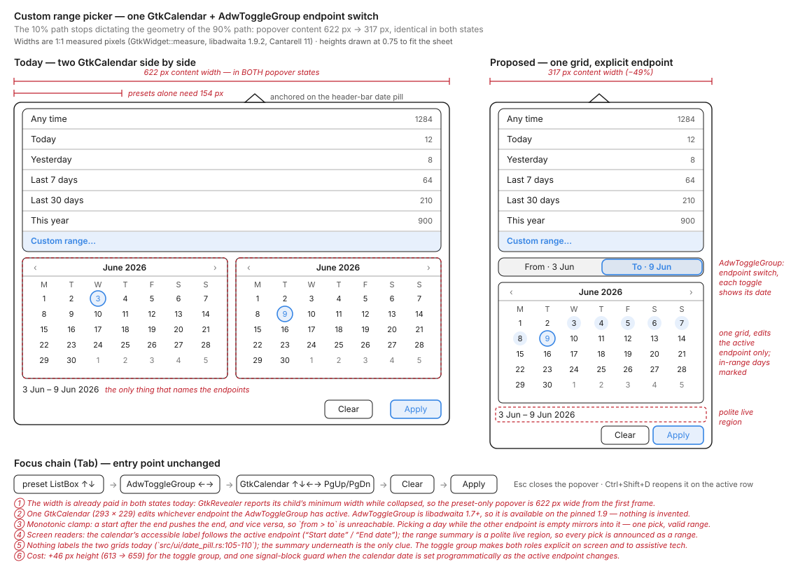
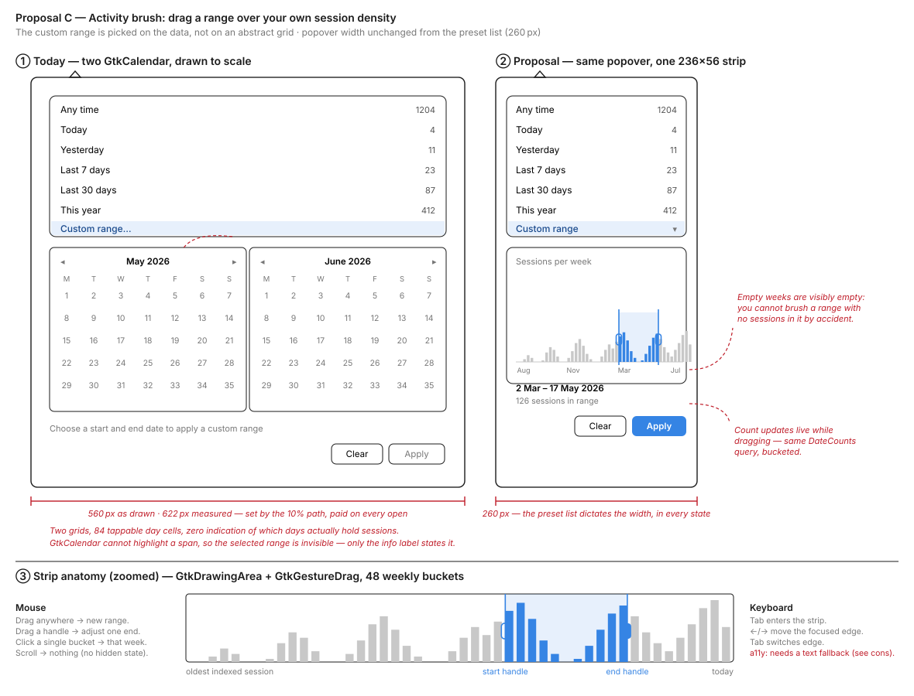
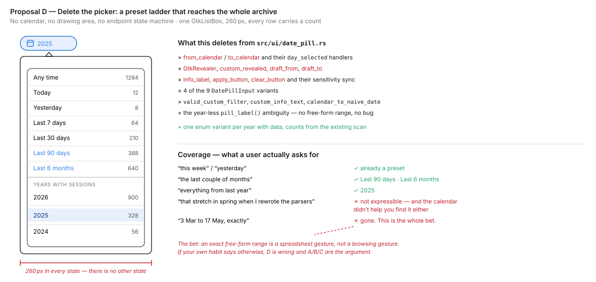

# Custom Range Picker in the Date Pill Popover: Design Exploration

**Date:** 2026-07-25  
**Status:** Decided — Proposal B's mechanic (one `GtkCalendar` + an `AdwToggleGroup` endpoint switch), no range shading, no auto-advance. The container is the one open variable: inline by default, with A's `GtkStack` page swap as the fallback if the 659 px expanded height is squeezed at 768 px.  
**Scope:** Replace the two `GtkCalendar` widgets used to pick a custom date range inside the `DatePill` popover (`src/ui/date_pill.rs`). The preset list itself is not up for debate — it shipped, it works, and it is the 90% path.  
**Source:** Proposals A and B were designed independently by two reviewers (Mii Beta GTK Designer, UI Designer), each producing its own mockup and measurements; the prose for those two sections was written up from their mockups and annotations. Proposals C and D were added to cover the two axes A and B share: C questions whether a calendar grid is the right instrument at all, D questions whether a free-form range earns any pixels.

## Context

The `DatePill` is a header-bar `GtkMenuButton`. Its popover holds a `boxed-list` `GtkListBox` of seven rows — *Any time · Today · Yesterday · Last 7 days · Last 30 days · This year · Custom range…* — each with a session count on the right (`src/ui/date_pill.rs:97`). Activating the last row flips a `GtkRevealer` containing **two side-by-side `GtkCalendar` widgets**, an info label, and *Clear* / *Apply* buttons (`src/ui/date_pill.rs:105`).

That revealer is the subject of this exploration.

### What is actually wrong

**1. The 10% path sets the geometry of the 90% path — and it is paid on every open, not just when expanded.**  
A `GtkCalendar` measures **293 px** minimum under the libadwaita stylesheet. Two of them plus spacing and the popover's margins measures **622 px of content** (`GtkWidget::measure`, Cantarell 11 — see Proposal B and the measurement note below). The preset list alone needs **154 px**.

(154 px is the list's *minimum*, not a comfortable width. Proposals C and D draw the popover at **260 px**, which is a chosen width with room for the count column — the point is that it is chosen, rather than dictated by a calendar.)

The part that is easy to miss: this is not a cost you pay *after* clicking *Custom range…*. `GtkRevealer` with a `SlideDown` transition collapses only along the transition axis. Perpendicular to it, the revealer keeps reporting its child's **full minimum width even while `reveal_child` is false**. So the popover is 622 px wide from the very first frame, before the calendars are ever shown, on every single open. Every user who opens the pill to click *Last 7 days* pays for a picker they never touch, and there is no state in which they don't.

**Every proposal below must be judged against 622 px, not against the expanded state.**

**2. The selected range is invisible in the widget that is supposed to show it.**  
GTK 4's `GtkCalendar` has **no range selection**. It has a single selected day, and `mark_day()`, which takes a *day number*, not a date — marking 1–12 emphasises the 1st through 12th of **every month you page to**. There is no API that renders a span. So the two calendars display 84 day cells, and not one of them tells the user what range is currently drafted. The only feedback is the `info_label` restating it as text (`src/ui/date_pill.rs:112`). Two full month grids are rendered to communicate strictly less than one line of text.

**3. The two-calendar layout was never designed — it is a workaround.**  
The predecessor exploration's chosen mockup (`docs/mockups/date-filter/f-date-pill-progressive-disclosure.svg`) shows **one** calendar with a highlighted span across `Apr 5 – Apr 17`. That is a drawing of something `GtkCalendar` cannot do. The design spec that followed (`docs/superpowers/specs/2026-05-27-date-filter-design.md:25`) resolved the gap by writing "Two `GtkCalendar` side by side". The current widget is the residue of a missing GTK capability, not a decision anyone made on the merits.

**4. The picker is blind to the data.**  
Session counts are already computed per preset in a single scan (`count_all_presets_without_query`, `src/database/mod.rs:696`) and shown on every preset row. The custom picker shows none. A user can carefully pick `3 Feb – 9 Feb` and apply a filter that matches zero sessions, having been given every visual cue that those days are as valid as any other.

**5. Adjacent defect, worth fixing whatever we pick.**  
`DateFilter::pill_label()` formats custom endpoints with `%b %-d` and no year (`src/models/date_filter.rs:91`). A range spanning a year boundary renders as `Dec 28 - Jan 4`, which is ambiguous, and `Jan 4 - Dec 28` of *different* years renders identically to the same-year range.

### What libadwaita 1.9 gives us (verified, not assumed)

Checked against the vendored `libadwaita 0.9.1` source (`adw = { version = "0.9.1", features = ["v1_9"] }`, `relm4 0.11`, `gnome_50`):

- **There is no `AdwCalendar` and no `AdwDatePicker`.** No date or calendar module exists in the crate.
- Available compact building blocks: `AdwEntryRow`, `AdwSpinRow`, `AdwComboRow`, `AdwExpanderRow`, `AdwToggleGroup` / `AdwToggle` (1.7+), `AdwDialog`, `AdwAlertDialog`, plus GTK's `GtkDropDown`, `GtkSpinButton`, `GtkDrawingArea`.
- So any proposal is built either from list-row primitives, or from a custom `GtkDrawingArea`. There is no native range picker to reach for.

### A note on the measurements

The two reviewers first reported different figures for the same widget — a 260 px minimum width for `GtkCalendar` versus 293 px. The discrepancy is not measurement noise, it is a **loaded stylesheet**.

Measured directly under `xvfb`:

```
plain: GtkCalendar min width = 266 px    # Gtk.init() only
adw:   GtkCalendar min width = 293 px    # Adw.init() first
```

So `GtkCalendar` measures 266 px under the plain GTK stylesheet and **293 px once the libadwaita stylesheet is loaded** — which is what this app actually runs. A's 260 px was an estimate close to the plain figure; B's 293 px is the one that matches the shipped app. `293 × 2 + 12 spacing + 24 margins = 622 px`, which is exactly B's measured popover width, so the baseline and the per-widget figure corroborate each other.

**Every figure in this document uses the libadwaita numbers**, since those are the ones the user sees. That means the honest result for Proposals A and B is the *same* ~317 px — A is not 33 px leaner than B; the two were simply measured under different stylesheets.

Worth recording as a trap for the next person who measures a GTK widget in a test harness: call `Adw.init()` before you measure, or every number you write down is ~27 px too small. Reproduction: instantiate a `Gtk.Calendar`, call `Adw.init()` first, present it in a window, then read `measure(HORIZONTAL, -1)`.

### Criteria used to judge the proposals

| # | Criterion |
|---|-----------|
| 1 | **Popover width on the 90% path** — does the preset list still dictate the geometry? |
| 2 | **Is the drafted range visible?** — without reading a label restating it |
| 3 | **Keyboard and screen-reader story** — the pill already has `Ctrl+Shift+D` and full arrow-key traversal |
| 4 | **Cost** — new widgets, custom drawing, new DB queries, new tests |
| 5 | **Data awareness** — can the user apply an empty range without warning? |
| 6 | **Locale and i18n** — date entry and month naming must not assume English or `%m/%d/%Y` |

---

## Proposal A — Endpoint stack: one calendar, one endpoint at a time

*By the Mii Beta GTK Designer reviewer. Pixel figures have been restated in the libadwaita-stylesheet numbers per the note above; the original section quoted 260 px per calendar and a 284 px result.*



*The mockup's own annotations still carry the pre-reconciliation figures (560 px baseline, 284 px result). Read them as 622 px and 317 px; the design is unaffected, only the numbers move.*

### The mechanic

`DateFilter::Custom { from, to }` is two `NaiveDate` scalars. That is the whole payload. `src/ui/date_pill.rs` currently spends two `gtk::Calendar` widgets — two month grids, ~42 day cells each, ~293 px wide each — to collect two integers, inside a `gtk::Revealer` that expands *downward* while the popover's width has already been decided *sideways* by the widest child.

That's the geometry trap. GTK sizes a popover to its content's minimum width. `293 + 12 + 293 + 24` of margins ≈ **622 px wide, ~640 px tall**, anchored to a 28 px header-bar pill. The preset `boxed-list` — the path taken 90% of the time — needs 154. It gets stretched to 598, so a 7-item menu reads like a spreadsheet, and the popover eats most of a 768 px-tall laptop screen. The 10% path is dictating the geometry of the 90% path.

### Why the current thing is wrong

Not because it's ugly. Because it's **conceptually lying**. Two `GtkCalendar`s side by side look like a range widget and mechanically are two independent single-day pickers with a validation string underneath. The range never appears in either grid, because it *can't*: `GtkCalendar` has no range selection, and `mark_day()` marks a day **number** (1–31), so shading 1–12 would light up the 1st–12th of every month you page to. The one piece of information the layout implies it is showing — the span — exists only in `info_label`.

So you are paying 622 px and ~90 widgets for a false promise. Two calendars don't tell the user more than one does; they just cost twice as much and imply a relationship the renderer isn't drawing.

Second smell: the `GtkRevealer` slide-down resizes a native popover surface mid-animation while its width was already inflated at realize time. It looks fine in a screenshot. It feels like the popover is unpacking furniture.

### What it should be

**One page-1 preset list. One page-2 endpoint editor. One calendar. Same width on both pages.**

Replace the `GtkRevealer` with a `GtkStack` (`slide-left-right`, `interpolate-size`) holding two pages of identical width:

- **Page 1** — the existing `boxed-list` of 7 preset rows, unchanged, at its natural width. `Custom range…` grows a `›` chevron, because it now navigates rather than expands.
- **Page 2** — a `‹ Custom range` title row, an **`AdwToggleGroup`** (libadwaita 1.7+; the crate is already on `features = ["v1_9"]`) with two toggles whose `child` is a two-line box (`From` / `1 May 2026`, `To` / `12 May 2026`), then **one** `GtkCalendar`, the range echo line, and Clear/Apply.

The `AdwToggleGroup` names the real mechanic: *which endpoint does the next day click write to*. The calendar's selected day always shows the endpoint being edited — one selection, one highlight, no lie. The span stays in the echo line, where a text label can actually tell the truth. No fake range shading anywhere.

### Interaction

**Mouse** — click `Custom range…`, the page slides left. Click `From` or `To` to choose the endpoint, click a day to write it. Setting `From` auto-advances the group to `To`, so the common path is still exactly two clicks in one grid instead of two clicks across two grids.

**Keyboard** — `Ctrl+Shift+D` opens; `↑↓` walks presets (unchanged — `focus_current_row_when_ready()` still applies); `Enter` on `Custom range…` slides to page 2 and focuses the calendar's day grid; `←→↑↓` moves the day, activation commits it to the active endpoint and auto-advances; `Tab` reaches the toggle group, Clear, Apply; `Escape` returns to page 1, `Escape` again closes the popover.

Two things to verify on a real build rather than assume: whether `GtkCalendar`'s day grid commits on `Enter`, `Space`, or both (the auto-advance hangs off that signal), and that a `GtkShortcutController` on page 2 swallows the first `Escape` before `GtkPopover`'s autohide does.

> **This is the one place A is probably wrong.** `GtkCalendar` emits `day-selected` on *every* arrow keypress — that is the only per-day signal it has. So "activation commits and auto-advances" needs a custom key controller on top of the grid, or the endpoint flips mid-navigation for keyboard users. Proposal B refuses auto-advance for exactly this reason. See *Where A and B disagree* below.

### What it costs

| | Today | Proposed |
|---|---|---|
| Popover width | **622 px** | **317 px** (both pages) |
| Popover height | ~640 px | 304 px → 404 px, once, animated |
| Render surfaces | 1 popover | 1 popover |
| `GtkCalendar` instances | 2 (~84 day cells) | 1 (~42 day cells) |
| Files touched | — | `src/ui/date_pill.rs` only |

`DatePillWidgets` drops `to_calendar`, swaps `custom_revealer` for a `GtkStack`, gains the `AdwToggleGroup`. `DatePillInput` keeps `CustomFromPicked` / `CustomToPicked`, but they are now emitted by one `connect_day_selected` routed through the active endpoint, plus one new `ActiveEndpointChanged`. `DateFilter`, `valid_custom_filter`, and every existing unit test survive untouched; the two `#[gtk::test]` helpers that walk the tree for a `GtkRevealer` become `GtkStack` lookups.

Narrow widths: a 317 px popover fits the header bar at every width the app supports, which the 622 px one does not. That alone is the argument.

### Pros / cons

| Pros | Cons |
|---|---|
| The 90% path gets its natural width back | Two clicks now live on one grid — a user who wanted to *see* both months side by side loses that |
| Halves the day-cell widget count | Adds a navigation concept (page 2 + back) to a popover that had none |
| Names the real mechanic: active endpoint, not "two calendars" | Needs an explicit `Escape`-to-page-1 shortcut controller, or `Escape` closes the whole popover and drops the draft |
| No fake range shading, so nothing lies about what GTK can draw | Cross-month ranges require paging the single calendar (2 clicks on `‹`), where two calendars sometimes showed both months at once |
| One resize on one axis instead of an inflated-then-growing surface | `AdwToggle::child` two-line content needs a CSS pass so the toggle doesn't look taller than a stock segmented control |
| Fits in `date_pill.rs` alone; no new component, no new model state | Auto-advance is a behavior users must discover — and, per the caveat above, may not be implementable on `day-selected` alone |

---

## Proposal B — one `GtkCalendar` + an `AdwToggleGroup` endpoint switch

*By the UI Designer reviewer.*



*The shading shown in the grid is the optional refinement discussed below, not part of the first pass. Widths are 1:1 measured pixels (`GtkWidget::measure`, libadwaita 1.9.2, Cantarell 11); heights are compressed 4:3 to fit the sheet.*

### Current-state assessment

`src/ui/date_pill.rs:105-110` puts two `GtkCalendar` widgets in a horizontal box inside the `GtkRevealer`. Measured with `GtkWidget::measure` under libadwaita 1.9.2 / Cantarell 11:

| Surface | Content width | Content height |
|---|---|---|
| Preset `boxed-list` alone | **154 px** | 272 px |
| Popover today, custom range collapsed | **622 px** | 296 px |
| Popover today, custom range revealed | **622 px** | 613 px |

The width problem is worse than "the popover gets wide when you open the custom range": `GtkRevealer` reports its child's minimum width even while collapsed, so **the popover is 622 px wide from the first frame**. Every preset click pays for a picker that is used rarely. At the narrow breakpoint a 622 px popover no longer fits its window, so GTK shrinks and repositions it, clipping the grids.

Second, unrelated defect in the same code: neither grid is labelled. The only thing distinguishing start from end is the summary label underneath, and nothing at all distinguishes them for a screen reader.

### Recommendation

Replace the two grids with **one `GtkCalendar` plus an `AdwToggleGroup` of two toggles that selects which endpoint the grid is editing**. Each toggle carries its own date (`From · 3 Jun` / `To · 9 Jun`), so both endpoints stay readable while only one grid is rendered.

Resulting geometry: **317 px content width, in both popover states** — a 49% reduction, and the reveal no longer changes the width at all, which removes the reveal-time repositioning risk from the horizontal axis entirely. Height grows 613 → 659 px (+46 px for the toggle group); that is the price paid.

HIG basis and precedent:

- **Progressive disclosure, one thing at a time.** GNOME date pickers show a single month grid: Files' search popover pairs a preset list with one grid, Calendar's date navigation popover shows one month, Clocks and Software never show two. Two side-by-side month grids is a web-booking pattern, not a GNOME one — it is the only part of Variant F that was never grounded in precedent.
- **`AdwToggleGroup`** (libadwaita 1.7) is the modern replacement for hand-linked toggle buttons and is available on the pinned `adw = { version = "0.9.1", features = ["v1_9"] }`. The sort-options proposal uses the same widget for Ascending/Descending, so the popover vocabulary stays consistent.
- No invented widget: there is no public `AdwCalendar`, and `GtkCalendar` has no range selection. Range semantics stay in `DatePill`, exactly as the frozen spec already says.

Deviation from the predecessor exploration's open question #1 ("custom range opens a popover anchored on the row"): rejected. A popover inside a popover, or an `AdwDialog` over the header bar, adds a surface and a dismissal ambiguity (Esc closes which one?) to save 163 px. Staying inside the existing `GtkRevealer` keeps one surface and one focus chain.

### Interaction, keyboard, and accessibility

- Activating *Custom range…* reveals the section, sets the active endpoint to **From**, and focuses the calendar.
- The calendar writes to whichever endpoint is active. **Monotonic clamp:** setting the start after the end pushes the end forward, setting the end before the start pulls the start back. `from > to` becomes unreachable, so the error branch of `custom_info_text` is dead by construction.
- Picking a day while the *other* endpoint is empty mirrors the date into it. One interaction therefore always yields a valid single-day range; extending it is one toggle away.
- **No auto-advance from From to To.** `GtkCalendar` emits `day-selected` on every arrow keypress, so auto-advancing would flip the endpoint on the first arrow press. Explicit switching is the keyboard-safe choice, and it costs the pointer user one click.
- Focus order: preset `GtkListBox` (↑↓) → `AdwToggleGroup` (←→) → `GtkCalendar` (↑↓←→, PgUp/PgDn for months) → *Clear* → *Apply*. Esc closes the popover; `Ctrl+Shift+D` reopens on the active row. Unchanged from today apart from the toggle group insertion.
- **Screen readers:** the calendar's accessible label follows the active endpoint (`Start date` / `End date`) via `update_property(Label, …)` — this is what fixes the unlabelled-grid defect. Each toggle's label already names its role and its value. The summary label becomes a polite live region (`accessible-live`), so every pick is announced as a resolved range rather than a bare date.
- **High contrast and large text:** the active toggle is identified by libadwaita's own toggle styling, not a custom colour, so it survives high contrast. At large text the toggle group only grows in height; the 293 px calendar is the width floor either way — with two grids, large text pushed the popover past 700 px.
- **Reduced motion:** unchanged. The revealer transition is the only animation, and its width no longer changes.

### On shading the drafted range (the `mark_day` question)

`gtk_calendar_mark_day()` takes a day *number*, not a date, and marks persist across month changes. Marking 3–9 for a June range does light up 3–9 in July when the user pages forward. That is a real defect, not a cosmetic one: it asserts a selection that does not exist.

The position taken here: **the shading is deferred out of the first pass**, and if it is ever added it must re-mark, not be left as-is.

- Making it correct is cheap and bounded: clear and rebuild the marks in `sync_custom_state`, plus one handler on `notify::month` / `notify::year` that calls the same routine. `clear_marks()` then at most 31 `mark_day()` calls, only for the intersection of the draft range with the visible month. Roughly 15 lines and O(31) per month page — not a perf concern.
- What re-marking still cannot fix is the honesty gap: `mark_day` renders one flat style, so interior days, the start, and the end all look alike, and only the *active* endpoint gets the calendar's own selection ring. A range spanning months therefore has no on-screen anchor for its far endpoint inside the grid. The **toggle labels are the truth** about the drafted range; marks would only ever be a hint about the visible month.
- Since the toggles already carry both dates unambiguously, the shading buys decoration in exchange for a stateful invariant that must be maintained in two places. Not worth it in v1.

So: same outcome as Proposal A's refusal, different reason. It is not that correct shading is impossible — it is that even correct shading is redundant here, while incorrect shading actively lies. If a later pass wants it, the acceptance test is: draft 3–9 June, page to July, confirm no marks; page back, confirm marks return.

### Adaptive behaviour

- **Wide:** identical to today, minus 305 px of popover width.
- **Narrow (360 px class window):** 317 px content plus popover chrome fits with margin; 622 px does not. This is what makes the custom range usable at the narrow breakpoint the predecessor exploration explicitly accepted as a risk.

### Implementation sketch (Relm4)

Only `src/ui/date_pill.rs` changes. No new CSS; reuse `boxed-list`, `dim-label`, `suggested-action`.

- New `#[derive(Debug, Clone, Copy, PartialEq)] enum RangeEndpoint { Start, End }`. `DatePill` gains `active_endpoint: RangeEndpoint` and a `Cell<bool>` (or a stored `SignalHandlerId`) to suppress the feedback loop when the calendar date is set programmatically.
- `DatePillWidgets`: drop `from_calendar` / `to_calendar`, add `calendar: gtk::Calendar` and `endpoint_toggles: adw::ToggleGroup` (two `adw::Toggle`). `info_label` and `apply_button` keep their roles.
- `DatePillInput`: replace `CustomFromPicked(NaiveDate)` / `CustomToPicked(NaiveDate)` with `CustomDayPicked(NaiveDate)` and `CustomEndpointChanged(RangeEndpoint)`. `CustomApplyClicked`, `CustomClearClicked`, and `PresetSelected` are untouched; `DatePillOutput`, `DateFilter`, and the SQL layer are untouched.
- `sync_custom_state` grows to: set both toggle labels, set the toggle group's active index, set the calendar's day (guarded) and its accessible label, set the summary text, set Apply sensitivity.
- Docs: `docs/superpowers/specs/2026-05-27-date-filter-design.md` has a frozen row reading *"Custom range picker — two `GtkCalendar` side by side"* that this supersedes.

**Complexity: small.** One file, roughly the same widget count, one signal guard.

### Verification

Run with `--sessions-dir tests/fixtures`, then: reveal the custom section and confirm the popover width does not change; pick a start after the current end and confirm the end is pushed rather than an error appearing; pick one day and confirm Apply becomes sensitive immediately; traverse the whole section with Tab and arrows only; run at 200% text scale and in high contrast; resize to the narrow breakpoint and confirm the popover still fits. Unit-testable without a display: the clamp function and `valid_custom_filter`. `#[gtk::test]`: the toggle group has two toggles, and `CustomEndpointChanged` moves the calendar to that endpoint's date without re-emitting `CustomDayPicked`.

### Pros and cons

| Pros | Cons |
|---|---|
| 622 → 317 px content width, identical in both popover states (measured) | +46 px height for the toggle group |
| Kills the reveal-time width jump and the narrow-breakpoint clipping | One extra click for pointer users, since there is no auto-advance |
| Fixes the unlabelled-grid defect for sighted and screen-reader users alike | Only one endpoint's month is visible at a time — comparing two distant months needs navigation |
| The clamp makes `from > to` unreachable, deleting a whole error state | Needs a signal guard around programmatic `select_day` |
| Pure libadwaita/GTK, no new CSS, one file, small diff | `AdwToggleGroup` requires libadwaita ≥ 1.7 (satisfied; would block a downgrade) |
| Keeps the presets visible while picking, per the predecessor exploration's decision | **659 px tall** when expanded — on a 768 px laptop screen, minus header bar and shell chrome, that is at or past the limit. This is the one place A's page swap is clearly safer |

---

## Proposal C — Activity brush (creative)

Stop picking dates. Pick a **region of your own history**.

The revealer holds a single **236 × 56 px `GtkDrawingArea`**: a bar per week (per month if the history exceeds two years) spanning from the oldest indexed session to today, bar height proportional to session count. Drag across it to set the range. The brushed span fills with the accent colour; two handles let you nudge either edge afterwards. Below it, one line: `2 Mar – 17 May 2026` and `126 sessions in range`, both updating live during the drag.



### Why this is not just a smaller calendar

A calendar grid is a **coordinate system**. It answers "where is 17 May?" — a question the user can already answer. It cannot answer "where did I actually work?", which is the question someone browsing an AI-session archive is really asking. Nobody opens Sessions Chronicle thinking *3 March to 17 May*; they think *that stretch in spring when I was rewriting the parsers*. The brush is addressable by that thought. The calendar is not.

It also fixes defect **2** and defect **4** in the same stroke: the range is a filled region you can see, and empty weeks are visibly empty, so an empty range is not something you can select by accident — the flat stretch is right there under the cursor.

### Interaction

**Mouse** — drag anywhere sets a new range (`GtkGestureDrag`). Drag a handle adjusts one edge. A single click selects that one bucket. Scroll does nothing: no zoom, no pan, no hidden state off-screen. The whole history is always on screen, which is the point.  
**Keyboard** — `Tab` enters the strip, `←`/`→` move the focused edge one bucket, `Tab` switches which edge has focus, `Shift`+`←`/`→` slides the whole window keeping its length, `Enter` applies.  
**Snapping** — endpoints snap to bucket boundaries. A weekly bucket means the finest custom range is one week. That is a real limitation, and the honest answer is that day-level precision is already covered by *Today* and *Yesterday*; what presets do not cover is arbitrary multi-week spans, which is exactly what the brush is good at.

### Cost

- One `GtkDrawingArea` and one `GtkGestureDrag` replace two `GtkCalendar`s. Render surface goes *down*: 84 day cells and two month-navigation headers become one snapshot of ~48 rects.
- One new query: the existing preset-count SQL becomes a sibling `GROUP BY strftime('%Y-%W', last_updated, 'unixepoch', 'localtime')` over the same `WHERE` clause. Same table, same predicate, same single scan shape as `count_all_presets_without_query`. It must honour the active assistant and project filters, like the preset counts do.
- New: hit-testing, focus drawing, high-contrast and dark-theme colours for the bars, and a real accessibility fallback.

### Trade-offs

| Pros | Cons |
|------|------|
| Popover stays **260 px** — the preset list dictates the width, as it should | A `GtkDrawingArea` has **no accessibility for free**. Screen readers get nothing unless we build it: `AccessibleRole::Slider` on each edge with `value-now` announcements, and realistically a two-`AdwSpinRow` text fallback for the endpoints — which means shipping *both* affordances |
| The drafted range is **visible as a region**, not restated in a label | Custom hit-testing, custom keyboard handling, custom theming — the exact "custom widget" cost that got Variants C/D/E rejected in the 2026-05-26 exploration |
| **Empty ranges become obviously empty** before you apply them | Weekly snapping: no day-precise custom range |
| Live session count during the drag, from infrastructure that already exists | Needs a second DB query and a cache-invalidation story on reindex |
| Doubles as a glance at your own activity history — the filter teaches you something | Degenerate cases need designing: a brand-new install with 3 sessions in one week, or a five-year archive |
| Render surface strictly smaller than today's | Precision drag on a 236 px strip is fiddly with a trackpad; the handles are the mitigation, not a cure |

**Honest verdict on C:** the interaction is right and the width story is the best of any option, but it is the most expensive proposal and the only one that *creates* an accessibility obligation instead of inheriting one. It is the right answer if the brush is treated as the primary affordance with a text fallback beside it — and the wrong answer if the fallback gets deferred.

---

## Proposal D — Delete the picker, extend the preset ladder

The only proposal that questions whether a free-form range earns any pixels at all.

Remove the custom range entirely. In its place, extend the list: *Last 90 days*, *Last 6 months*, then a labelled group of **one row per year that actually has sessions** — `2026 · 900`, `2025 · 328`, `2024 · 56` — generated from the index, not hardcoded. *This year* disappears because `2026` is the same row, stated less ambiguously.



### Why it deserves a slot in this exploration

Every other proposal accepts the premise that the user needs to name two arbitrary dates, and then argues about how to make naming them cheaper. That premise is worth one paragraph of scrutiny, because the picker is expensive: `from_calendar`, `to_calendar`, the revealer, `draft_from`, `draft_to`, `custom_revealed`, `info_label`, the two action buttons and their sensitivity sync, four of the nine `DatePillInput` variants, and three free functions (`valid_custom_filter`, `custom_info_text`, `calendar_to_naive_date`). D deletes all of it and the year-less `pill_label()` ambiguity along with it — you cannot render a cross-year range ambiguously if you cannot express one.

What replaces it is one enum variant taking a year, and count columns from the same scan that already feeds the preset rows. Every row shows a count, so **no row in the popover can ever be a dead end** — the *"pick an empty range"* defect becomes structurally impossible rather than merely visible.

### The bet, stated plainly

| What the user asks for | Covered? |
|---|---|
| "this week", "yesterday" | already a preset |
| "the last couple of months" | *Last 90 days* / *Last 6 months* |
| "everything from last year" | `2025` |
| "that stretch in spring when I rewrote the parsers" | **No** — but the two calendars never helped find it either |
| "3 Mar to 17 May, exactly" | **No.** This is the whole bet. |

An exact free-form range is a spreadsheet gesture, not a browsing gesture. If that reading of your own habits is wrong, D is wrong, and A/B/C are the argument.

### Trade-offs

| Pros | Cons |
|------|------|
| **260 px in every state — there is no other state.** No revealer, so nothing to inflate the minimum width | Loses arbitrary ranges outright. Irreversible in the user's perception: removing a shipped capability reads as a regression even when the replacement covers more ground |
| Net **negative** diff. Fewer widgets, fewer states, fewer tests, and one existing bug deleted rather than fixed | The year group grows without bound on a long-lived archive; needs a scroll or a cap after ~5 years |
| Every row carries a count — an empty selection is unreachable, not merely discouraged | Year rows are data-dependent, so the popover's row count varies between installs, which makes shortcut/index-based row logic (`current_row_index`) more fiddly, not less |
| No new widget vocabulary, no custom drawing, no accessibility work — inherits the `GtkListBox` story wholesale | Coarse: no way to isolate a single fortnight |
| Fixes the `pill_label()` cross-year ambiguity by removing its cause | If the answer later turns out to be "we do need ranges", this work is thrown away rather than built on |

**Honest verdict on D:** the strongest cost argument and the weakest capability argument. Worth adopting the *additive* half regardless of which proposal wins — *Last 90 days*, *Last 6 months*, and per-year rows are cheap, useful, and orthogonal to the picker question.

---

## Comparison

| Criterion | A · Endpoint stack | B · Endpoint toggle, inline | C · Activity brush | D · Preset ladder |
|---|---|---|---|---|
| **Popover width, 90% path** | 317 px (−49%) | 317 px (−49%) | 260 px | 260 px |
| **Popover height, expanded** | 404 px (page swap, not growth) | 659 px (+46 px) | ~490 px | unchanged, 296 px |
| **Drafted range visible?** | ❌ Echo line only, deliberately | ❌ Echo line + both toggle labels; shading deferred | ✅ As a filled region | n/a — no range to draft |
| **Which endpoint am I editing?** | ✅ Explicit toggle | ✅ Explicit toggle, with values on the buttons | ✅ Both handles visible at once | n/a |
| **`from > to` reachable?** | ⚠️ Guarded on apply, as today | ✅ Unreachable by construction (monotonic clamp) | ✅ Unreachable — a brush has no order | n/a |
| **Keyboard** | ⚠️ Full, inherited — but auto-advance needs a custom key controller | ✅ Full, inherited, no auto-advance | ⚠️ Entirely bespoke | ✅ Full, inherited |
| **Screen reader** | ✅ Inherited from `GtkCalendar` | ✅ Inherited + active-endpoint label + polite live region | ❌ **Must be built** — `AccessibleRole::Slider` per edge, plus a text fallback | ✅ Inherited from `GtkListBox` |
| **Data awareness** | ❌ None | ❌ None | ✅ Empty ranges are visibly empty | ✅ Every row carries a count |
| **Locale** | ✅ `GtkCalendar` handles it | ✅ `GtkCalendar` handles it | ⚠️ Axis month abbreviations need localizing | ✅ Numerals + translated strings only |
| **New code** | `GtkStack` + `AdwToggleGroup`, −1 calendar | `AdwToggleGroup` + signal guard, −1 calendar | `GtkDrawingArea` + gestures + a new bucketed query + a11y | **Net deletion** |
| **Risk** | Low | Lowest | High | Low, but removes a shipped capability |

### Where A and B agree, and where they don't

The two GTK reviewers worked independently and **converged on the same core mechanic**: drop the second grid, use an `AdwToggleGroup` to name which endpoint the single grid writes to, and keep the true range in a text echo. That convergence is the most useful result in this exploration — it is very likely the right shape, and it was not coordinated.

They also converge, for *different* reasons, on **not shading the range in the grid**:

- A refuses on the grounds that `mark_day()` takes a day *number*, so any shading is wrong the moment the user pages to another month. A grid that highlights the wrong days is worse than one that highlights nothing.
- B agrees the naive version lies, notes that a correct version is cheap and bounded (~15 lines: rebuild marks on `notify::month` / `notify::year`), and then rejects it anyway as **redundant**: `mark_day` renders one flat style, so start, end, and interior days look identical, and the toggle labels already carry both dates unambiguously. Correct shading buys decoration in exchange for a stateful invariant maintained in two places.

That is a stronger conclusion than either alone: it is not merely that shading is *hard to get right*, it is that even the correct version earns little. **No shading in v1.** If a later pass wants it, the acceptance test is: draft 3–9 June, page to July, confirm no marks; page back, confirm marks return.

Two genuine differences remain.

**1. Container — a stack page (A) or an inline reveal (B).**  
A slides to a second page, so the popover swaps content instead of growing: it lands at ~404 px tall and never grows sideways. B reveals below the presets, keeping them in view, which is what the predecessor exploration asked for. B's cost is height: **659 px**. On a 768 px-tall laptop, minus a header bar and shell chrome, that popover is at or past the limit and GTK will start squeezing it. There is also a dismissal difference: with A, `Escape` has two meanings (leave page 2, then close) and needs an explicit `GtkShortcutController` to disambiguate; with B, `Escape` means one thing. **A's geometry is safer, B's dismissal is simpler.** This is measurable in the real app, so it should be measured rather than argued.

**2. Auto-advance From → To — and here A is probably wrong.**  
A wants the endpoint to auto-advance once the start is committed, so the common path stays two clicks. B refuses, because `GtkCalendar`'s only per-day signal is `day-selected`, and it fires on **every arrow keypress** — a keyboard user navigating from 3 June to 9 June would flip the active endpoint on the first press. A's own section flags this as something to verify rather than assume, and the verification comes out against it: making auto-advance safe requires a custom key controller layered over the grid to distinguish "navigating" from "committing". That is real work in service of saving pointer users one click. **Take B's explicit switching**, and revisit auto-advance only if the extra click turns out to grate.

### One number that had to be reconciled

A originally reported 284 px and B reported 317 px for the same widget. That gap was **not** a design difference — it was the libadwaita stylesheet, confirmed by direct measurement (see *A note on the measurements*). Both proposals land on the same ~317 px, and the table above quotes the reconciled figure for both.

## Decision

**Taken 2026-07-25. Proposal B's mechanic ships.** The two reviewers converged on it independently, which is the strongest signal available here, and it is also the smallest diff.

### What is settled

1. **One `GtkCalendar` plus an `AdwToggleGroup` endpoint switch.** The second grid goes away. The toggle names the real mechanic — which endpoint the next day click writes to — and carries both dates, so both endpoints stay readable while only one grid renders. Content width drops 622 → 317 px, in *both* popover states.
2. **B's correctness extras are part of the deal, not optional polish.** The monotonic clamp (setting the start after the end pushes the end, and vice versa), which makes `from > to` unreachable and lets the *"Start date must be on or before end date"* branch of `custom_info_text` be deleted; empty-endpoint mirroring, so one click already yields a valid single-day range and *Apply* is live immediately; the calendar's accessible label following the active endpoint (`Start date` / `End date`), which is what fixes the unlabelled-grid defect; and the range summary as an `accessible-live: polite` region.
3. **No range shading in v1.** Both reviewers land here independently, and for reasons that compound: `mark_day()` takes a day *number*, so naive shading lies the moment the user pages months, and even the corrected version renders one flat style in which start, end, and interior days are indistinguishable. The range lives in the toggle labels and the echo line, where text can state it truthfully. If a later pass wants shading, the acceptance test is: draft 3–9 June, page to July, confirm no marks; page back, confirm marks return.
4. **No auto-advance From → To.** This is a feasibility call, not a preference. `GtkCalendar`'s only per-day signal is `day-selected` and it fires on *every* arrow keypress, so auto-advance would flip the active endpoint mid-navigation for keyboard users. Making it safe needs a custom key controller layered over the grid, which is real work to save pointer users one click. Revisit only if the extra click turns out to grate.

### The one open variable: the container

**Default to B's inline reveal**, keeping the existing `GtkRevealer` and the predecessor exploration's "single surface" decision. Then measure: build it, run at 768 px, and check whether the **659 px** expanded popover is squeezed once the header bar and shell chrome are subtracted.

If it is, swap the container for **A's `GtkStack` page swap** — same mechanic, ~404 px tall because page 2 does not stack on top of the 272 px preset list, and A's mockup already specifies it. Budget two things if you go that way: an explicit `GtkShortcutController` so the first `Escape` returns to page 1 instead of closing the popover and dropping the draft, and a CSS pass on `AdwToggle::child` so the two-line toggle content does not tower over a stock segmented control.

This is deliberately left to measurement rather than argued. A's geometry is safer, B's dismissal semantics are simpler, and the deciding number is one `flatpak-builder --run` away.

### Adopted alongside, independent of the picker

5. **D's additive half.** *Last 90 days*, *Last 6 months*, and one row per year that has sessions — generated from the index, with counts, replacing *This year* since `2026` says the same thing less ambiguously. Cheap, orthogonal, and covers most of what a free-form range gets used for. Cap or scroll the year group once an archive passes ~5 years.
6. **Fix `pill_label()`.** Include the year when a custom range spans one (`src/models/date_filter.rs:91`). Today `Dec 28 - Jan 4` is ambiguous, and a cross-year range renders identically to a same-year one. A live defect, independent of everything above.
7. **Amend the frozen spec.** `docs/superpowers/specs/2026-05-27-date-filter-design.md:25` reads *"Custom range picker — two `GtkCalendar` side by side"*. This exploration supersedes that row.

### Rejected, and why

**C (activity brush) is not rejected on merit.** It has the best width story of the four, it is the only proposal in which an empty range is impossible to pick by accident, and it is the only one that answers *"where did I actually work?"* rather than *"where is 17 May?"* — which is closer to the question someone browsing a session archive is really asking. It is rejected for this iteration because it is the only proposal that **creates** an accessibility obligation instead of inheriting one: a `GtkDrawingArea` gets nothing for free, so it would need `AccessibleRole::Slider` per edge with value announcements *and* a text fallback, meaning two affordances shipped in parallel. That is a feature, not a widget swap. Worth its own issue if a density strip ever earns a place elsewhere in the app — at which point the custom range gets it for free.

**D's subtractive half is rejected.** Deleting free-form ranges outright has the strongest cost argument in the document and the weakest capability argument, and removing a shipped capability reads as a regression even when the replacement covers more ground. Its additive half is adopted above.

### Verification before the PR

Run with `--sessions-dir tests/fixtures`, then: reveal the custom section and confirm the popover width does not change; pick a start after the current end and confirm the end is pushed rather than an error appearing; pick one day and confirm *Apply* becomes sensitive immediately; traverse the whole section with `Tab` and arrows only; run at 200% text scale and in high contrast; resize to the narrow breakpoint and confirm the popover still fits; and measure the expanded height at 768 px, which is the input to the container decision. Unit-testable without a display: the clamp and `valid_custom_filter`. `#[gtk::test]`: the toggle group has two toggles, and `CustomEndpointChanged` moves the calendar to that endpoint's date without re-emitting `CustomDayPicked`.

Next step: a design spec under `docs/superpowers/specs/`, then an implementation plan.
