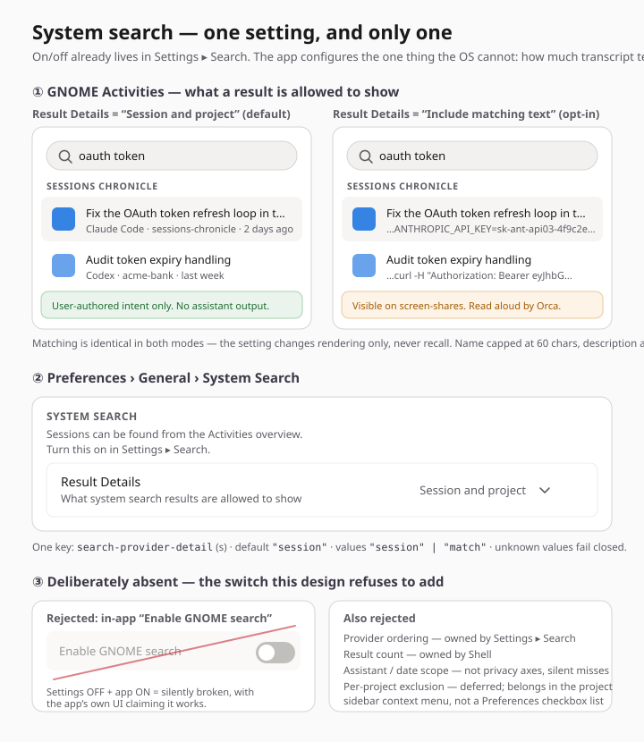
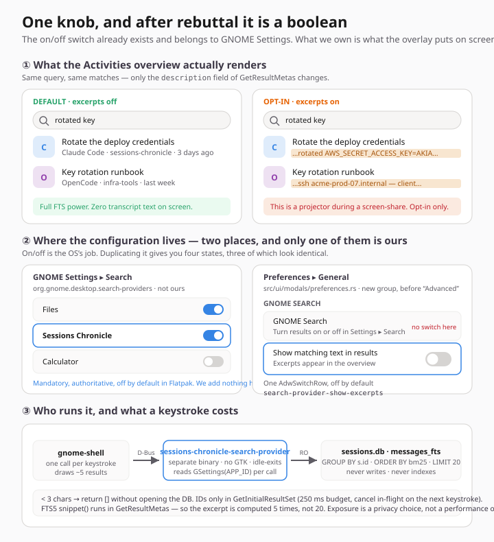
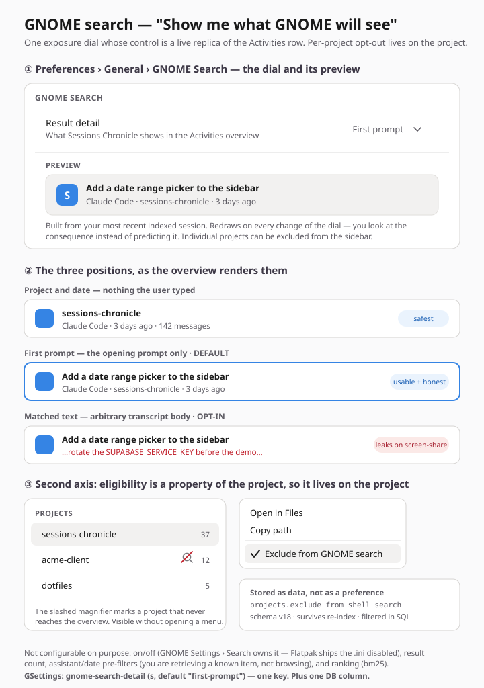

# GNOME Activities search — what should be configurable — Exploration

**Date**: 2026-08-01  
**Last reviewed**: 2026-08-02 — ground facts and packaging deltas refreshed after [PR #200](https://github.com/supermaciz/sessions-chronicle/pull/200) shipped the deep-link prerequisite.  
**Status**: **Proposed** — recommendation in [Recommendation](#recommendation), pending sign-off. Unblocked, not signed off: #197 removed a blocker, it is not an adoption of this doc's recommendation.  
**Issue**: [#189 — feat: expose session search in GNOME Activities](https://github.com/supermaciz/sessions-chronicle/issues/189)  
**Depends on**: #188 (closed — `sort-order`) · #197 (closed — deep-link transport, [PR #200](https://github.com/supermaciz/sessions-chronicle/pull/200))  
**Related**: [`docs/GNOME_DESKTOP_INTEGRATION.md`](../GNOME_DESKTOP_INTEGRATION.md) — the packaging baseline, and where the search provider was first sketched as an optional GNOME service.  
**Related**: [`docs/superpowers/specs/2026-08-01-deep-link-session-design.md`](../superpowers/specs/2026-08-01-deep-link-session-design.md) — the `open-session` contract this provider invokes, and the source of the activation-failure behaviour.  
**Scope of this doc**: not the search provider itself, but the question the issue leaves open — **what is configurable, where does that configuration live, and what are the defaults?**

---

## Problem

Issue #189 adds an `org.gnome.Shell.SearchProvider2` implementation so indexed sessions appear in GNOME Activities. The issue lists *"provider-specific preferences"* as out of scope for v1, but that is only tenable if the hard-coded behaviour is right for everyone — and here it is not, for one specific reason.

The corpus behind this provider is **full AI-assistant transcript bodies**: pasted API keys, client names, absolute paths with usernames in them, `.env` dumps, stack traces naming internal services. `GetResultMetas` returns a `description` string that GNOME Shell renders as the result subtitle, in the **Activities overview** — the most screen-shared, most shoulder-surfed, most projected surface on the desktop. It is also read aloud by Orca, so "it only flashes briefly" is not true for every user.

That is what makes "la recherche dans GNOME doit être configurable" a requirement rather than a preference. The question is which axis, and how many knobs.

## Ground facts the three proposals reason from

- **Flatpak exports `share/gnome-shell/search-providers/*.ini` marked disabled.** GNOME Settings ▸ Search therefore already gives every user a mandatory per-app on/off switch and drag-to-reorder, backed by `org.gnome.desktop.search-providers`. That switch is authoritative — when it is off, Shell never opens the D-Bus connection at all. ([Flatpak conventions](https://docs.flatpak.org/en/latest/conventions.html)) Confirmed against the five providers installed on this machine (Alpaca, Bazaar, Devtoolbox, Icon Library, Cartridges): **all five** set `DefaultDisabled=true`, and all five point `DesktopId` at the main application desktop file even when the provider owns a separate bus name.
- Shell calls `GetInitialResultSet` / `GetSubsearchResultSet` **on every keystroke**; handlers must be async, bounded, and cancellable. ([Writing a Search Provider](https://developer.gnome.org/documentation/tutorials/search-provider.html))
- The existing search path, `search_sessions_with_query` (`src/database/mod.rs:453`), selects 22 columns, joins `messages_fts → messages → sessions`, and dedupes to sessions in Rust with a `HashSet` **after** materialising every matching message row. Fine for a deliberate in-app search, wrong for a per-keystroke path.
- GSettings today (`data/dev.maciz.sessionschronicle.gschema.xml.in`): `window-width`, `window-height`, `is-maximized`, `resume-terminal`, `sort-order`. Nothing else.
- Preferences is one `adw::PreferencesPage` titled *General*, with groups *Session Resumption* and *Advanced* (`src/ui/modals/preferences.rs`).
- **Deep-linking exists** as of [#197](https://github.com/supermaciz/sessions-chronicle/issues/197) / [PR #200](https://github.com/supermaciz/sessions-chronicle/pull/200) ([design spec](../superpowers/specs/2026-08-01-deep-link-session-design.md)). The app assigns `APP_ID` and is unique by default, ships `DBusActivatable=true` and a per-profile D-Bus service file, and exposes a **private stateless GApplication action `open-session`** taking one string parameter (the exact `sessions.id`). The provider activates it through `org.freedesktop.Application.ActivateAction`. A public `--session <id>` CLI and a `sessions-chronicle:` URI scheme were both **explicitly rejected as non-goals** — their absence is a decision, not a gap. Failure is non-destructive and toast-based: unknown/empty/subagent ID → *Session not found*; database absent → *Sessions are not indexed yet*; SQLite error → *Could not open session*. **The largest hidden cost in #189 is therefore already paid**; what remains is the provider process and its query path. Two constraints follow for #189: (a) the provider must return only top-level IDs (`s.is_subagent = 0`), because a subagent ID resolves to a toast rather than a session; and (b) an instance launched with `--sessions-dir` is `NON_UNIQUE`, owns no bus name, and cannot receive `open-session` — fixture instances are unusable for activation testing.
- **Concurrent reads are already safe.** `SessionIndexer::new` sets `journal_mode=WAL` (`src/database/indexer.rs:284`) and `open_connection` sets a five-second busy timeout (`src/database/mod.rs:28-30`). A second reader process running alongside incremental indexing needs no new concurrency mechanism. The `SQLITE_BUSY` concern in the body of #189 is stale.

## Where all three proposals agree

Independently, and this is the strongest signal in the exploration:

1. **Do not ship an in-app "Enable GNOME search" switch.** The OS owns on/off, ours could only ever return an empty result set, and three of the four states in the two-switch truth table render identically. A switch whose *On* position produces nothing is a switch that lies.
2. **The real axis is exposure** — how much transcript text is permitted to appear on screen outside the app window.
3. **The safe value is the default**, and the leak is opt-in.
4. **Ranking, result count, and provider ordering are not configurable.** They are owned by bm25, by Shell, and by Settings ▸ Search respectively.
5. Same packaging deltas, all of which belong to #189 rather than to this doc — **narrower since #197**, which already shipped `DBusActivatable=true` and the application's own D-Bus service file. What remains: a `dev.maciz.sessionschronicle.search-provider.ini` under `datadir/gnome-shell/search-providers/` (basename prefixed with the app ID so Flatpak exports it), and — if the provider is a separate binary — a per-profile `@APP_ID@.SearchProvider.service` activating it.

   **No `finish-args` change is needed, and the originally proposed `--own-name` line was wrong twice.** Flatpak auto-grants an app `--own=$APP_ID` and `--own=$APP_ID.*`, so a sub-name needs no permission; verified empirically — of the five providers installed on this machine, four own `$APP_ID.SearchProvider` and **none** declares an `own-name` in its metadata. The second error is subtler: hardcoding `dev.maciz.sessionschronicle.SearchProvider` is a sub-name of the *stable* App ID, but the development App ID is `dev.maciz.sessionschronicle.Devel`, making that same string a **sibling** — not auto-granted, and colliding with the stable build's provider. The name must be generated per-profile as `@APP_ID@.SearchProvider`, exactly as the service file already is.

They diverge on **how many values the dial has**, **whether it gates matching or only rendering**, and **whether a second axis (per-project exclusion) ships in v1**.

---

## Proposal — UI Designer
*HIG-conformant, minimal change: exactly one setting, and a defence of every rejection*

Almost none of this should be configurable in-app. Add **one** `AdwComboRow` — *Result Details*, "What system search results are allowed to show" — in a new *System Search* group on the existing General page, with two values: **Session and project** (default; `name` = `first_prompt` capped at 60 chars, `description` = assistant · project name · relative time) and **Include matching text** (opt-in; `description` = the matched snippet, capped at 100 chars). The rule the default encodes: *the overview may show what the user themselves typed as intent; it may never show assistant output or pasted material.*

Critically, **the setting changes rendering only, never recall** — `GetInitialResultSet` does not read the key at all. Matching is identical in both modes, which is what makes the safe default costless and therefore defensible. A `ComboRow` rather than a `SwitchRow`, because a switch would frame the privacy-preserving state as "off" and invite flipping. Discoverability is served by a `PreferencesGroup` *description* — "Turn this on in Settings ▸ Search" — deliberately not a link row, since there is no stable URI for a Settings panel and a link that silently fails inside the sandbox is worse than a sentence that is always true.

A third "minimal" value was considered and rejected: results become mutually indistinguishable, which fails the issue's own acceptance criterion, and a near-off value re-imports the duplicate-toggle problem through the side door. Per-project exclusion is the one rejection held open — but deferred, and if it ships it belongs on the project sidebar row, not as a checkbox list in Preferences.

→ full detail: [`_section-ui-designer.md`](../mockups/gnome-search-config/_section-ui-designer.md)  
GSettings: `search-provider-detail` (`s`, default `"session"`; accepts `"session"` / `"match"`, unknown values fail closed).

---

## Proposal — Mii Beta
*Mechanical reasoning — what each knob costs per keystroke, and which ones are indecision wearing a `SwitchRow`*

Applies one test to every candidate knob: *its two states must differ in an outcome the user can observe and would deliberately choose between.* Most fail. **Enable/disable**: deleted (three of four states render identically; the Off/On case burns a process spawn per keystroke to answer "no"). **Per-assistant / per-project / date scoping**: deleted — those filters work in the session list because the sidebar shows you *why* results are missing; the overview has no such affordance, so it becomes an unanswerable support question. **Minimum query length (3) and `LIMIT 20`**: real values, not preferences — exposing them asks the user to tune a query planner. **Open vs. resume on activation**: not configurable, just correct.

What survives is one `AdwComboRow` — *Activities search* — on a single monotonic exposure scale: **Session titles only** / **Full transcripts** (default) / **Full transcripts with excerpt**.

The mechanical half is the real contribution. The provider must **not** be hosted by the main binary: D-Bus-activating it means a full GTK 4 + libadwaita + Relm4 init, window-less, ~60 MB, to answer a three-letter query. Ship a separate `sessions-chronicle-search-provider` — no GTK, `zbus` + `rusqlite` read-only on the same DB, idle-exit after ~30 s, **never writes**. And do not reuse `search_sessions_with_query`: add a sibling `search_session_ids_for_shell` returning `Vec<String>` with `GROUP BY s.id`, `MIN(bm25(...))`, `ORDER BY rank ASC LIMIT 20` — dedupe in SQLite *before* the limit. `GetResultMetas` then runs FTS5 `snippet()` for only the ~5 rows Shell draws, so excerpt cost is paid 5 times, not 20. Budget 250 ms, and **cancel the in-flight query on the next keystroke** or the overview stutters while typing.

→ full detail: [`_section-mii-beta.md`](../mockups/gnome-search-config/_section-mii-beta.md)  
GSettings: ~~`search-provider-exposure` (`s`, three values)~~ — **withdrawn**, see the rebuttal below. Now `search-provider-show-excerpts` (`b`, default `false`).

### Post-#197 note — the separate binary is strengthened, not challenged

Before #197 the app owned no bus name, so hosting the provider in the main binary was *impossible*. It is now *possible*, which looks like a challenge to this proposal and is the opposite of one.

The new disqualifier is that the root window is declared `set_visible: true` in the `view!` macro (`src/app/mod.rs:259`), and the design spec is explicit that **a D-Bus activation is a launch** — service activation maps a window immediately. If the provider lived on the app's bus name, typing three letters in the overview would map an unrequested window on top of Activities, mid-keystroke. Making that lazy means hold/release counting and turning Sessions Chronicle into a background service, which #197 lists as an explicit non-goal.

The one genuinely new argument *for* in-binary hosting — when the app is already running the process is warm, so the ~60 MB init is free — dies on inspection: Shell queries providers whether or not the app is running, so the same keystroke would answer silently when warm and pop a window when cold. Same input, two different desktops.

What #197 actually did for this proposal is **complete** it. The separate no-GTK provider previously had no supported way to *open* a result and had to hand-wave `--session <id>`; it now calls `ActivateAction("open-session", ["<id>"])` and inherits cold start, warm present, and all three failure toasts for free.

### Rebuttal — *Session titles only* withdrawn

The three-value dial was challenged on an internal contradiction and the challenge was conceded. It is recorded here because the failure mode is the most useful thing in this exploration.

**The charge.** Knob 2 deletes per-assistant / per-project / date scoping because the state is invisible at the point of use, closing with *"nobody wants a search that quietly can't find things."* Knob 5 then ships **Session titles only**, which stops matching against `messages_fts` and falls back to `LIKE` on `first_prompt` / `project_path` / assistant name. Query `AKIA`: nothing, no chip, no sidebar, no explanation — because of a combo row set months ago. That is the defect Knob 2 disqualifies. It is a scoping knob wearing an exposure knob's clothes.

**Conceded, and sharpened.** *"The dial was not one axis."* Position 1→2 changes what **matches**; position 2→3 changes what **renders**. Two mechanisms welded into one widget because a scale needs three points — surface multiplication hiding inside a single control. The tell was in its own justification: *titles only* was defended as the option for people who find full-text results **noisy**, which is a recall concern, not a privacy one. With the default already at `"transcripts"`, it wasn't even the safe position; it existed to give the scale a bottom end.

**The principled defence, recorded so it is rejected knowingly.** GNOME Files' provider matches filenames, not contents, and nobody objects — because "search matches names" is a total rule the user can hold, and the name it matched is the name the result shows. Under *titles only*, `name` is `first_prompt`, so the rule would be "the shell matches what it shows you": self-consistent in a way a stale assistant filter never is, since it excludes by *where in the document* the match lives, uniformly, for every query. **A rule rather than an exception.** It dies on contact with this corpus: Files has no body corpus, so filename matching there is the entire product, not a reduced mode. We have `messages_fts`, already built and paid for, and #189 exists precisely to find a session by something remembered from *inside* it. A mode that switches that off is a downgrade with a label — it reduces the provider to the `Keywords=` line already in `data/dev.maciz.sessionschronicle.desktop.in.in`.

**Why rendering-only wins, stated mechanically:** *a setting whose safe direction is also the weaker-recall direction forces the user to price their own paranoia against their own memory, in a surface that shows them neither.* Gating matching is honest only where the matched field **is** the result identity — Files, Calculator, Characters. Not here.

**Two consequences, both adopted into the recommendation:** the surviving control is a boolean and should be an `AdwSwitchRow`, not a two-item `ComboRow`; and the safe default is not free — with excerpts off, two sessions in the same project on the same day are indistinguishable in the overview.

---

## Proposal — Creative
*Reframe: configuration by direct manipulation — you look at the consequence instead of predicting it*

To honestly answer "☐ Show matched text in search results" you have to already know what a Shell result row looks like, which transcript field lands in `name` versus `description`, and how much survives ellipsization. Nobody knows that, so the switch is flipped at random or left at its default forever — meaning the default was the whole design and the switch was decoration.

So make the control a picture. A **Result detail** `ComboRow` with three positions (**Project and date** / **First prompt** (default) / **Matched text**), and directly beneath it, inside the same group, a **live mock Activities result row** built from the user's own most recent indexed session, redrawn on `selected-notify`. One query for the newest session when the dialog opens; it never touches FTS.

The second contribution is where the *other* axis goes. "This client repo must never surface in the overview" is not a preference — it is a durable property of a project that must survive re-index and be filterable in SQL. So it becomes `projects.exclude_from_shell_search` (schema v18; `CURRENT_DB_VERSION` is 17 at `src/database/schema.rs:5`), toggled from a **context-menu item on the project sidebar row**, with a slashed-magnifier suffix so the state is visible without opening a menu. The provider adds `LEFT JOIN projects p ... AND COALESCE(p.exclude_from_shell_search, 0) = 0` — `LEFT JOIN` because `sessions.project_id` is `Option<i64>` (`src/models/session.rs:46`), so unresolved-project sessions stay searchable. No Preferences page enumerates the excluded set: if you want to know which projects are excluded, you look at the sidebar, where the projects are.

Honest about its own failure mode: **the preview can lie.** It renders our approximation of a Shell row, not the real thing, and Shell's truncation, icon size and font vary by theme and width. If it drifts far enough to mislead it is worse than no preview at all.

→ full detail: [`_section-creative.md`](../mockups/gnome-search-config/_section-creative.md)  
GSettings: `gnome-search-detail` (`s`, default `"first-prompt"`) — one key, plus one DB column.

---

## Comparison

Mii Beta is shown as first written, with its post-rebuttal position in brackets.

| Criterion | UI Designer | Mii Beta | Creative |
|---|---|---|---|
| In-app on/off switch | rejected | rejected | rejected |
| Number of values | 2 | 3 → **[2]** | 3 |
| Gates **matching**? | no — rendering only | **yes** (*titles only*) → **[no]** | no — rendering only |
| Default | `"session"` | `"transcripts"` → **[excerpts off]** | `"first-prompt"` (middle) |
| Can the default hide a result? | never | never | never |
| Can any value hide a result? | never | **yes** — *titles only* → **[never]** | never |
| Widget | `ComboRow` | `ComboRow` → **[`SwitchRow`]** | `ComboRow` + preview |
| Second axis (per-project) | deferred, on the project | not proposed | **ships**, DB column + sidebar menu |
| Preview of the consequence | none | none | **live mock result row** |
| Provider process | agnostic | **separate no-GTK binary** | separate entry point, same binary |
| Query path | note: needs a bounded variant | **full rewrite specified** | reuses existing + one clause |
| GSettings keys | 1 (`s`) | 1 (`s`) → **[1 (`b`)]** | 1 (`s`) (+ 1 DB column) |
| Schema migration | none | none | **v18** |
| Discoverability of on/off | group description text | non-interactive signpost row | not addressed |
| a11y treatment | **most thorough** (Orca, truncation as a11y surface, 200% text) | partial (ellipsization at narrow widths) | not addressed |
| Config complexity | Small | Small | Medium |

---

## Recommendation

> **Ship UI Designer's shape on Mii Beta's mechanics. Bank Creative's placement decision for later.**

**One boolean, rendering-only.** `search-provider-show-excerpts` (`b`, default `false`), driving an `AdwSwitchRow` — title **"Show matching text in results"**, subtitle *"Transcript excerpts appear in the Activities overview."* — in a new *System Search* group on the General page, alongside a non-interactive signpost row pointing at Settings ▸ Search.

Three things decide this:

**1. A search that can silently fail to find things is the wrong kind of configurable.** Mii Beta's *Session titles only* gated matching, not just rendering, colliding with its own Knob 2. Put to Mii Beta directly, the charge was conceded and sharpened (see the [rebuttal](#rebuttal--session-titles-only-withdrawn)). The surviving constraint is UI Designer's, now stated mechanically rather than as a preference: **a setting whose safe direction is also the weaker-recall direction forces the user to price their own paranoia against their own memory, in a surface that shows them neither.** Rendering-only removes the trade — the safe default costs zero recall, so it needs no argument.

**2. Two values, not three.** Creative's *Project and date* and Mii Beta's *titles only* both produce result rows that cannot be told apart when several sessions share a project and a day. That fails the issue's own first acceptance criterion ("a recognizable title and concise identifying context"). A user who wants zero transcript text in the overview wants the provider **off**, and that control already exists in Settings ▸ Search.

**3. Mii Beta's process and query analysis is not optional.** The separate no-GTK provider binary, the ID-only `GROUP BY`/`LIMIT 20` query with dedupe pushed into SQLite, `snippet()` deferred to `GetResultMetas`, the 3-character floor, and query cancellation on the next keystroke are what make the last acceptance criterion ("fast enough to keep GNOME Activities responsive") true rather than aspirational. Reusing `search_sessions_with_query` per keystroke would materialise tens of thousands of `Session` structs to display five.

**4. Two rendering-only values is a boolean, so it gets a switch — reversing UI Designer on its own turf.** UI Designer argued for a `ComboRow` over a `SwitchRow` on the grounds that a switch frames the privacy-preserving state as *off* and invites flipping, and that a combo leaves room for a third value later. The second half of that rationale died when the third value did. The first half is answered by naming: *"Show matching text in results"* makes *off* obviously the restrained state, and the subtitle carries the consequence. What remains is that a two-item `AdwComboRow` is a switch that makes you click twice, and libadwaita's canonical control for a boolean is `AdwSwitchRow`. Type `b` breaks from the `resume-terminal` / `sort-order` string convention, correctly — those are enums, this is not, and there is no "unknown value" to fail closed on.

**The safe default is not free, and the doc should not pretend otherwise.** With excerpts off, `description` is always `Claude Code · sessions-chronicle · 3 days ago`, so two sessions in the same project on the same day are indistinguishable in the overview — the discriminating information is exactly the text we chose not to render. Still the right call, but it makes `name` load-bearing: `first_prompt`, ellipsized, is the only thing separating results, and it must never fall back to a filename or a session ID.

Also adopt, because they cost nothing: **truncate on our side** (`name` 60, `description` 100 chars, whitespace collapsed) since Orca reads the untruncated string; **keep `AND s.is_subagent = 0`** — since #197 this is defence in depth rather than the only guard, and that is exactly why it must stay: the receiving handler rejects subagent rows, so an unfiltered subagent hit would look like an ordinary result in the overview and resolve to a *Session not found* toast on click. A result that opens onto an error is the shipped-but-dead surface this recommendation exists to avoid; and the **non-interactive signpost row / group description** rather than a link row into `gnome-control-center`. Keep `snippet()` deferred to `GetResultMetas` even though it now buys nothing at the default — it is free, and it is the difference between excerpt mode costing 5 snippets and 20.

**Deferred to a follow-up, in this order:**

- **Per-project exclusion.** Both UI Designer and Creative independently landed on the same placement — a context-menu item on the project sidebar row, not a checkbox list in Preferences. That agreement is worth banking. It ships once the provider has been adopted; whether it stores as an `as` GSettings key or as `projects.exclude_from_shell_search` is settled then (see open questions).
- **Creative's live preview.** The best idea in the exploration and the one most likely to rot. Revisit if real use shows people cannot predict what *Include matching text* does — which is, after all, exactly the claim it makes.

**Complexity for the configuration surface: Small** — one schema key, one `AdwSwitchRow` bound with `settings.bind()`, one signpost `ActionRow`, one group description, no CSS, no new components, no manifest change for the setting itself. Simpler than the `resume-terminal` `ComboRow` at `src/ui/modals/preferences.rs:74-86`, which needs a `ListStore` and a hand-written `connect_selected_notify`; a bound switch needs neither. The cost of #189 lives entirely in the provider; the summary table should not imply otherwise.

---

## Open questions

- **Storage for per-project exclusion when it ships: `as` GSettings key of project paths, or `projects.exclude_from_shell_search` (schema v18)?** The column is correct under re-index and filters in SQL rather than in Rust after the fact; the `strv` key ships faster and needs no migration. Creative argues the column; deferring the feature defers the choice.
- ~~**Does the provider get its own `ini` `DesktopId` pointing at the main desktop file, given the provider is a separate binary?**~~ **Settled empirically.** It must — `DesktopId` is how Shell names and icons the provider group, and there is only one user-facing app. All five providers installed on this machine do exactly this, including those whose `BusName` is a separate `$APP_ID.SearchProvider`.
- **Which icon does a result carry?** Mii Beta wants per-assistant symbolic icons for free disambiguation, and flags the real constraint: icons resolved only from our GResource bundle render blank in the Shell process. They must be installed themed icons, or fall back to the app icon.
- **Is `first_prompt` ever empty or absent, and how often?** `Session::first_prompt` is `Option<String>` (`src/models/session.rs:54`). This got sharper after the rebuttal: at the default, `name` is the **only** thing separating two results, so a fallback is not a cosmetic detail. It must never be a filename or a session ID — project name + assistant + time is the floor. Worth measuring against `tests/fixtures` how many sessions actually lack a first prompt before deciding whether the fallback is a rare path or a common one.
- **Does `LaunchSearch` pre-fill the in-app search entry?** All three proposals assume yes. #197 deferred it here by name and settled the *shape* of the answer, so the premise of the original question (a `--search <query>` argument alongside `--session <id>`) no longer applies: `--session` was rejected as a public API and will not ship, so `LaunchSearch`'s counterpart is a **second stateless GApplication action** — say `search-sessions` with parameter `s` — following `open-session` exactly: present the window, then send an `AppMsg`. What is genuinely still open is (a) whether it ships at all in v1, (b) `s` (Shell's terms joined) versus `as` (the raw `terms` array, joined app-side), and (c) what the app shows when the carried query matches nothing. Note the contract inverts: `open-session` *clears* search mode, the query, transcript highlights, and the search-only sort override, whereas `search-sessions` must *set* them — so the two handlers must not share a code path or they will fight over the shared search entry.

## Verification (once implemented)

- **The minimum-query-length check must not go through the overview against fixtures.** The original step here (`--sessions-dir tests/fixtures`, then type in the overview) is invalid twice over. Shell activates the provider with no arguments, so it resolves the *default* database path, while `--sessions-dir` writes to `sessions-override.db` (`select_db_filename`, `src/session_sources.rs:125-127`) — the overview would return nothing for every query and the 2-character case would "pass" for entirely the wrong reason. Separately, a fixture instance is `NON_UNIQUE` and cannot receive `open-session`, so result activation cannot work either. Split the check:
  - **Query half, no Shell involved.** Give the provider binary a database override for direct invocation only (never in the service file's `Exec`, so Shell can never activate a fixture-backed provider), point it at the fixture database — `sessions-chronicle --print-db-path --sessions-dir tests/fixtures` prints the exact path — and drive it over D-Bus directly with `gdbus call … GetInitialResultSet "['ak']"` → empty array **and no SQLite query in the log**; `"['aki']"` → non-empty. Deterministic, scriptable in CI, no compositor required.
  - **End-to-end half, default index only.** Overview typing and result activation use the ordinary default-index instance. Fixture instances remain the tool for in-app UI work, not for activation testing.
- **Activate a result whose session has been deleted or re-indexed away** (or invoke `open-session` with a stale ID directly): the app presents its window, preserves the current page, and shows the *Session not found* toast, while the **provider** itself must not error, log a D-Bus fault, or block the overview. #189's "fail quietly" criterion binds the provider; the app is where the user gets told. Same check with a subagent ID — which the provider must never return in the first place.
- A term present only in a message body, never in a first prompt: **present in both modes**, with the description differing. If the two values ever render identically for some query, one of them should be deleted.
- Flip the switch while the provider process is alive; the next keystroke reflects it without a restart (proves the GSettings read is per-call, not cached at startup).
- Provider cold-start with the GUI closed reads the persisted value, not the schema default.
- **Two sessions in the same project on the same day**, with excerpts off: confirm their `name` strings differ enough to tell them apart. This is the accepted cost of the safe default and the one case where it bites.
- A session with no `first_prompt` still produces a non-empty, human-readable `name` — never a path or a UUID.
- Hold a key down in the overview against the largest fixture: no stutter, no growing memory, last query wins (proves cancellation, not queueing).
- Fixture whose first prompt is a 4 KB pasted block, and one whose matched message is a multi-line stack trace: neither produces a multi-line or oversized overview row.
- Packaged Flatpak build: the app appears in Settings ▸ Search, **disabled by default**, and nothing in Preferences claims search is active while it is off.

## Sources

- [Writing a Search Provider — GNOME Developer Documentation](https://developer.gnome.org/documentation/tutorials/search-provider.html)
- [Requirements & Conventions — Flatpak documentation](https://docs.flatpak.org/en/latest/conventions.html)
