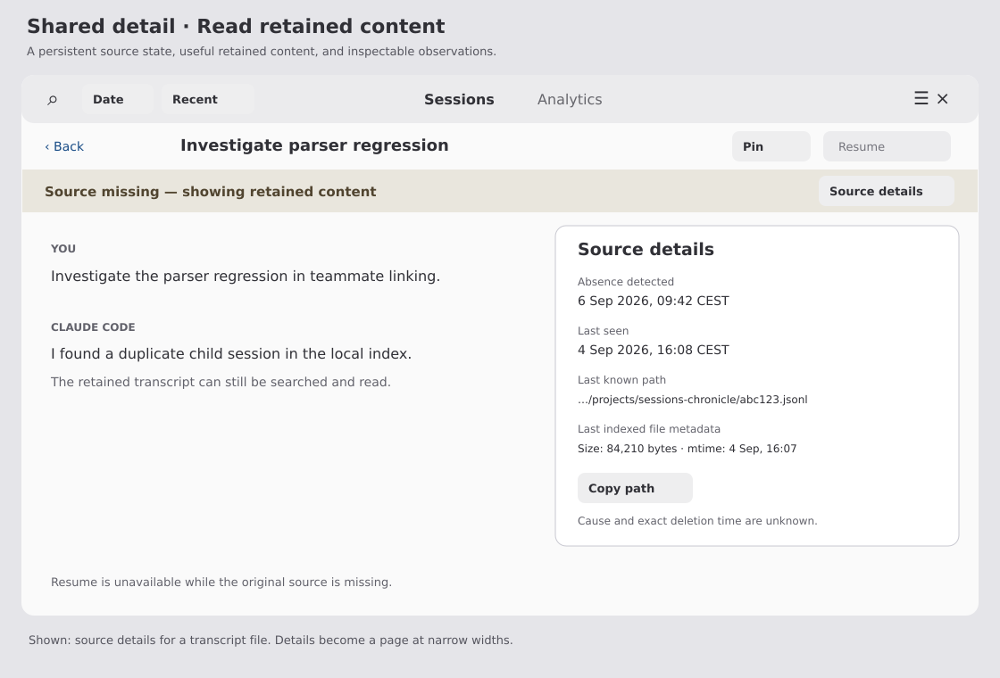
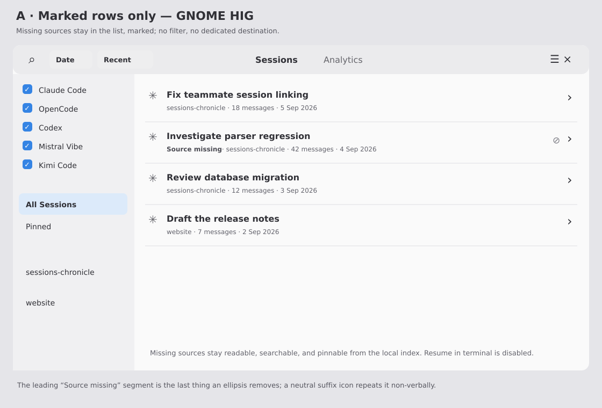
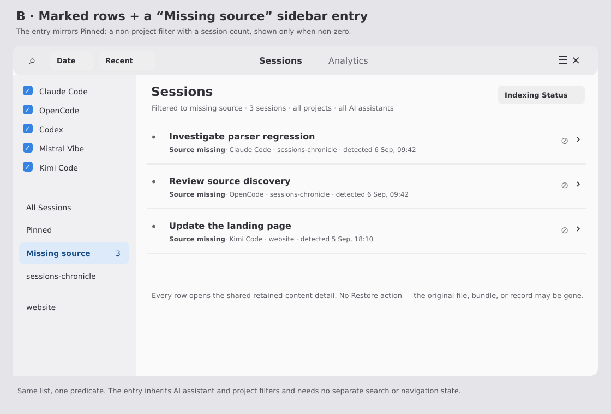
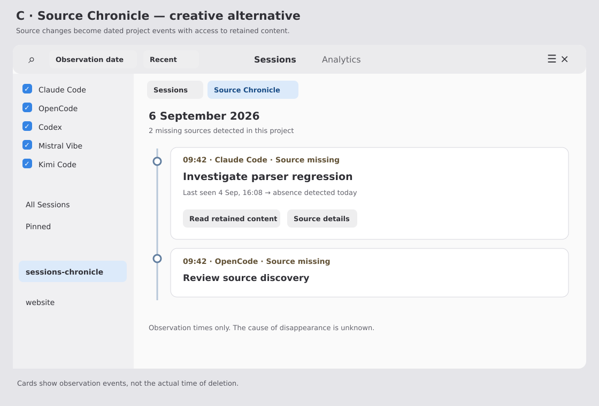

# Missing sources: preserve the record and keep it in view

**Issue:** [#195 — Deleted Claude Code transcripts leave stale session rows in the database](https://github.com/supermaciz/sessions-chronicle/issues/195)  
**Date:** 2026-09-06  
**Status:** Exploration — retained sessions shown by default; presentation choice pending review (B recommended, A is its first increment, C is a separate effort)  
**Scope:** Claude Code, OpenCode, Codex, Mistral Vibe, and Kimi Code  
**Direction:** Preserve indexed sessions with a `source_missing` state instead of deleting them, and keep them visible in ordinary browsing with a clear textual marker.

## Problem and scope

The issue originally proposes deleting sessions whose Claude Code transcripts disappeared. The [comment by grimdalltech](https://github.com/supermaciz/sessions-chronicle/issues/195#issuecomment-5354802262) proposes preserving the evidence instead: a missing-source state, the last known fingerprint, and observation timestamps. This exploration adopts that direction and supersedes the issue's original cascade-deletion acceptance criteria.

**This is a shared capability for every supported AI assistant, not a Claude Code-only fix.** A source can be a transcript file, a session directory containing several files, or a session record in a shared database. The application exposes one consistent state while each storage adapter determines whether the corresponding source still exists.

A session can lose its source and remain useful in the local index. Nothing on the session list or in session detail reads the source file: titles, transcript items, counts, and token usage all come from SQLite. The single capability a missing source removes is **resume in terminal**. Users therefore need to keep reading, searching, and pinning these sessions, understand what is missing, and — occasionally — focus on just the affected ones. Missing sessions must stop feeding machine decisions (active-session linkage, teammate ambiguity) and stop offering a resume path that cannot work.

### Revision — 2026-09-06

An earlier draft recommended hiding missing sessions behind an availability filter defaulting to "Available". Review rejected that default. It reproduces the exact user-visible symptom of #195 — a session disappears from the list when its transcript disappears — implemented with a `WHERE source_missing = 0` instead of a `DELETE`, and it makes the preserved record undiscoverable at the one moment it matters, right after a user cleans out a sessions directory. This revision makes **visible-by-default** a shared decision and narrows the proposals to how much dedicated surface the state earns.

**Shared mockup scenario:** successful source scans find three previously indexed sessions missing: one from Claude Code, one from OpenCode, and one from Kimi Code. Two belong to `sessions-chronicle`. The user wants to reread a parser investigation. All titles, paths, and dates are illustrative. Mockups show the same UI across storage formats; file-specific metadata in the shared detail is one example.

### Existing implementation

The paths referenced in the issue have changed:

- [`crates/core/src/database/indexer.rs`](../../crates/core/src/database/indexer.rs) contains `prune_orphan_fingerprints` and OpenCode-specific stale-session pruning. Preserve source evidence **before** fingerprint cleanup; replace disappearance-driven hard deletion with the shared retention policy.
- [`crates/core/src/database/indexer/kimi.rs`](../../crates/core/src/database/indexer/kimi.rs) also prunes stale Kimi bundles. Its disappearance path needs the same policy, including retained child sessions.
- [`crates/core/src/database/schema.rs`](../../crates/core/src/database/schema.rs) stores file fingerprints based on `mtime_ns` and `size`, not content hashes.
- [`src/ui/session_detail.rs`](../../src/ui/session_detail.rs) loads transcript items from the database with `load_all_transcript_items`. A missing source does not inherently prevent reading already indexed content. This is useful retained content, not a promised complete backup.
- [`src/ui/session_row.rs`](../../src/ui/session_row.rs), [`src/ui/session_list.rs`](../../src/ui/session_list.rs), [`src/ui/sidebar.rs`](../../src/ui/sidebar.rs), and [`src/ui/session_detail/session_summary.rs`](../../src/ui/session_detail/session_summary.rs) provide the main UI surfaces. The row is a `gtk::Box` → `adw::ActionRow` with one composed subtitle string and up to three suffix images; row state (for example `.pinned-row`) is applied at init through `add_css_class?:`, so it changes by rebuild, not by widget update. The sidebar already filters by AI assistant, project, and pin, with **Pinned** as a non-project entry carrying a count; the header offers date and sorting controls.

## Shared behavior across all proposals

### Describe observations accurately

Use **"Source missing"** in the UI. `source_deleted` is acceptable internally, though `source_missing` better describes the observation. "Deleted on…" would claim knowledge of an action and timestamp that the indexer does not have. A source may have moved, or a database record may have disappeared while its database remains present.

Source details show **"Absence detected"**, **"Last seen"**, the source location, and the last retained source metadata. Full dates include the timezone; unavailable values display "Unknown". Do not derive last-seen time from conversation activity or file modification time. The cause and exact deletion time remain unknown. This local record is not a tamper-proof audit log or evidence of malicious intent.

### Show retained sessions by default

Missing sessions appear in the ordinary list, search, and navigation counts, marked as described below. No opt-in is required to see them, there is no availability mode toggle, and the boot state carries no hidden filter to reset. The list's existing empty state is unchanged and now means what it says.

| Surface or operation | Behavior |
| --- | --- |
| Default internal list and search | Include missing sessions, marked. No mode toggle to see them. |
| Navigation and sidebar counts | Count sessions in the displayed scope, missing ones included, so counts match the visible list. |
| Pins | Preserve the pin. A missing pinned session still appears under Pinned. |
| Analytics | Include missing sessions. Their transcripts, token totals, and activity are retained index data; excluding them would let aggregates shrink retroactively whenever a user runs a cleanup. If a later analysis needs an active-only scope, it labels that scope explicitly. |
| GNOME shell search | Exclude missing sessions from results, excerpts, and counts: a system-wide result that cannot be resumed is a poor shell citizen. Activating an older result still opens retained detail. This exclusion is deliberately inconsistent with the in-app list. |
| Teammate resolution | Exclude missing candidates from ambiguity checks. Preserve existing historical links and label missing destinations. Machine decision, not browsing. |
| Resume in terminal | Disable in the row, menu, and detail; enforce in the action handler regardless of when the menu opened. |
| Transcript reading and search | Use indexed content without reloading a missing source. |
| Deep links, child-session links, already open detail | Open or retain the detail with its source state instead of a generic error. |

An unsuccessful scan preserves the previous availability state and surfaces an indexing diagnostic. "Available" is the last known state, not a guarantee of current reachability. Sessions with no successful observation since migration remain included in ordinary browsing, with "Last seen: Unknown"; do not invent evidence of presence or absence.

Detection must not update conversation `last_updated`: disappearance is not new conversation activity. The Date filter continues to use session dates, except in proposal C's explicitly labeled observation timeline.

### Row treatment for a missing source

A missing source adds **no second subtitle line**. A per-subset height change breaks scan rhythm in the recycled `FactoryVecDeque` and enlarges the recycled-state surface. Instead:

- **Subtitle, leading segment.** Prepend **"Source missing"** to the existing interpunct chain: `Source missing · sessions-chronicle · 42 messages · 4 Sep 2026`. Leading position keeps it ahead of the metadata users skim past and makes it the last thing an ellipsis removes at narrow width or large text. Keep this exact string on the row; storage-specific wording ("Session record missing", a named missing bundle component) belongs in Source details. The subtitle is Pango markup and already escaped — reuse the existing `markup_escape_text` path; malformed markup silently blanks an `AdwActionRow` subtitle.
- **One suffix icon**, following the ending-status image pattern: visible only when missing, `valign: Center`, `pixel_size: 16`, tooltip **"Source missing — showing retained content"**. Use `action-unavailable-symbolic`; it ships in `adwaita-icon-theme`, so `build.rs` needs no new relm4-icons entry. Place it first among the suffixes, before the pin. Cover it with a test mirroring `pin_icon_name_exists_in_icon_theme`; a missing symbolic renders as a broken square. Set the image `accessible-role: presentation` so the state is not announced twice.
- **Colour is the redundant fourth channel, never the carrier.** Recommended: the neutral "not found" grey already in the stylesheet (`.source-status-not-found`, `alpha(@view_fg_color, …)`), reusing an existing vocabulary rather than adding one. A restrained `@warning_color` tint on the icon and leading segment is an acceptable alternative. `@error_color`, `.status-error`, and `dialog-error-symbolic` are not: a missing source is a state, not a fault, and there is no restore path to imply.
- **State is carried by text + glyph + a disabled Resume**, each sufficient alone, so it survives greyscale, high contrast, colour-blindness, and screen readers.

Must not happen: strikethrough (claims the record is deleted; it is intact), dimmed title or subtitle (claims degraded content), swapping the assistant prefix icon (the primary scanning axis), a list-level toast or banner, or grouping missing rows into their own section (hiding with extra steps).

Behavior: row click and pin stay fully enabled and open retained detail with the persistent banner; Resume is visible but insensitive with an explanation attached for assistive technology, and re-checked in [`src/app/handlers/resume.rs`](../../src/app/handlers/resume.rs); sort position is unchanged — missing rows keep normal date order and are not sunk to the bottom.

`SessionRow` currently has `type Input = ()` and applies row classes at init, so missing-source state must ride the same rebuild path. A conditional-visibility widget that assumes a factory update it will not receive is a bug. A regression test should render a mixed scrolled list and assert the `source_missing` CSS class, suffix icon, and disabled Resume are present only on missing rows after recycling.

### Shared retained-content detail

A persistent banner reads **"Source missing — showing retained content"**, with **"Source details"** as its action. It applies to the open session and remains visible while the source is missing. The [GNOME HIG banner guidance](https://developer.gnome.org/hig/patterns/feedback/banners.html) recommends this pattern for persistent states, with a short title and optional action.

The source-details surface adapts its fields to storage:

| Source kind | Details and copy actions |
| --- | --- |
| Transcript file | Last known path, retained size and modification time; **"Copy path"**. |
| Session bundle | Bundle location and last known required-file metadata; **"Copy path"** copies the bundle path. Identify a missing component when known. |
| Database session | Database location and session ID; **"Copy path"** copies the database location, **"Copy session ID"** copies the record identity. Explain **"Session record missing"** even if the database exists. |

Never represent a shared database's file size or modification time as an individual session fingerprint. File paths may be visually shortened, but accessible and copied values are complete. Pinning and copying retained content remain available. Resume has a visible explanation also associated with the control for assistive technology.

When retained content is incomplete, show **"Only indexed content is available"**. With no retained transcript, show **"No retained transcript"** alongside source observations and metadata, rather than an empty conversation. At narrow widths, source details become a dialog page with explicit back navigation; the banner can wrap.

## Proposal A — Marked rows only (minimal, GNOME HIG)

**Intent:** Reread or search an old conversation through the list you already use, with no new controls.

The shared marked row plus the shared detail banner are the whole change. There is no availability filter and no dedicated destination. The earlier draft's three-way "Sources" pill, its conditional "N missing sources" count, its two extra empty-state variants, and its "24 available · 3 missing" summary all existed only to manage the consequences of hiding rows; with rows visible they are removed. Project, AI-assistant, pin, date, search, and sort are unchanged and combine with missing sessions as plain ANDs.

Triage — "show me only the ones that lost their source" — is possible by typing in search or reading the marker down the list, but it is not a first-class mode. If missing rows are later reported as noise at scale (a cleaned-out projects directory producing dozens), the escalation is Proposal B's sidebar entry, not a toolbar filter.

**Strengths:** Smallest surface, one browsing flow, nothing to persist or reset, strictly less UI than the current list; fully within GNOME HIG list and subtitle conventions.  
**Trade-offs:** No fast way to isolate missing sessions for bulk review; a user with many of them scrolls past them mixed into ordinary results.

## Proposal B — Marked rows plus a "Missing source" sidebar entry (GNOME HIG)

**Intent:** Everything in A, plus a stable place to review just the affected sessions across AI assistants.

Add one row to the sidebar next to **Pinned**, structurally identical to it: a filter that is not a project, carrying a session count, visible only when the count is non-zero. Selecting it filters the same list to missing top-level sessions. It needs no separate search state, no separate navigation state, and no "restore previous state on exit" machinery, because it is another predicate over the same list. It inherits the sidebar's AI-assistant toggles and project selection the way other entries do. Rows there carry the same marker and open the same shared detail; **"Indexing Status"** reaches existing diagnostics. There is no Restore action — the application may not hold the original file, bundle, or record.

Naming: label it for the session property, parallel to "Pinned" — **"Missing source"** — and make the count unambiguously a count of sessions, never a mix of files, bundles, and database records, in its accessible name.

**Strengths:** Discoverable and stable without a hidden default; near-zero marginal cost over A (one conditional sidebar row mirroring Pinned); the earlier "dedicated destination" idea without its separate search and navigation cost, since ordinary browsing already includes these sessions.  
**Trade-offs:** One more entry in a recently simplified sidebar, even if it only appears when relevant. "Source" sits in a list where every other count is sessions, so the accessible name has to disambiguate.

## Proposal C — Source Chronicle (creative)

**Intent:** Understand how a project's locally retained history has changed over time, not just find one conversation.

C is complementary to the marked-row baseline, not an alternative discovery path. Above the list, **"Sessions"** and **"Source Chronicle"** offer two views of the selected project. Both include missing sessions; the chronicle adds a time axis the list does not have. It groups observations by detection day, using a restrained timeline and one card per event. Each card identifies the session, AI assistant, observed state, and interval between last presence and detected absence. **"Read retained content"** and **"Source details"** lead to the shared surfaces.

Under "All Sessions", the chronicle covers all projects and includes project labels on cards. Search filters events by session title or retained content; date controls explicitly read **"Observation date"** in this mode.

This proposal requires an append-only observation history: absence and subsequent reappearance are separate events. A boolean alone is insufficient. Repeated scans must not create duplicate cards without a state transition. Do not synthesize events for periods before migration. Events from different AI assistants use the same structure, while their source details remain storage-aware.

**Adaptive behavior:** Cards form a vertical list at narrow widths and actions wrap. The timeline spine is decorative; dates, order, and accessible names convey all information without it. An empty chronicle says **"No source changes recorded"**, which does not imply that no earlier deletion occurred.

**Strengths:** Makes preserved evidence tangible and separates conversation dates from observation dates; layers cleanly on top of A or B.  
**Trade-offs:** Additional storage, event pagination, and a second per-project view; excessive if rereading a conversation is the main use case. A chronological presentation must not imply audit-integrity guarantees.

## Generalized source reconciliation

### One shared policy, storage-specific evidence

Separate **source discovery** from **successful parsing**. A discovered but malformed session is not a deleted session. Each adapter should report its source scope, discovered session identities or locators, successful observations, and which parts of the scope were completely enumerated. These are proposed responsibilities, not existing APIs.

The shared reconciler compares previously observed sources only against the matching completed scope. It records confirmed absence and preserves content. The UI consumes the resulting session state without branching on the AI assistant.

| AI assistant / storage | Source identity and evidence | Proposed absence rule |
| --- | --- | --- |
| Claude Code | Session identity within its configured root; JSONL transcript locator and file metadata. | Previously observed transcript absent from a complete scan of its owning scope. A parse failure is not absence. |
| Codex | Session identity within its configured root; JSONL rollout locator and file metadata. | Same file-source rule. Match rediscovered identities before marking old locators missing, so a move within the scanned scope does not create a false deletion. |
| OpenCode — JSON | Session identity within its storage root; session metadata and associated message/part storage. | Session identity absent from successful session enumeration. Missing message/part data with a surviving session is an incomplete-source diagnostic, not whole-session deletion. |
| OpenCode — SQLite | Database scope plus session record ID; last successful observation and any supported record-level revision metadata. | Record absent from a successful, consistent enumeration of that database. An inaccessible, missing, or unreadable database makes the scope unavailable; it does not confirm deletion of every contained session. |
| Mistral Vibe | Session directory identity with `meta.json` and `messages.jsonl`; child sources under `agents/`. | Previously observed session directory absent from a complete parent-scope scan. A surviving directory with missing required components produces an incomplete-source diagnostic. |
| Kimi Code | Session bundle identity; `state.json`, `agents/main/wire.jsonl`, and resolved child dependencies. | Previously observed bundle absent from a complete workspace scan. Missing required files in a surviving bundle are incomplete-source diagnostics, not whole-bundle deletion. |

The bundle rules deliberately distinguish **a missing session** from **a damaged or partially written source**. Incomplete-source diagnostics preserve content and availability history; they do not silently enter "Missing". This keeps a shared boolean meaningful without adding unrelated UI states to #195.

A child source can disappear independently. Reconcile independently stored children using their own verified source scope. When an entire owned bundle disappears, mark the sessions whose sources belong to that bundle missing while retaining their relationships and content. Do not cascade absence through logical parent links to independently stored sources that still exist. Top-level list counts exclude child sessions; child links still expose their own source state.

OpenCode and Kimi already have disappearance-driven pruning paths. Replacing those paths is part of this cross-assistant change, not a later extension. Audit child replacement and parser-skip cleanup too: distinguish intentional eligibility changes from missing source data, and never let generic content replacement erase an already retained missing-source record.

### Persistence and transitions

| Proposed data | Purpose |
| --- | --- |
| `source_missing` boolean, default false | Shared confirmed-absence marker; equivalent to the suggested `source_deleted`. |
| `source_missing_detected_at`, nullable | First detection in the current absence period; unchanged by repeated scans. |
| `source_last_seen_at`, nullable | Last actual presence observation, independent of conversation activity. |
| Source identity and locator | AI assistant, storage kind, owning root/database scope, and native session identity; path alone is insufficient. |
| Last known evidence snapshot | File metadata for files, dependency metadata for bundles, record identity and supported revision metadata for database sessions. Unknown values remain null. |
| Last absence and return observations | Preserve the latest completed absence period for A/B; C stores every transition as an event. |

Source identity must be scoped: the same native ID in fixtures and real data must not alias. Check existing schema uniqueness and source-to-session mapping before choosing the migration. If necessary, introduce a source-instance mapping rather than overloading the conversation ID. Do not reuse a shared database fingerprint as a session-level fingerprint or require a fabricated hash where none exists.

Migration must not mark existing sessions missing immediately. Reconcile only after complete, successful enumeration of the relevant scope. An inaccessible root, permission denial, I/O error, disabled source, or partial scan does not prove deletion. Preserve the previous state and report diagnostics; a global `Path::exists()` check is insufficient. If a subtree fails, do not infer absence within it.

Fixture scans must never modify real-source observations, and vice versa. Snapshot evidence and mark absence transactionally before cleaning the indexing cache. Retain messages, transcript items, child sessions, and search data. Ordinary reindexing must preserve these records; explicit removal belongs to a separate retention policy.

When the same scoped identity reappears, successfully reindex it before making a missing session active again. An unreadable return preserves the previous missing state with a diagnostic. A different identity at the same path must not overwrite the old record. Resolve same-identity moves within a completed scope before recording absence; moves across scopes must not be automatically merged without identity evidence.

### Implementation surfaces

- Schema, indexer, storage adapters, and shared queries in `crates/core/src/database/`: scoped reconciliation, retention, fingerprints, availability predicates, and teammate ambiguity checks.
- Session models in `crates/core/src/models/`: carry source state and filter selection independently of UI presentation.
- List, row, detail, and summary in `src/ui/`: leading subtitle segment, suffix marker, storage-aware source details, and retained-content reading. For B, one conditional sidebar entry in `src/ui/sidebar.rs` mirroring Pinned.
- Handlers in `src/app/handlers/`, especially `resume.rs`: enforce source state even if it changed after a menu opened.
- System search in `crates/core/src/database/shell_search.rs`: keep the active-session scope (exclude missing). Analytics includes missing sessions; no active-only scope unless a specific analysis declares one.

## Implementation acceptance checks

1. For **each supported AI assistant and both OpenCode storage modes**, index a fixture, remove the session's authoritative source, and rescan: retain content and evidence, mark absence, and keep the row in the default list with its marker while the resume, teammate, and shell-search paths exclude it. A repeated scan must preserve the first detection time.
2. For SQLite, remove one session record while keeping the database and other records: only that session becomes missing. Database unavailability must not mark all sessions missing.
3. For Mistral Vibe and Kimi Code, distinguish whole-bundle removal from missing required components. Cover independently missing children and surviving independent child sources.
4. Alternate real and fixture roots; test identical native IDs in separate scopes, inaccessible roots, partial scans, permission errors, and malformed but discovered sources. No false absence or cross-scope mutation.
5. Reintroduce the same identity, move it within a scope, return unreadable data, and replace a path with another identity. Reactivate only after a successful matching reindex; preserve old evidence where appropriate.
6. Check internal search, GNOME search, pins, pagination, analytics, and navigation counts. Missing sessions appear in the in-app list, search, analytics, and counts, and the counts match the visible list; GNOME shell search still excludes them. A missing teammate must not make a present candidate ambiguous.
7. Open missing sessions through the list, deep links, and child links. Cover complete, partial, and absent retained transcripts, plus disappearance during reading. Verify the subtitle leads with "Source missing", that title and subtitle markup escaping holds for prompts containing `<`, `>`, and `&`, and that storage-specific copy actions and disabled resume behave.
8. Render a list mixing missing and available sessions and scroll it: the `source_missing` CSS class, suffix icon, and disabled Resume are present only on missing rows after recycling.
9. Check keyboard navigation, screen readers, large text, dark mode, and high contrast; never encode state through color alone. Follow the [GNOME HIG accessibility guidance](https://developer.gnome.org/hig/guidelines/accessibility.html).
10. For C, verify no duplicate events and preservation of multiple absence/return cycles across different AI assistants.

These checks belong to implementation. This change delivers an exploration and static SVGs, not screenshots of running widgets.

## Comparison and recommended decision

| Criterion | A — Marked rows only | B — Marked rows + sidebar entry | C — Source Chronicle |
| --- | --- | --- | --- |
| Reread a conversation | Ordinary list and search | Ordinary list and search | Ordinary list, or via an event |
| Isolate missing sessions | Not a mode; scroll or search | One sidebar entry, count-gated | Per-project timeline |
| Multiple disappearance/return cycles | Latest observation | Latest observation | Explicit history |
| Fit with existing UI | Strongest | Strong (mirrors Pinned) | Moderate |
| Relative UI cost | Lowest | Low (≈ A + one sidebar row) | High |

**Recommendation: implement B — the shared marked row and shared detail, plus the "Missing source" sidebar entry — across all five AI assistants.** A is B minus the sidebar row and is the correct first increment if that entry has to wait; shipping A alone is acceptable and complete on its own. C is a separate UI effort, justified only if source-change history over time becomes a central use case; it layers cleanly on top of A or B.

The data decision is unchanged: retain absence evidence for every supported source. Neither automatic record deletion nor restoration of original source data is required.
