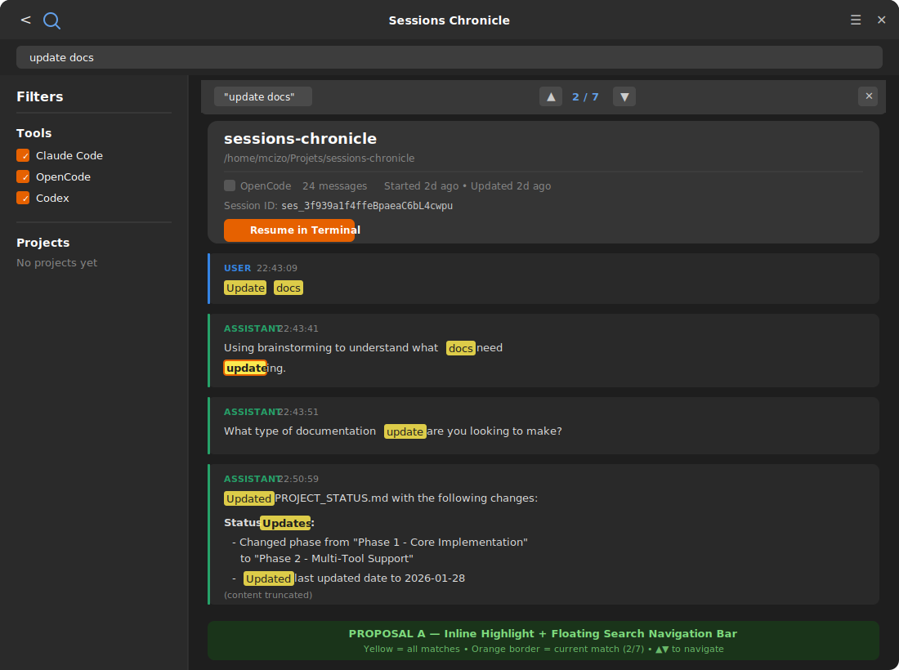
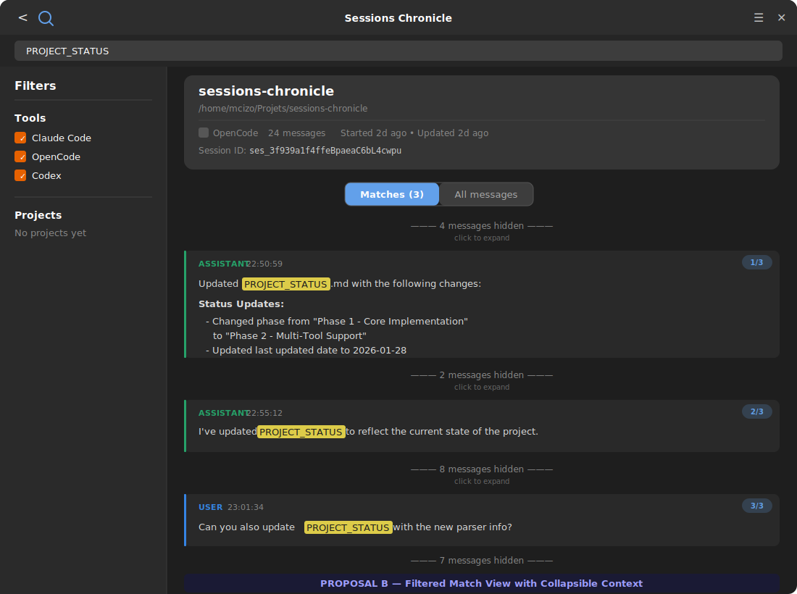

# Search Term Highlighting in SessionDetail - Exploration

**Date**: 2026-02-07
**Status**: Accepted (Proposal A)
**Feature**: When a user searches for a term and opens a session from the results, highlight the matching terms inside the session detail view.

**Current behavior**: The search bar (top of the app) filters the session *list* via FTS5. When the user clicks a result, the detail view shows all messages without any indication of where the search term appears.

## Decision (Accepted): Proposal A (Inline Highlight + Floating Search Navigation Bar)

- Keep the full conversation visible, and highlight every occurrence of the active search term inline in the detail view.
- Show a floating navigation bar overlay in `SessionDetail` with match count + prev/next controls + a close button.
- Auto-scroll to the first match when opening a session from search results.
- Highlights persist while a search query is active; clearing the main search (or dismissing via the nav bar) removes highlights.

## Rationale

The primary use case is: "I searched for something, now show me *where* it appears in the conversation". The conversational context is essential; hiding messages by default (Proposal B) makes results less useful.

- Familiar UX (Ctrl+F): immediate comprehension, no learning.
- Prev/Next navigation solves long sessions without removing context.
- Lower implementation complexity than a filtered/collapsible "matches only" mode.
- Avoids the UX downside of "N messages hidden" (anxiety / repeated expand-to-everything).

## Visual Mockups

| Proposal A | Proposal B |
|------------|------------|
|  |  |

---

## Proposal A: Inline Highlight + Floating Search Navigation Bar

### Concept

A classic "Ctrl+F in browser" approach adapted to the GNOME/Adwaita design language:

- Every occurrence of the search term in message content gets a **yellow/amber highlight background** (`#fce94f` with alpha on dark, or `@accent_bg_color` tint).
- A **floating search bar** appears at the top of the detail ScrolledWindow, overlaying the content, showing the match count and prev/next navigation.
- The view **auto-scrolls to the first match** when entering the detail.
- The highlight persists as long as a search query is active. Clearing the search in the main bar removes all highlights.

### Mockup

```
+------------------------------------------------------------------+
| <  Q                  Sessions Chronicle                  =   X  |
+------------------------------------------------------------------+
| [  Search sessions...   "update docs"                          ] |
+------------------------------------------------------------------+
|            |                                                      |
|  Filters   |  +------------------------------------------------+|
|            |  | "update docs"  < 2/7 >   x                     ||
|  Tools     |  +------------------------------------------------+|
|            |                                                      |
|  [x] Claude|  +------------------------------------------------+|
|  [x] Open..|  | sessions-chronicle                              ||
|  [x] Codex |  | /home/mcizo/Projets/sessions-chronicle          ||
|            |  | OpenCode  24 messages  Started 2d ago            ||
|  ---------.|  | Session ID: ses_3f939a1f4ffeBpaeaC6bL4cwpu      ||
|            |  | [ Resume in Terminal ]                           ||
|  Projects  |  +------------------------------------------------+|
|            |                                                      |
|  No proj...|  +------------------------------------------------+|
|            |  | USER  22:43:09                                   ||
|            |  | |||||||||||||||||||                               ||
|            |  | [Update docs]                                    ||
|            |  +------------------------------------------------+|
|            |                                                      |
|            |  +------------------------------------------------+|
|            |  | ASSISTANT  22:43:41                              ||
|            |  |                                                  ||
|            |  | Using brainstorming to understand what docs need ||
|            |  | ||||||||||||.                                    ||
|            |  |                                                  ||
|            |  | Let me first check the current project state and ||
|            |  | documentation structure.                         ||
|            |  +------------------------------------------------+|
|            |                                                      |
|            |  +------------------------------------------------+|
|            |  | ASSISTANT  22:43:51                              ||
|            |  |                                                  ||
|            |  | What type of documentation |||||||||| are you    ||
|            |  | looking to make?                                 ||
|            |  +------------------------------------------------+|
|            |                                                      |
|            |  +------------------------------------------------+|
|            |  | ASSISTANT  22:50:59                              ||
|            |  |                                                  ||
|            |  | ||||||||| PROJECT_STATUS.md with the following   ||
|            |  | changes:                                         ||
|            |  |                                                  ||
|            |  | **Status |||||||||||:**                          ||
|            |  | - Changed phase from "Phase 1..." to "Phase 2"  ||
|            |  | - ||||||||| last ||||||||| date to 2026-01-28    ||
|            |  +------------------------------------------------+|
+------------------------------------------------------------------+

Legend:  ||||||||||| = highlighted match (amber/yellow background)
```

### Floating search nav bar (detail)

```
+------------------------------------------------------------+
| "update docs"            < 2 / 7 >                    [x]  |
+------------------------------------------------------------+
  ^search term               ^current/total matches    ^close
  (read-only echo)           ^prev/next arrows
```

This bar is a `gtk::Box` with:
- A `gtk::Label` showing the search term (read-only)
- `<` and `>` `gtk::Button` (prev/next match) with `go-up-symbolic` / `go-down-symbolic` icons
- A `gtk::Label` showing `"2 / 7"` (current / total)
- A `gtk::Button` with `window-close-symbolic` to dismiss highlights

### Highlight rendering

For **user messages** (plain `gtk::Label`): use Pango markup `<span background="#fce94f" foreground="#000000">term</span>` around matched substrings.

For **assistant messages** (markdown-rendered): the `render_markdown()` function would accept an optional `highlight_terms: &[&str]` parameter. During Pango markup generation in `markdown_to_blocks()`, matched substrings in text nodes get wrapped with the highlight `<span>`.

For **code blocks** (plain text labels): same Pango `<span>` wrapping on the code text.

### CSS additions

```css
/* Floating search nav bar overlay */
.search-nav-bar {
  background-color: @headerbar_bg_color;
  border-bottom: 1px solid alpha(@borders, 0.3);
  padding: 6px 12px;
  border-radius: 0 0 8px 8px;
}

.search-nav-bar .match-counter {
  font-variant-numeric: tabular-nums;
  min-width: 60px;
}
```

### Interaction flow

1. User types "update docs" in the main SearchBar.
2. Session list filters to matching sessions.
3. User clicks a session row.
4. `SessionDetailMsg::SetSession` is extended to `SetSession { id, search_query: Option<String> }`.
5. Detail view loads messages and applies Pango highlight markup for the query.
6. Floating nav bar appears with match count. View scrolls to first match.
7. User clicks `>` to jump to next match (scrolls the `ScrolledWindow`).
8. User clears search or clicks `x` on the nav bar: highlights removed, nav bar hidden.

### Pros / Cons

| Pros | Cons |
|------|------|
| Familiar UX (browser-like Ctrl+F) | Need to track widget positions for scroll-to-match |
| Shows full context around matches | Long sessions with few matches still require scrolling |
| Non-destructive: all messages visible | Highlight in markdown requires changes to the renderer |
| Match navigation (prev/next) is powerful | Floating overlay needs careful z-ordering in GTK |

---

## Proposal B: Filtered Match View with Collapsible Context

### Concept

Instead of highlighting in place, the detail view **filters to show only matching messages** when a search query is active, with expandable context:

- When a search query is active, non-matching messages are **collapsed into a count indicator** (e.g., "3 messages hidden").
- Matching messages show the search term with **inline highlight** (same amber `<span>` as Proposal A).
- A **toggle pill** at the top lets the user switch between "Matches only" and "All messages".
- Each collapsed section can be **expanded** by clicking the indicator.
- The matching message shows a brief **context snippet** (surrounding text around the match) if the message is long.

### Mockup

```
+------------------------------------------------------------------+
| <  Q                  Sessions Chronicle                  =   X  |
+------------------------------------------------------------------+
| [  Search sessions...   "PROJECT_STATUS"                       ] |
+------------------------------------------------------------------+
|            |                                                      |
|  Filters   |  +------------------------------------------------+|
|            |  | sessions-chronicle                              ||
|  Tools     |  | /home/mcizo/Projets/sessions-chronicle          ||
|            |  | OpenCode  24 messages  Started 2d ago            ||
|  [x] Claude|  | Session ID: ses_3f939a1f4ffeBpaeaC6bL4cwpu      ||
|  [x] Open..|  | [ Resume in Terminal ]                           ||
|  [x] Codex |  +------------------------------------------------+|
|            |                                                      |
|  -------.  |   [ Matches (3) |  All messages ]   search term pill |
|            |                                                      |
|  Projects  |     --- 4 messages hidden ---         collapsed group|
|            |                                                      |
|  No proj...|  +------------------------------------------------+|
|            |  | ASSISTANT  22:50:59                              ||
|            |  |                                                  ||
|            |  | Updated ||||||||||||||||||| with the following   ||
|            |  | changes:                                         ||
|            |  |                                                  ||
|            |  | **Status Updates:**                              ||
|            |  | - Changed phase from "Phase 1 - Core Implem..." ||
|            |  |   to "Phase 2 - Multi-Tool Support"              ||
|            |  +------------------------------------------------+|
|            |                                                      |
|            |     --- 2 messages hidden ---                        |
|            |                                                      |
|            |  +------------------------------------------------+|
|            |  | ASSISTANT  22:55:12                              ||
|            |  |                                                  ||
|            |  | I've updated ||||||||||||||||||| to reflect the  ||
|            |  | current state of the project.                    ||
|            |  +------------------------------------------------+|
|            |                                                      |
|            |     --- 8 messages hidden ---                        |
|            |                                                      |
|            |  +------------------------------------------------+|
|            |  | USER  23:01:34                                   ||
|            |  |                                                  ||
|            |  | Can you also update ||||||||||||||||||| with the ||
|            |  | new parser info?                                 ||
|            |  +------------------------------------------------+|
|            |                                                      |
|            |     --- 7 messages hidden ---                        |
|            |                                                      |
+------------------------------------------------------------------+

Legend:  ||||||||||||||||||| = highlighted match (amber/yellow background)
```

### Toggle pill

```
+-----------------------------------+
| [ Matches (3) ] | All messages    |    <-- segmented toggle
+-----------------------------------+
         ^active          ^inactive
    (filtered view)   (full view with highlights)
```

This is an `adw::SegmentedButton` (or two linked `gtk::ToggleButton`s) placed between the metadata card and the messages area.

- **"Matches (N)"**: Only show messages containing the search term. Non-matching messages collapsed into `"--- N messages hidden ---"` dividers.
- **"All messages"**: Show every message, but still with inline highlights on matching terms.

### Collapsed section indicator

```
           --- 4 messages hidden ---
```

This is a clickable `gtk::Button` styled as a subtle centered label. Clicking it either:
- Expands that specific group in place (inserts the hidden messages), or
- Switches to "All messages" mode and scrolls to that position.

### CSS additions

```css
/* Toggle pill for match mode */
.match-mode-toggle {
  margin: 8px 12px;
}

/* Collapsed messages indicator */
.collapsed-indicator {
  color: alpha(@window_fg_color, 0.5);
  font-style: italic;
  padding: 8px 0;
}

.collapsed-indicator:hover {
  color: @accent_color;
}
```

### Interaction flow

1. User types "PROJECT_STATUS" in the main SearchBar.
2. Session list filters. User clicks a session.
3. `SessionDetailMsg::SetSession { id, search_query }` is sent.
4. Detail view loads all messages, identifies which contain the search term.
5. Default view: **"Matches (3)"** mode. Only matching messages are rendered as `MessageRow` factories. Between groups, `CollapsedIndicator` widgets show "N messages hidden".
6. User clicks "All messages": every message is shown, matches still highlighted.
7. User clicks a collapsed indicator: messages in that group are inserted in place.
8. Clearing the search reverts to normal full-message view.

### Pros / Cons

| Pros | Cons |
|------|------|
| Immediately shows *only* relevant messages | Loses conversation context by default |
| Great for long sessions (50+ messages) | More complex widget management (show/hide groups) |
| No need for scroll-to-match logic | Toggle state adds UI complexity |
| Collapsed indicators give structural overview | "Hidden messages" concept needs clear UX explanation |
| Clickable expansion is progressive disclosure | Two modes to maintain (filtered vs. full) |

---

## Side-by-side Summary

| Aspect | Proposal A (Inline + Nav) | Proposal B (Filtered + Collapse) |
|--------|---------------------------|----------------------------------|
| **Mental model** | "Ctrl+F in a document" | "Search results with context" |
| **Best for** | Short/medium sessions | Long sessions with sparse matches |
| **Context** | Full context always visible | Context on demand (expand) |
| **Navigation** | Prev/Next match buttons | Scroll through filtered results |
| **Implementation** | Pango markup + scroll logic | Factory filtering + toggle state |
| **GNOME fit** | Standard (like Text Editor) | Innovative (like Code search) |

---

## Implementation Notes (shared)

Regardless of which proposal is chosen:

1. **Pass search query to SessionDetail**: Extend `SessionDetailMsg::SetSession` to carry an `Option<String>` search query. The `App` already knows the current search text.

2. **Highlight with Pango markup**: Both proposals use Pango `<span background="#fce94f" foreground="#1e1e1e">term</span>` for highlighting. This works in both plain labels and markdown-rendered labels since both use Pango.

3. **Case-insensitive matching**: Use `str::to_lowercase()` for matching, but preserve original casing in displayed text.

4. **MessageRow changes**: Add an optional `highlight_term: Option<String>` to `MessageRowInit`. The `init_widgets()` method applies highlighting before setting label text/markup.

5. **Markdown renderer changes**: Add a `render_markdown_with_highlights(content, terms)` variant that wraps matched text nodes in highlight `<span>` tags during the `markdown_to_blocks()` pass.
