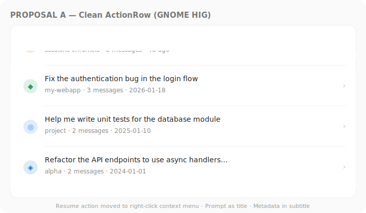
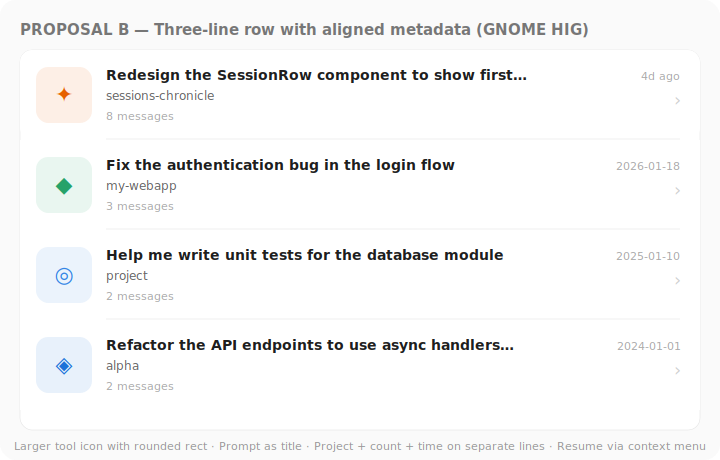
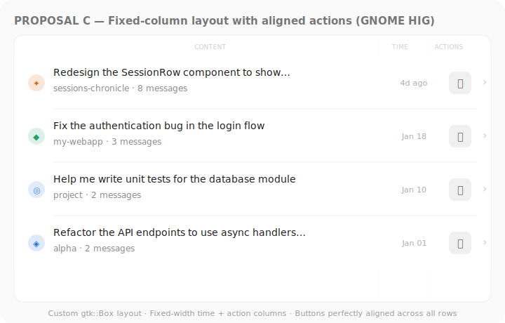
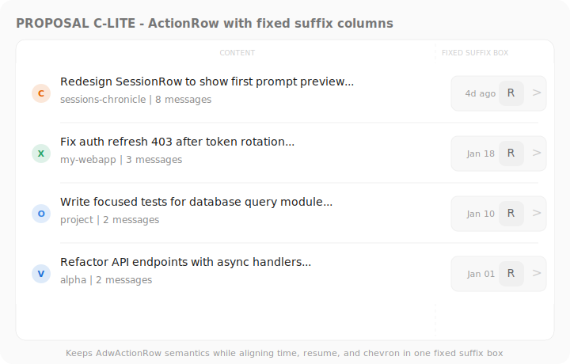
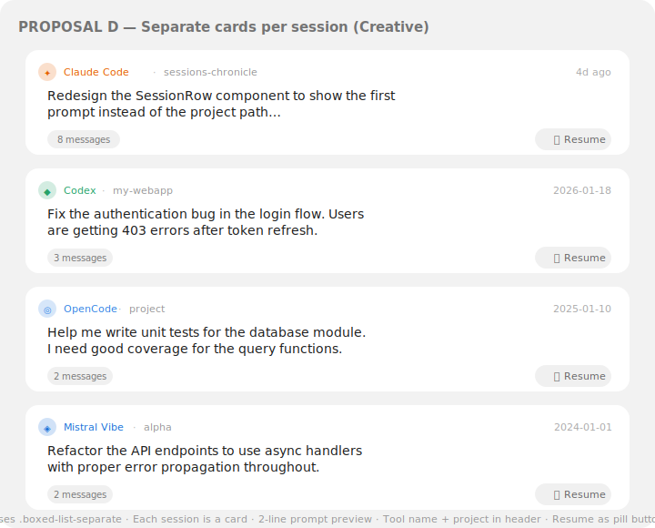
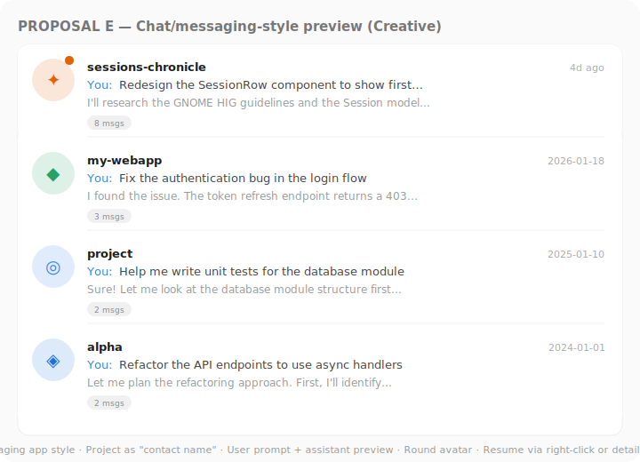

# Session Row Prompt Preview - Exploration

**Date**: 2026-02-10  
**Status**: Pending decision  
**Feature**: Redesign the session list rows to show the first user prompt instead of the project path, and fix button alignment issues.

## Problems with current design

1. **Title shows project folder name** (`sessions-chronicle`, `project`, etc.) — this is redundant with the detail view and doesn't help distinguish sessions.
2. **Subtitle shows the full project path** — useless in the list context, takes up space.
3. **"Resume in terminal" buttons are not vertically aligned** across rows — the `AdwActionRow` suffix area does not coordinate layout across rows, so variable-width timestamps push buttons to different horizontal positions.

## Prerequisite: `first_prompt` field

The `Session` struct currently has no field for the first user message. Regardless of the chosen proposal, we need:

- Add `first_prompt: Option<String>` to `Session` (truncated, e.g. 200 chars)
- Add a `first_prompt TEXT` column to the `sessions` table (populated during indexing from the first `role='user'` message in `messages`)
- Update all parsers (`ClaudeCodeParser`, `OpenCodeParser`, `CodexParser`, `MistralVibeParser`) and `insert_session_and_messages()` to extract and store this value
- Update `session_from_row()` to read the new column

Alternative: JOIN at query time from the `messages` FTS table. But storing it directly is simpler and avoids an extra query per session.

## Proposals

### Proposal A — Clean ActionRow (GNOME HIG)



**Layout**: Standard `AdwActionRow`

| Slot | Content |
|------|---------|
| Prefix | Tool icon (16px, colored) |
| Title | First prompt (1 line, ellipsis via `title_lines: 1`) |
| Subtitle | `project-name · N messages · relative-time` |
| Suffix | `go-next-symbolic` chevron only |

**Key decisions**:
- Resume button **removed from the row**, moved to a right-click context menu (`GtkGestureClick` / `GtkPopoverMenu`)
- No alignment problem since there's only a chevron in the suffix
- Most HIG-compliant: uses ActionRow exactly as intended

**Pros**: Simplest, cleanest, fully HIG-compliant, no alignment issues  
**Cons**: Resume action less discoverable (hidden in context menu), less information density

---

### Proposal B — Three-line row with aligned metadata (GNOME HIG)



**Layout**: Standard `AdwActionRow` with larger prefix icon

| Slot | Content |
|------|---------|
| Prefix | Tool icon (56x56, rounded-rect with tinted background) |
| Title | First prompt (1 line, bold, ellipsis) |
| Subtitle | `project-name` (line 1) + `N messages` (line 2, via Pango markup or subtitle text) |
| Suffix top | Relative timestamp (right-aligned) |
| Suffix bottom | `go-next-symbolic` chevron |

**Key decisions**:
- Larger icon gives stronger tool identity
- Three lines of information: prompt, project, message count
- Resume via context menu
- Timestamp top-right (like messaging apps)

**Pros**: Good info hierarchy, strong visual identity per tool, HIG-compliant  
**Cons**: Taller rows = fewer visible at once, resume hidden

---

### Proposal C — Fixed-column layout with aligned actions (GNOME HIG)



**Layout**: Custom `gtk::Box` inside `GtkListBoxRow` with fixed-width columns

```
[icon 32px] [CONTENT flex] [TIME 70px] [ACTIONS 60px]
```

| Column | Content |
|--------|---------|
| Icon | Tool icon (circle, 24px) |
| Content | Title (first prompt) + Subtitle (project · N messages), `hexpand: true` |
| Time | Relative time, fixed `width_request: 70`, `.numeric` class |
| Actions | Resume button (flat, 32x32) + chevron |

**Key decisions**:
- Custom Box layout instead of ActionRow, for precise column control
- Fixed-width time and action columns guarantee **perfect vertical alignment** of buttons across all rows
- Resume button stays visible and aligned
- Still uses `.boxed-list` on the parent ListBox

**Pros**: Perfect button alignment, resume button visible, familiar layout    
**Cons**: More complex implementation (manual Box layout instead of ActionRow), must manually handle accessibility and typography that ActionRow provides for free

---

### Proposal C-lite — ActionRow with fixed suffix columns (GNOME HIG + pragmatic)



**Layout**: Keep `AdwActionRow`, but place a custom fixed-width suffix container inside it

```
[icon 32px] [CONTENT flex] [SUFFIX BOX: TIME 70px | RESUME 32px | CHEVRON]
```

| Area | Content |
|------|---------|
| Prefix | Tool icon (symbolic, 16-24px) |
| Title | First prompt (1 line, ellipsis via `title_lines: 1`) |
| Subtitle | `project-name · N messages` |
| Suffix container | Fixed-width `gtk::Box` holding time, resume button, chevron |

**Key decisions**:
- Keep `AdwActionRow` semantics and built-in accessibility/typography behavior
- Fix alignment by grouping suffix widgets in one controlled container
- Time label gets fixed width (`width_request: 70`) and numeric style (`.numeric`)
- Resume button stays visible (`flat`, icon-only, 32x32)
- Chevron remains the navigation affordance (`go-next-symbolic`)

**Pros**: Perfect alignment while keeping ActionRow, resume remains visible, lower risk than full custom row  
**Cons**: Slightly more custom than pure ActionRow patterns, requires careful spacing for narrow widths

---

### Proposal D — Separate cards per session (Creative)



**Layout**: Uses `.boxed-list-separate` — each row is an individual card

```
┌──────────────────────────────────────────────────────┐
│ ✦ Claude Code · sessions-chronicle           4d ago  │  ← header line
│                                                      │
│ Redesign the SessionRow component to show the first  │  ← prompt (2 lines)
│ prompt instead of the project path…                  │
│                                                      │
│ ⌈8 messages⌉                             ⌈⏵ Resume⌉  │  ← footer
└──────────────────────────────────────────────────────┘
```

| Zone | Content |
|------|---------|
| Header | Tool icon + tool name (colored) + `·` + project name + timestamp (right) |
| Body | First prompt, 2 lines max, `subtitle_lines: 2` equivalent |
| Footer | Message count pill badge (left) + Resume pill button (right) |

**Key decisions**:
- Each session is a separate card with clear visual boundaries
- 2-line prompt preview — more text visible per session
- Tool name displayed explicitly (not just an icon)
- Resume as a pill button in the card footer — always aligned, always visible
- Requires custom Box layout inside each card

**Pros**: Most information per session, prompt gets 2 lines, visually rich, resume always visible and aligned  
**Cons**: Takes more vertical space (fewer sessions visible), departs from standard HIG boxed-list pattern, more complex implementation

---

### Proposal E — Chat/messaging-style preview (Creative)



**Layout**: Messaging app inspired (Fractal/Telegram style)

| Slot | Content |
|------|---------|
| Avatar | Round tool icon (48x48, tinted background) |
| Line 1 | Project name (bold) + timestamp (right-aligned) |
| Line 2 | `You: ` (accent color) + first prompt (truncated) |
| Line 3 | First assistant response preview (dimmed) |
| Badge | Message count pill |

**Key decisions**:
- Treats each session as a "conversation" — natural metaphor for AI chat sessions
- Shows both user prompt AND assistant response preview
- Project name acts as the "contact name"
- Resume via context menu or detail view
- Requires storing an additional `first_response: Option<String>` field (or querying it)

**Pros**: Most information-rich, natural chat metaphor, immediately shows what happened in the session  
**Cons**: Requires extra data (assistant response preview), tallest rows, farthest from HIG conventions, most complex implementation

---

## Comparison matrix

| Criterion | A | B | C | C-lite | D | E |
|-----------|---|---|---|--------|---|---|
| HIG conformance | ★★★ | ★★★ | ★★☆ | ★★★ | ★★☆ | ★☆☆ |
| Implementation complexity | Low | Low | Medium | Low-Medium | Medium | High |
| Button alignment | N/A (no btn) | N/A (no btn) | Perfect | Perfect | Good | N/A (no btn) |
| Resume discoverability | Low (ctx menu) | Low (ctx menu) | High (visible) | High (visible) | High (pill btn) | Low (ctx menu) |
| Info density per row | Medium | Good | Good | Good | Very good | Excellent |
| Vertical space per row | ~72px | ~90px | ~76px | ~76px | ~115px | ~105px |
| Data model changes | `first_prompt` | `first_prompt` | `first_prompt` | `first_prompt` | `first_prompt` | `first_prompt` + `first_response` |

## GNOME HIG references used

- [Boxed Lists](https://developer.gnome.org/hig/patterns/containers/boxed-lists.html) — row types, control limits (1-2 per row), `.boxed-list` / `.boxed-list-separate`
- [Typography](https://developer.gnome.org/hig/guidelines/typography.html) — `.dimmed`, `.caption`, `.heading`, `.numeric`
- [Buttons](https://developer.gnome.org/hig/patterns/controls/buttons.html) — `.flat`, `.circular`, `.pill`, icon-only rule
- [Browsing](https://developer.gnome.org/hig/patterns/nav/browsing.html) — `go-next-symbolic` for navigation rows
- [AdwActionRow API](https://gnome.pages.gitlab.gnome.org/libadwaita/doc/main/class.ActionRow.html) — prefix/suffix, `title_lines`, `.property` class
- [Style classes](https://gnome.pages.gitlab.gnome.org/libadwaita/doc/main/style-classes.html) — full reference
