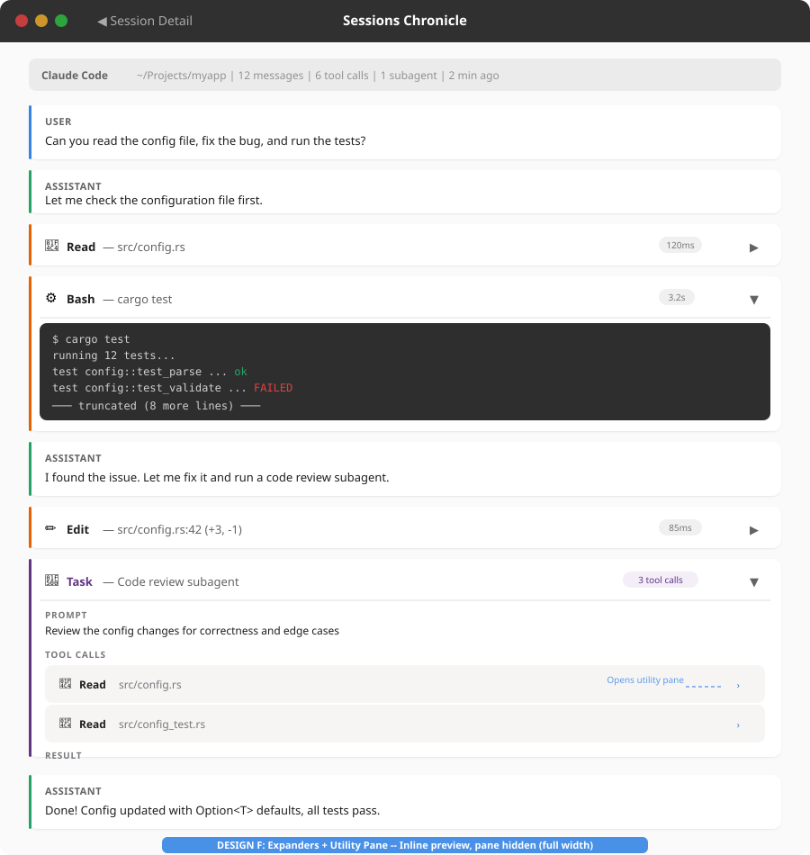
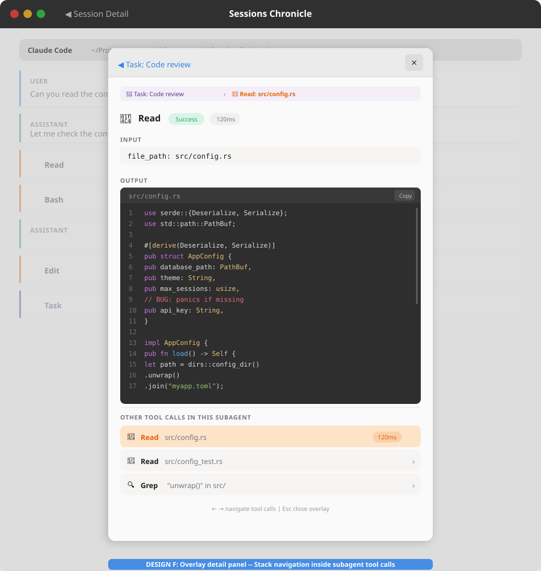

# Tool Calls & Subagents — UI Exploration

Visual exploration of how to display tool calls (Read, Bash, Edit, etc.) and
subagent sessions in the Sessions Chronicle transcript view.

Reference design: [tool-calls-and-subagents-design.md](2026-01-30-tool-calls-and-subagents-design.md)

---

## Proposals

### A — Badges + Detail Panel


Tool calls appear as **compact inline badges** (pills) between messages in the
transcript. Clicking a badge opens a **lateral detail panel** on the right
showing the full input/output.

| Aspect | Detail |
|--------|--------|
| Layout | Split: transcript 60% / detail panel 40% |
| Tool calls | Colored pills inline: `📄 Read`, `⚙ Bash`, `✏ Edit` |
| Subagents | Distinct pill: `🔀 Task` with purple accent |
| Interaction | Click badge → panel shows input, output, duration |
| Navigation | Mini-pills at panel bottom to switch between tool calls |

**Pros:** Compact transcript, full detail on demand, badge navigation.  
**Cons:** Requires lateral panel management, split layout reduces transcript width.

**Analysis:** The 60/40 split is problematic on screens < 1400px. On a typical
GNOME laptop (1366×768 or 1920×1080 with scaling), the transcript at 60%
becomes narrow. The panel is only useful when inspecting a tool call — the rest
of the time it wastes space. For subagents, clicking the `🔀 Task` badge opens
the panel with the subagent prompt + result summary, but there is no mechanism
to drill into the subagent's own tool calls without additional panel navigation
(stack push/pop). The panel concept is strong for detail display, but the
permanent split layout has a high UX cost.

---

### B — Expander Rows (GNOME HIG)


Tool calls are **AdwExpanderRow-style collapsible rows** inline in the
transcript. Follows the GNOME Settings pattern.

| Aspect | Detail |
|--------|--------|
| Layout | Full width, no side panel |
| Tool calls | Full-width expandable rows with chevron ▶/▼ |
| Collapsed | Icon + tool name + summary (e.g. file path, command) |
| Expanded | Monospace content block (terminal output, file content) |
| Subagents | Same pattern, purple accent |

**Pros:** Native GNOME pattern, familiar UX, no panel complexity, full width.  
**Cons:** Expanding a tool pushes messages down, can stretch the transcript.

**Analysis:** Excellent for simple tool calls (Read, Bash, Edit). The pattern
breaks down for subagents: a subagent from Claude Code contains an embedded blob
with its own tool calls — an expander inside an expander becomes confusing.
Similarly, Codex collab threads contain mini-transcripts that don't fit well in
a single expanded row. Long tool outputs (e.g. a `Read` of 200 lines) push
messages far down, disrupting reading flow. Best suited as the primary inline
display, but insufficient alone for subagent hierarchies.

---

### C — Grouped Action Rows (GNOME HIG)


Consecutive tool calls are **grouped into a single AdwPreferencesGroup card**.
Each tool is an **AdwActionRow** inside the group.

| Aspect | Detail |
|--------|--------|
| Layout | Full width, no side panel |
| Tool calls | Grouped in a card: "3 tool calls" header |
| Each row | Icon + bold name + dim summary + chevron › |
| Interaction | Click row → navigates to detail (or expands) |
| Subagents | Separate group card with purple accent |

**Pros:** Reduces visual noise, groups related calls, clean HIG pattern.  
**Cons:** Loses chronological interleaving with text, click target less obvious.

**Analysis:** Good presentation layer, but incomplete as a standalone solution.
The "or expands" in the interaction model hides an unresolved design choice: if
clicking navigates somewhere, it needs a detail view (falling back to a panel or
overlay). The grouping breaks down when the assistant writes text between tool
calls, making the grouping artificial. For subagents, a separate purple group
card works visually, but the subagent's own tool calls have nowhere to display.
Best used as a **bonus grouping heuristic** on top of another proposal: when N
consecutive tool calls appear with no text between them, group them under a
collapsible "N tool calls" header.

---

### D — Timeline Swimlanes (Creative)


The conversation is a **vertical timeline with swimlanes**. Messages flow in
the center, tool calls branch to the right as parallel execution lanes.

| Aspect | Detail |
|--------|--------|
| Layout | 3 columns: time / conversation / tool lanes |
| Tool calls | Branch right with bezier curves, shown in lane boxes |
| Parallelism | Concurrent tools at same Y position |
| Metadata | Duration pills, result summaries on each tool box |
| Subagents | Distinct lane with purple accent, nested sub-tasks |

**Pros:** Shows execution flow and parallelism, rich metadata, unique.  
**Cons:** Complex layout, harder to implement in GTK4, wide screen needed.

**Analysis:** The only proposal that honestly represents parallelism — Claude
Code often launches 3-4 Read calls simultaneously, Codex spawns concurrent
threads. However, GTK4 has no layout engine for this. It would require a custom
`GtkDrawingArea` or absolute positioning in a `GtkFixed`, completely outside
libadwaita. Bezier curves, synchronized Y positioning, resizable swimlanes —
this is a standalone UI project. On a normal screen, 3 columns don't fit.
Accessibility (screen readers, keyboard navigation) would be a significant
challenge. Intellectually the most interesting proposal, but practically
unrealistic for a first pass. Could be revisited as a v2 alternative view.

---

### E — Nested Thought Process (Creative)


The assistant message is a **single tall card** containing everything: text
interleaved with **nested tool cards** at increasing indentation levels.

| Aspect | Detail |
|--------|--------|
| Layout | Full width, single column |
| Tool calls | Cards nested inside the assistant message (indent 24px) |
| Subagents | Double-nested cards (indent 48px), deeper background shade |
| Nesting | Background shading: #fff → #f6f6f6 → #efefef |
| Content | Collapsed (2-line preview + "Show output") or expanded |

**Pros:** Reads like the AI's thought process, natural flow, shows hierarchy.  
**Cons:** Tall messages, deep nesting can become visually heavy.

**Analysis:** The best conceptual representation of the hierarchy. Subagents
from Claude Code (embedded blob) map naturally to a deeper indentation level
with their own tool cards inside. However, messages become very tall — an
assistant that makes 5 tool calls produces a card 500px+ high. Deep nesting (3
levels: message → subagent → tool call → output) reduces usable width. For
OpenCode with separate child sessions, the nesting is artificial — you'd need
to load the child session's data and inject it into the parent's flow. The
collapsed/expanded state management adds significant UI complexity.

---

### F — Expanders + Overlay (Recommended Hybrid)

This proposal combines the strengths of **B (Expander Rows)** for inline
preview and **A (Detail Panel)** for full detail, using an on-demand overlay
instead of a permanent split layout.

#### F1 — Transcript with Expander Rows



The main transcript uses **AdwExpanderRow-style rows** (from Proposal B) for
all tool calls. Each row shows icon + tool name + summary + duration pill, and
can be expanded inline for a quick preview. Subagent rows expand to show a
prompt summary and a **list of inner tool calls** as ActionRows.

#### F2 — Overlay Detail Panel



When the user wants full detail (clicking a `›` chevron on an inner tool call,
or double-clicking any tool row), an **overlay panel** opens on top of the
transcript. This panel uses **AdwNavigationView** stack navigation: you can
drill into a subagent's tool calls and navigate back without leaving the
overlay.

#### Design Summary

| Aspect | Detail |
|--------|--------|
| Layout | Full width transcript (100%), overlay on demand |
| Tool calls | AdwExpanderRow inline: collapsed summary, expand for quick preview |
| Subagents | Expanded row shows prompt + inner tool call list (AdwActionRow) |
| Full detail | Overlay panel (AdwDialog / AdwNavigationView) with stack navigation |
| Navigation | `‹ Back` to parent subagent, `←/→` to navigate sibling tool calls |
| Grouping | Optional: N consecutive tool calls with no text → "N tool calls" group |

#### Interaction Flow

```
Transcript (full width)
├── [User message]
├── [Assistant message]
├── [▶ Read — src/config.rs         120ms]     ← collapsed: click ▶ to expand
├── [▼ Bash — cargo test             3.2s]     ← expanded: inline preview
│   └── $ cargo test
│       running 12 tests...
│       test config::test_validate ... FAILED
│       ─── truncated (8 more lines) ───
├── [Assistant message]
├── [▶ Edit — src/config.rs:42       85ms]     ← collapsed
├── [▼ 🔀 Task — Code review     3 tools]     ← subagent expanded
│   ├── PROMPT: Review the config changes...
│   ├── 📄 Read  src/config.rs           ›     ← click › opens overlay
│   ├── 📄 Read  src/config_test.rs      ›
│   └── RESULT: Looks good. The Option<T>...
└── [Assistant message]

         │ click › on inner tool call
         ▼

┌──────── Overlay Panel ────────┐
│ ‹ Task: Code review           │  ← back to subagent view
│                               │
│ 🔀 Task: Code review › 📄 Read│  ← breadcrumb
│                               │
│ 📄 Read         Success 120ms │
│                               │
│ INPUT                         │
│ ┌───────────────────────────┐ │
│ │ file_path: src/config.rs  │ │
│ └───────────────────────────┘ │
│                               │
│ OUTPUT                        │
│ ┌───────────────────────────┐ │
│ │ 1  use serde::{De...};    │ │
│ │ 2  use std::path::PathBuf;│ │
│ │ ...                       │ │
│ └───────────────────────────┘ │
│                               │
│ OTHER TOOL CALLS              │
│ [📄 Read config.rs ██████████]│  ← current (highlighted)
│ [📄 Read config_test.rs    ›]│
│ [🔍 Grep "unwrap()"        ›]│
│                               │
│   ← → navigate  |  Esc close │
└───────────────────────────────┘
```

#### Per-Parser Behavior

| Parser | Tool calls | Subagents |
|--------|-----------|-----------|
| **Claude Code** | Expander rows from `tool_use` blocks | Subagent row expands to show prompt + inner tools extracted from `tool_result` blob. Click inner tool → overlay with stack |
| **Codex** | Expander rows from `mcp_tool_call_*` / `exec_command_*` events | Subagent row from `collab_agent_spawn_*` events. Inner tools filtered by child `thread_id`. Click → overlay |
| **OpenCode** | Expander rows from `tool` parts (with full lifecycle state) | Subagent row from `subtask` parts. Inner tools loaded from child session (`parentID`). "Open full session" link also available |
| **Mistral Vibe** | Expander rows from `tool_calls[]` + correlated `role: "tool"` results | No subagent support. Tool calls stay at one level |

#### Tool Call ↔ Result Correlation

| Parser | Mechanism | Overlay impact |
|--------|-----------|----------------|
| **Claude Code** | `tool_use.id` → next `tool_result` (API sequencing convention) | Parser must reconstruct pairs before display |
| **Codex** | `call_id` shared between `begin` and `end` events | Direct ID-based lookup |
| **OpenCode** | Single `tool` part contains `state.input` + `state.output` | No correlation needed — self-contained |
| **Mistral Vibe** | `tool_calls[].id` → `tool_call_id` on `role: "tool"` message | ID-based lookup |

#### GTK4/libadwaita Components

| UI Element | Widget |
|-----------|--------|
| Tool call rows (collapsed/expanded) | `AdwExpanderRow` or custom `GtkListBoxRow` with expand logic |
| Inner tool call list (inside subagent) | `AdwActionRow` inside `AdwPreferencesGroup` |
| Overlay detail panel | `AdwDialog` (modal overlay with dim backdrop) |
| Stack navigation in overlay | `AdwNavigationView` with push/pop pages |
| Breadcrumb trail | `GtkBox` with `GtkLabel` + separator |
| Code output block | `GtkSourceView` or `GtkTextView` with monospace |

**Pros:**  
- Full-width transcript (no permanent split)
- Inline preview for quick inspection (expand/collapse)
- Full detail on demand via overlay (no wasted screen space)
- Stack navigation handles subagent nesting naturally
- GNOME HIG compliant (AdwExpanderRow, AdwDialog, AdwNavigationView)
- Works for all 4 parsers with parser-specific correlation strategies
- Optional grouping of consecutive tool calls (Proposal C bonus)

**Cons:**
- Two interaction modes to learn (expand inline vs. open overlay)
- Overlay obscures transcript (mitigated by dimmed backdrop and Esc to close)
- More implementation work than pure B (expanders) due to overlay + navigation

---

## Comparison Matrix

| Criterion | A: Badges | B: Expander | C: Grouped | D: Timeline | E: Nested | **F: Hybrid** |
|-----------|-----------|-------------|------------|-------------|-----------|---------------|
| GNOME HIG compliance | Medium | High | High | Low | Medium | **High** |
| Implementation complexity | Medium | Low | Low | High | Medium | **Medium** |
| Transcript readability | High | Medium | High | Medium | Medium | **High** |
| Tool detail visibility | High (panel) | High (inline) | Low (nav) | Medium | High (inline) | **High (both)** |
| Parallelism display | No | No | No | Yes | No | No |
| Subagent hierarchy | Badge only | Row only | Group | Swimlane | Nesting | **Expand + overlay stack** |
| Screen width needed | Wide (split) | Normal | Normal | Wide (3-col) | Normal | **Normal** |
| Multi-parser support | Medium | Medium | Medium | Low | Medium | **High** |

---

## Recommendation

**Proposal F (Expanders + Overlay)** is the recommended approach. It provides
the best balance of HIG compliance, transcript readability, and subagent
support across all four parsers. The inline expander rows handle 90% of tool
call inspection needs (quick preview), while the overlay panel handles the 10%
that requires full detail or subagent drill-down.

The optional grouping heuristic from Proposal C can be layered on top: when N
consecutive tool calls appear with no interleaved text, collapse them under a
"N tool calls" header. This reduces visual noise without losing chronological
accuracy.
