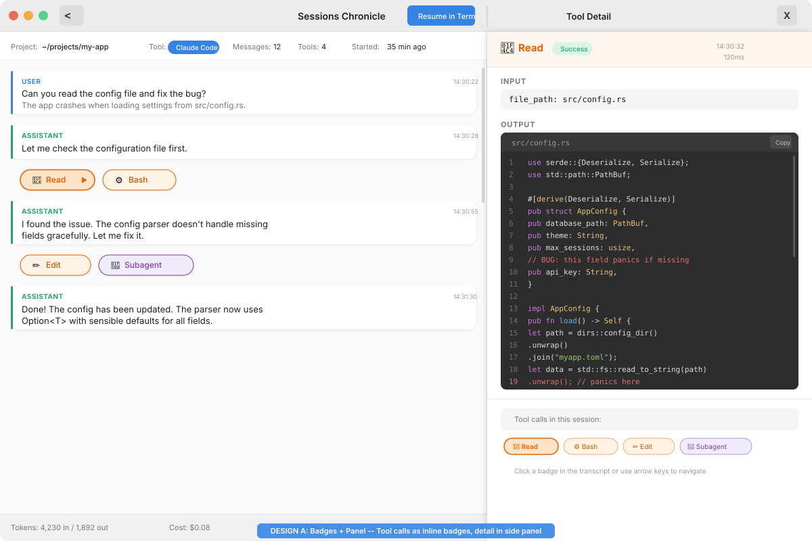
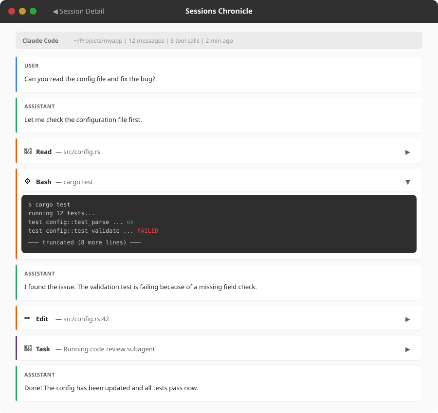
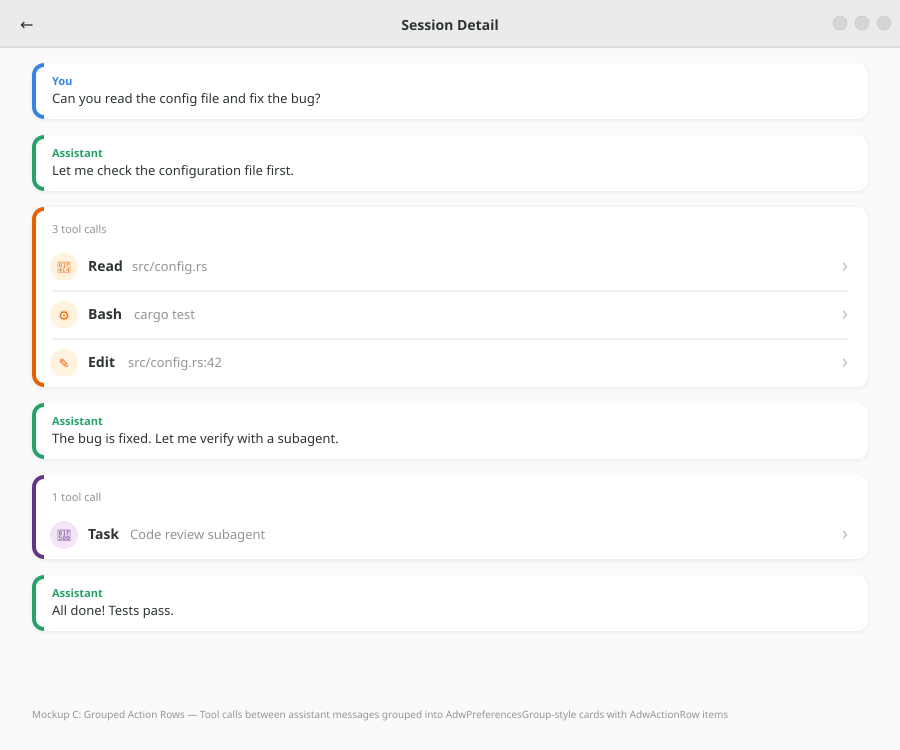
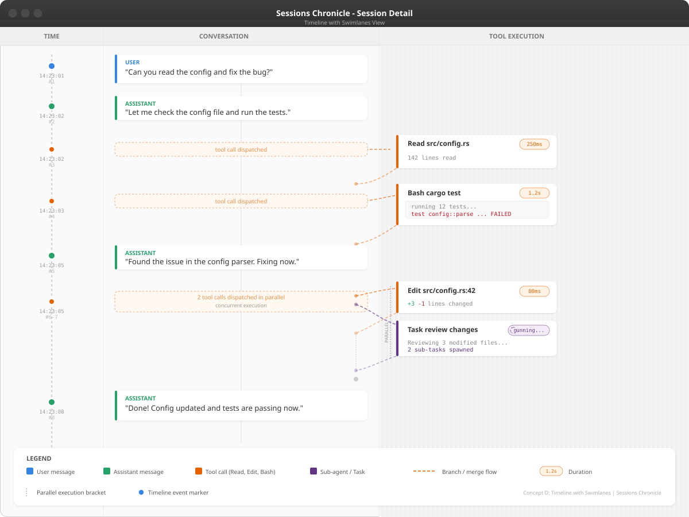
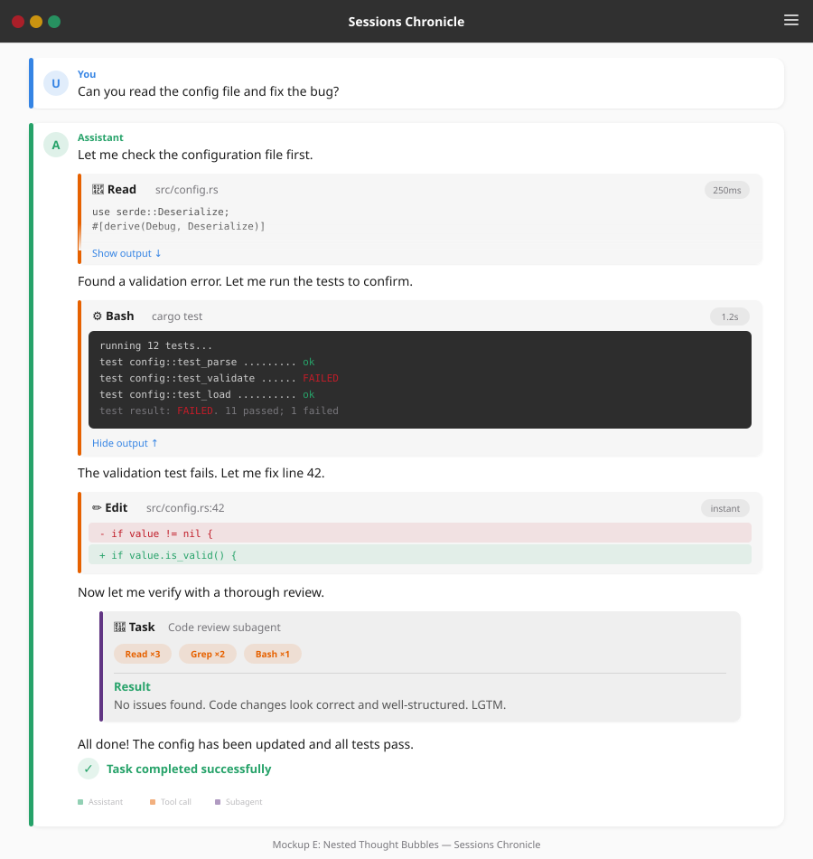

# Tool Calls & Subagents — UI Exploration

Visual exploration of how to display tool calls (Read, Bash, Edit, etc.) and
subagent sessions in the Sessions Chronicle transcript view.

Reference design: [tool-calls-and-subagents-design.md](2026-01-30-tool-calls-and-subagents-design.md)

---

## Proposals

### A — Badges + Detail Panel

Tool calls appear as **compact inline badges** (pills) between messages in the
transcript. Clicking a badge opens a **lateral detail panel** on the right
showing the full input/output.

| Aspect | Detail |
|--------|--------|
| Layout | Split: transcript 60% / detail panel 40% |
| Tool calls | Colored pills inline: `📄 Read`, `⚙ Bash`, `✏ Edit` |
| Subagents | Distinct pill: `🔀 Task` with purple accent |
| Interaction | Click badge → panel shows input, output, duration |
| Navigation | Mini-pills at panel bottom to switch between tool calls |

**Pros:** Compact transcript, full detail on demand, badge navigation.  
**Cons:** Requires lateral panel management, split layout reduces transcript width.

---

### B — Expander Rows (GNOME HIG)

Tool calls are **AdwExpanderRow-style collapsible rows** inline in the
transcript. Follows the GNOME Settings pattern.

| Aspect | Detail |
|--------|--------|
| Layout | Full width, no side panel |
| Tool calls | Full-width expandable rows with chevron ▶/▼ |
| Collapsed | Icon + tool name + summary (e.g. file path, command) |
| Expanded | Monospace content block (terminal output, file content) |
| Subagents | Same pattern, purple accent |

**Pros:** Native GNOME pattern, familiar UX, no panel complexity, full width.  
**Cons:** Expanding a tool pushes messages down, can stretch the transcript.

---

### C — Grouped Action Rows (GNOME HIG)

Consecutive tool calls are **grouped into a single AdwPreferencesGroup card**.
Each tool is an **AdwActionRow** inside the group.

| Aspect | Detail |
|--------|--------|
| Layout | Full width, no side panel |
| Tool calls | Grouped in a card: "3 tool calls" header |
| Each row | Icon + bold name + dim summary + chevron › |
| Interaction | Click row → navigates to detail (or expands) |
| Subagents | Separate group card with purple accent |

**Pros:** Reduces visual noise, groups related calls, clean HIG pattern.  
**Cons:** Loses chronological interleaving with text, click target less obvious.

---

### D — Timeline Swimlanes (Creative)

The conversation is a **vertical timeline with swimlanes**. Messages flow in
the center, tool calls branch to the right as parallel execution lanes.

| Aspect | Detail |
|--------|--------|
| Layout | 3 columns: time / conversation / tool lanes |
| Tool calls | Branch right with bezier curves, shown in lane boxes |
| Parallelism | Concurrent tools at same Y position |
| Metadata | Duration pills, result summaries on each tool box |
| Subagents | Distinct lane with purple accent, nested sub-tasks |

**Pros:** Shows execution flow and parallelism, rich metadata, unique.  
**Cons:** Complex layout, harder to implement in GTK4, wide screen needed.

---

### E — Nested Thought Process (Creative)

The assistant message is a **single tall card** containing everything: text
interleaved with **nested tool cards** at increasing indentation levels.

| Aspect | Detail |
|--------|--------|
| Layout | Full width, single column |
| Tool calls | Cards nested inside the assistant message (indent 24px) |
| Subagents | Double-nested cards (indent 48px), deeper background shade |
| Nesting | Background shading: #fff → #f6f6f6 → #efefef |
| Content | Collapsed (2-line preview + "Show output") or expanded |

**Pros:** Reads like the AI's thought process, natural flow, shows hierarchy.  
**Cons:** Tall messages, deep nesting can become visually heavy.

---

## Comparison Matrix

| Criterion | A: Badges | B: Expander | C: Grouped | D: Timeline | E: Nested |
|-----------|-----------|-------------|------------|-------------|-----------|
| GNOME HIG compliance | Medium | High | High | Low | Medium |
| Implementation complexity | Medium | Low | Low | High | Medium |
| Transcript readability | High | Medium | High | Medium | Medium |
| Tool detail visibility | High (panel) | High (inline) | Low (nav) | Medium | High (inline) |
| Parallelism display | No | No | No | Yes | No |
| Subagent hierarchy | Badge only | Row only | Group | Swimlane | Nesting |
| Screen width needed | Wide (split) | Normal | Normal | Wide (3-col) | Normal |
