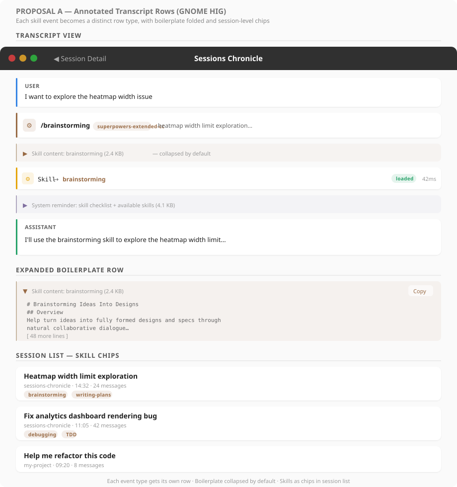
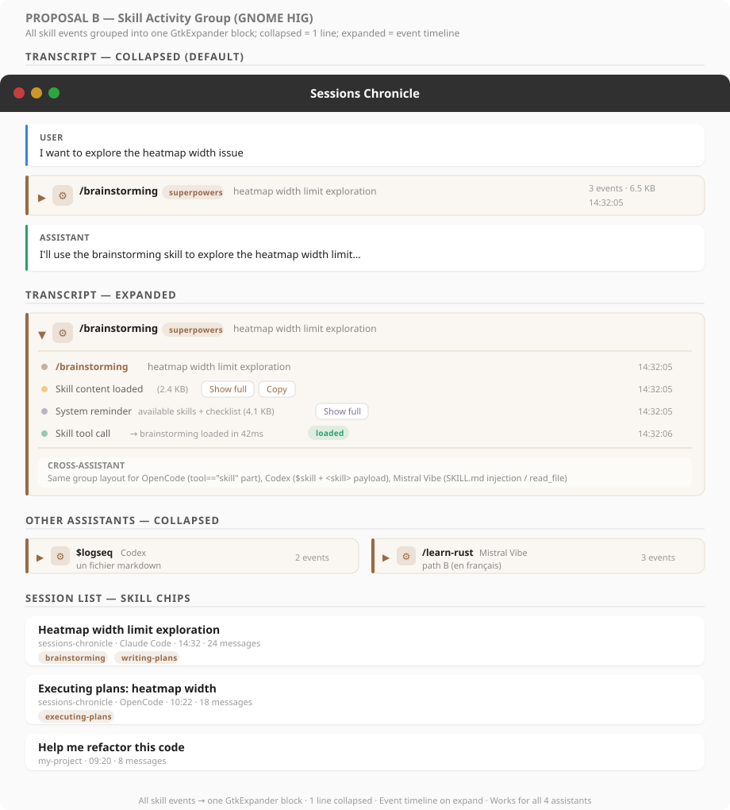
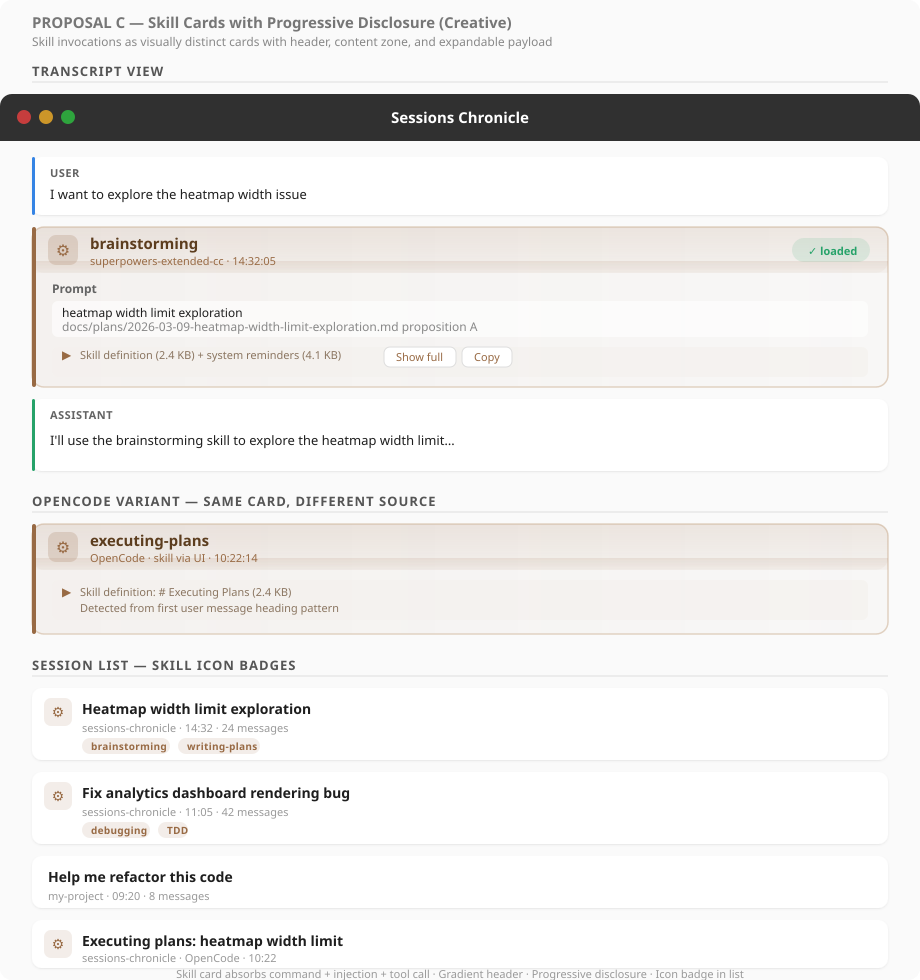

# Skill Visibility — UI Exploration

How to surface skill invocations across the full lifecycle: command parsing,
boilerplate folding, tool call compaction, and session-level metadata.

Supersedes the earlier command-display exploration by treating skills as a
cross-assistant, end-to-end concern.

**Related:** [#47 — Skill tool visibility](https://github.com/supermaciz/sessions-chronicle/issues/47)

---

## Problem

Skills are a first-class workflow concept across AI assistants, but Sessions
Chronicle treats them as raw data. This produces four visible problems:

1. **Garbled user messages** — Claude Code encodes slash commands as XML tags
   (`<command-message>brainstorming</command-message>…`), displayed verbatim.
2. **Generic tool call rows** — the Skill tool call shows `Skill` with no
   indication of *which* skill was loaded.
3. **Boilerplate flooding** — full skill definitions (2-5 KB of markdown) and
   system reminders (4+ KB) appear as regular user/system messages, drowning
   out the actual conversation.
4. **No session-level signal** — no way to see at a glance that a session used
   brainstorming, TDD, or debugging workflows.

## Data Format — Cross-Assistant

Skills appear differently depending on the assistant:

### Claude Code

Three data events per skill invocation:

**1. User message** — the slash command (XML tags in `message.content`):
```json
{
  "type": "user",
  "message": {
    "content": "<command-message>brainstorming</command-message>\n<command-name>/brainstorming</command-name>\n<command-args>heatmap width limit exploration</command-args>"
  }
}
```

**2. System injection** — skill markdown and system reminders:
```json
{
  "type": "user",
  "message": {
    "content": "<system-reminder>\nThe following skills are available...\n</system-reminder>"
  }
}
```

**3. Skill tool call** — assistant-side `tool_use`:
```json
{
  "type": "assistant",
  "message": {
    "content": [
      { "type": "tool_use", "name": "Skill", "input": { "skill": "brainstorming", "args": "..." } }
    ]
  }
}
```

**Tags reference:**

| Tag | Content |
|-----|---------|
| `<command-name>` | Slash command with `/` prefix |
| `<command-message>` | Command identifier without prefix |
| `<command-args>` | Arguments (may be empty or multiline) |
| `<system-reminder>` | Injected skill content and checklists |
| `<local-command-stdout>` | Output from local commands like `/model` |

### OpenCode

**Single event** — skill content injected as the first user text part:

```
# Executing Plans

## Overview

Load plan, review critically, execute tasks in batches…
```

- No XML tags, no special metadata fields.
- Detected by heading pattern: first user message text starts with `# Skill Name`.
- 26 sessions in the local database use this pattern (brainstorming,
  writing-plans, executing-plans, debugging, writing-skills, etc.).

### Codex / Mistral Vibe

No skill system — these assistants are unaffected.

---

## Proposals

### A — Annotated Transcript Rows (GNOME HIG)



Each skill lifecycle event becomes a **distinct, typed row** in the transcript.
Follows existing patterns (message rows, tool call rows) without introducing
new layout concepts.

| Component | Treatment |
|-----------|-----------|
| Slash command | Dedicated command row — brown `#986a44` accent, gear icon, skill name bold, source badge, args as subtitle |
| Skill content | Folded row — muted background, 1-line stub (`Skill content: brainstorming (2.4 KB)`), expand on demand |
| System reminders | Folded row — purple-grey tint, same expand pattern |
| Skill tool call | Enhanced tool call row — shows `Skill → brainstorming` instead of generic `Skill` |
| Session list | Skill chips below subtitle line |

**Pros:**
- Lowest conceptual overhead — every element maps to an existing row pattern.
- Folded boilerplate rows are individually expandable, so power users can
  inspect any single piece.
- Incremental implementation: each row type can ship independently.

**Cons:**
- A single skill invocation still produces 3-4 visible rows in the transcript
  (command + 1-2 folded + tool call), even when collapsed.
- The connection between related rows is implicit — nothing visually groups
  "these 4 rows are all part of the same skill invocation."
- More visual noise than proposals B/C for transcript-heavy sessions.

**Analysis:** The safest, most conservative option. Works well if skill
invocations are infrequent in a session (1-2 per session). Becomes cluttered
for sessions with many skill invocations. Good first step that can evolve
toward proposal B later.

---

### B — Skill Activity Group (GNOME HIG)



All events for a single skill invocation are **grouped into one collapsible
block** with a summary header. Collapsed by default — the entire skill
lifecycle appears as a single line in the transcript.

| Component | Treatment |
|-----------|-----------|
| Group header (collapsed) | Brown accent, gear icon, skill name + source, args preview, event count, timestamp |
| Group body (expanded) | Timeline of events: command, skill content loaded, system reminders, tool call status |
| Skill content | "Show full" / "Copy" buttons inline in the expanded timeline |
| Session list | Skill chips below subtitle line |

**Pros:**
- Maximum noise reduction — an entire skill invocation occupies one line
  when collapsed.
- Clear visual grouping — no ambiguity about which events belong together.
- The expanded timeline provides full forensic detail when needed.
- Works identically for Claude Code and OpenCode (different internal events,
  same group header).

**Cons:**
- Requires grouping logic in the parser/indexer — must correlate command,
  system reminders, and Skill tool call as belonging to the same invocation.
- New UI concept (grouped rows) not used elsewhere in the transcript.
- Heuristic grouping may misfire on edge cases (e.g., skill content injected
  before or after the command).

**Analysis:** The strongest option for daily use. Treats skills as a semantic
unit rather than a sequence of raw events. The grouping heuristic for Claude
Code is straightforward (command → following system reminders → next Skill
tool call), and for OpenCode even simpler (first user message matching
`# Heading` pattern). The expanded timeline view serves as a debugging tool
for skill issues. New UI pattern, but follows GNOME HIG expander/group
conventions.

---

### C — Skill Cards with Progressive Disclosure (Creative)



Each skill invocation becomes a **visually distinct card** — a bordered,
gradient-shaded container that stands apart from regular message and tool
call rows. The card header shows skill identity, and the body provides
progressive disclosure of content.

| Component | Treatment |
|-----------|-----------|
| Card header | Gradient band — skill icon (large), bold name, source label, status pill |
| Prompt section | User's args displayed in a clean inset box |
| Payload section | Collapsed stub showing total skill content size, "Show full" / "Copy" actions |
| Session list | Gear icon badge on sessions that use skills, plus skill name chips |

**Pros:**
- Strongest visual distinction — skills are immediately recognizable as a
  different kind of interaction, not just another message.
- The gradient header and card border create a clear "landmark" when scrolling
  through long transcripts.
- Progressive disclosure is natural: header → prompt → payload, each level
  adds detail.
- The icon badge in the session list provides instant visual scanning.

**Cons:**
- Most visually opinionated — the gradient and card styling may clash with
  GNOME HIG's flat aesthetic.
- Card layout is a new visual pattern not used by messages or tool calls,
  potentially inconsistent.
- The "prompt" section may feel redundant if the user's actual message already
  appears as a separate row before the card.

**Analysis:** The most distinctive option. Works best if skills are treated as
*landmark events* in a session — visual anchors that structure the
conversation history. The gradient header is a strong visual signal but may
need toning down for HIG compliance (solid color instead of gradient). The
icon badge in the session list is independently valuable and could be adopted
by any proposal. Risk: visual weight may overwhelm in sessions with many
skill invocations.

---

## Cross-Cutting: Session List Titles

When a slash command is the **first message** in a session, it currently
becomes the session title as raw XML. All proposals require the same title
parsing:

1. Detect `<command-name>` tags (Claude Code) or `# Heading` pattern
   (OpenCode) in the first message.
2. Extract the skill/command name and args.
3. Display as readable text (e.g., `brainstorming: heatmap width limit`)
   instead of raw tags.

This is independent of the transcript rendering proposal chosen.

## Cross-Cutting: Skill Extraction for Chips

All proposals share the same **skill name extraction** logic:

| Source | Extraction |
|--------|-----------|
| Claude Code `<command-name>` | Strip `/` prefix, split on `:` for namespaced skills |
| Claude Code `Skill` tool call | Read `input.skill` field |
| OpenCode first user message | Parse `# Heading` from first text part |

Extracted skill names are stored in the database and used for:
- Session list chips / badges
- Search and filtering (`skill:brainstorming`)
- Analytics (most-used skills over time)

---

## Summary

| Proposal | Style | Noise reduction | Grouping | New UI patterns | Complexity |
|----------|-------|----------------|----------|----------------|------------|
| A — Annotated rows | Conservative HIG | Medium (folding) | None (implicit) | Folded row | Low |
| B — Activity group | Structured HIG | High (single line) | Explicit | Grouped block | Medium |
| C — Skill cards | Creative | High (card) | Explicit | Card + gradient | Medium-High |

All proposals share: skill chips in session list, title parsing, skill name
extraction, and the same detection heuristics for Claude Code and OpenCode.

---

## Decision

*Pending — awaiting review of mockups and discussion.*
