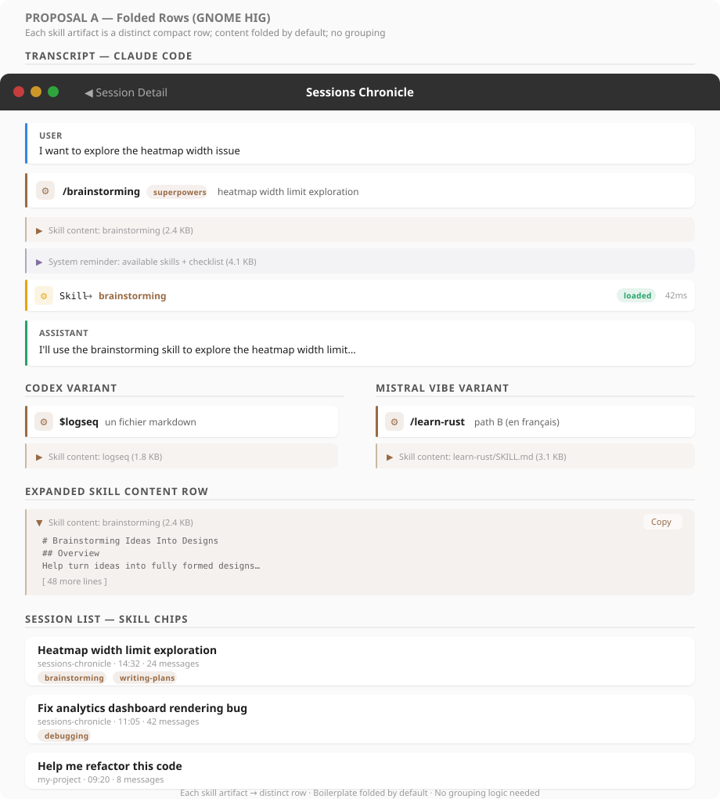
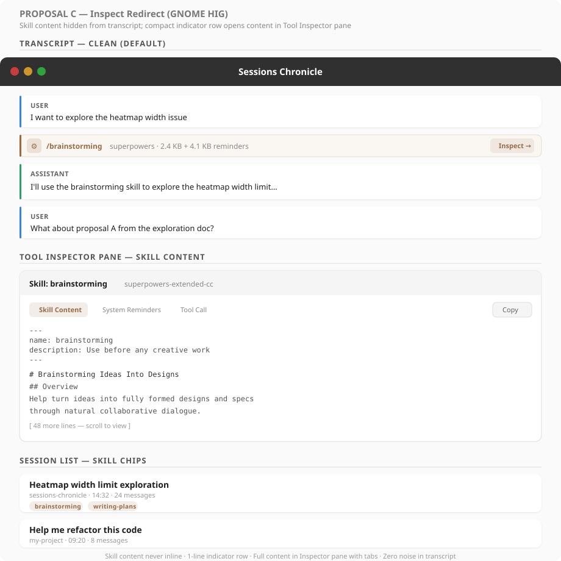
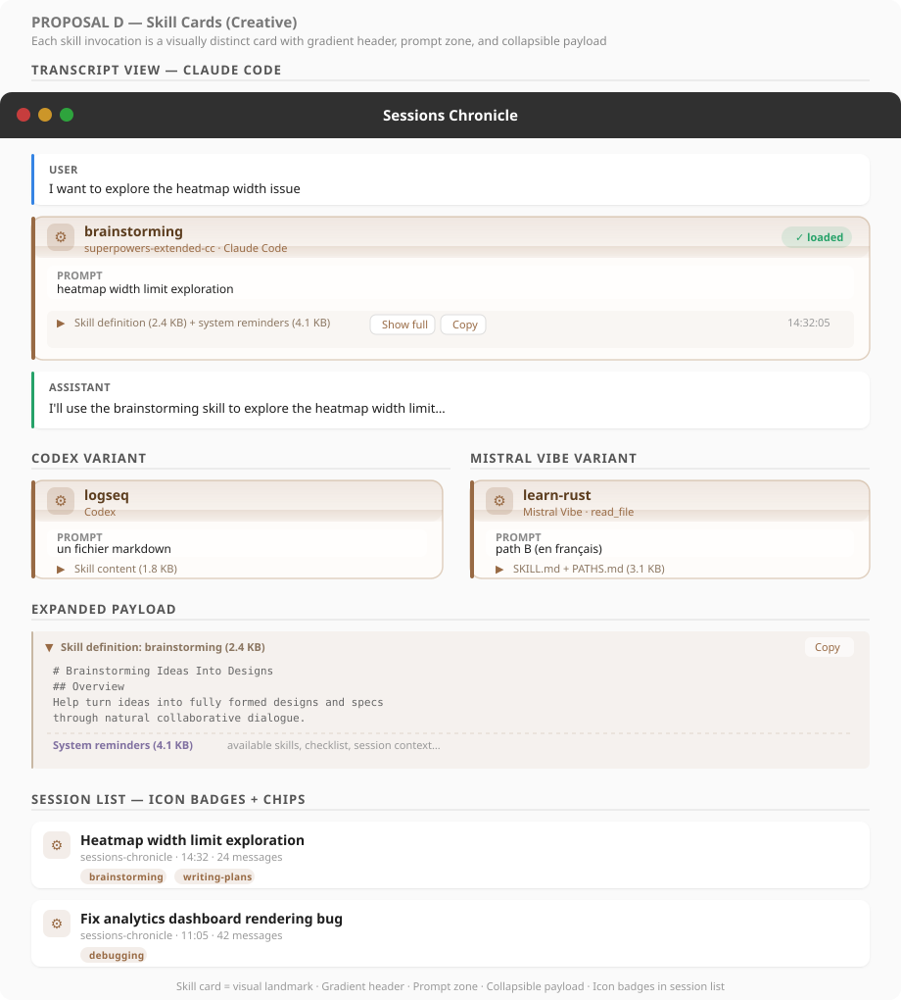

# Skill Visibility — UI Exploration

How to surface skill invocations across the full lifecycle: command parsing,
boilerplate folding, tool call compaction, and session-level metadata.

Supersedes the earlier command-display exploration by treating skills as a
cross-assistant, end-to-end concern.

**Related:** [#47 — Skill tool visibility](https://github.com/supermaciz/sessions-chronicle/issues/47)

---

## Problem

Skills are a first-class workflow concept across AI assistants, but Sessions
Chronicle treats them as raw data. This produces four visible problems:

1. **Garbled user messages** — Claude Code encodes slash commands as XML tags
   (`<command-message>brainstorming</command-message>…`), displayed verbatim.
2. **Generic tool call rows** — the Skill tool call shows `Skill` with no
   indication of *which* skill was loaded.
3. **Boilerplate flooding** — full skill definitions (2-5 KB of markdown) and
   system reminders (4+ KB) appear as regular user/system messages, drowning
   out the actual conversation.
4. **No session-level signal** — no way to see at a glance that a session used
   brainstorming, TDD, or debugging workflows.

## Data Format — Cross-Assistant

Skills appear differently depending on the assistant. The table below
summarizes the primary detection markers and the noise sources:

| Assistant | Invocation marker | Loaded skill marker | Noise source(s) |
|-----------|------------------|---------------------|-----------------|
| Claude Code | `<command-name>/skill</command-name>` in user message | `Skill` tool call with `input.skill` | Injected skill markdown + system reminders as user messages |
| OpenCode | (implicit — user message triggers skill) | `tool == "skill"` part with `state.metadata.name` | Injected skill markdown as first `text` part of user message |
| Codex | `$skill-name` token in `user_message` | `<skill><name>…</name></skill>` wrapper in `response_item` | Injected `<skill>` payload as separate user-role message |
| Mistral Vibe | `/<skill-name>` user input | Full `SKILL.md` body as user message (exact path) or `read_file` tool call (free-form path) | Entire user message replaced by SKILL.md content |

### Claude Code

Three data events per skill invocation:

**1. User message** — the slash command (XML tags in `message.content`):
```json
{
  "type": "user",
  "message": {
    "content": "<command-message>brainstorming</command-message>\n<command-name>/brainstorming</command-name>\n<command-args>heatmap width limit exploration</command-args>"
  }
}
```

**2. System injection** — skill markdown and system reminders:
```json
{
  "type": "user",
  "message": {
    "content": "<system-reminder>\nThe following skills are available...\n</system-reminder>"
  }
}
```

**3. Skill tool call** — assistant-side `tool_use`:
```json
{
  "type": "assistant",
  "message": {
    "content": [
      { "type": "tool_use", "name": "Skill", "input": { "skill": "brainstorming", "args": "..." } }
    ]
  }
}
```

**Tags reference:**

| Tag | Content |
|-----|---------|
| `<command-name>` | Slash command with `/` prefix |
| `<command-message>` | Command identifier without prefix |
| `<command-args>` | Arguments (may be empty or multiline) |
| `<system-reminder>` | Injected skill content and checklists |
| `<local-command-stdout>` | Output from local commands like `/model` |

### OpenCode

Two data events per skill invocation:

**1. User message** — skill markdown injected as the first user text part
(the reliable marker is the **assistant-side** `skill` tool part, not the
user text):

```
# Executing Plans
## Overview
Load plan, review critically, execute tasks in batches…
```

**2. Assistant skill tool part** — native OpenCode `tool` part:
```json
{
  "type": "tool",
  "tool": "skill",
  "state": {
    "status": "completed",
    "input": { "name": "brainstorming" },
    "metadata": {
      "name": "brainstorming",
      "dir": "/home/user/.config/opencode/skills/superpowers/brainstorming",
      "truncated": false
    },
    "title": "Loaded skill: brainstorming"
  }
}
```

- Detect with `part.data.type == "tool"` and `part.data.tool == "skill"`.
- Skill identity from `state.metadata.name`, fallback `state.input.name`.
- The parent user message (via `message.data.parentID`) contains the injected
  markdown as payload.

### Codex

Two data events per skill invocation:

**1. User message** — explicit `$skill-name` invocation:
```json
{
  "type": "event_msg",
  "payload": {
    "type": "user_message",
    "message": "$logseq un fichier markdown",
    "text_elements": [
      { "byte_range": { "start": 0, "end": 7 }, "placeholder": "$logseq" }
    ]
  }
}
```

**2. Injected skill payload** — separate `response_item` user message:
```xml
<skill>
<name>logseq</name>
<path>/home/user/project/skills/logseq/SKILL.md</path>
---
name: logseq
description: ...
---
...
</skill>
```

- Best marker: `<skill>` wrapper in a `response_item` with `role == "user"`.
- Extract name from `<name>…</name>`, fallback to leading `$skill-name` token.
- No dedicated Codex-native `tool call` for skill loading.

### Mistral Vibe

Two loading paths, neither has a dedicated skill event:

**Exact slash path** — `/<skill-name>`:
- The first persisted `role == "user"` message is the full `SKILL.md` body.
- Session title is polluted by the injected content.

**Free-form path** — `/<skill-name> args`:
- User message is `/<skill-name> args` literally.
- Assistant reads `skills/<skill-name>/SKILL.md` via `read_file` tool call.

- No native Mistral Vibe skill `tool call` marker exists.
- Best detection: user message is SKILL.md body (exact path) or `read_file`
  pointing to `skills/<skill-name>/SKILL.md` (free-form path).

---

## Current UI Patterns

Before proposing changes, here is how the relevant UI works today:

- **Transcript rows** use `TranscriptRow` factory components with role-colored
  left borders: blue (user), green (assistant), orange (tool call).
- **Tool call rows** are compact: icon + name (monospace) + status badge +
  duration + inspect button + optional preview line.
- **Expand/collapse** exists for long messages (button-based toggle, loads full
  content from DB on demand). No native `GtkExpander` or `AdwExpanderRow` used.
- **Tool Inspector pane** shows full tool call details with tab-like renderer
  types (terminal, diff, file, generic, subagent).
- **Session list** uses `adw::ActionRow` with title, subtitle, and no skill
  metadata currently.
- **GTK4 `GtkExpander`** is the recommended widget for collapsible content in
  dynamic lists (not `AdwExpanderRow`, which targets static boxed lists).

---

## Proposals

### A — Folded Rows (GNOME HIG)



Each skill lifecycle event becomes a **distinct, typed row** in the transcript.
Boilerplate rows are collapsed by default. Extends existing `TranscriptRow`
patterns without introducing new layout concepts.

| Component | Treatment |
|-----------|-----------|
| Slash command | Dedicated command row — brown `#986a44` accent, gear icon, skill name bold, source badge, args as subtitle |
| Skill content | Folded row — muted `#f4f0ec` background, 1-line stub (`Skill content: brainstorming (2.4 KB)`), expand on click |
| System reminders | Folded row — purple-grey `#f0eff4` tint, same expand pattern |
| Skill tool call | Enhanced tool call row — shows `Skill → brainstorming` instead of generic `Skill` |
| Session list | Skill chips below subtitle line |

**Pros:**
- Lowest implementation cost — each row type can ship independently.
- No new widget types: extends existing `TranscriptRow` + CSS classes.
- Individually expandable rows for power users who want to inspect any piece.

**Cons:**
- A single skill invocation still produces 3-4 visible rows even when
  collapsed (command + folded content + folded reminders + tool call).
- No visual grouping — the connection between rows is implicit.
- More visual noise than proposals B-D for sessions with frequent skill use.

**Implementation notes:**
- New `TranscriptItemInit` variants: `SkillCommand`, `FoldedContent`.
- CSS: `.skill-command-row`, `.folded-content-row`, `.folded-reminder-row`.
- Parser: detect skill artifacts during indexing and tag them with metadata.

**Analysis:** The safest starting point. Works well for sessions with 1-2
skill invocations. Becomes cluttered with heavy skill use (5+ per session).
Good first step that can evolve toward Proposal B.

---

### B — Skill Activity Group (GNOME HIG)


All events for a single skill invocation are **grouped into one collapsible
`GtkExpander` block** with a summary header. Collapsed by default — the entire
skill lifecycle appears as a single line in the transcript.

| Component | Treatment |
|-----------|-----------|
| Group header (collapsed) | Brown accent, gear icon, skill name + source badge, args preview, event count, byte size, timestamp |
| Group body (expanded) | Timeline of events: command, skill content loaded (with Show full / Copy), system reminders (with Show full), tool call status |
| Session list | Skill chips below subtitle line |

**Grouping heuristic per assistant:**

| Assistant | Group anchor | Group members |
|-----------|-------------|---------------|
| Claude Code | `<command-name>` user message | Following system-reminder user messages + next `Skill` tool call |
| OpenCode | `tool == "skill"` assistant part | Parent user message (skill markdown) via `parentID` |
| Codex | `$skill-name` user message | Following `<skill>` payload user message |
| Mistral Vibe | `SKILL.md`-body user message (exact) or `read_file(SKILL.md)` tool call (free-form) | Associated `read_file` tool calls for same skill directory |

**Pros:**
- Maximum noise reduction — an entire skill invocation occupies one line
  when collapsed.
- Clear visual grouping — no ambiguity about which events belong together.
- The expanded timeline provides full forensic detail when needed.
- Identical collapsed appearance across all four assistants.

**Cons:**
- Requires grouping logic in the parser/indexer — must correlate events
  across messages per assistant.
- New UI pattern (`GtkExpander` inside factory) not used elsewhere yet.
- Edge cases: multiple skills loaded in one assistant reply, partial skill
  loads (invoked but not loaded).

**Implementation notes:**
- New `TranscriptItemInit::SkillGroup` variant wrapping child events.
- Uses `gtk4::Expander` inside `TranscriptRow` for collapse/expand.
- Deferred content: build child widgets only on first expand.
- Parser emits `SkillInvocation` records during indexing; UI groups them.

**Analysis:** The strongest option for daily use. Treats skills as a semantic
unit. The grouping heuristic for Claude Code is the most complex (3 events
across messages); OpenCode's is the cleanest (single `tool == "skill"` part).
New UI pattern, but `GtkExpander` follows GTK4 conventions and integrates
naturally into the existing factory-based transcript.

---

### C — Inspect Redirect (GNOME HIG)



Skill content is **not displayed inline** in the transcript at all. Instead,
a single compact **indicator row** replaces all skill noise. Clicking the
row opens the full skill content in the existing **Tool Inspector pane**,
which already handles multi-tab detail views.

| Component | Treatment |
|-----------|-----------|
| Indicator row | Compact 36px row — brown accent, gear icon, skill name, byte size summary, "Inspect →" button |
| Inspector pane | Tabbed view: "Skill Content" tab (full markdown), "System Reminders" tab, "Tool Call" tab (status/timing) |
| Transcript | Zero noise — only the indicator row sits between user message and assistant reply |
| Session list | Skill chips below subtitle line |

**Pros:**
- Absolute minimum noise in the transcript — one 36px row per invocation.
- Leverages the existing Tool Inspector pane (already built, with renderers
  for markdown, terminal output, diffs, etc.).
- No inline expansion — keeps the transcript flow perfectly clean.
- Inspector tabs give structured access to each piece independently.

**Cons:**
- Skill content is not visible without opening the inspector — less
  discoverable for users who don't know the inspector exists.
- Requires the inspector pane to be open (or auto-opened on click).
- Users who prefer inline content must learn a new interaction pattern.

**Implementation notes:**
- New `TranscriptItemInit::SkillIndicator` variant (minimal data).
- New inspector renderer: `SkillRenderer` with tabs for content, reminders,
  tool call metadata.
- Parser: same skill extraction as other proposals, but UI only emits one
  row per invocation.
- Click handler sends `OpenInspector(skill_id)` message.

**Analysis:** The most aggressive noise reduction. Ideal for users who treat
skills as plumbing and just want to read the conversation. The inspector
already supports rich content rendering, so the skill content would be
displayed with full markdown formatting, syntax highlighting, and copy
support. Risk: users who don't use the inspector regularly might miss skill
details entirely.

---

### D — Skill Cards (Creative)



Each skill invocation becomes a **visually distinct card** — a bordered,
gradient-shaded container that stands apart from regular message and tool
call rows. Progressive disclosure: header → prompt → collapsed payload.

| Component | Treatment |
|-----------|-----------|
| Card header | Gradient band (`#986a44` 14% → 4% opacity), gear icon (large), bold skill name, source label, status pill |
| Prompt zone | User's args displayed in a clean inset box |
| Payload zone | Collapsed stub showing skill definition + reminders byte sizes, "Show full" / "Copy" actions, expand on click |
| Session list | Gear icon badge on sessions that use skills, plus skill name chips |

**Pros:**
- Strongest visual distinction — skills are immediately recognizable as a
  different kind of interaction, not just another message.
- The gradient header creates a clear "landmark" when scrolling through
  long transcripts.
- Progressive disclosure is natural: header → prompt → payload, each level
  adds detail.
- Works identically for all four assistants (different internal events,
  same card rendering).

**Cons:**
- Most visually opinionated — the gradient styling may clash with GNOME
  HIG's flat aesthetic in some themes.
- Card layout is a new visual pattern not used by messages or tool calls,
  introducing visual inconsistency.
- The "prompt" zone may feel redundant if the user's actual message already
  appears as a separate row before the card.
- Visual weight may overwhelm in sessions with many skill invocations
  (5+ cards among regular messages).

**Implementation notes:**
- New `TranscriptItemInit::SkillCard` variant.
- CSS: `.skill-card`, `.skill-card-header` (gradient), `.skill-card-prompt`,
  `.skill-card-payload` (collapsible).
- Same grouping logic as Proposal B (one card absorbs all skill events).
- Expand/collapse for payload zone uses existing button-based toggle pattern.

**Analysis:** The most distinctive option. Treats skills as *landmark events*
that structure the conversation. The gradient header is a strong visual signal
but should be tunable (solid color fallback for HIG-strict themes). The icon
badge in the session list is independently valuable and could be adopted by
any proposal. Risk: visual weight may dominate in skill-heavy sessions.

---

## Cross-Cutting: Session List Titles

When a slash command is the **first message** in a session, it currently
becomes the session title as raw XML. All proposals require the same title
parsing:

1. Detect `<command-name>` tags (Claude Code), the first OpenCode
   `tool == "skill"` marker, the first Codex `$skill-name` / `<skill>`
   pair, or the first Mistral Vibe `SKILL.md` body associated with the
   opening message span.
2. Extract the skill/command name and args.
3. Display as readable text (e.g., `brainstorming: heatmap width limit`)
   instead of raw tags or SKILL.md frontmatter.

This is independent of the transcript rendering proposal chosen.

## Cross-Cutting: Skill Extraction for Chips

All proposals share the same **skill name extraction** logic:

| Source | Extraction |
|--------|-----------|
| Claude Code `<command-name>` | Strip `/` prefix, split on `:` for namespaced skills |
| Claude Code `Skill` tool call | Read `input.skill` field |
| OpenCode `tool == "skill"` part | Read `state.metadata.name`, fallback `state.input.name` |
| Codex injected `<skill>` payload | Read `<name>…</name>`, fallback leading `$skill-name` |
| Mistral Vibe exact path | Parse SKILL.md frontmatter `name:` field from user message |
| Mistral Vibe free-form path | Extract `skills/<name>/SKILL.md` from `read_file` arguments |

Extracted skill names are stored in the database and used for:
- Session list chips / badges
- Search and filtering (`skill:brainstorming`)
- Analytics (most-used skills over time)

## Cross-Cutting: Incremental Path

Proposals A through D are not mutually exclusive. A viable incremental path:

1. **Phase 1 — Extraction:** Implement skill name extraction and session list
   chips. Title cleaning. These are shared by all proposals and provide
   immediate value.
2. **Phase 2 — Transcript:** Implement one of the transcript proposals (A, B,
   C, or D). Proposal A is the simplest start; B is the recommended target.
3. **Phase 3 — Enhancement:** Add the inspector skill renderer (useful for
   both B and C). Add skill-based search filtering.

---

## Summary

| Proposal | Style | Noise reduction | Grouping | New UI patterns | Complexity |
|----------|-------|----------------|----------|----------------|------------|
| A — Folded rows | Conservative HIG | Medium (folding) | None (implicit) | Folded row CSS | Low |
| B — Activity group | Structured HIG | High (single line) | Explicit | GtkExpander in factory | Medium |
| C — Inspect redirect | Aggressive HIG | Maximum (no inline) | N/A (1 row) | Inspector skill renderer | Medium |
| D — Skill cards | Creative | High (card) | Explicit | Card + gradient CSS | Medium-High |

All proposals share: skill chips in session list, title parsing, skill name
extraction, and assistant-specific detection rules for Claude Code, OpenCode,
Codex, and Mistral Vibe.

---

## Decision

Proposal A
