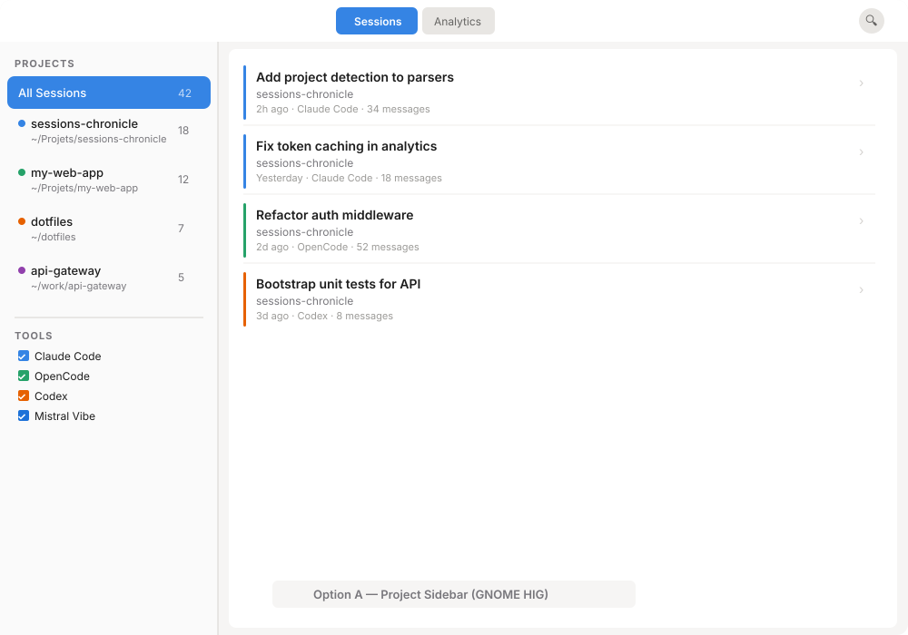
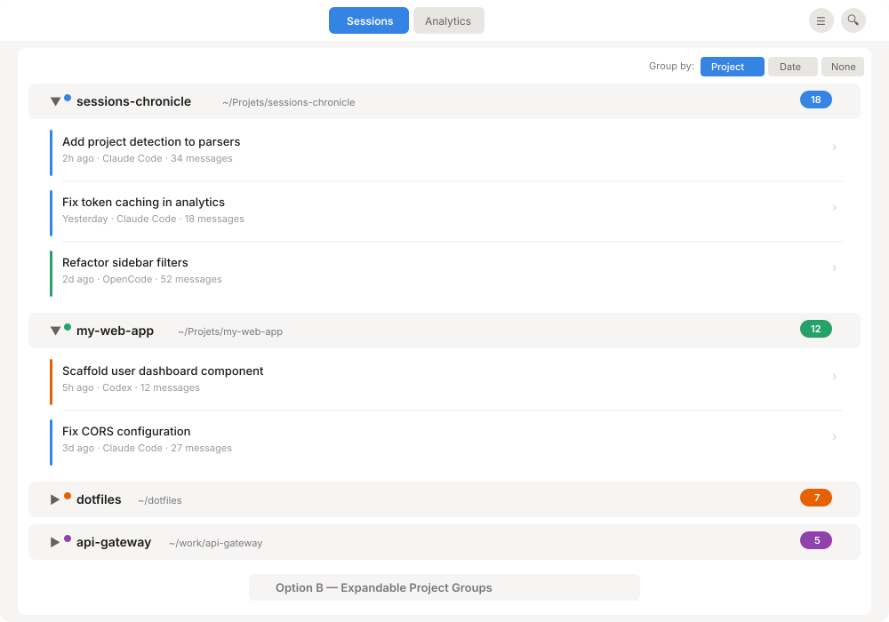
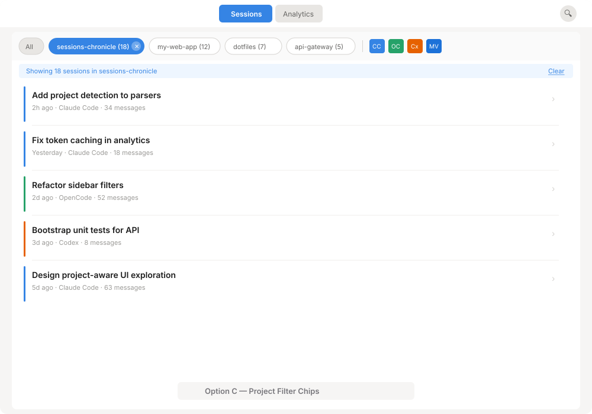
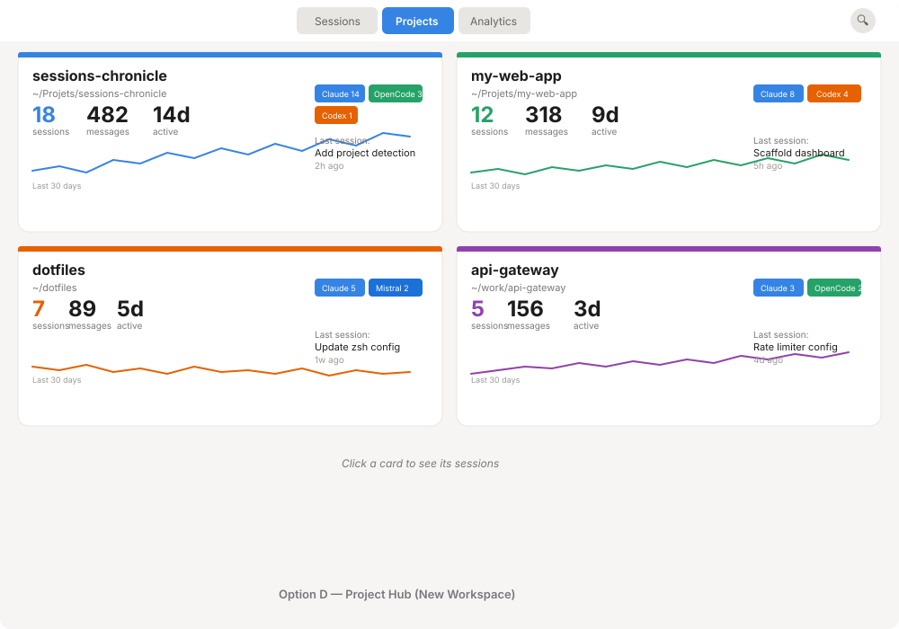
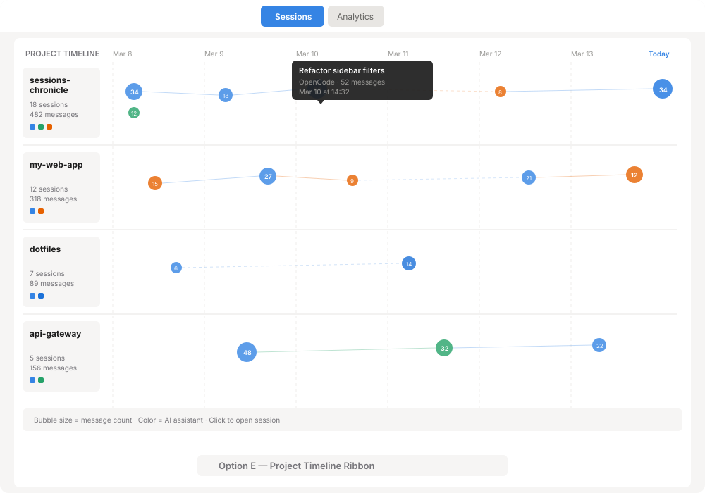

# Project-Aware UI: Design Exploration

**Issues:** [#66](https://github.com/supermaciz/sessions-chronicle/issues/66), [#67](https://github.com/supermaciz/sessions-chronicle/issues/67)
**Date:** 2026-03-14
**Status:** Open

## Context

Sessions Chronicle indexes AI coding sessions from Claude Code, OpenCode, Codex, and Mistral Vibe. Currently, sessions are displayed as a flat chronological list with tool-based filtering. The `project_path` field already exists in the data model but is only used as a subtitle in session rows.

### Project Detection (Brief)

Issue #67 covers the backend work: extracting working directory (`cwd`) from each parser, resolving git worktrees to their main repository root, and storing/indexing project info in the database. This exploration assumes that work is done and focuses entirely on how projects surface in the UI.

**Key data available per project:**
- Project name (directory basename)
- Project path (resolved root)
- Session count, message count, active day count
- AI assistant breakdown
- Activity over time

---

## Option A — Project Sidebar (GNOME HIG)

The standard GNOME pattern using `AdwNavigationSplitView`. The existing sidebar becomes a full navigation panel listing projects, with sessions filtered in the right pane.

### Behavior

- Left pane lists all projects sorted by recent activity, with session counts as badges
- "All Sessions" row at the top shows the unfiltered list (current behavior)
- Selecting a project filters the session list to that project only
- Tool checkboxes remain below the project list for cross-filtering
- On narrow windows, the sidebar collapses to a separate navigation page (responsive)

### Trade-offs

| Pros | Cons |
|------|------|
| Follows GNOME HIG `NavigationSplitView` pattern exactly | Takes permanent horizontal space (~240px) |
| Familiar to GNOME users (Files, Contacts, etc.) | Sidebar has two sections (projects + tools) which may feel overloaded |
| Supports keyboard navigation naturally | Replaces current utility pane behavior — need to reconcile with tool inspector |
| Responsive collapse on narrow windows | Only filters, no project-level overview or analytics |

---

## Option B — Expandable Project Groups

Sessions are grouped by project using `AdwExpanderRow`-style collapsible headers directly in the main list. No sidebar needed.

### Behavior

- A "Group by" toggle in the header area lets users switch between Project, Date, or None (flat list)
- Each project group is a collapsible row showing project name, path, and session count badge
- Expanding a group reveals its sessions (sorted by recency)
- Groups are sorted by most recent session first
- Collapsed groups show just the header, enabling quick scanning of all projects

### Trade-offs

| Pros | Cons |
|------|------|
| No layout change — works in the existing single-pane design | Scrolling through many expanded groups can be long |
| AdwExpanderRow is a standard Adwaita pattern | Can't see sessions from multiple projects simultaneously when some are collapsed |
| "Group by" toggle gives flexibility (project/date/none) | Grouping logic adds UI complexity (state management) |
| Session count badges give quick project overview | No project-level metadata beyond count (path, tools, activity) |

---

## Option C — Project Filter Chips

A horizontal chip bar above the session list lets users toggle project filters quickly. Combines project and tool filtering in one compact bar.

### Behavior

- Chip bar sits between the header and the session list
- Each project is a pill-shaped chip showing name and session count
- Clicking a chip filters to that project; clicking again deselects
- An "All" chip resets to unfiltered
- Tool chips (smaller, icon-style) sit after a separator in the same bar
- Active filter shows a subtle info bar ("Showing 18 sessions in sessions-chronicle")
- Chips scroll horizontally if there are many projects

### Trade-offs

| Pros | Cons |
|------|------|
| Minimal vertical footprint (~48px) | Can get crowded with many projects (>8) |
| Single click to filter, single click to clear | Chips offer no project metadata beyond count |
| Unifies tool + project filtering in one strip | Not a standard GNOME HIG pattern (more Material/web) |
| No layout restructuring needed | Horizontal scrolling for many chips is a mobile pattern, less GNOME-native |
| Very fast interaction | No project overview — purely a filter mechanism |

---

## Option D — Project Hub (New Workspace)

A dedicated "Projects" workspace added to the view switcher. Each project is a rich card with stats, sparklines, and tool breakdown.

### Behavior

- New "Projects" tab in the view switcher (Sessions / **Projects** / Analytics)
- Each project renders as a card in a responsive 2-column grid
- Cards show: name, path, session/message/active-day counts, tool badge breakdown, 30-day activity sparkline, last session info
- Clicking a card navigates to the Sessions workspace pre-filtered to that project
- Cards are color-coded by dominant AI assistant used
- Cards are sorted by recent activity

### Trade-offs

| Pros | Cons |
|------|------|
| Rich project overview at a glance — the only option with analytics | View switcher grows to 3 items (still within HIG limit of 3-5) |
| Sparklines show activity trends per project | Requires a full new workspace with its own layout |
| Acts as a landing page for project-centric users | Two-step navigation: Projects → click → Sessions (filtered) |
| Card grid is responsive and visually appealing | More implementation work (new factory, sparkline drawing) |
| Natural home for future per-project analytics | Cards may feel empty for projects with few sessions |

---

## Option E — Project Timeline Ribbon (Creative)

A swim-lane timeline visualization where each project is a horizontal lane and sessions appear as bubbles along a time axis. Bubble size encodes message count, color encodes AI assistant.

### Behavior

- Each project gets a horizontal swim lane with a label card on the left
- Sessions appear as circles positioned on a shared date axis
- Circle radius scales with message count; color indicates AI assistant
- Hovering a bubble shows a tooltip with session title, tool, and timestamp
- Clicking a bubble opens the session detail
- Connecting lines show session proximity/gaps (dashed = gap > 2 days)
- Time axis scrolls horizontally; default shows last 7 days

### Trade-offs

| Pros | Cons |
|------|------|
| Unique, information-dense visualization | Non-standard pattern — learning curve for users |
| Shows temporal patterns across projects at once | Requires custom Cairo/Snapshot drawing (no GTK widget for this) |
| Bubble size encodes message volume intuitively | Can get cluttered with many projects or dense activity |
| Gap detection (dashed lines) reveals project idle periods | Harder to implement accessibly (screen readers, keyboard nav) |
| Compelling "wow factor" for power users | Horizontal scrolling for time axis is unusual in GNOME apps |

---

## Comparison Matrix

| Criterion | A: Sidebar | B: Groups | C: Chips | D: Hub | E: Timeline |
|-----------|:---------:|:---------:|:--------:|:------:|:-----------:|
| GNOME HIG compliance | ★★★ | ★★☆ | ★☆☆ | ★★☆ | ★☆☆ |
| Project overview | ★☆☆ | ★☆☆ | ★☆☆ | ★★★ | ★★★ |
| Quick filtering | ★★★ | ★★☆ | ★★★ | ★☆☆ | ★☆☆ |
| Implementation effort | Medium | Medium | Low | High | High |
| Layout impact | High | Low | Low | Medium | High |
| Scales to 20+ projects | ★★★ | ★★☆ | ★☆☆ | ★★☆ | ★★☆ |
| Works on narrow windows | ★★★ | ★★★ | ★★☆ | ★★☆ | ★☆☆ |

---

## Combinations Worth Considering

These options are not mutually exclusive. Some natural pairings:

1. **A + D** — Sidebar for filtering + Hub for overview. The Hub becomes the "dashboard" for projects, the sidebar is the quick-filter when browsing sessions.
2. **C + B** — Chips for quick filtering + Groups for in-list structure. The chips select which project groups are visible.
3. **C + D** — Chips on the session list + Hub as a dedicated workspace. Lightweight filtering in Sessions, rich overview in Projects.

---

## Decision

*Pending user review.*
