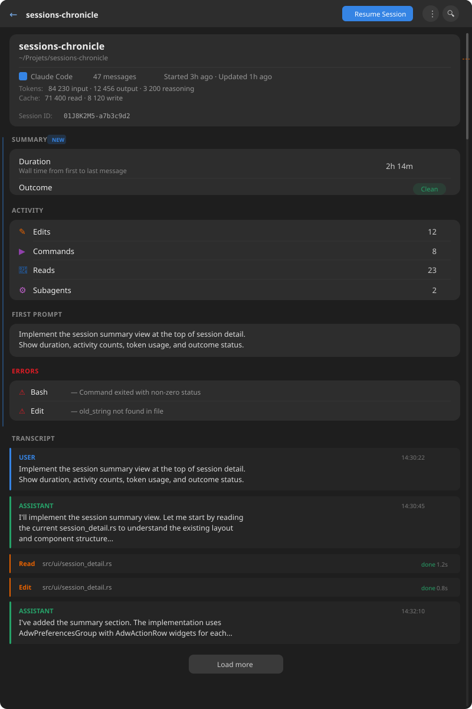
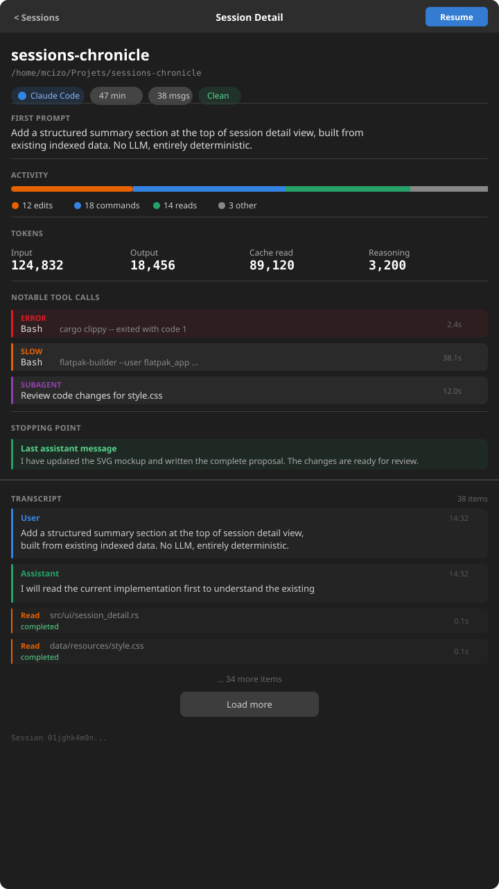
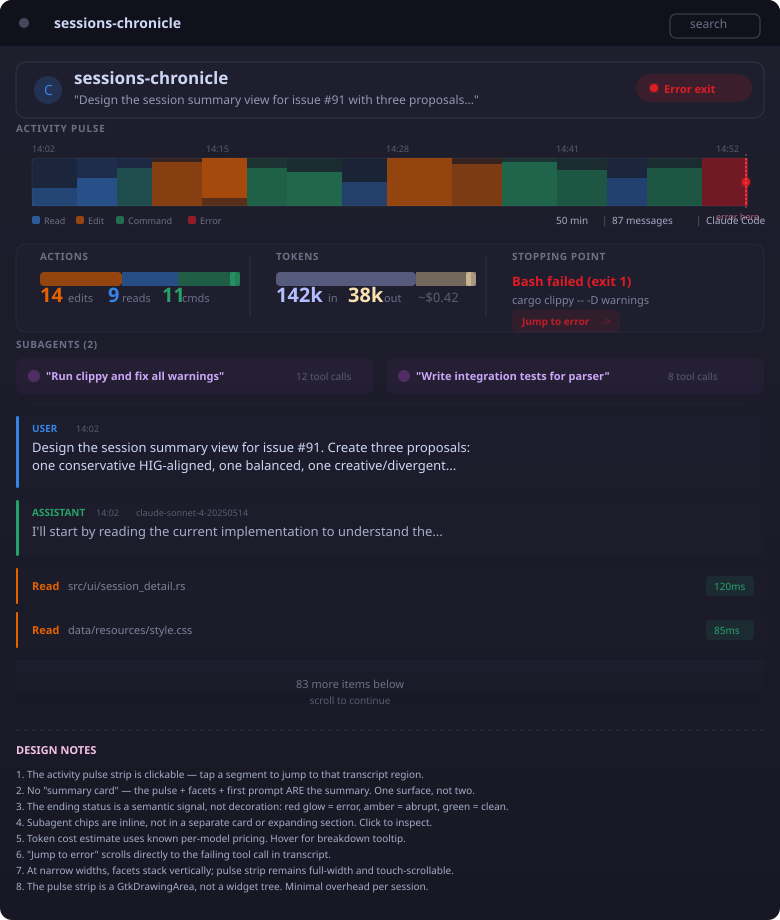

# Session Summary View — Design Exploration

**Issue**: [#91 — Deterministic structured session summary](https://github.com/supermaciz/sessions-chronicle/issues/91)
**Date**: 2026-03-28
**Status**: Exploration — decision pending

---

## Problem Statement

When a user opens a session, the app immediately drops them into the full transcript.
The most common review questions remain unanswered at a glance:

- What happened in this session?
- What files or tool calls mattered?
- How long it ran and what it cost?
- Where it appears to have stopped?

The product assessment identifies this as the central gap between a readable archive
and a true human-comprehension tool.

## Constraints

- **Deterministic**: no LLM, no AI-generated text — everything built from existing indexed data
- **Cross-assistant**: must work for Claude Code, OpenCode, Codex, and Mistral Vibe
- **Implementable in GTK4 + libadwaita + Relm4**
- **Data already available**: `Session` struct fields (timestamps, token usage, activity counts,
  ending status, first prompt), tool calls table, subagents table, transcript items

## Available Data Sources

| Data | Source | Available |
|------|--------|-----------|
| Duration | `last_updated - start_time` | Yes |
| Ending status | `ending_status` field (Clean/Abrupt/Error/Unknown) | Yes (v7) |
| Activity counts | `edit_count`, `read_count`, `command_count` | Yes (v7) |
| Token usage | `input_tokens`, `output_tokens`, `cache_*`, `reasoning_tokens` | Yes |
| First prompt | `first_prompt` | Yes |
| Tool call errors | `tool_calls WHERE status = 'error'` | Query needed |
| Slow tool calls | `tool_calls WHERE duration_ms > threshold` | Query needed |
| Subagent count | `subagents WHERE session_id = ?` | Query needed |
| Time-bucketed activity | `tool_calls` grouped by time windows | Query needed |

---

## Proposal A: Grouped Property Rows

**Author**: UI Designer agent
**Philosophy**: HIG-conformant, conservative, minimal change

### Approach

Extend the existing metadata card with structured `AdwPreferencesGroup` sections below it,
using the standard GNOME property-list pattern (`AdwActionRow` with suffix widgets).
No new navigation concepts, no collapsible panels, no visual chrome beyond what
libadwaita already provides. The summary is a static, always-visible section between
the metadata card and the transcript.

### Mockup



### Layout

Top-to-bottom inside the `ScrolledWindow > gtk::Box`:

1. **Metadata card** (existing, unchanged) — project name, path, AI assistant, message count,
   timestamps, tokens, session ID
2. **Summary section** (new) — two to four `AdwPreferencesGroup` blocks:
   - Duration and Outcome group
   - Activity group
   - First Prompt group (conditional)
   - Errors group (conditional)
3. **Transcript rows** (existing, unchanged)

**Why not merge into the metadata card?** The metadata card is identity and context
(what session is this, where, when). The summary is derived analysis (what happened).
Keeping them separate preserves the existing card's role and avoids turning it into
an unbounded vertical list.

### Sections Detail

#### Group 1: Duration and Outcome (always shown)

| Row | Widget | Suffix | Data source |
|-----|--------|--------|-------------|
| Duration | `AdwActionRow` | `GtkLabel` "2h 14m" | `last_updated - start_time` |
| Outcome | `AdwActionRow` | Status pill label | `ending_status` with semantic color |

#### Group 2: Activity (always shown, rows conditional)

| Row | Condition | Icon | Suffix |
|-----|-----------|------|--------|
| Edits | `edit_count > 0` | `document-edit-symbolic` | count |
| Commands | `command_count > 0` | `utilities-terminal-symbolic` | count |
| Reads | `read_count > 0` | `document-open-symbolic` | count |
| Subagents | subagent count > 0 | `system-run-symbolic` | count |

Rows with zero counts are hidden. If all counts are zero, shows "Conversation only — N messages".

#### Group 3: First Prompt (conditional)

`GtkLabel` with `wrap: true`, `max_width_chars: 80`, `lines: 3`, ellipsized.
Only shown when `first_prompt` is non-empty.

#### Group 4: Errors (conditional)

Shown only when tool calls have `status = Error`. Each error row is `AdwActionRow` with
tool call name + truncated error text. Maximum 5 rows + overflow indicator.

### Widget Spec

```
scroll_child (gtk::Box, vertical, spacing=12, margin=12)
  +-- [existing metadata card] (gtk::Box .card)
  +-- summary_box (gtk::Box, vertical, spacing=12)
  |     +-- duration_outcome_group (adw::PreferencesGroup, title="Summary")
  |     |     +-- duration_row (adw::ActionRow, suffix: "2h 14m")
  |     |     +-- outcome_row (adw::ActionRow, suffix: status pill)
  |     +-- activity_group (adw::PreferencesGroup, title="Activity")
  |     |     +-- edit_row, command_row, read_row, subagent_row (conditional)
  |     +-- first_prompt_group (adw::PreferencesGroup, conditional)
  |     +-- errors_group (adw::PreferencesGroup, conditional)
  +-- [existing messages_box] (transcript)
```

### Adaptive Behavior

- **Wide (600px+)**: Full width, `AdwActionRow` suffix labels right-align naturally
- **Narrow (<600px)**: `AdwPreferencesGroup` and `AdwActionRow` stack labels vertically
  automatically — no special logic needed

### Accessibility

- Standard `AdwActionRow` widgets — focusable by default via Tab/Shift-Tab
- Focus order matches visual order: metadata → summary rows → transcript
- Outcome pill gets `accessible-label` ("Session completed cleanly")
- Semantic colors adapt to high-contrast mode automatically
- No animations

### Trade-offs

| Pros | Cons |
|------|------|
| Only standard libadwaita widgets | Adds vertical height before transcript |
| Consistent with GNOME preferences pattern | No progressive disclosure — scroll past every time |
| Conditionally hidden groups keep view clean | Property-list style is informational, not visually rich |
| Small implementation surface | Error rows show truncated text only |
| Data available from existing `Session` fields + 2 queries | |

### Implementation Complexity: **Small to Medium**

**Files to touch**:
- `src/ui/session_detail.rs` — add summary widget tree, populate in `post_view()`
- `src/ui/format.rs` — add `format_outcome_label()` helper
- `src/database/` — add `load_session_errors()` and `count_subagents()` queries
- `data/resources/style.css` — `.outcome-pill` (3-4 lines), `.errors-group-title` (2 lines)

---

## Proposal B: Unified Session Header

**Author**: Mii Beta GTK Designer agent
**Philosophy**: GNOME HIG-leaning with critical eye on naming and surface count

### Naming Critique

> The current "metadata card" is a naming lie. It is not metadata — it is the session identity.
> Project name, AI assistant, timestamps, token counts: these are not supplementary facts
> about a session, they ARE the session. Calling it a "card" and boxing it in a `.card` surface
> makes it feel like a sidebar factoid instead of the primary orientation point.

The word "summary" in the issue title is also slightly misleading. What users actually need
is **orientation** — "what happened, how much, and where did it stop?" That is a header,
not a summary page.

### Mockup



### Approach

Kill the metadata card as a separate surface and replace it with a **unified session header** —
a flush, structured region that flows directly into the transcript. One scrollable column,
zero cards above the fold, progressive disclosure of detail through clearly named sections.

### Layout

Single vertical scroll with these regions:

1. **Session identity** (flush, no card) — project name as `title-2`, path dim below,
   then inline chips: AI assistant, duration, message count, ending status
2. **First prompt** — the initial user message as quoted block
3. **Activity breakdown** — stacked proportional bar (edits/commands/reads/other) with legend
4. **Tokens** — four values in horizontal grid: input, output, cache read, reasoning
5. **Notable tool calls** — only errors, slow calls (>10s), and subagents
6. **Stopping point** — last assistant message preview + ending status, color-coded
7. **Separator + Transcript** — existing paginated transcript, unchanged

### Surface Count Critique

**Current**: 2 surfaces (`.card` metadata box + transcript area).
The metadata card mixes identity, diagnostics, and reference data with no information hierarchy.

**Proposed**: 1 surface (scroll area) with 6 clearly separated sections via `GtkSeparator`.
Zero cards. Section headings (dim, uppercase, small) provide hierarchy without card boundaries.

> Why zero cards? The entire detail view IS the card. Putting a card inside a card is surface
> multiplication out of indecision.

### Widget Spec

```
AdwNavigationPage > AdwToolbarView
  [content] AdwToastOverlay > gtk::Overlay > gtk::ScrolledWindow
    gtk::Box (vertical, spacing=0, margin=16)
      // Session Identity (flush)
      gtk::Label.title-2                    // project name
      gtk::Label.dim-label.mono             // path
      gtk::Box (horizontal)                 // chip row
        .pill chips: AI assistant, duration, messages, ending status
      gtk::Separator
      // First Prompt
      gtk::Label.section-heading "FIRST PROMPT"
      gtk::Label (wrap: true)
      gtk::Separator
      // Activity
      gtk::Label.section-heading "ACTIVITY"
      gtk::DrawingArea (height: 8px)        // proportional bar
      gtk::Box (horizontal)                 // legend chips
      gtk::Separator
      // Tokens
      gtk::Label.section-heading "TOKENS"
      gtk::Box (horizontal, homogeneous)    // 4 value/label pairs
      gtk::Separator
      // Notable Tool Calls
      gtk::Label.section-heading "NOTABLE TOOL CALLS"
      gtk::ListBox                          // errors, slow, subagents
      gtk::Separator
      // Stopping Point
      gtk::Label.section-heading "STOPPING POINT"
      gtk::Box (status-colored border)      // last message preview
      gtk::Separator (heavier)
      // Transcript
      gtk::Label.section-heading "TRANSCRIPT"
      gtk::Box (FactoryVecDeque<TranscriptRow>)
      gtk::Button "Load more"
```

### Notable Tool Calls Filtering

Only surface:
- **Errors**: always shown
- **Slow**: tool calls with `duration_ms > 10000` (10s threshold)
- **Subagents**: always shown

Each row is tappable to open the inspector.

### Adaptive Behavior

- **Wide (>600px)**: Tokens row shows all four values horizontally. Legend is one row.
- **Narrow (<600px)**: Tokens wrap to 2×2 grid. Legend wraps via `GtkFlowBox`.
  Chip row wraps naturally.

No layout mode switch needed. Single column that breathes at every width.

### Accessibility

- Tab moves through focusable elements: notable tool call rows, load more button, resume button
- Section headings use `ATK_ROLE_HEADING`
- Token values pair label + value in accessible-label ("Input tokens: 124,832")
- Semantic colors adapt to high-contrast themes
- `font-variant-numeric: tabular-nums` for alignment stability

### Trade-offs

| Pros | Cons |
|------|------|
| Zero new surfaces — metadata card removed, not extended | ~400px of header before transcript on short screens |
| First prompt answers "what was this about?" immediately | Proportional bar needs custom draw or creative box layout |
| Activity counts surfaced (currently only in list rows) | "Notable" filtering needs design choices (thresholds) |
| Notable tool calls surface errors without full scroll | Removing `.card` changes visual feel vs other app sections |
| All data already in `Session` or trivially queryable | |
| Flush layout feels native GNOME | |

### Implementation Complexity: **Medium**

**Files to touch**:
- `src/ui/session_detail.rs` — restructure view macro, replace card with flush sections
- `data/resources/style.css` — `.section-heading`, `.pill`, activity bar colors, stopping-point border
- `src/database/` — query for notable tool calls (errors + slow + subagents)
- No model changes needed — all fields already exist

---

## Proposal C: Session Pulse

**Author**: Mii Beta GTK Designer agent
**Philosophy**: Creative, divergent — challenge the assumption that a summary is a list of metadata fields

### The Radical Idea

> The conventional session summary is a corpse pinned to a board.

A session has rhythm — bursts of reading, stretches of editing, a sudden command-run phase,
then an abrupt stop. That shape IS the summary. A user glancing at a session does not need
to read "14 edits, 9 reads, 11 commands" as three numbers. They need to SEE the session's
activity contour and immediately know: "ah, this one explored for a while, then went into
a heavy edit phase, and crashed at the end on clippy."

What should a session summary answer in under two seconds? **What kind of session was this?**

Not "what metadata does this session have" — that is a database inspector question.
The real questions are about *shape*, not *fields*:
- Was it mostly reading or mostly editing?
- Did it end well or badly?
- How intense was it? Was there a long idle gap?
- Where should I look first?

### Mockup



### Layout

Three zones stacked vertically, no "card" wrapper:

1. **Identity Stripe** (~56px) — project name (bold, large), AI assistant icon, first prompt
   preview (truncated to one line), ending status pill with semantic glow
2. **Activity Pulse + Facets** (~160px total):
   - **Pulse strip** (~100px): horizontal visualization where time runs left→right, each
     segment colored by dominant tool call category, height/opacity encoding intensity.
     Ending point has a semantic marker (red glow = error, amber = abrupt, green = clean).
     **Clickable**: tap a segment to jump to that transcript position.
   - **Three inline facets** below: ACTIONS (stacked bar + counts), TOKENS (ratio bar + cost),
     STOPPING POINT (error detail + "Jump to error" link)
   - **Subagent chips** (conditional): inline horizontal `GtkFlowBox`
3. **Transcript** — immediately after a thin separator, no gap

The current metadata card is **deleted entirely**. Everything it shows is redistributed:
project name → identity stripe, AI assistant → identity stripe, message count → pulse legend,
token usage → TOKENS facet, session ID → tooltip on project name.

### The Activity Pulse Strip

A horizontal strip spanning full width. Time runs left to right. Each segment colored by
dominant activity in that time window:

| Color | Activity |
|-------|----------|
| Blue (`#3584e4`) | Reads |
| Orange (`#e66100`) | Edits |
| Green (`#26a269`) | Commands |
| Red (`#e01b24`) | Errors |

Height/opacity of segments encodes intensity (more tool calls = taller/brighter).
The ending point has a semantic glow marker.

**Dual function**: visualization AND navigation control. One surface, two purposes.

### Visual Treatment

What makes this different:

1. **The pulse strip is a custom-drawn visualization** (`GtkDrawingArea`), not a widget tree.
   Color and opacity communicate like an audio waveform communicates sound shape.
2. **Semantic glow on ending status** — not a red label buried in metadata, a red beacon
   (CSS `box-shadow` or drawn glow via Snapshot/Cairo).
3. **Same color language as transcript** — Read blue, Edit orange, Command green, Error red.
   Consistency, not decoration.
4. **No card-within-card nesting** — surfaces separated by spacing and color temperature,
   not borders and shadows.
5. **First prompt elevated to primary position** — the most useful text for orientation.

### Facets Detail

Three inline stat clusters in a single row, separated by vertical dividers:

| Facet | Content | Visual |
|-------|---------|--------|
| ACTIONS | Edit/read/command counts | Stacked proportional bar + large numbers |
| TOKENS | Input/output + cost estimate | Ratio bar + "~$0.42" |
| STOPPING POINT | Last error or clean exit | Tool call name + "Jump to error" link |

### Widget Approach

1. **`GtkDrawingArea`** for pulse strip — Cairo/Snapshot drawing, `GestureClick` for navigation
2. **`GtkBox` (horizontal)** for facets — three child boxes + `GtkSeparator` dividers
3. **`GtkFlowBox`** for subagent chips — horizontal flow, wrapping
4. **`GtkBox` (vertical)** for identity stripe — standard labels + image

### Adaptive Behavior

- **Wide (>700px)**: Full layout as shown. Facets in single horizontal row.
- **Medium (500-700px)**: Facets wrap: ACTIONS + TOKENS side-by-side, STOPPING POINT below.
- **Narrow (<500px)**: Facets stack vertically. Pulse strip remains full-width
  (most information-dense element, compresses poorly). Identity stripe wraps.

**Key principle**: the pulse strip never loses width.

### Trade-offs

| Pros | Cons |
|------|------|
| Answers "what kind of session?" in 2 seconds visually | Pulse strip requires custom `GtkDrawingArea` draw code |
| Click-to-navigate on pulse = summary + navigation in one | Sessions with few tool calls produce boring strips |
| Cost estimate directly useful | Cost estimate can be wrong if pricing changes |
| Same color language as transcript = instant recognition | `GtkDrawingArea` needs manual accessibility labels |
| Net widget tree shrinks despite richer visual output | Larger implementation effort than alternatives |
| First prompt elevated to primary position | Diverges from HIG on several points |

### Risk Assessment

- **Few tool calls**: sessions with <5 tool calls → skip pulse strip, show compact summary instead
- **No timestamps**: fall back to message-index positioning (position in transcript, not time)
- **Cost accuracy**: prefix with "~", include "pricing as of" in tooltip
- **Accessibility**: set `accessible-description` on drawing area summarizing pattern in text

### Implementation Complexity: **Medium-High**

**Files to touch**:
- `src/ui/session_detail.rs` — major refactor replacing metadata card
- New: `src/ui/activity_pulse.rs` — custom drawing area widget
- `data/resources/style.css` — identity stripe, facets, subagent chips, ending status styles
- `src/database/` — possibly time-bucketed activity query
- `src/models/` — possibly `ActivityBucket` struct

---

## Comparison Matrix

| Criterion | A: Grouped Property Rows | B: Unified Header | C: Session Pulse |
|-----------|--------------------------|-------------------|-----------------|
| **Designer** | UI Designer | Mii Beta (HIG) | Mii Beta (Creative) |
| **HIG conformance** | Full | High (flush layout) | Moderate (custom viz) |
| **Surface count** | +1 (summary groups) | 0 (replaces card) | 0 (replaces card) |
| **Information density** | Low-medium | High | Very high |
| **Visual richness** | Minimal | Medium | High |
| **First prompt visible?** | Yes (conditional group) | Yes (dedicated section) | Yes (identity stripe) |
| **Activity visualization** | Count labels only | Proportional bar | Temporal pulse strip |
| **Error surfacing** | Dedicated error group | Notable tool calls section | Stopping point facet |
| **Navigation from summary** | None | None | Click pulse → transcript |
| **Custom drawing needed** | No | Minimal (bar) | Yes (pulse strip) |
| **Implementation effort** | Small-Medium | Medium | Medium-High |
| **Risk** | Low | Low-Medium | Medium |

---

## Decision

*Pending — to be decided after review of this exploration.*

## References

- [Issue #91 — Deterministic structured session summary](https://github.com/supermaciz/sessions-chronicle/issues/91)
- `docs/PRODUCT_ASSESSMENT_2026-03-21.md` — recommendation 2 and Direction 1
- Related: #55, #36, #70, #74, #79, #80, #81
