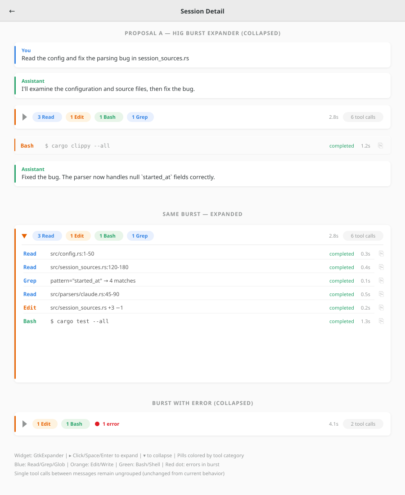
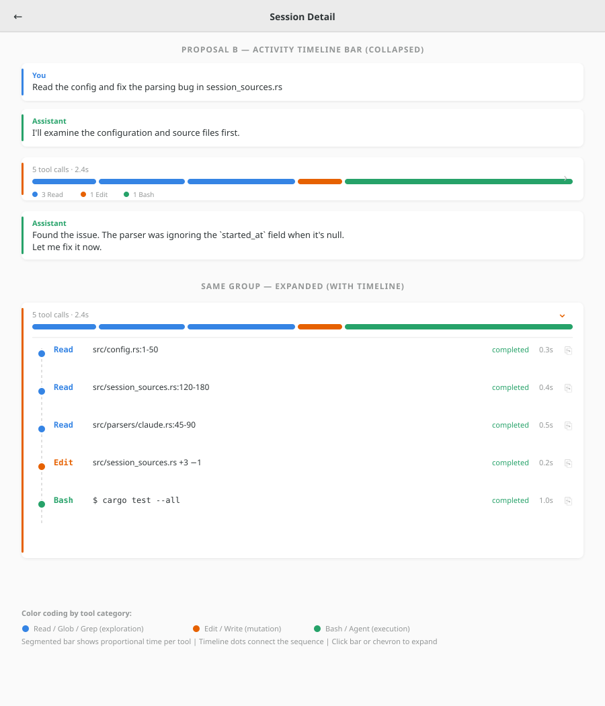
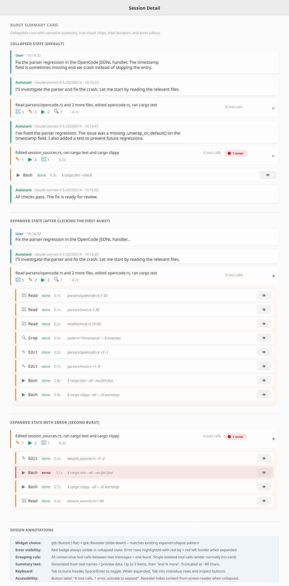
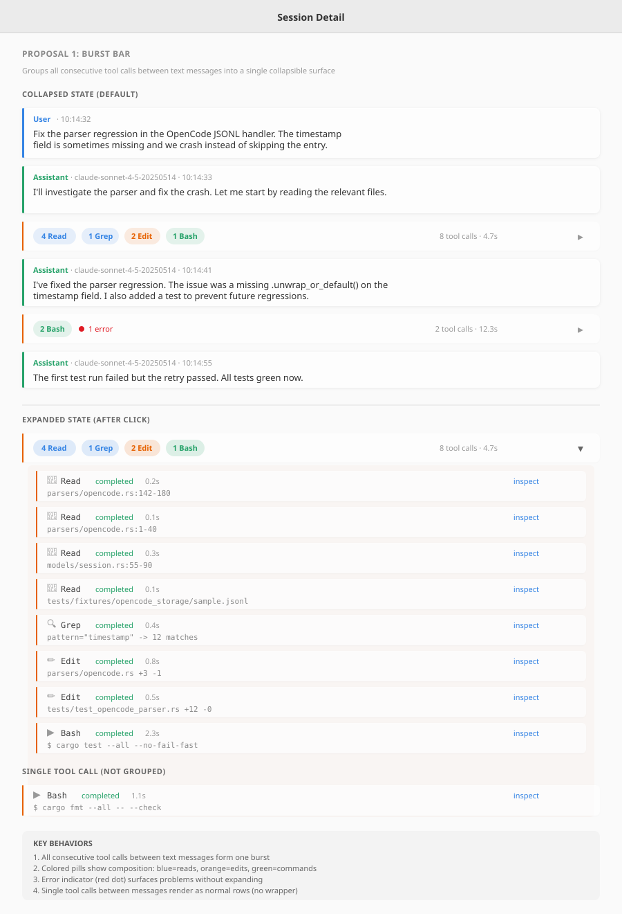
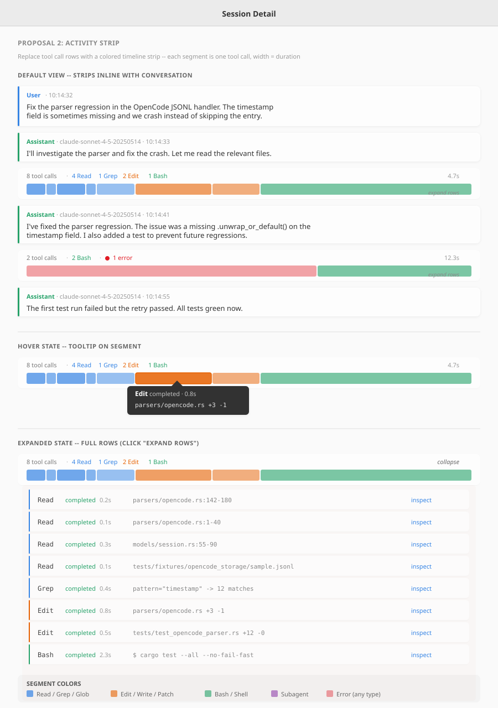

# Tool Call Grouping — Design Exploration

**Issue:** [#89](https://github.com/supermaciz/sessions-chronicle/issues/89) — Group consecutive tool calls in session detail view  
**Date:** 2026-04-01  
**Status:** Open for decision  
**Milestone:** First release

## Problem

The session detail view renders every tool call as an individual row.
AI assistants frequently emit 5-20 consecutive tool calls — Read calls while exploring,
Edit calls during a refactor, Bash calls for testing. This creates a wall of small
orange-bordered rows that pushes the conversation off-screen and makes it hard to
understand what the assistant actually did.

The unit of understanding for a user reviewing a session is not "one tool call" —
it is "what was the assistant trying to do?"

## Current State

- Each tool call is a `TranscriptRow` (FactoryComponent) in a vertical `gtk::Box`
- Row layout: icon + monospace tool name + status badge + duration + inspect button + preview
- CSS: `.tool-call-row` — 2px 8px padding, 6px radius, orange 2px left border
- Messages use a separate expand/collapse pattern (`gtk::Button` "Show full message" / "Collapse")
- No grouping or disclosure exists for consecutive tool calls

## Grouping Boundary

All proposals use **all-consecutive burst** grouping: every consecutive tool call
between two text messages forms one group, regardless of tool type.

A burst of [Read, Read, Grep, Edit, Bash] produces **1 group**, not 3 or 4.
Single isolated tool calls between messages are **not grouped** (rendered as-is).

This is the correct boundary because real-world sessions have mixed-type bursts.
Same-type consecutive grouping would fragment most bursts into multiple small groups
that still create visual noise.

---

## Proposals

### Proposal A — HIG Burst Expander (GNOME HIG)

**Source:** Main designer  
**Approach:** `GtkExpander` with colored per-category pills and error indicator  
**Widget:** `GtkExpander` (canonical GNOME disclosure)



**Collapsed (52px):** A single card with orange left border, containing:
- `GtkExpander` disclosure triangle (right-pointing ▸)
- Colored pills per tool category: `3 Read` (blue), `1 Edit` (orange), `1 Bash` (green), `1 Grep` (blue)
- Total duration on trailing edge
- Count pill: "6 tool calls"
- Red error dot + "1 error" text when any call failed

**Expanded:** Triangle rotates down ▾. Separator appears, then individual
tool call rows inside the card with tool name colored by category (blue for
Read/Grep, orange for Edit, green for Bash). Each row retains its inspect button.

**Widgets:**
```
gtk::Box.tool-call-group
  GtkExpander
    [label]: gtk::Box(H) → triangle + category pills + duration + count pill + error badge
    [child]: gtk::Box(V) → tool-call-row × N (colored by category)
```

**Pros:**
- Canonical GNOME pattern — zero HIG deviation
- Full accessibility for free (keyboard toggle, screen reader state)
- Minimal implementation code
- Category-colored pills answer "what types?" at a glance
- Error indicator visible without expanding

**Cons:**
- `GtkExpander` default padding may need CSS tuning for compact feel
- No duration proportionality (total only, not per-tool visual)

**Accessibility:** Built-in. Tab/Space/Enter toggle. Screen reader announces
"collapsed" / "expanded" automatically.

---

### Proposal B — Activity Timeline Bar (creative)

**Source:** Main designer  
**Approach:** Color-coded segmented bar + vertical timeline in expanded state  
**Widget:** `gtk::Revealer` + custom segmented bar



**Collapsed (64px):** A single card with:
- Summary text: "5 tool calls · 2.4s"
- Segmented horizontal bar with proportional segments per tool call (width = duration ratio)
- Color-coded by tool category: blue (Read/Grep), orange (Edit), green (Bash)
- Small legend dots below the bar
- Expand chevron at trailing edge

**Expanded:** The bar stays as header. Below it, a vertical timeline appears with
dashed connector line and colored dots per tool call. Each dot sits on the timeline
with tool name, preview, status, duration, and inspect icon.

**Widgets:**
```
gtk::Box.tool-call-group
  gtk::Box(H) — summary + segmented bar + legend
  gtk::Revealer(SLIDE_DOWN)
    gtk::Box(V) — timeline line + tool rows with circles
```

**Pros:**
- High information density — duration proportionality at a glance
- Visual pattern recognition (blue-blue-orange-green = "explored, edited, tested")
- Timeline metaphor matches the sequential nature of tool calls

**Cons:**
- Custom visualization — no stock libadwaita widget for segmented bars
- Duration data may be missing for some AI assistants (segments degrade to equal-width)
- More implementation effort than a simple expander
- No error indicator in collapsed state

**Accessibility:** Requires manual accessible roles for bar segments.
Keyboard users use the timeline rows in expanded state.

---

### Proposal C — Burst Summary Card (UI Designer)

**Source:** UI Designer agent  
**Approach:** Narrative summary line + icon-count chips + error badge  
**Widget:** `gtk::Button.flat` + `gtk::Revealer`



**Key idea:** The collapsed state answers "what did the assistant do?" with a  
**generated natural-language summary** instead of just counts.

**Collapsed (56px):** A card with two lines:
- **Top line:** Generated summary: "Read parsers/opencode.rs and 2 more files, edited opencode.rs, ran cargo test"
- **Bottom line:** Icon-count chips (file icon + 3, pencil + 2, terminal + 2, search + 1), total duration

Right side: count label ("8 tool calls"), error badge if any failed, disclosure chevron.

**Expanded:** Summary header stays. `gtk::Revealer` slides down showing individual
tool call rows in existing format. Subtle tinted background connects rows to header.

**Widgets:**
```
gtk::Box.burst-group
  gtk::Button.flat.burst-header
    gtk::Box(H)
      gtk::Box(V, hexpand) → Label(summary) + Box(chips + duration)
      gtk::Box(H) → count + error badge + chevron
  gtk::Revealer(SLIDE_DOWN)
    gtk::Box(V) → tool-call-row × N
```

**Pros:**
- Narrative summary is the most human-readable option
- Error badge always visible without expanding
- Two-line layout provides rich information in compact space
- Matches existing app expand/collapse pattern (`gtk::Button.flat`)

**Cons:**
- Summary generation needs new code (concatenate tool names + previews)
- Requires manual accessibility annotations (button + expanded state)
- More implementation code than `GtkExpander`
- Summary text may be misleading if preview data is poor

**Accessibility:** Manual. Button accessible label: "8 tool calls, 1 error,
activate to expand". Revealer hides content from screen reader when collapsed.

---

### Proposal D — Burst Bar (Mii Beta)

**Source:** Mii Beta GTK Designer agent  
**Approach:** Colored type pills + error dot + revealer  
**Widget:** `gtk::Button` + `gtk::Revealer`



**Key insight:** The collapsed bar should answer "what did the assistant do?"
at a glance with zero clicks. Errors must surface immediately.

**Collapsed (42px):** A horizontal bar with:
- Colored pills: `4 Read` (blue), `2 Edit` (orange), `1 Bash` (green)
- Total duration
- Red error dot + count if any call failed
- Disclosure chevron at trailing edge

**Expanded:** Bar stays as header. `GtkRevealer` with `SLIDE_DOWN` reveals
individual tool call rows using existing rendering.

**Widgets:**
```
gtk::Box.tool-burst
  gtk::Box.tool-burst-header(H) → pills + duration + error dot + chevron
  gtk::Revealer(SLIDE_DOWN)
    gtk::Box(V) → tool-call-row × N
```

**Pros:**
- Correct grouping for all real-world burst patterns
- Zero clicks for the 80% use case
- Errors surface immediately via red indicator
- Moderate implementation cost
- Compact (42px) — minimal visual footprint

**Cons:**
- New `TranscriptRowKind::ToolBurst` variant
- Search highlighting inside collapsed bursts needs auto-expand logic
- Manual accessibility (not `GtkExpander`)

**Accessibility:** Header is keyboard-focusable. Enter/Space toggles.
Screen reader label: "Tool call burst: 4 Read, 1 Grep, 2 Edit, 1 Bash, 4.7s total."

---

### Proposal E — Activity Strip (Mii Beta)

**Source:** Mii Beta GTK Designer agent  
**Approach:** Segmented duration-proportional strip with direct inspect  
**Widget:** Custom `gtk::Box` segments + `GtkGestureClick` + `gtk::Revealer` fallback



**Key insight:** Tool calls are action metadata, not content to read.
Rows put them on equal visual footing with messages. A strip shows them
as what they are: a sequence of timed actions.

**Default (56px):** A surface containing:
- Summary line: "8 tool calls — 4 Read, 1 Grep, 2 Edit, 1 Bash — 4.7s"
- Colored segmented bar where each segment = one tool call, width = duration ratio
- Colors: blue (Read/Grep/Glob), orange (Edit/Write), green (Bash), purple (Subagent)
- Red tint for errored calls

**Interaction:**
- Hover a segment: tooltip with tool name, preview, status, duration
- Click a segment: opens inspector directly for that tool call (no expand step)
- "expand rows" link reveals traditional row view as keyboard/a11y fallback

**Widgets:**
```
gtk::Box.activity-strip-burst
  gtk::Label (summary line)
  gtk::Box(H) — segments as colored gtk::Box children with GtkGestureClick
  gtk::Revealer(SLIDE_DOWN)  // "expand rows" fallback
    gtk::Box(V) → tool-call-row × N
```

**Pros:**
- Maximum information density (56px vs 660px for 15 calls)
- Duration proportionality reveals where time was spent
- Direct one-click inspect (skip expand-then-find-then-click)
- Visual pattern recognition after a few sessions

**Cons:**
- Highest implementation cost — custom segment rendering, tooltip management
- Mouse-centric (hover tooltips); keyboard users must use "expand rows" fallback
- Duration data may be missing — strip degrades to equal-width boxes
- Least GNOME-native feel — no stock widget for this
- Requires careful high-contrast work (segment borders/patterns, not just color)

**Accessibility:** Each segment is a button with accessible label. Tab navigates
segments. "Expand rows" fallback provides full text access.

---

## Comparison Matrix

| Dimension | A: HIG Expander | B: Timeline Bar | C: Summary Card | D: Burst Bar | E: Activity Strip |
|-----------|:-:|:-:|:-:|:-:|:-:|
| **HIG conformance** | canonical | custom | app-native | near-native | custom |
| **Accessibility effort** | free | manual | manual | manual | high |
| **Information density** | medium | high | high | medium-high | highest |
| **Error visibility** | immediate | on expand | immediate | immediate | immediate |
| **Implementation cost** | low | high | medium | medium | high |
| **Duration at a glance** | total only | proportional | total only | total only | proportional |
| **"What happened?" at a glance** | pills | bar pattern | narrative text | pills | bar pattern |

## Open Questions

1. **Search interaction:** When a search match falls inside a collapsed burst,
   should the burst auto-expand? Show a match count badge on the header?

2. **Error surfacing:** Most proposals show errors in collapsed state.
   Proposal B does not — should it?

3. **Duration data absence:** Some AI assistants don't provide per-tool duration.
   Proposals B and E degrade when this data is missing.

4. **Summary generation (Proposal C):** Is generating narrative text worth the
   complexity? Or are pills/counts sufficient?
