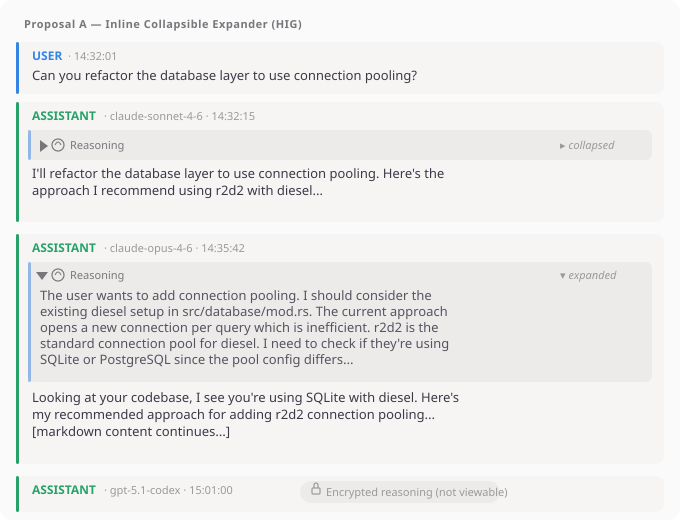
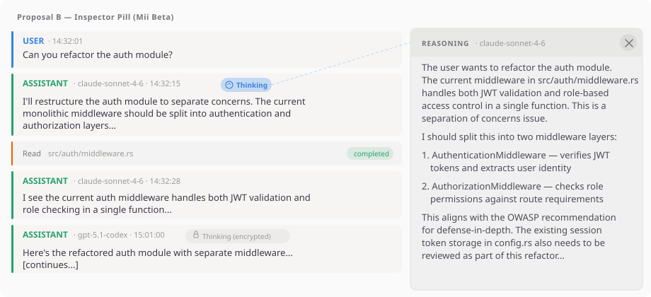
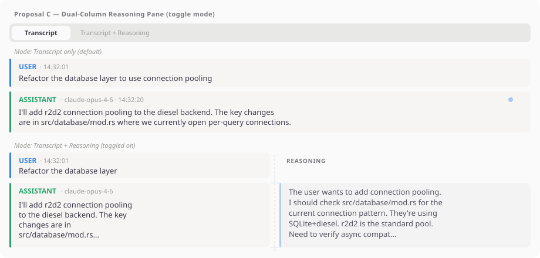

# Reasoning/Thinking Blocks Display — Design Exploration

**Issue:** [#45](https://github.com/supermaciz/sessions-chronicle/issues/45)  
**Date:** 2026-04-05  
**Status:** Exploration — no decision taken yet

---

## Problem Statement

AI assistants increasingly produce **reasoning/thinking content** alongside their responses.
Sessions Chronicle currently discards this content or concatenates it with regular text,
losing the distinction. Users reviewing sessions need to see *that* reasoning happened and
optionally *what* the model was thinking, without overwhelming the transcript.

### Data availability by assistant

| Assistant | Reasoning field | Displayable? | Notes |
|-----------|----------------|:---:|-------|
| **Claude Code** | `content[].type == "thinking"` in assistant events | Yes | Currently concatenated with text blocks |
| **Mistral Vibe** | `reasoning_content` on assistant messages | Yes | Separate field, clean extraction |
| **OpenCode** | `part.type == "reasoning"` | Yes | Currently skipped by parser |
| **Codex** | `response_item.type == "reasoning"` with `encrypted_content` | No | Encrypted, cannot be decrypted locally |

### Key characteristics of reasoning content

- Can be **very long** (thousands of tokens — sometimes longer than the response itself)
- Present on roughly **20–50%** of assistant messages (model-dependent)
- Contains **natural language** chain-of-thought, not code
- Users typically want it for **forensic analysis** ("why did the model do X?"), not sequential reading
- Adding it inline would roughly **double** transcript length

### Shared parser/schema work (all proposals)

Regardless of the UI approach, every proposal requires:

1. **Parser changes**: separate thinking blocks from text in Claude Code; extract `reasoning_content`
   in Mistral Vibe; capture `reasoning` parts in OpenCode; detect encrypted reasoning in Codex
2. **Schema migration**: add `reasoning_content TEXT` column to the `messages` table
3. **Model changes**: add `reasoning_content: Option<String>` to `MessagePreview`

---

## Proposal A — Inline Collapsible Expander

**Source:** UI Designer (GNOME HIG)  
**Principle:** Reuse the `GtkExpander` pattern already established by tool-call burst groups

### Description

A collapsible reasoning section is placed **inside** each assistant message row,
between the header and the response content. Collapsed by default.

```
gtk::Box .message-row .role-assistant
├── header (ASSISTANT · model · timestamp)
├── gtk::Box .reasoning-section
│   └── gtk::Expander (collapsed by default)
│       ├── [label]: gtk::Box (horizontal)
│       │   ├── gtk::Image "brain-augmented-symbolic" 14px
│       │   └── gtk::Label "Reasoning" .caption .dim-label
│       └── [child]: gtk::Box .reasoning-content
│           └── markdown-rendered reasoning text
├── content container (response text)
└── expand-toggle (existing)
```

For Codex encrypted reasoning, the expander is replaced by a static indicator:

```
gtk::Box .reasoning-section .reasoning-encrypted
├── gtk::Image "lock-symbolic" 14px
└── gtk::Label "Encrypted reasoning (not viewable)" .caption .dim-label
```

### CSS

```css
.reasoning-section {
  margin-top: 4px;
  margin-bottom: 8px;
  padding: 8px 10px;
  border-radius: 6px;
  background-color: alpha(@card_shade_color, 0.1);
  border-left: 3px solid alpha(@accent_color, 0.5);
}

.reasoning-content {
  margin-top: 6px;
  font-size: 0.92em;
  opacity: 0.88;
}

.reasoning-encrypted {
  opacity: 0.6;
}
```

### Mockup



### Trade-offs

| Advantage | Disadvantage |
|-----------|-------------|
| Reuses existing `GtkExpander` pattern (tool-call groups) | Expanding pushes all subsequent messages down, losing scroll position |
| Zero new surfaces — reasoning stays in context | The collapsed expander header is dead weight on every reasoning-bearing message |
| HIG-native disclosure widget with keyboard/a11y for free | Multiple expanded sections in a long session create a very tall, hard-to-navigate transcript |
| Reasoning is spatially attached to its response | Content is duplicated in layout (reasoning + response visible at same time) |

---

## Proposal B — Inspector Pill

**Source:** Mii Beta GTK Designer  
**Principle:** Reasoning is forensic evidence, not conversation content — treat it like tool-call inspection

### Description

A small **pill badge** is added to the assistant message header when reasoning content exists.
Clicking the pill opens the **existing inspector pane** (already used for tool call details)
with the reasoning content rendered as scrollable markdown. The transcript itself is never modified.

```
gtk::Box .message-row .role-assistant
├── header row
│   ├── gtk::Label "ASSISTANT" .heading
│   ├── gtk::Label "· claude-sonnet-4-6 · 14:32" .dim-label
│   └── gtk::Button .reasoning-pill .flat .pill
│       ├── gtk::Image "brain-augmented-symbolic" 12px
│       └── gtk::Label "Thinking"
├── content container (response text)
└── expand-toggle (existing)
```

Clicking the pill sends an `InspectReasoning { session_id, message_index }` message
that populates the existing `ToolInspectorPane` with:

```
Inspector pane header: REASONING · model · timestamp
Inspector pane body:   GtkScrolledWindow → markdown::render(reasoning_content)
```

For Codex encrypted reasoning, the pill shows "Thinking (encrypted)" with dimmed style
and is **not clickable**.

### CSS

```css
.reasoning-pill {
  padding: 1px 8px;
  border-radius: 99px;
  font-size: 0.8em;
  background-color: alpha(@accent_color, 0.15);
  color: @accent_color;
}

.reasoning-pill-encrypted {
  background-color: alpha(@view_fg_color, 0.08);
  color: alpha(@view_fg_color, 0.5);
}
```

### Mockup



### Trade-offs

| Advantage | Disadvantage |
|-----------|-------------|
| Zero layout disruption — transcript stays stable | Cannot skim reasoning without clicking (one extra interaction) |
| Reuses existing inspector pane — no new surfaces | Inspector becomes multi-purpose (tools + reasoning) |
| Pill is smaller/lighter than a collapsed expander | Reasoning is spatially disconnected from its response |
| Consistent mental model: "click to inspect details" | Users inspecting tool calls and reasoning simultaneously can't do both |
| Codex encrypted case is naturally handled (non-clickable pill) | |

---

## Proposal C — Dual-Column Reasoning Pane

**Source:** Original synthesis  
**Principle:** Reasoning is a parallel stream that should be viewable alongside the conversation, not inline or in a separate pane

### Description

A **toggle button** in the transcript toolbar switches between two modes:

1. **Transcript only** (default): normal single-column view. Assistant messages with reasoning
   show a small dot indicator (accent-colored circle) in the row suffix area.
2. **Transcript + Reasoning**: the transcript column narrows to ~55% width, and a dedicated
   reasoning column appears on the right. Reasoning blocks are **vertically aligned** with
   their corresponding assistant messages. User messages and tool calls have empty space
   in the reasoning column.

```
gtk::Box (horizontal)
├── gtk::Box .transcript-column (flex: 55%)
│   └── [existing transcript rows, narrowed]
└── gtk::Box .reasoning-column (flex: 45%)
    ├── section heading "REASONING"
    └── [reasoning blocks aligned to assistant rows]
```

The reasoning column scrolls **in sync** with the transcript column (linked scroll adjustments).

For Codex encrypted reasoning, the reasoning column cell shows a dimmed lock icon and
"Encrypted" label instead of text.

### Mockup



### Trade-offs

| Advantage | Disadvantage |
|-----------|-------------|
| Side-by-side view: read response and reasoning together without clicking | Significant implementation complexity (synchronized scrolling, alignment) |
| Transcript flow is preserved — no expanding/collapsing | Wastes horizontal space when many messages have no reasoning |
| Familiar pattern from diff viewers and IDE debug panels | Doesn't work well on narrow windows — needs a responsive fallback |
| Toggle means zero overhead when reasoning is not needed | New surface/mode to build and maintain |
| Natural for comparing "what the model thought" vs "what it said" | Vertical alignment is fragile if message heights vary |

---

## Comparison Matrix

| Criterion | A: Inline Expander | B: Inspector Pill | C: Dual Column |
|-----------|:-:|:-:|:-:|
| **Transcript stability** | Low (expanding shifts content) | High (no layout change) | High (fixed columns) |
| **Reasoning access** | 1 click (toggle expander) | 1 click (opens inspector) | 0 clicks (visible in column) |
| **Context preservation** | Good (reasoning near response) | Poor (reasoning in side pane) | Excellent (side-by-side) |
| **Implementation cost** | Low (reuse GtkExpander) | Low (reuse inspector pane) | High (synchronized scroll, alignment) |
| **Narrow window behavior** | Fine (single column) | Fine (inspector overlays) | Needs responsive fallback |
| **New widgets** | 1 (reasoning section) | 1 (pill badge) | 2+ (column, toggle, sync) |
| **Codex encrypted** | Static label | Non-clickable pill | Dimmed cell |
| **Consistency with existing UI** | High (matches tool-call groups) | High (matches tool inspection) | Low (new interaction pattern) |
| **HIG conformance** | Native GtkExpander | Standard button + existing pane | Custom, no direct HIG precedent |

---

## Open Questions

1. **Should there be a global "show all reasoning" toggle?**  
   A session with 30 assistant messages, each with reasoning, is tedious to expand one-by-one
   (Proposal A). A global toggle (Proposal C style) could apply to Proposal A as well.

2. **Lazy loading vs eager parsing?**  
   Reasoning content can be very large. Should it be loaded on-demand (like `load_message_full_content`)
   or stored fully in the DB and loaded at transcript open time?

3. **Search scope: should transcript search include reasoning?**  
   If the user searches for a term that appears only in reasoning content, should it match?
   This affects indexing strategy regardless of the UI proposal.

4. **Multiple thinking blocks per message?**  
   Claude Code can have alternating thinking/text blocks in a single response. Should these be
   concatenated into one reasoning block, or preserved as separate entries?

5. **Reasoning in session-level summary?**  
   The session summary header already shows `reasoning_tokens` in the token breakdown. Should
   it also show a "contains reasoning" indicator?

---

## References

- [Issue #45: Display reasoning/thinking blocks in transcript](https://github.com/supermaciz/sessions-chronicle/issues/45)
- [Issue #45 comment: Cross-assistant update + widget pattern](https://github.com/supermaciz/sessions-chronicle/issues/45#issuecomment-4162984968)
- [Claude Code format: thinking blocks](docs/session-formats/claude-code.md) — `content[].type == "thinking"`
- [Mistral Vibe format: reasoning_content](docs/session-formats/mistral-vibe.md) — optional `reasoning_content` field
- [OpenCode format: reasoning part](docs/session-formats/opencode.md) — `part.type == "reasoning"`
- [Codex format: encrypted reasoning](docs/session-formats/codex.md) — `response_item.type == "reasoning"`, `encrypted_content`
- [SESSION_FORMAT_ANALYSIS.md](docs/SESSION_FORMAT_ANALYSIS.md) — cross-assistant reasoning findings
