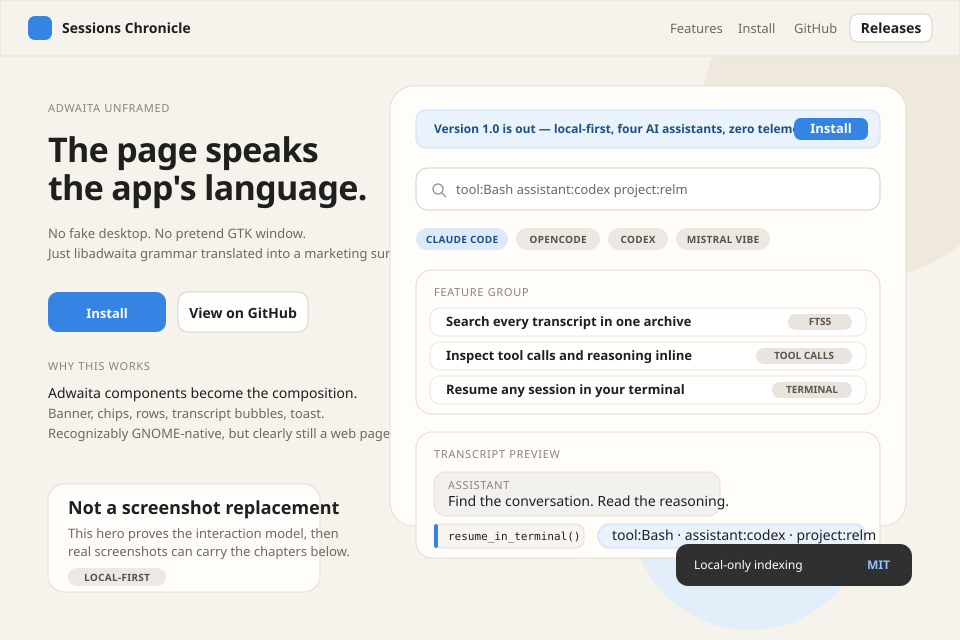
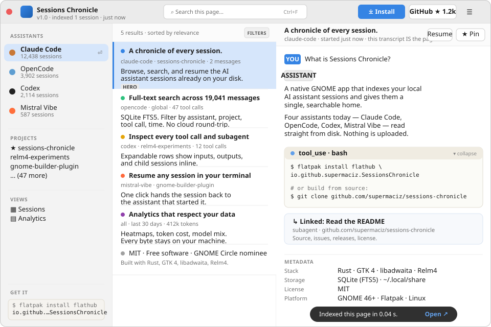

# Exploration: Landing Page (Issue #124)

**Date:** 2026-04-20
**Issue:** [#124 — Create a static landing page for Sessions Chronicle](https://github.com/supermaciz/sessions-chronicle/issues/124)
**Type:** Design exploration — 6 visual directions for the v1 marketing page
**Status:** Open — awaiting decision

## Problem

The README is informative but slow to convey what Sessions Chronicle is.
A first-time visitor needs to read paragraphs before the product "clicks".
A small static landing page would let the value land in seconds: hero,
curated visuals, four-assistant story, install + GitHub links.

This exploration is about **the visual & narrative direction**, not the
stack. Issue #124 already recommends Astro on GitHub Pages; that
recommendation is treated as the shared baseline below.

## Shared Technical Baseline

All proposals share these implementation facts:

- **Stack:** Astro, deployed via GitHub Pages from `docs-site/` (or
  similar). Static HTML at the end. No JS framework on the client.
- **Scope:** Single page. No blog, no changelog, no CMS. Out-of-scope
  items from #124 stay out of scope.
- **Content blocks (all proposals must cover):**
  1. Hero with one-sentence value prop and primary CTA (Releases / Install).
  2. Curated screenshot story (browse → read → inspect → analytics).
  3. Four-assistant support story (Claude Code, OpenCode, Codex, Mistral Vibe).
  4. Links to GitHub, latest release, and license/MIT badge.
- **Responsiveness:** Mobile-readable. No horizontal scroll < 360px.
- **Accessibility:** WCAG-AA contrast, semantic landmarks, alt text on
  every screenshot, `prefers-reduced-motion` respected.
- **Asset hygiene:** Screenshots cropped from real builds, not mockups.
  Reuse `docs/screenshots/*.png` as the source of truth.

What differs between proposals: **aesthetic direction, layout grammar,
typography, and the metaphor used to frame the product.**

---

## Proposal A — Adwaita Marketing *(GNOME-native)*

**Reference:** [apps.gnome.org](https://apps.gnome.org), GNOME Circle pages.
**One-line:** The page looks like the app belongs to GNOME — because it does.

### Direction

A calm, centered page that mirrors libadwaita conventions: Cantarell
type, the system blue (`#3584e4`), generous whitespace, soft 12px
rounded surfaces, a single accent color. Reads like the "About" page of
a polished GNOME app, scaled up to a marketing surface.

### Layout

- **Header:** App icon + name on the left, Releases / GitHub / star
  count on the right. 56px tall, hairline border below.
- **Hero (centered):** App icon (80px) → product title → two-line
  subtitle → primary "Install" button + ghost "View on GitHub" → row of
  four assistant pills.
- **Screenshot panel:** A single chrome-accurate window mock (traffic
  lights, sidebar, list, detail) sitting on a soft gray surface. One
  screenshot, well-presented, beats four.
- **Below the fold (not in mockup):** Three feature cards (Search /
  Tool calls / Resume), each with a libadwaita-style icon. Footer
  carries assistant logos + MIT.

### Typography

- Cantarell or Adwaita Sans throughout.
- Headings 36/24/18, body 14, dim 12.

### Trade-offs

| + | - |
|---|---|
| Strong identity tie to GNOME — signals "native, trustworthy" | Risks looking generic to visitors who don't know GNOME |
| Cheap to build — uses libadwaita color tokens directly | Centered hero is the most-cloned web pattern of 2020-2025 |
| Light/dark via `prefers-color-scheme` is a one-liner | Less editorial personality than B/C/D |
| Screenshots feel at home (same chrome) | Mobile experience is functional but unmemorable |

---

## Proposal B — Classic OSS / SaaS *(Familiar, conversion-tuned)*

**Reference:** Linear, Tauri, Astro, Zed, Raycast OSS pages.
**One-line:** The page a dev expects to land on when they click a GitHub link.

### Direction

Dark UI, bright cyan/blue accent, IBM Plex Sans (or Inter Tight) for
copy + JetBrains Mono for the install command. Two-column hero with a
tilted product screenshot, terminal CTA, three feature columns below.
Optimized for "I get it, where do I install" in 5 seconds.

### Layout

- **Sticky nav:** logo / Features / Install / Docs / GitHub stars / CTA.
- **Hero (asymmetric):**
  - Left: pre-headline pill ("v1.0 · OPEN SOURCE · GNOME"), 42px
    headline, 15px sub, two CTAs, then a real terminal block with
    `$ flatpak install …`.
  - Right: product screenshot tilted ~4°, soft glow behind, drop shadow.
- **Feature row:** Three colored-icon cards (full-text search, tool
  call inspection, resume in terminal).
- **Below fold (not in mockup):** "Works with" assistant logo strip,
  "How it works" diagram, footer.

### Typography

- Inter / Inter Tight or IBM Plex Sans for UI.
- JetBrains Mono for code & install commands.
- Tight letter-spacing on the H1 (-1px).

### Trade-offs

| + | - |
|---|---|
| Familiar pattern — visitors know exactly where to look | Familiar pattern — looks like every other dev tool |
| Terminal block doubles as install instruction *and* visual texture | Inter / dark-with-blue-accent is the canonical "AI slop" combo unless executed well |
| Asymmetric hero converts better than centered (industry consensus) | Tilted screenshot is a small but real cliché |
| Easy to extend with extra rows (testimonials, sponsors) later | Pulls visual identity *away* from GNOME, toward generic devtool |

---

## Proposal C — Editorial Chronicle *(Creative, literal-name play)*

**Reference:** New York Times print front pages, *Pitchfork* feature
articles, the [Werner Herzog "Chronicle" aesthetic](https://www.are.na/),
Edward Tufte handouts.
**One-line:** The product is called *Chronicle*. The page acts like one.

### Direction

A printed-newspaper aesthetic: cream paper (`#f4ede0`), oxblood ink
accents (`#8b1a1a`), Playfair Display masthead, Iowan Old Style /
Charter for body. Two-column layout with a hairline rule between.
"Volumes" instead of features. A dated stamp ("FIRST EDITION · v1.0").
The screenshot is rendered as a woodcut/cross-hatch plate captioned
*"PLATE I — THE LIBRARY"*.

This direction commits hard to the *Chronicle* name as a metaphor. It
is the most distinctive option and the one most likely to show up in
"cool landing pages of the month" lists — at the cost of being further
from what GNOME visitors expect.

### Layout

- **Top meta strip:** `VOL. I · NO. 1   ·   SESSIONS · CHRONICLE · GNOME   ·   MMXXVI`
- **Masthead:** Huge serif title, italic sub-deck below, double rule.
- **Two columns:**
  - Left ("FROM THE EDITOR"): drop-cap paragraph manifesto, pull-quote
    set in italic Playfair, "FIRST EDITION" stamp rotated -6°.
  - Right ("PLATE I — THE LIBRARY"): a large illustrated plate of the
    app rendered as cross-hatched lines, then a numbered "VOLUMES" list
    (I, II, III, IV) for features.
- **Footer rule:** "SUBSCRIBE → GITHUB" black button + colophon.

### Typography

- Playfair Display (display, 56px masthead).
- Iowan Old Style / Charter / Georgia (body).
- Small-caps with 1.5–2px letter-spacing for section labels.
- Drop cap: 56px Playfair in oxblood.

### Trade-offs

| + | - |
|---|---|
| Most memorable, most distinctive — uses the product's name as a frame | Furthest from what a GitHub visitor expects → may confuse |
| Print metaphor reframes "session log" as "archive worth keeping" | Cream paper + serif risks reading as "blog post" not "product page" |
| No competing GNOME app does this — instant recognition | Higher copy burden — needs editorial writing, not just feature bullets |
| Mobile reads beautifully (newspapers were responsive first) | Hardest to A/B-tune for conversion later |
| Real screenshots can be rendered as plates without losing meaning | Rendering screenshots as woodcut illustrations is real production work |

---

## Proposal D — Mosaic Canvas *(Creative, product-as-hero)*

**Reference:** Are.na, Linear's launch page experiments, Obsidian's
graph view, the [Vercel "/templates" page](https://vercel.com/templates).
**One-line:** Skip the hero text. The product *is* the hero.

### Direction

A near-black canvas (`#07070a`) with a faint dot grid. Real session
cards float across the viewport at slight rotations, each showing
assistant + title + timestamp + message count, connected by hairline
dashed paths. The center of the page is a focal search bar — styled
exactly like the in-app search — with a tagline above:
*"find any **conversation.**"* The page literally demonstrates the
product before describing it.

The "resume" card is highlighted in the brand accent (orange-red
`#ff6a3d`) to draw the eye and convey the "pick up where you left off"
promise.

### Layout

- **Minimal top strip:** product wordmark, version, github / install
  links — all 12px, no borders.
- **Floating cards (6):** four assistants represented, varying
  rotations (-3° to +4°), one card highlighted. Mock connection lines
  suggest the searchable web of conversations.
- **Center focal:** two-line headline with one accent word + a search
  bar that looks live (cursor blinks via CSS), with three suggested
  filter chips beneath (`tool:Bash`, `project:relm`, `assistant:codex`).
- **Below fold (not in mockup):** scroll-triggered single-card
  storytelling: each scroll step swaps the focal card to demonstrate
  one feature (search → tool calls → analytics → resume).

### Typography

- Space Mono / JetBrains Mono throughout (the product talks to
  developers; mono earns its keep here).
- Headline 30px, weight 200 mixed with weight 700 for the accent word.

### Trade-offs

| + | - |
|---|---|
| Product is the hero — demo and marketing collapse into one | The most ambitious to build well; weak execution = "AI slop" instantly |
| Memorable hook ("you scroll, the cards animate to show the feature") | Risks burying the install CTA below the fold |
| Mono + dot grid + accent orange = a strong, cohesive aesthetic | Mono body type tires readers — must be used sparingly below the fold |
| Cards can be reused as social/OG images for free | `prefers-reduced-motion` story has to be designed up front, not bolted on |
| Differentiates strongly from every other GNOME app site | Furthest from GNOME / libadwaita identity — disowns the platform tie |

---

## Proposal E — App-In-Place *(UI Designer)*

**Reference:** libadwaita `AdwOverlaySplitView` + `AdwHeaderBar` +
`AdwBanner`; the actual Sessions Chronicle window shell.
**One-line:** Don't show a screenshot of the app. Make the page *be* the app.

### Direction

The viewport is rendered as a single Adwaita window — rounded corners,
headerbar with WindowControls, sidebar with realistic-looking session
rows on the left, and a content pane on the right. The marketing copy
lives *inside* the content pane as if it were the currently selected
session ("Browse, search, resume." — Claude Code, just now). An
`AdwBanner` across the top of the content pane carries the install CTA,
exactly the way the real app surfaces release notices.

This is meaningfully different from Proposal A's centered "About"
treatment: A imitates apps.gnome.org's *page about an app*; E imitates
*the app itself*. Same vocabulary (Cantarell, `#3584e4`, 12px radii,
hairline borders), opposite stance — instead of presenting the product
on a calm marketing canvas, the page asks the visitor to look directly
at the working window. Visitors who have never opened a GNOME app still
read it as "a real desktop application", which is the trust signal that
matters.

### Layout

- **Desktop frame:** Soft warm-gray "wallpaper" (`#d6d3ce`) behind a
  shadowed 920×600 window with 12px rounded corners, edge-to-edge.
- **Headerbar (libadwaita-faithful):**
  - Left: app name, sidebar-toggle icon button.
  - Center: search entry styled as the in-app `Search transcripts` field.
  - Right: menu button + three `WindowControls` (minimize, maximize,
    close — close in red on hover state).
- **Sidebar (left pane, 280px):**
  - Top: PROJECTS section (`All sessions`, `sessions-chronicle`,
    `relm4-experiments`, `infra-notes`) with right-aligned counts —
    mirrors the real project filter.
  - Middle: RECENT SESSIONS list. The first row is selected and
    rendered with the accent-blue selection state — its title is the
    one-line value prop ("Browse, search, resume."). The remaining six
    rows cycle through all four supported AI assistants (Claude Code,
    OpenCode, Codex, Mistral Vibe), grounding the four-assistant story
    without a "logo strip".
  - Footer: green status dot + `Indexed · 412 sessions` and
    `LOCAL ONLY · NEVER LEAVES YOUR DISK` — the privacy promise lives
    where the real indexing status lives.
- **Content pane (right, ~608px wide):**
  1. `AdwBanner` at the top: *"Version 1.0 is out — local-first, four
     AI assistants, zero telemetry."* + `Install Flatpak` action button.
  2. Hero copy as if it were a session header: small-caps meta
     (`SESSION · CHRONICLE · v1.0 · MMXXVI`), 30px headline with one
     accent-blue word, 13px dim subtitle.
  3. Four assistant chips styled exactly like in-app filter pills
     (Claude Code highlighted in accent tint).
  4. Primary `Install on GNOME` button + ghost `View source` + a quiet
     `★ 1.2k · MIT` line.
  5. A "session preview" card titled *"Why a chronicle?"* containing a
     real-feeling assistant bubble, a user bubble, and one inline
     `TOOL CALL` chip — this is the "screenshot moment", except it's
     interactive HTML, not a PNG.
- **Bottom hint:** `ESC to close · ⌘F to search · ENTER to resume in
  terminal` — the floating shortcut hint that lives in the real app.

### Typography

- Cantarell / Adwaita Sans throughout — same as Proposal A.
- JetBrains Mono only for the inline `tool call` token (one place,
  earned).
- Headline 30/14/13/12, faint small-caps 10px with 0.5px tracking for
  section labels (the libadwaita "FROM" / "RECENT" idiom).
- Accent applied to a single hero word, not paragraphs.

### Trade-offs

| + | - |
|---|---|
| Strongest possible "this is a real GNOME app" signal — the page literally is the app shell | Visitors who don't recognize libadwaita chrome may briefly think they landed inside a webapp dashboard |
| Four-assistant story is told by the sidebar rows themselves — no extra "Supported by" strip needed | Sidebar copy must stay believable; lorem-ipsum session titles would break the illusion immediately |
| `AdwBanner` doubles as install CTA *and* a teaching moment for how the real app announces things | Two-pane layout must collapse cleanly on mobile (sidebar becomes a top sheet or is dropped — explicit responsive design needed) |
| Tool-call chip + user/assistant bubbles preview features without a separate "Features" section | More moving parts than Proposal A — every detail (window controls, selected-row state, status dot) has to be right or it reads as costume |
| Light/dark via `prefers-color-scheme` is still trivial — same libadwaita tokens | Harder to A/B-tune copy: hero, banner, and "session" content all have to stay coherent as one composition |
| Differentiates strongly from A while staying inside the same design language | Risks reading as a clever-trick page if the marketing copy isn't pulled all the way through below the fold |

---

## Proposal F — Self-Indexed Window *(Mii Beta)*

**Reference:** the running app itself — `AdwApplicationWindow` +
`AdwOverlaySplitView` + `AdwToolbarView`, as already shipped in
`src/ui/`. No external aesthetic.
**One-line:** The page is not *about* Sessions Chronicle. It **is** an
`AdwApplicationWindow` rendered at viewport scale, indexing exactly one
session: its own launch.

### Critique of the convention being departed from

Proposal A treats the page as a brochure that quotes libadwaita tokens
(blue accent, Cantarell, 12px radius) and parks a screenshot of the
real app in the lower half. That is a screenshot of the product
*surrounded by a marketing page*. Two surfaces solving one job. The
naming is wrong too: it calls itself a "landing page" but its actual
behavior is "static fan art of a GTK window." If the screenshot is the
most honest asset on the page, stop hiding it behind a hero block —
make the window the page.

Proposal D already does "product as hero" with a black canvas and
floating cards. That is web art direction wearing the product's data
as decoration. Proposal F does the inverse: web art direction zero,
real chrome one hundred percent.

### Direction

A single `AdwApplicationWindow` fills the browser viewport with a 12px
window radius and a hairline border. Inside, the real grammar of the
app: header bar, sidebar of assistants and projects, list of sessions,
detail pane. The marketing payload is **embedded as data the app would
plausibly hold**:

- The four assistants live in the sidebar, with real-looking session
  counts, exactly where filters live in the running app.
- The five product features are **session rows**: title = feature
  headline, subtitle = `assistant · project · N tool calls`, preview
  = the feature's two-line pitch.
- The selected row opens in the detail pane as a transcript — a USER
  bubble asks "What is Sessions Chronicle?", an ASSISTANT bubble
  answers, and a `tool_use · bash` block contains the install command.
- The install CTA in the header bar is a real button. The "GitHub ★
  1.2k" pill is the same control the app uses for filters.
- An `AdwToast` at the bottom reads `Indexed this page in 0.04 s.` with
  an `Open ↗` action — a small, true joke that also serves as the
  secondary CTA.

There is no hero text outside the chrome. There is no screenshot
*of* the app, because the page is not next to the app — the page is
the app, populated.

### Layout

- **HeaderBar (46 px):** app icon + title + "indexed 1 session · just
  now" subtitle, centered search entry, primary `Install` button, ghost
  `GitHub ★ 1.2k`, menu button. Window controls present, GNOME-correct.
- **Sidebar (220 px, `AdwOverlaySplitView` start pane):**
  - `ASSISTANTS` group: Claude Code (selected, with focus row), OpenCode,
    Codex, Mistral Vibe — each with a colored dot and a session count.
  - `PROJECTS` group: starred + a few real-looking project names.
  - `VIEWS` group: Sessions / Analytics.
  - Bottom: small `GET IT` block with a copyable Flatpak command in
    the same slot the app uses for status.
- **List column (320 px):** filter bar + five session rows. The first
  row is selected (blue rail + tinted background) and carries the
  hero headline. Rows two through five are the feature story. Row six
  is the license/colophon, framed as a row instead of a footer.
- **Detail pane (~420 px, `AdwToolbarView`):** title bar with `Resume`
  and `★ Pin` actions, a two-message transcript, an expandable
  `tool_use · bash` block holding the install commands, a linked
  subagent card pointing to the GitHub repo, and a metadata block
  (stack, storage, license, platform) styled like the existing utility
  pane.
- **Toast overlay:** the only piece of explicitly "marketing" copy.

**Adaptive:** at narrow widths the `AdwOverlaySplitView` collapses
exactly like the real app — sidebar becomes a drawer, list and detail
stack via `AdwNavigationView`. The page inherits the app's responsive
story for free; no separate mobile design needed.

### Typography

- **Cantarell / Adwaita Sans** throughout the chrome. Same scale as
  the running app: 13 px body, 11 px dim, 10 px tiny labels with 0.6
  letter-spacing for section headers.
- **JetBrains Mono** only inside the `tool_use` block and the sidebar
  install hint — same rule the app already follows for code blocks.
- No marketing display face. If a font choice on the page differs from
  what the app actually uses, the lie has started.

### Honesty checks

- **Does the name match the behavior?** Yes — every "marketing"
  affordance is the GTK affordance it appears to be. The Install
  button installs. The search entry would search the page. The toast
  is an `AdwToast` with one action.
- **How many surfaces?** One. `AdwApplicationWindow`. Hero, screenshot,
  feature grid, install CTA, footer, and assistant pills are all
  collapsed into the same split view.
- **What does it cost to maintain?** When the app's chrome changes,
  the page changes by re-running the app and re-cropping. There is no
  parallel design system to drift.
- **What it is not:** an animation showcase, a scroll-jacked demo, a
  dark canvas with floating cards, or a serif manifesto. The page
  does not move. It sits there, looking like the thing.

### Trade-offs

| + | - |
|---|---|
| One surface, not three — the chrome IS the marketing | First-time visitors might mistake it for an embedded web demo |
| Updates from real screenshots; zero illustration debt | Requires the page to ship pixel-honest GTK CSS — no shortcuts |
| Adaptive falls out of the `AdwOverlaySplitView` collapse story | Loses some "above the fold sales pitch" punch versus B |
| The strongest possible "this is a GNOME app" signal | Risks looking too in-jokey if Flathub visitors don't get the bit |
| Cannot be confused with any other dev-tool landing page | Hard to A/B-tune later; the page resists conventional CRO |
| Toast as CTA is small, true, and reusable as the OG image | Search entry must either work or be obviously decorative — no middle ground |

---

## Comparison Matrix

| Aspect | A: Adwaita | B: Classic OSS | C: Editorial | D: Mosaic | E: App-In-Place | F: Self-Indexed |
|---|---|---|---|---|---|---|
| **Aesthetic risk** | Low | Low | High | High | Low-Medium | Medium |
| **Identity with GNOME** | Strong | Weak | Neutral | Weak | Very Strong | Very Strong |
| **Memorability** | Low | Medium | Very High | Very High | High | High |
| **Conversion clarity** | High | Very High | Medium | Medium-Low | High | High |
| **Implementation cost** | Low | Low-Medium | Medium | Medium-High | Medium | Medium |
| **Custom illustration needed** | None | None | Yes (plates) | No (cards from real data) | None (HTML chrome) | None (HTML chrome) |
| **Mobile story** | Easy | Easy | Easy (single col) | Hard (mosaic must collapse) | Medium (sidebar must collapse) | Free (inherits app collapse) |
| **Reduced-motion story** | Trivial | Trivial | Trivial | Must design upfront | Trivial | Trivial |
| **Risk of looking "AI slop"** | Low | Medium-High | Very Low | Medium | Very Low | Very Low |
| **Time to first visitor "gets it"** | ~3s | ~2s | ~6s | ~4s (after one scroll) | ~3s | ~3s |
| **Best when the goal is...** | Trust | Conversion | Distinction | Demonstration | Native-app proof | Honesty / proof-by-existence |

## Open Questions

- **Tone of voice:** Should the page sound like project documentation
  (Adwaita / Classic) or like a designed artifact (Editorial / Mosaic)?
- **Primary visitor:** Someone who already heard about the app and
  wants to install (favors B), or someone discovering through a tweet
  / aggregator post (favors C / D)?
- **GNOME identity vs. broader reach:** Do we want the page to clearly
  signal "GNOME-native" (favors A), or do we want to attract Linux
  developers who don't yet care about GNOME (favors B / D)?
- **Maintenance budget:** Are we OK with a page that needs an
  illustrator's hand to refresh (C), or does it need to update from
  screenshots alone (A / B / D)?

## Recommendation Slot

*To be filled in after team review. The four proposals span the full
risk spectrum on purpose — pick the one that matches the appetite for
distinctiveness vs. familiarity.*

## Next Step

Once a direction is selected, produce a design document
(`2026-04-XX-landing-page-design.md`) covering: site structure, page
sections in detail, copy, type scale, color tokens, screenshot crops,
responsive breakpoints, and a deploy plan for GitHub Pages.
