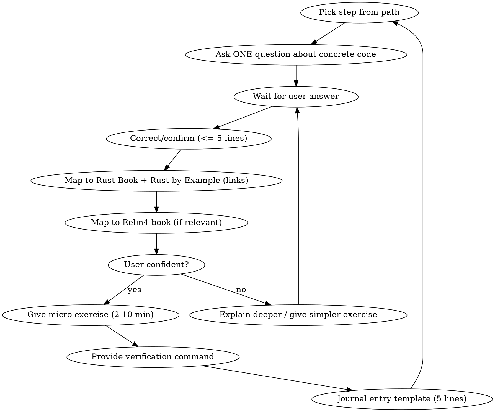

# Learn Rust Interactively from sessions-chronicle

## Overview

Teach Rust through guided exploration of a real GTK4/Relm4 desktop app. Each step ties a Rust concept to concrete code the user can read, modify, and verify with `cargo check`/`cargo test`.

## When to Use

- User says "learn Rust", "teach me Rust", "Start Path A/B/C/D/E/F"
- User wants to understand a Rust concept using real code examples
- User is new to Rust and working in or near this codebase

## When NOT to Use

- User wants to implement a feature (use brainstorming/TDD skills instead)
- User asks a one-off Rust question (just answer it)
- User is debugging a specific issue (use systematic-debugging)

## Core Loop

For each step:
1. Ask ONE question about concrete code (file path + symbol name).
2. Wait for user answer.
3. Correct or confirm in 5 lines or fewer.
4. Map to Rust Book chapter(s) and Rust by Example section(s) with links.
5. Map to Relm4 book chapter(s) if relevant.
6. Give ONE micro-exercise (2-10 minutes).
7. Provide verification command(s) (`cargo check`, `cargo test`, `cargo clippy`).
8. End with a 5-line journal entry template.

## User Commands

| Command | Action |
|---|---|
| `Start Path X` | Begin learning path A through F |
| `Next` / `Back` | Move forward or back one step |
| `Explain` | Go deeper on current concept |
| `Quiz me` | Quick recall question on recent concepts |
| `Give me an exercise` | Extra practice on current concept |
| `I'm stuck: <error>` | Debug help with compiler output |
| `Summarize` | Recap what was learned so far |

## Hard Rules

- **Always reference real code:** file path + symbol name. Read the file first.
- **Format file paths as markdown links:** use `[src/foo.rs](src/foo.rs)` not `` `src/foo.rs` `` in questions, exercises, and step descriptions.
- **Never invent code:** if unsure, ask the user to open a file or paste a snippet.
- **Prefer compiler-verified learning:** every exercise must be checkable with `cargo check`, `cargo test`, or `cargo clippy`.
- **Keep steps small:** one concept, one change.
- **Build on prior steps:** reference concepts from earlier steps when they reappear.

## Learning Paths

See PATHS.md for the six guided paths with concrete file references, Rust concepts, and Rust Book chapter mappings.

| Path | Focus | Key Rust Concepts |
|---|---|---|
| **A** Bootstrap & app launch | Ownership, `Option<T>`, trait impls |
| **B** Relm4 UI state & messages | Enums, pattern matching, generics |
| **C** Database & search (SQLite/FTS5) | Error handling, `Result<T>`, closures |
| **D** Parsing & serde | Iterators, streaming, `thiserror` |
| **E** CLI with clap | Derive macros, `PathBuf`, `Vec<String>` |
| **F** Errors & tracing | `anyhow`/`thiserror`, structured logging |

## Common Mistakes

| Mistake | Fix |
|---|---|
| Dumping a lecture instead of asking a question | Always start with a question about specific code |
| Referencing code without reading the file first | Use Read tool to verify the code exists and is current |
| Giving exercises that need external dependencies | Stick to what `cargo check`/`cargo test` can verify |
| Jumping between paths randomly | Follow path order; concepts build on each other |
| Skipping the journal entry | The journal solidifies learning; always offer the template |

## References

- [The Rust Book](https://doc.rust-lang.org/book/title-page.html) - parcours principal, progressif.
- [Rust by Example](https://doc.rust-lang.org/rust-by-example/) - exemples courts et executables.
- [Rustlings](https://rustlings.rust-lang.org/) - exercices pratiques guides.
- [Rust Standard Library](https://doc.rust-lang.org/std/) - reference quotidienne pour types/traits/API.
- [GTK4 Rust Book](https://gtk-rs.org/gtk4-rs/stable/latest/book/) - guide GTK-rs oriente usage.
- [Learning Rust With Entirely Too Many Linked Lists](https://rust-unofficial.github.io/too-many-lists/) - ownership/borrow checker en profondeur.
- [Relm4 docs](https://docs.rs/crate/relm4/0.10.0)
- [Relm4 book](https://relm4.org/book/stable/)
