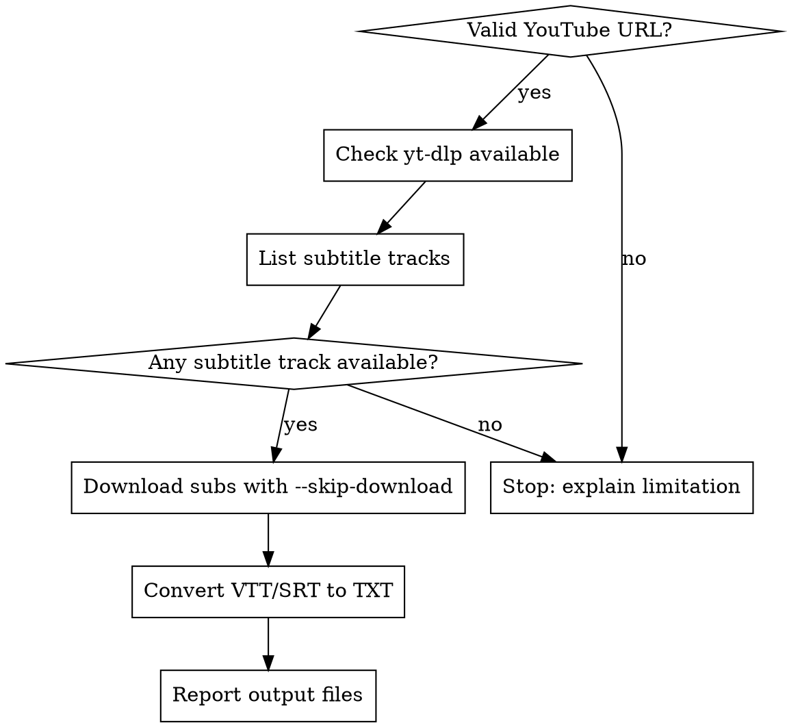

# YouTube Transcript with yt-dlp Only

## Overview

Extract subtitle tracks from YouTube and produce transcript text files with `yt-dlp` only.
Core principle: subtitle extraction only, never video/audio download, never browser automation.

## When to Use

- User asks for YouTube transcript, captions, subtitles, or subtitle-to-text export.
- User provides one or more YouTube URLs (`youtube.com/watch`, `youtu.be`, `youtube.com/shorts`).
- User wants a fast CLI workflow with `yt-dlp`.

## When NOT to Use

- User asks for full speech-to-text transcription from audio.
- User asks to download video or audio files.
- User requires browser automation tools.

## Hard Rules

- Use `yt-dlp` only.
- Always include `--skip-download`.
- Never use browser automation fallback.
- Never download video/audio for transcription.
- If subtitles are unavailable, report clearly and stop.

## Quick Reference

| Goal | Command |
|---|---|
| List available subtitle languages | `yt-dlp --list-subs "<URL>"` |
| Download manual + auto subs only | `yt-dlp --skip-download --write-subs --write-auto-subs --sub-langs "en.*,en" --sub-format "vtt" -o "%(title).180B [%(id)s].%(ext)s" "<URL>"` |
| Restrict filename characters | Add `--restrict-filenames` |

## Workflow



1. Validate YouTube URL format.
2. Verify `yt-dlp` is available:

```bash
yt-dlp --version
```

If unavailable, ask user to install `yt-dlp` and stop.

3. Inspect subtitle availability:

```bash
yt-dlp --list-subs "<URL>"
```

4. Download subtitle files only:

```bash
yt-dlp --skip-download --write-subs --write-auto-subs --sub-langs "en.*,en" --sub-format "vtt" -o "%(title).180B [%(id)s].%(ext)s" "<URL>"
```

5. Convert `.vtt` or `.srt` to plain text transcript.

## Example Conversion

```python
from pathlib import Path
import html
import re

def subtitle_to_text(path: Path) -> Path:
    out = path.with_suffix(".txt")
    seen = set()
    lines = []

    for raw in path.read_text(encoding="utf-8", errors="ignore").splitlines():
        line = raw.strip()
        if not line:
            continue
        if line == "WEBVTT" or "-->" in line or line.isdigit():
            continue

        line = re.sub(r"<[^>]+>", "", line)
        line = html.unescape(line).strip()
        if line and line not in seen:
            seen.add(line)
            lines.append(line)

    out.write_text("\n".join(lines) + "\n", encoding="utf-8")
    return out
```

## Common Mistakes

| Mistake | Fix |
|---|---|
| Forgetting `--skip-download` | Always include it in subtitle extraction commands |
| Falling back to browser automation | Do not use any browser automation path |
| Falling back to audio transcription | Do not download audio/video; report subtitle unavailability |
| Hardcoding one language only | Check `--list-subs` first, then choose `--sub-langs` |

## Rationalization Table

| Excuse | Reality |
|---|---|
| "If yt-dlp fails, browser automation is fine" | This skill explicitly forbids browser automation |
| "I'll download audio and run Whisper" | Out of scope: subtitle extraction only |
| "No subtitles available, I should improvise" | Report limitation and stop |
| "I'll skip listing tracks and guess language" | Listing tracks prevents wrong language assumptions |

## Red Flags - STOP and Correct

- Any command without `--skip-download`
- Any mention of Playwright, DevTools MCP, Selenium, or browser fallback
- Any mention of Whisper or speech-to-text from downloaded audio
- Claiming transcript success without produced subtitle/text file path
